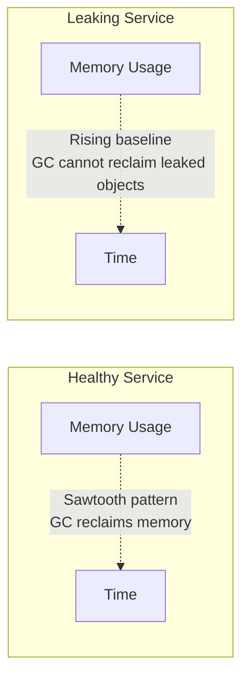
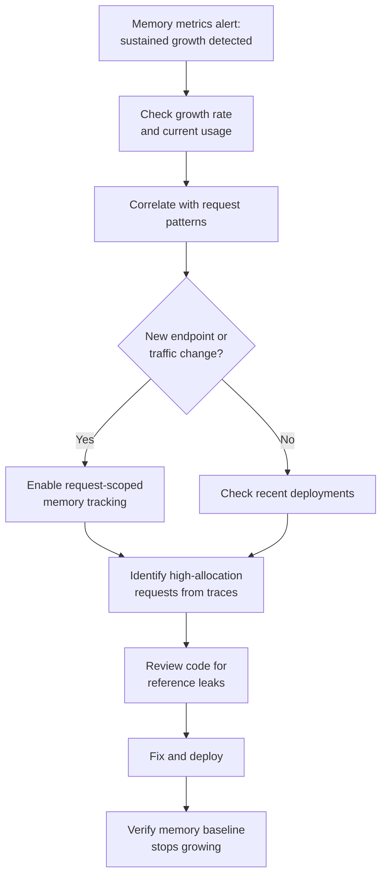

# How to Use OpenTelemetry to Detect and Diagnose Memory Leaks

Author: [nawazdhandala](https://www.github.com/nawazdhandala)

Tags: OpenTelemetry, Memory Leaks, Debugging, Performance, Metrics, Profiling, Node.js, Python, Go

Description: Learn how to use OpenTelemetry metrics and traces to detect memory leaks in production, identify the leaking code path, and fix it before it causes an outage.

---

> Memory leaks are among the most insidious production issues. They do not cause an immediate failure. Instead, your service slowly consumes more and more memory over hours or days until it hits the limit and crashes. OpenTelemetry gives you the metrics and traces to catch leaks early and pinpoint the code responsible.

The classic memory leak debugging experience involves waiting for a service to crash, taking a heap dump, and spending hours analyzing it. By the time you find the leak, your service has already been restarted (or crashed) multiple times. With OpenTelemetry, you can detect the upward memory trend long before it becomes critical, and correlate it with specific request patterns to narrow down the cause.

This guide covers how to instrument your application for memory leak detection, set up alerts on memory growth, and use traces to identify the leaking code path.

---

## How Memory Leaks Manifest in Metrics

A healthy service has a sawtooth memory pattern. Memory grows as it processes requests, then drops when the garbage collector runs. A leaking service shows a steadily rising baseline, even after garbage collection.



The key metric to watch is the memory usage after garbage collection. If this baseline is rising over time, you have a leak.

---

## Instrumenting Memory Metrics with OpenTelemetry

Start by emitting memory metrics from your application. Here is how to do it in the three most common languages for backend services.

### Node.js Memory Metrics

```javascript
// memory-metrics.js
// Emit detailed memory metrics for leak detection in Node.js

const { metrics } = require('@opentelemetry/api');
const v8 = require('v8');

const meter = metrics.getMeter('memory-diagnostics');

// Total heap size allocated by V8
// This grows as your application allocates more objects
const heapTotal = meter.createObservableGauge('process.runtime.nodejs.memory.heap_total', {
  description: 'Total size of the V8 heap in bytes',
  unit: 'By',
});

// Actually used portion of the heap
// This is the metric that reveals leaks when it rises over time
const heapUsed = meter.createObservableGauge('process.runtime.nodejs.memory.heap_used', {
  description: 'Used portion of the V8 heap in bytes',
  unit: 'By',
});

// RSS (Resident Set Size) - total memory allocated by the OS
// Includes heap, stack, and code segments
const rss = meter.createObservableGauge('process.runtime.nodejs.memory.rss', {
  description: 'Resident set size in bytes',
  unit: 'By',
});

// External memory - buffers allocated outside the V8 heap
// Leaks in native addons or Buffer allocations show up here
const external = meter.createObservableGauge('process.runtime.nodejs.memory.external', {
  description: 'Memory used by C++ objects bound to JavaScript objects',
  unit: 'By',
});

// Number of heap spaces and their sizes
// Useful for understanding which part of the heap is growing
const heapSpaceUsed = meter.createObservableGauge('process.runtime.nodejs.memory.heap_space.used', {
  description: 'Used size of each V8 heap space',
  unit: 'By',
});

// Register callbacks that read memory stats periodically
heapTotal.addCallback((result) => {
  const mem = process.memoryUsage();
  result.observe(mem.heapTotal);
});

heapUsed.addCallback((result) => {
  const mem = process.memoryUsage();
  result.observe(mem.heapUsed);
});

rss.addCallback((result) => {
  const mem = process.memoryUsage();
  result.observe(mem.rss);
});

external.addCallback((result) => {
  const mem = process.memoryUsage();
  result.observe(mem.external);
});

heapSpaceUsed.addCallback((result) => {
  const heapStats = v8.getHeapSpaceStatistics();
  for (const space of heapStats) {
    result.observe(space.space_used_size, {
      'nodejs.heap_space.name': space.space_name,
    });
  }
});
```

### Python Memory Metrics

```python
# memory_metrics.py
# Emit memory metrics for leak detection in Python applications

import os
import psutil
import gc
from opentelemetry import metrics

meter = metrics.get_meter("memory-diagnostics")

process = psutil.Process(os.getpid())

# RSS memory - the primary indicator of overall memory consumption
def get_rss(options):
    mem_info = process.memory_info()
    yield metrics.Observation(mem_info.rss, {})

rss_gauge = meter.create_observable_gauge(
    name="process.runtime.python.memory.rss",
    description="Resident set size in bytes",
    unit="By",
    callbacks=[get_rss],
)

# Number of objects tracked by the garbage collector
# A steadily increasing count suggests objects are being created but not freed
def get_gc_objects(options):
    yield metrics.Observation(len(gc.get_objects()), {})

gc_objects_gauge = meter.create_observable_gauge(
    name="process.runtime.python.gc.objects",
    description="Number of objects tracked by the garbage collector",
    unit="1",
    callbacks=[get_gc_objects],
)

# GC collection counts - how many times each generation has been collected
# If generation 2 collections increase but memory does not drop, objects are leaking
def get_gc_collections(options):
    counts = gc.get_stats()
    for i, stat in enumerate(counts):
        yield metrics.Observation(stat["collections"], {"gc.generation": str(i)})

gc_collections = meter.create_observable_counter(
    name="process.runtime.python.gc.collections",
    description="Number of garbage collection runs per generation",
    unit="1",
    callbacks=[get_gc_collections],
)

# Track object counts by type for the most common types
# This helps identify which type of object is leaking
def get_type_counts(options):
    import collections
    type_counts = collections.Counter(type(obj).__name__ for obj in gc.get_objects())
    # Only report the top 10 types to avoid cardinality explosion
    for type_name, count in type_counts.most_common(10):
        yield metrics.Observation(count, {"python.object_type": type_name})

type_count_gauge = meter.create_observable_gauge(
    name="process.runtime.python.gc.objects.by_type",
    description="Number of tracked objects by Python type",
    unit="1",
    callbacks=[get_type_counts],
)
```

### Go Memory Metrics

```go
package main

import (
    "context"
    "runtime"

    "go.opentelemetry.io/otel"
    "go.opentelemetry.io/otel/metric"
)

func registerMemoryMetrics() {
    meter := otel.Meter("memory-diagnostics")

    // Register a callback that reads Go runtime memory stats
    // This fires every time the metrics SDK collects data
    meter.Int64ObservableGauge(
        "process.runtime.go.memory.heap_alloc",
        metric.WithDescription("Bytes of allocated heap objects"),
        metric.WithUnit("By"),
        metric.WithInt64Callback(func(ctx context.Context, o metric.Int64Observer) error {
            var m runtime.MemStats
            runtime.ReadMemStats(&m)
            o.Observe(int64(m.HeapAlloc))
            return nil
        }),
    )

    // HeapInuse is the number of bytes in heap spans that have at least one object
    // This metric, after a GC, shows the "floor" of your memory usage
    // A rising floor indicates a leak
    meter.Int64ObservableGauge(
        "process.runtime.go.memory.heap_inuse",
        metric.WithDescription("Bytes in in-use heap spans"),
        metric.WithUnit("By"),
        metric.WithInt64Callback(func(ctx context.Context, o metric.Int64Observer) error {
            var m runtime.MemStats
            runtime.ReadMemStats(&m)
            o.Observe(int64(m.HeapInuse))
            return nil
        }),
    )

    // Number of live objects - if this keeps growing, something is holding references
    meter.Int64ObservableGauge(
        "process.runtime.go.memory.heap_objects",
        metric.WithDescription("Number of allocated heap objects"),
        metric.WithUnit("1"),
        metric.WithInt64Callback(func(ctx context.Context, o metric.Int64Observer) error {
            var m runtime.MemStats
            runtime.ReadMemStats(&m)
            o.Observe(int64(m.HeapObjects))
            return nil
        }),
    )

    // Number of goroutines - goroutine leaks are a common form of memory leak in Go
    meter.Int64ObservableGauge(
        "process.runtime.go.goroutines",
        metric.WithDescription("Number of active goroutines"),
        metric.WithUnit("1"),
        metric.WithInt64Callback(func(ctx context.Context, o metric.Int64Observer) error {
            o.Observe(int64(runtime.NumGoroutine()))
            return nil
        }),
    )
}
```

---

## Alerting on Memory Growth

With memory metrics flowing, set up alerts that detect the rising baseline pattern. Simple threshold alerts ("alert when memory exceeds 2GB") are too crude because they fire too late. Instead, alert on the rate of memory growth:

```yaml
# memory-leak-alerts.yaml
# Alert rules that detect memory leaks by looking for sustained growth

groups:
  - name: memory_leak_detection
    interval: 60s
    rules:
      # Alert when heap memory has been growing steadily for 2 hours
      # The deriv() function computes the per-second rate of change
      # A positive derivative over a long window means steady growth
      - alert: MemoryLeakSuspected
        expr: |
          deriv(
            process_runtime_nodejs_memory_heap_used[2h]
          ) > 10000
        for: 30m
        labels:
          severity: warning
        annotations:
          summary: "Suspected memory leak in {{ $labels.service_name }}"
          description: >
            Heap memory has been growing at {{ $value | humanize }}B/s
            for the last 2 hours. Current heap: {{ with query
            "process_runtime_nodejs_memory_heap_used" }}{{ . | first | value | humanize }}B{{ end }}

      # Alert when memory exceeds 80% of the container limit
      # This is the "we need to act soon" alert
      - alert: MemoryUsageHigh
        expr: |
          process_runtime_nodejs_memory_rss
          /
          container_spec_memory_limit_bytes
          > 0.80
        for: 5m
        labels:
          severity: critical
        annotations:
          summary: "Memory usage at {{ $value | humanizePercentage }} of limit"
          description: "Service {{ $labels.service_name }} is approaching its memory limit"

      # Goroutine leak detection for Go services
      # Alert when goroutine count is growing steadily
      - alert: GoroutineLeakSuspected
        expr: |
          deriv(process_runtime_go_goroutines[1h]) > 0.1
        for: 30m
        labels:
          severity: warning
        annotations:
          summary: "Goroutine count growing in {{ $labels.service_name }}"
          description: "Current count: {{ with query \"process_runtime_go_goroutines\" }}{{ . | first | value }}{{ end }}"
```

---

## Correlating Memory Growth with Request Patterns

Once you detect a leak, you need to identify which requests trigger it. OpenTelemetry traces help here because you can correlate the memory growth timeline with the types of requests being processed.

```python
# memory_leak_correlator.py
# Correlate memory growth periods with request patterns from traces

from opentelemetry import trace
from datetime import datetime, timedelta

tracer = trace.get_tracer("memory-leak-analysis")

def correlate_leak_with_requests(metrics_client, trace_client, service_name):
    """
    Find the time period where memory started growing and identify
    which request types were active during that period.
    """
    with tracer.start_as_current_span("memory.leak.correlate") as span:
        # Find when the memory growth started
        # Look for the inflection point in the heap_used metric
        memory_series = metrics_client.query_range(
            metric=f'process_runtime_nodejs_memory_heap_used{{service_name="{service_name}"}}',
            start=datetime.utcnow() - timedelta(hours=24),
            end=datetime.utcnow(),
            step="5m",
        )

        # Find the point where memory started consistently growing
        growth_start = find_growth_inflection(memory_series)
        span.set_attribute("leak.growth_start", growth_start.isoformat())

        # Query the request types active since the growth started
        request_breakdown = trace_client.aggregate(
            service_name=service_name,
            start=growth_start,
            end=datetime.utcnow(),
            group_by=["http.route", "http.method"],
            metric="count",
        )

        # Compare with request types before the growth started
        baseline_breakdown = trace_client.aggregate(
            service_name=service_name,
            start=growth_start - timedelta(hours=6),
            end=growth_start,
            group_by=["http.route", "http.method"],
            metric="count",
        )

        # Find request types that appeared or increased significantly
        # These are the most likely leak triggers
        suspects = []
        for route, count in request_breakdown.items():
            baseline_count = baseline_breakdown.get(route, 0)
            if baseline_count == 0 and count > 0:
                suspects.append({
                    "route": route,
                    "reason": "New endpoint appeared when leak started",
                    "count": count,
                })
            elif baseline_count > 0:
                increase = (count - baseline_count) / baseline_count
                if increase > 0.5:
                    suspects.append({
                        "route": route,
                        "reason": f"Traffic increased {increase:.0%} when leak started",
                        "count": count,
                    })

        for i, suspect in enumerate(suspects):
            span.set_attribute(f"leak.suspect.{i}.route", suspect["route"])
            span.set_attribute(f"leak.suspect.{i}.reason", suspect["reason"])

        return {
            "growth_start": growth_start.isoformat(),
            "suspects": suspects,
        }


def find_growth_inflection(series):
    """Find the timestamp where memory started consistently growing"""
    # Use a simple sliding window approach
    # Look for the point where the derivative stays positive
    window_size = 12  # 12 data points = 1 hour at 5m intervals
    for i in range(len(series) - window_size):
        window = series[i:i + window_size]
        # Check if memory grew in at least 80% of intervals in the window
        growth_count = sum(
            1 for j in range(1, len(window))
            if window[j].value > window[j-1].value
        )
        if growth_count >= window_size * 0.8:
            return window[0].timestamp

    return series[0].timestamp  # Fallback to the beginning
```

---

## Using Request-Scoped Memory Tracking

For a more precise approach, you can track memory allocation within individual request spans. This is more expensive but directly identifies which requests allocate the most memory:

```python
# request_memory_tracking.py
# Track memory allocated during each request span

import tracemalloc
from opentelemetry import trace

tracer = trace.get_tracer("memory-tracking")

class MemoryTrackingMiddleware:
    """
    WSGI/ASGI middleware that measures memory allocated during each request.
    Enable this temporarily when investigating a suspected leak.
    WARNING: tracemalloc adds significant overhead. Use only for debugging.
    """

    def __init__(self, app):
        self.app = app
        tracemalloc.start()

    def __call__(self, environ, start_response):
        span = trace.get_current_span()

        # Take a snapshot before the request
        snapshot_before = tracemalloc.take_snapshot()
        before_size = sum(stat.size for stat in snapshot_before.statistics("filename"))

        # Process the request
        response = self.app(environ, start_response)

        # Take a snapshot after the request
        snapshot_after = tracemalloc.take_snapshot()
        after_size = sum(stat.size for stat in snapshot_after.statistics("filename"))

        # Record the memory delta on the span
        memory_delta = after_size - before_size
        span.set_attribute("memory.allocated_bytes", memory_delta)

        # If the delta is large, record the top allocating files
        if memory_delta > 1_000_000:  # More than 1MB allocated
            top_stats = snapshot_after.compare_to(snapshot_before, "filename")
            for i, stat in enumerate(top_stats[:5]):
                span.set_attribute(
                    f"memory.top_allocator.{i}.file",
                    str(stat.traceback),
                )
                span.set_attribute(
                    f"memory.top_allocator.{i}.size_bytes",
                    stat.size_diff,
                )

        return response
```

---

## The Memory Leak Investigation Workflow

Putting it all together, here is the complete workflow for detecting and diagnosing memory leaks with OpenTelemetry:



The metrics give you early warning. The traces tell you which requests are involved. The request-scoped memory tracking tells you which code is allocating. Together, they turn a days-long investigation into a focused, systematic debugging session.

Start by deploying memory metrics for all your services. Set up the growth-rate alert. When it fires, use traces and per-request memory tracking to narrow down the cause. The earlier you catch a leak, the easier it is to fix, because you have fewer code changes to review as potential causes.
