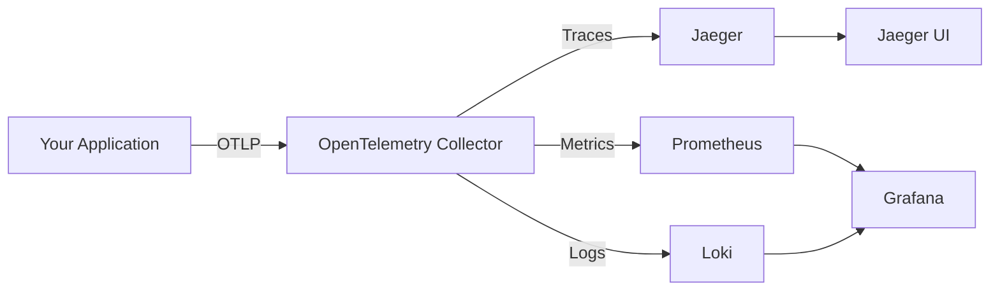

# How to Set Up an OpenTelemetry Development Environment with Docker Compose

Author: [nawazdhandala](https://www.github.com/nawazdhandala)

Tags: OpenTelemetry, Docker Compose, Development, Local Setup, Collector

Description: A practical guide to setting up a complete OpenTelemetry development environment using Docker Compose, including collectors, backends, and sample applications.

Setting up a local OpenTelemetry development environment can be challenging when you're juggling multiple services, collectors, and backend systems. Docker Compose simplifies this process by letting you define your entire observability stack in a single configuration file that anyone on your team can spin up in minutes.

## Why Docker Compose for OpenTelemetry Development

Traditional development setups require installing and configuring multiple services on your local machine. You might need Jaeger for traces, Prometheus for metrics, and a log aggregator for logs. Each requires different ports, configuration files, and startup procedures. When something breaks, debugging becomes a nightmare.

Docker Compose solves this by providing:

- **Reproducibility**: Every developer gets identical environments
- **Isolation**: Services run in containers without cluttering your system
- **Simplicity**: Start everything with a single command
- **Flexibility**: Easily swap components or experiment with configurations

## The Complete Development Stack

A full OpenTelemetry development environment needs several components working together. Here's the architecture we'll build:



This setup gives you a complete observability platform where you can develop, test, and visualize telemetry data without relying on cloud services.

## The Docker Compose Configuration

Create a `docker-compose.yml` file in your project root. We'll build this incrementally, explaining each service:

```yaml
version: '3.8'

services:
  # OpenTelemetry Collector - the central hub for all telemetry
  otel-collector:
    image: otel/opentelemetry-collector-contrib:0.93.0
    container_name: otel-collector
    command: ["--config=/etc/otel-collector-config.yaml"]
    volumes:
      - ./otel-collector-config.yaml:/etc/otel-collector-config.yaml
    ports:
      # OTLP gRPC receiver
      - "4317:4317"
      # OTLP HTTP receiver
      - "4318:4318"
      # Prometheus metrics endpoint
      - "8889:8889"
      # Health check endpoint
      - "13133:13133"
    networks:
      - otel-network
    depends_on:
      - jaeger
      - prometheus

  # Jaeger - distributed tracing backend and UI
  jaeger:
    image: jaegertracing/all-in-one:1.53
    container_name: jaeger
    environment:
      - COLLECTOR_OTLP_ENABLED=true
    ports:
      # Jaeger UI
      - "16686:16686"
      # OTLP gRPC receiver (backup, collector is primary)
      - "4317"
      # Jaeger native receiver
      - "14268:14268"
    networks:
      - otel-network

  # Prometheus - metrics storage and querying
  prometheus:
    image: prom/prometheus:v2.48.1
    container_name: prometheus
    command:
      - '--config.file=/etc/prometheus/prometheus.yml'
      - '--storage.tsdb.path=/prometheus'
      - '--web.enable-lifecycle'
    volumes:
      - ./prometheus.yml:/etc/prometheus/prometheus.yml
      - prometheus-data:/prometheus
    ports:
      - "9090:9090"
    networks:
      - otel-network

  # Loki - log aggregation system
  loki:
    image: grafana/loki:2.9.3
    container_name: loki
    command: -config.file=/etc/loki/local-config.yaml
    ports:
      - "3100:3100"
    networks:
      - otel-network

  # Grafana - unified visualization for metrics, traces, and logs
  grafana:
    image: grafana/grafana:10.2.3
    container_name: grafana
    environment:
      - GF_AUTH_ANONYMOUS_ENABLED=true
      - GF_AUTH_ANONYMOUS_ORG_ROLE=Admin
      - GF_AUTH_DISABLE_LOGIN_FORM=true
    volumes:
      - ./grafana-datasources.yml:/etc/grafana/provisioning/datasources/datasources.yml
      - grafana-data:/var/lib/grafana
    ports:
      - "3000:3000"
    networks:
      - otel-network
    depends_on:
      - prometheus
      - loki
      - jaeger

networks:
  otel-network:
    driver: bridge

volumes:
  prometheus-data:
  grafana-data:
```

This configuration defines five services that work together to collect, store, and visualize telemetry data.

## Configuring the OpenTelemetry Collector

The collector needs its own configuration file. Create `otel-collector-config.yaml`:

```yaml
# Receivers define how telemetry data enters the collector
receivers:
  # OTLP receiver accepts data in OpenTelemetry Protocol format
  otlp:
    protocols:
      grpc:
        endpoint: 0.0.0.0:4317
      http:
        endpoint: 0.0.0.0:4318
        cors:
          allowed_origins:
            - "http://*"
            - "https://*"

  # Prometheus receiver scrapes metrics from instrumented applications
  prometheus:
    config:
      scrape_configs:
        - job_name: 'otel-collector'
          scrape_interval: 10s
          static_configs:
            - targets: ['localhost:8889']

# Processors transform and filter telemetry data
processors:
  # Batch processor groups telemetry before export (reduces network overhead)
  batch:
    timeout: 10s
    send_batch_size: 1024

  # Memory limiter prevents the collector from consuming too much memory
  memory_limiter:
    check_interval: 1s
    limit_mib: 512

  # Resource processor adds or modifies resource attributes
  resource:
    attributes:
      - key: environment
        value: development
        action: insert

# Exporters define where telemetry data goes
exporters:
  # Send traces to Jaeger
  otlp/jaeger:
    endpoint: jaeger:4317
    tls:
      insecure: true

  # Export metrics to Prometheus
  prometheus:
    endpoint: "0.0.0.0:8889"
    namespace: otel
    const_labels:
      environment: development

  # Send logs to Loki
  loki:
    endpoint: http://loki:3100/loki/api/v1/push

  # Logging exporter for debugging (prints to console)
  logging:
    loglevel: debug

# Service defines the telemetry pipeline
service:
  pipelines:
    # Traces pipeline: receive -> process -> export
    traces:
      receivers: [otlp]
      processors: [memory_limiter, batch, resource]
      exporters: [otlp/jaeger, logging]

    # Metrics pipeline
    metrics:
      receivers: [otlp, prometheus]
      processors: [memory_limiter, batch, resource]
      exporters: [prometheus, logging]

    # Logs pipeline
    logs:
      receivers: [otlp]
      processors: [memory_limiter, batch, resource]
      exporters: [loki, logging]
```

This collector configuration receives telemetry via OTLP, processes it for efficiency, and exports to appropriate backends.

## Configuring Prometheus

Create `prometheus.yml` to configure metric scraping:

```yaml
global:
  scrape_interval: 15s
  evaluation_interval: 15s

# Scrape the OpenTelemetry Collector's metrics endpoint
scrape_configs:
  - job_name: 'otel-collector'
    static_configs:
      - targets: ['otel-collector:8889']

  # Add your application's metrics endpoint here
  - job_name: 'my-application'
    static_configs:
      - targets: ['host.docker.internal:8080']
    metrics_path: '/metrics'
```

This configuration tells Prometheus to scrape metrics from the collector and optionally from your application.

## Configuring Grafana Data Sources

Create `grafana-datasources.yml` to automatically configure Grafana:

```yaml
apiVersion: 1

datasources:
  # Prometheus data source for metrics
  - name: Prometheus
    type: prometheus
    access: proxy
    url: http://prometheus:9090
    isDefault: true
    editable: true

  # Jaeger data source for traces
  - name: Jaeger
    type: jaeger
    access: proxy
    url: http://jaeger:16686
    editable: true

  # Loki data source for logs
  - name: Loki
    type: loki
    access: proxy
    url: http://loki:3100
    editable: true
```

With this configuration, Grafana automatically connects to all your observability backends when it starts.

## Starting Your Development Environment

Now that all configuration files are in place, start the entire stack:

```bash
# Start all services in detached mode
docker-compose up -d

# Watch the logs to ensure everything starts correctly
docker-compose logs -f
```

You should see output indicating each service is starting. Once complete, you can access:

- Grafana: http://localhost:3000
- Jaeger UI: http://localhost:16686
- Prometheus: http://localhost:9090
- OpenTelemetry Collector: http://localhost:13133 (health check)

## Testing the Setup with a Sample Application

Create a simple Node.js application to test your environment. First, create `sample-app/package.json`:

```json
{
  "name": "otel-sample-app",
  "version": "1.0.0",
  "dependencies": {
    "@opentelemetry/api": "^1.7.0",
    "@opentelemetry/sdk-node": "^0.45.1",
    "@opentelemetry/auto-instrumentations-node": "^0.39.4",
    "@opentelemetry/exporter-trace-otlp-grpc": "^0.45.1",
    "@opentelemetry/exporter-metrics-otlp-grpc": "^0.45.1",
    "express": "^4.18.2"
  }
}
```

Create `sample-app/tracing.js` to initialize OpenTelemetry:

```javascript
// Initialize OpenTelemetry before importing any other modules
const { NodeSDK } = require('@opentelemetry/sdk-node');
const { OTLPTraceExporter } = require('@opentelemetry/exporter-trace-otlp-grpc');
const { OTLPMetricExporter } = require('@opentelemetry/exporter-metrics-otlp-grpc');
const { getNodeAutoInstrumentations } = require('@opentelemetry/auto-instrumentations-node');
const { Resource } = require('@opentelemetry/resources');
const { SemanticResourceAttributes } = require('@opentelemetry/semantic-conventions');

// Configure the OpenTelemetry SDK
const sdk = new NodeSDK({
  // Define resource attributes to identify this service
  resource: new Resource({
    [SemanticResourceAttributes.SERVICE_NAME]: 'sample-app',
    [SemanticResourceAttributes.SERVICE_VERSION]: '1.0.0',
  }),

  // Configure trace export to the collector
  traceExporter: new OTLPTraceExporter({
    url: 'http://localhost:4317',
  }),

  // Configure metric export to the collector
  metricExporter: new OTLPMetricExporter({
    url: 'http://localhost:4317',
  }),

  // Enable automatic instrumentation for common libraries
  instrumentations: [getNodeAutoInstrumentations()],
});

// Start the SDK and register shutdown hooks
sdk.start();

process.on('SIGTERM', () => {
  sdk.shutdown()
    .then(() => console.log('OpenTelemetry terminated'))
    .catch((error) => console.log('Error terminating OpenTelemetry', error))
    .finally(() => process.exit(0));
});

module.exports = sdk;
```

Create `sample-app/index.js` with a simple Express server:

```javascript
// Initialize tracing first
require('./tracing');

const express = require('express');
const { trace, metrics } = require('@opentelemetry/api');

const app = express();
const PORT = 8080;

// Get tracer and meter for manual instrumentation
const tracer = trace.getTracer('sample-app');
const meter = metrics.getMeter('sample-app');

// Create a custom counter metric
const requestCounter = meter.createCounter('http_requests_total', {
  description: 'Total number of HTTP requests',
});

// Middleware to track requests
app.use((req, res, next) => {
  requestCounter.add(1, {
    method: req.method,
    route: req.path
  });
  next();
});

// Sample endpoint with custom span
app.get('/api/hello', async (req, res) => {
  // Create a custom span for this operation
  const span = tracer.startSpan('process-hello-request');

  try {
    // Simulate some processing
    span.setAttribute('request.name', req.query.name || 'World');

    // Simulate async operation
    await new Promise(resolve => setTimeout(resolve, 100));

    span.addEvent('Processing complete');
    res.json({ message: `Hello, ${req.query.name || 'World'}!` });
  } catch (error) {
    span.recordException(error);
    res.status(500).json({ error: 'Internal server error' });
  } finally {
    span.end();
  }
});

// Endpoint that simulates an error
app.get('/api/error', (req, res) => {
  const span = tracer.startSpan('error-endpoint');

  try {
    throw new Error('Simulated error for testing');
  } catch (error) {
    span.recordException(error);
    res.status(500).json({ error: error.message });
  } finally {
    span.end();
  }
});

// Health check endpoint
app.get('/health', (req, res) => {
  res.json({ status: 'healthy' });
});

app.listen(PORT, () => {
  console.log(`Sample app listening on port ${PORT}`);
  console.log(`Try: http://localhost:${PORT}/api/hello?name=OpenTelemetry`);
});
```

Run the sample application:

```bash
cd sample-app
npm install
node index.js
```

Generate some traffic to create telemetry data:

```bash
# Generate normal requests
curl "http://localhost:8080/api/hello?name=Developer"

# Generate error traces
curl "http://localhost:8080/api/error"

# Generate multiple requests
for i in {1..10}; do curl "http://localhost:8080/api/hello?name=User$i"; done
```

## Visualizing Your Data

Now open each UI to see your telemetry:

**Jaeger UI (http://localhost:16686)**: Select "sample-app" from the service dropdown and click "Find Traces". You'll see all the requests you made, including timing information and any errors. Click on a trace to see the detailed span hierarchy.

**Prometheus (http://localhost:9090)**: Query metrics like `http_requests_total` to see request counts. Use PromQL to aggregate and analyze your metrics.

**Grafana (http://localhost:3000)**: Create dashboards combining metrics from Prometheus, traces from Jaeger, and logs from Loki. Build correlations between different telemetry signals.

## Advanced Configuration Options

### Adding More Applications

To add another service to your environment, simply configure it to send telemetry to the collector:

```yaml
# Add to docker-compose.yml
  another-service:
    build: ./another-service
    environment:
      - OTEL_EXPORTER_OTLP_ENDPOINT=http://otel-collector:4317
      - OTEL_SERVICE_NAME=another-service
    networks:
      - otel-network
    depends_on:
      - otel-collector
```

### Persistent Data Storage

The current setup loses data when you restart containers. For persistent storage, configure volumes:

```yaml
# Add to services in docker-compose.yml
  jaeger:
    image: jaegertracing/all-in-one:1.53
    environment:
      - SPAN_STORAGE_TYPE=badger
      - BADGER_DIRECTORY_VALUE=/badger/data
      - BADGER_DIRECTORY_KEY=/badger/key
    volumes:
      - jaeger-data:/badger

volumes:
  jaeger-data:
```

### Sampling Configuration

For high-traffic applications, configure sampling in the collector:

```yaml
# Add to otel-collector-config.yaml processors
  probabilistic_sampler:
    sampling_percentage: 10.0

# Update traces pipeline
  traces:
    receivers: [otlp]
    processors: [memory_limiter, probabilistic_sampler, batch, resource]
    exporters: [otlp/jaeger]
```

## Troubleshooting Common Issues

### Collector Not Receiving Data

Check that your application is using the correct endpoint:

```bash
# Verify the collector is listening
docker-compose ps otel-collector

# Check collector logs
docker-compose logs otel-collector
```

### Port Conflicts

If ports are already in use, modify the port mappings in `docker-compose.yml`:

```yaml
ports:
  # Change 4317:4317 to use a different host port
  - "14317:4317"
```

### Memory Issues

If containers crash due to memory, adjust limits:

```yaml
  otel-collector:
    image: otel/opentelemetry-collector-contrib:0.93.0
    deploy:
      resources:
        limits:
          memory: 1G
```

## Cleaning Up

When you're done developing, clean up resources:

```bash
# Stop all services
docker-compose down

# Remove volumes (deletes all data)
docker-compose down -v

# Remove everything including images
docker-compose down -v --rmi all
```

## Next Steps

This development environment provides a foundation for building production-ready observability. Consider these enhancements:

- Add distributed tracing across multiple services
- Configure alerting rules in Prometheus
- Create custom Grafana dashboards for your metrics
- Experiment with different sampling strategies
- Test collector configuration changes before deploying to production

With this Docker Compose setup, you have a complete, reproducible OpenTelemetry development environment that mirrors production architecture. Everyone on your team can spin up identical environments, experiment safely, and iterate quickly on instrumentation and configuration.

For more information on collector architecture, see our guide on [what is an OpenTelemetry Collector and why use one](https://oneuptime.com/blog/post/2025-09-18-what-is-opentelemetry-collector-and-why-use-one/view).
