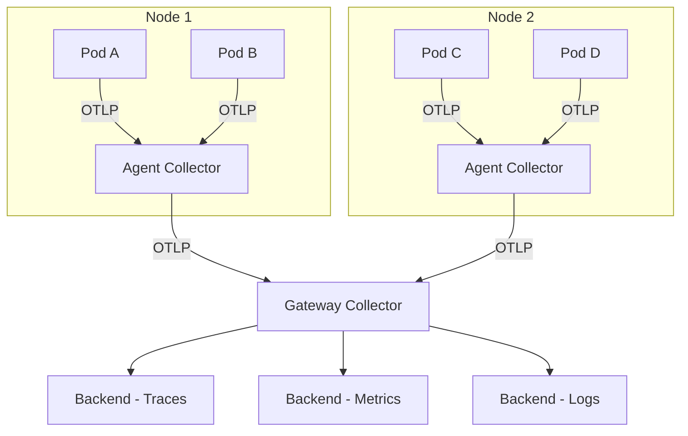

# How to Set Up OpenTelemetry on DigitalOcean Kubernetes

Author: [nawazdhandala](https://www.github.com/nawazdhandala)

Tags: OpenTelemetry, DigitalOcean, Kubernetes, Observability, Tracing, Metrics, Helm, DOKS

Description: A complete guide to deploying the OpenTelemetry Collector on DigitalOcean Kubernetes (DOKS) and instrumenting your workloads for full observability.

---

> DigitalOcean Kubernetes (DOKS) is a managed Kubernetes service that keeps things simple and affordable. It does not come with built-in observability tooling beyond basic monitoring, which makes it a great candidate for an OpenTelemetry-based observability stack that you control.

This guide walks you through deploying the OpenTelemetry Collector on DOKS, instrumenting your applications, and setting up a complete telemetry pipeline. We will use Helm for deployment and cover both the DaemonSet and Deployment patterns for the Collector.

---

## Architecture

The standard architecture for OpenTelemetry on Kubernetes uses two layers of Collectors: an agent layer running as a DaemonSet on every node, and a gateway layer running as a Deployment for centralized processing.



The agent Collectors run close to your pods and handle initial collection. The gateway Collector handles batching, processing, and export. This two-tier design keeps network traffic local on each node and centralizes the heavier processing.

---

## Prerequisites

- A DigitalOcean account with a Kubernetes cluster (1.28+)
- `kubectl` configured to talk to your cluster
- Helm 3 installed
- A backend to receive telemetry (OneUptime, Jaeger, Grafana Cloud, etc.)

---

## Step 1: Create a DOKS Cluster

If you do not already have a cluster, create one with `doctl`.

```bash
# Create a DigitalOcean Kubernetes cluster with 3 nodes
# Using the s-2vcpu-4gb size which is good for small-to-medium workloads
doctl kubernetes cluster create otel-cluster \
  --region nyc1 \
  --version 1.29.1-do.0 \
  --size s-2vcpu-4gb \
  --count 3

# Save the kubeconfig for kubectl access
doctl kubernetes cluster kubeconfig save otel-cluster
```

Verify the cluster is running.

```bash
# Check that all nodes are ready
kubectl get nodes
```

---

## Step 2: Deploy the OpenTelemetry Collector with Helm

The OpenTelemetry project maintains an official Helm chart that supports both DaemonSet and Deployment modes.

### Add the Helm Repository

```bash
# Add the OpenTelemetry Helm chart repository
helm repo add open-telemetry https://open-telemetry.github.io/opentelemetry-helm-charts
helm repo update
```

### Create the Namespace

```bash
# Create a dedicated namespace for observability components
kubectl create namespace observability
```

### Deploy the Agent Collector (DaemonSet)

The agent Collector runs on every node and collects telemetry from pods on that node. Create a values file for the agent configuration.

```yaml
# values-agent.yaml
# Helm values for the OpenTelemetry Collector DaemonSet (agent mode)

mode: daemonset

# Resource limits appropriate for a DaemonSet agent
resources:
  limits:
    cpu: 256m
    memory: 512Mi
  requests:
    cpu: 128m
    memory: 256Mi

# Presets enable common collection patterns
presets:
  # Collect Kubernetes attributes and attach them to telemetry
  kubernetesAttributes:
    enabled: true
  # Collect container logs from the node
  logsCollection:
    enabled: true
    includeCollectorLogs: false  # Avoid log loops

config:
  receivers:
    otlp:
      protocols:
        grpc:
          endpoint: 0.0.0.0:4317
        http:
          endpoint: 0.0.0.0:4318

    # Collect node and pod metrics from the kubelet
    kubeletstats:
      collection_interval: 30s
      auth_type: serviceAccount
      endpoint: "https://${env:K8S_NODE_NAME}:10250"
      insecure_skip_verify: true  # Required for DOKS kubelet certificates
      metric_groups:
        - node
        - pod
        - container

  processors:
    batch:
      timeout: 5s
      send_batch_size: 512

    memory_limiter:
      check_interval: 1s
      limit_mib: 400
      spike_limit_mib: 100

    # Enrich telemetry with Kubernetes metadata
    k8sattributes:
      auth_type: serviceAccount
      extract:
        metadata:
          - k8s.namespace.name
          - k8s.deployment.name
          - k8s.pod.name
          - k8s.node.name
          - k8s.container.name

  exporters:
    # Forward to the gateway Collector
    otlp:
      endpoint: "otel-gateway-collector.observability.svc.cluster.local:4317"
      tls:
        insecure: true  # Use TLS in production

  service:
    pipelines:
      traces:
        receivers: [otlp]
        processors: [memory_limiter, k8sattributes, batch]
        exporters: [otlp]
      metrics:
        receivers: [otlp, kubeletstats]
        processors: [memory_limiter, k8sattributes, batch]
        exporters: [otlp]
      logs:
        receivers: [otlp]
        processors: [memory_limiter, k8sattributes, batch]
        exporters: [otlp]
```

Deploy the agent.

```bash
# Install the agent Collector as a DaemonSet
helm install otel-agent open-telemetry/opentelemetry-collector \
  --namespace observability \
  --values values-agent.yaml
```

### Deploy the Gateway Collector (Deployment)

The gateway Collector receives telemetry from all agents and handles the final processing and export to your backend.

```yaml
# values-gateway.yaml
# Helm values for the OpenTelemetry Collector Deployment (gateway mode)

mode: deployment

# Run 2 replicas for high availability
replicaCount: 2

resources:
  limits:
    cpu: 1
    memory: 2Gi
  requests:
    cpu: 500m
    memory: 1Gi

config:
  receivers:
    otlp:
      protocols:
        grpc:
          endpoint: 0.0.0.0:4317
        http:
          endpoint: 0.0.0.0:4318

  processors:
    batch:
      timeout: 10s
      send_batch_size: 1024

    memory_limiter:
      check_interval: 1s
      limit_mib: 1500
      spike_limit_mib: 400

    # Tail-based sampling at the gateway level
    tail_sampling:
      decision_wait: 15s
      num_traces: 50000
      policies:
        - name: keep-errors
          type: status_code
          status_code:
            status_codes: [ERROR]
        - name: keep-slow
          type: latency
          latency:
            threshold_ms: 2000
        - name: probabilistic-sample
          type: probabilistic
          probabilistic:
            sampling_percentage: 20

  exporters:
    # Export to your observability backend
    otlphttp:
      endpoint: "https://oneuptime.com/otlp"
      headers:
        x-oneuptime-token: "your-project-token"

    # Optional: also export to a local Jaeger for development
    # otlp/jaeger:
    #   endpoint: "jaeger.observability.svc.cluster.local:4317"
    #   tls:
    #     insecure: true

  service:
    pipelines:
      traces:
        receivers: [otlp]
        processors: [memory_limiter, tail_sampling, batch]
        exporters: [otlphttp]
      metrics:
        receivers: [otlp]
        processors: [memory_limiter, batch]
        exporters: [otlphttp]
      logs:
        receivers: [otlp]
        processors: [memory_limiter, batch]
        exporters: [otlphttp]
```

Deploy the gateway.

```bash
# Install the gateway Collector as a Deployment
helm install otel-gateway open-telemetry/opentelemetry-collector \
  --namespace observability \
  --values values-gateway.yaml
```

### Verify the Deployment

```bash
# Check that all Collector pods are running
kubectl get pods -n observability

# Check the agent DaemonSet (should have one pod per node)
kubectl get daemonset -n observability

# Check the gateway Deployment
kubectl get deployment -n observability

# View logs from the gateway to confirm it is receiving data
kubectl logs -n observability -l app.kubernetes.io/name=opentelemetry-collector --tail=50
```

---

## Step 3: Instrument Your Application

With the Collector infrastructure in place, you need to configure your applications to send telemetry to the agent. The agent runs on every node, so your pods can reach it on the node's IP.

### Kubernetes Deployment with OTLP Configuration

Here is a sample deployment for a Python application that sends traces to the local agent Collector.

```yaml
# app-deployment.yaml
# Sample application deployment with OpenTelemetry configuration

apiVersion: apps/v1
kind: Deployment
metadata:
  name: order-service
  namespace: default
spec:
  replicas: 3
  selector:
    matchLabels:
      app: order-service
  template:
    metadata:
      labels:
        app: order-service
    spec:
      containers:
        - name: order-service
          image: myregistry/order-service:latest
          ports:
            - containerPort: 8080
          env:
            # Service identification
            - name: OTEL_SERVICE_NAME
              value: "order-service"

            # Point to the agent Collector running on the same node
            # Using the Kubernetes downward API to get the node IP
            - name: K8S_NODE_IP
              valueFrom:
                fieldRef:
                  fieldPath: status.hostIP

            # The agent Collector listens on port 4317 (gRPC)
            - name: OTEL_EXPORTER_OTLP_ENDPOINT
              value: "http://$(K8S_NODE_IP):4317"

            # Add Kubernetes metadata as resource attributes
            - name: OTEL_RESOURCE_ATTRIBUTES
              value: "k8s.namespace.name=default,k8s.pod.name=$(HOSTNAME)"

            # Configure trace sampling (10% in production)
            - name: OTEL_TRACES_SAMPLER
              value: "parentbased_traceidratio"
            - name: OTEL_TRACES_SAMPLER_ARG
              value: "0.1"
```

Apply the deployment.

```bash
# Deploy the application
kubectl apply -f app-deployment.yaml
```

---

## Step 4: Auto-Instrumentation with the OpenTelemetry Operator

For a zero-code approach, the OpenTelemetry Operator can inject instrumentation into your pods automatically. Install it with Helm.

```bash
# Install cert-manager (required by the OTel Operator)
kubectl apply -f https://github.com/cert-manager/cert-manager/releases/download/v1.14.5/cert-manager.yaml

# Wait for cert-manager to be ready
kubectl wait --for=condition=ready pod -l app.kubernetes.io/instance=cert-manager -n cert-manager --timeout=120s

# Install the OpenTelemetry Operator
helm install otel-operator open-telemetry/opentelemetry-operator \
  --namespace observability \
  --set admissionWebhooks.certManager.enabled=true
```

Create an Instrumentation custom resource that tells the Operator how to instrument pods.

```yaml
# instrumentation.yaml
# Auto-instrumentation configuration for the OTel Operator

apiVersion: opentelemetry.io/v1alpha1
kind: Instrumentation
metadata:
  name: auto-instrumentation
  namespace: default
spec:
  # Where to send telemetry
  exporter:
    endpoint: http://otel-agent-collector.observability.svc.cluster.local:4317

  # Language-specific configuration
  python:
    env:
      - name: OTEL_TRACES_EXPORTER
        value: otlp
      - name: OTEL_METRICS_EXPORTER
        value: otlp
  java:
    env:
      - name: OTEL_TRACES_EXPORTER
        value: otlp
  nodejs:
    env:
      - name: OTEL_TRACES_EXPORTER
        value: otlp

  # Propagators for distributed tracing context
  propagators:
    - tracecontext
    - baggage
```

Apply the Instrumentation resource and annotate your deployments to opt in.

```bash
# Apply the auto-instrumentation configuration
kubectl apply -f instrumentation.yaml

# Annotate a deployment to enable Python auto-instrumentation
kubectl patch deployment order-service -n default -p '{"spec":{"template":{"metadata":{"annotations":{"instrumentation.opentelemetry.io/inject-python":"true"}}}}}'

# For Node.js applications, use:
# instrumentation.opentelemetry.io/inject-nodejs: "true"

# For Java applications, use:
# instrumentation.opentelemetry.io/inject-java: "true"
```

The Operator injects the instrumentation agent as an init container and sets the required environment variables. Your pods will restart with tracing enabled automatically.

---

## DigitalOcean-Specific Considerations

A few things are specific to running OpenTelemetry on DOKS:

- **Load Balancer annotations**: If you expose the Collector externally (not recommended for production), use DigitalOcean's load balancer annotations to configure health checks and proxy protocols.
- **Persistent volumes**: DOKS uses DigitalOcean Block Storage for persistent volumes. If you need the Collector to buffer to disk, request a `do-block-storage` StorageClass volume.
- **Node pools**: For the gateway Collector, consider using a dedicated node pool with more memory. Tail sampling and batch processing can be memory-intensive.
- **Monitoring the Collector**: Use the Collector's built-in Prometheus metrics endpoint to monitor the Collector itself. Scrape it with Prometheus or send it to your backend.

```bash
# Check Collector health by hitting its metrics endpoint
kubectl port-forward -n observability svc/otel-gateway-collector 8888:8888
# Then visit http://localhost:8888/metrics in your browser
```

---

## Scaling Considerations

As your cluster grows, keep these scaling patterns in mind:

| Cluster Size | Agent Resources | Gateway Replicas | Gateway Resources |
|-------------|----------------|-----------------|-------------------|
| 1-5 nodes | 128m CPU, 256Mi | 1 | 500m CPU, 1Gi |
| 5-20 nodes | 256m CPU, 512Mi | 2 | 1 CPU, 2Gi |
| 20-50 nodes | 256m CPU, 512Mi | 3-5 | 2 CPU, 4Gi |
| 50+ nodes | 512m CPU, 1Gi | 5+ (with HPA) | 4 CPU, 8Gi |

For very large clusters, add a Horizontal Pod Autoscaler to the gateway.

```yaml
# gateway-hpa.yaml
# Auto-scale the gateway based on CPU utilization

apiVersion: autoscaling/v2
kind: HorizontalPodAutoscaler
metadata:
  name: otel-gateway-hpa
  namespace: observability
spec:
  scaleTargetRef:
    apiVersion: apps/v1
    kind: Deployment
    name: otel-gateway-opentelemetry-collector
  minReplicas: 2
  maxReplicas: 10
  metrics:
    - type: Resource
      resource:
        name: cpu
        target:
          type: Utilization
          averageUtilization: 70  # Scale up when CPU exceeds 70%
    - type: Resource
      resource:
        name: memory
        target:
          type: Utilization
          averageUtilization: 80
```

---

## Summary

Setting up OpenTelemetry on DigitalOcean Kubernetes follows the same patterns as any Kubernetes cluster, with a few platform-specific tweaks. The two-tier Collector architecture (agents as DaemonSets, gateway as a Deployment) gives you efficient local collection with centralized processing. The OpenTelemetry Operator takes it further with zero-code auto-instrumentation. Start with the agent and gateway Collectors, instrument a single service, verify traces are flowing, and then expand from there.
