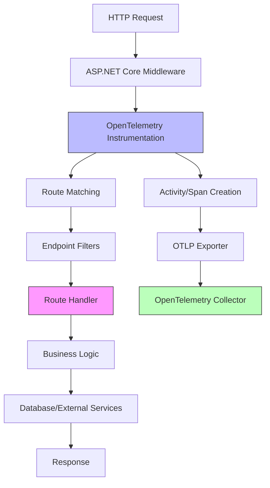

# How to Add OpenTelemetry to .NET 8 Minimal APIs

Author: [nawazdhandala](https://www.github.com/nawazdhandala)

Tags: OpenTelemetry, .NET 8, Minimal APIs, C#, Tracing, Metrics

Description: Learn how to instrument .NET 8 Minimal APIs with OpenTelemetry for distributed tracing, metrics collection, and comprehensive observability.

.NET 8 introduced significant improvements to Minimal APIs, making them a compelling choice for building lightweight, high-performance web services. However, the streamlined syntax and reduced boilerplate can make observability seem less straightforward compared to traditional controller-based APIs. Implementing OpenTelemetry in Minimal APIs requires understanding how to instrument route handlers, middleware, and filters while maintaining the simplicity that makes Minimal APIs attractive.

## Why Minimal APIs Need Specialized Instrumentation

Minimal APIs differ from MVC controllers in their execution model. Instead of controller classes with action methods, you define route handlers as lambda expressions or local functions directly in Program.cs. This means traditional attribute-based instrumentation won't work, and you need alternative approaches to add observability without cluttering your route definitions.

The compact syntax of Minimal APIs makes it easy to create many endpoints quickly, but this can lead to observability blind spots if you don't instrument proactively. Each route handler executes in the ASP.NET Core pipeline, but without explicit tracing, you lose visibility into handler-specific logic, parameter validation, and business operations.

## Architecture Overview



## Setting Up the Project

Create a new .NET 8 Minimal API project and add the necessary OpenTelemetry packages.

```bash
# Create new minimal API project
dotnet new webapi -n MinimalApiOtel -minimal

cd MinimalApiOtel

# Add OpenTelemetry packages
dotnet add package OpenTelemetry.Extensions.Hosting
dotnet add package OpenTelemetry.Instrumentation.AspNetCore
dotnet add package OpenTelemetry.Instrumentation.Http
dotnet add package OpenTelemetry.Exporter.OpenTelemetryProtocol
dotnet add package OpenTelemetry.Exporter.Console
```

## Basic OpenTelemetry Configuration

Configure OpenTelemetry in Program.cs with instrumentation for ASP.NET Core and HTTP client calls.

```csharp
using OpenTelemetry;
using OpenTelemetry.Resources;
using OpenTelemetry.Trace;
using OpenTelemetry.Metrics;
using System.Diagnostics;

var builder = WebApplication.CreateBuilder(args);

// Add OpenTelemetry with tracing and metrics
builder.Services.AddOpenTelemetry()
    .ConfigureResource(resource => resource
        .AddService(
            serviceName: "minimal-api-service",
            serviceVersion: "1.0.0",
            serviceInstanceId: Environment.MachineName)
        .AddAttributes(new Dictionary<string, object>
        {
            ["deployment.environment"] = builder.Environment.EnvironmentName,
            ["service.type"] = "minimal-api"
        }))
    .WithTracing(tracing => tracing
        .AddAspNetCoreInstrumentation(options =>
        {
            // Enrich spans with HTTP request details
            options.EnrichWithHttpRequest = (activity, request) =>
            {
                activity.SetTag("http.request.content_type", request.ContentType);
                activity.SetTag("http.request.content_length", request.ContentLength);

                // Add custom tags for minimal API routing
                var endpoint = request.HttpContext.GetEndpoint();
                if (endpoint != null)
                {
                    activity.SetTag("http.route.name", endpoint.DisplayName);
                }
            };

            // Enrich with response details
            options.EnrichWithHttpResponse = (activity, response) =>
            {
                activity.SetTag("http.response.content_type", response.ContentType);
                activity.SetTag("http.response.content_length", response.ContentLength);
            };

            // Filter out health check endpoints
            options.Filter = (context) =>
            {
                return !context.Request.Path.StartsWithSegments("/health");
            };

            // Record exceptions
            options.RecordException = true;
        })
        .AddHttpClientInstrumentation()
        // Add custom activity source for route handlers
        .AddSource("MinimalApi.Handlers")
        .AddSource("MinimalApi.Services")
        // Export to console for development
        .AddConsoleExporter()
        // Export to OTLP collector
        .AddOtlpExporter(options =>
        {
            options.Endpoint = new Uri(
                builder.Configuration["OpenTelemetry:Endpoint"] ?? "http://localhost:4317");
            options.Protocol = OpenTelemetry.Exporter.OtlpExportProtocol.Grpc;
        }))
    .WithMetrics(metrics => metrics
        .AddAspNetCoreInstrumentation()
        .AddHttpClientInstrumentation()
        .AddRuntimeInstrumentation()
        .AddMeter("MinimalApi.Handlers")
        .AddConsoleExporter()
        .AddOtlpExporter());

var app = builder.Build();

// Enable HTTPS redirection
app.UseHttpsRedirection();

// Add your route handlers here
app.MapGet("/", () => "Hello World!");

app.Run();
```

## Creating an Instrumentation Helper

Build a helper class to simplify instrumentation in route handlers without cluttering the endpoint definitions.

```csharp
using System.Diagnostics;
using System.Diagnostics.Metrics;

namespace MinimalApiOtel.Telemetry;

public static class ActivitySourceProvider
{
    public static readonly ActivitySource Source = new("MinimalApi.Handlers", "1.0.0");
    public static readonly Meter Meter = new("MinimalApi.Handlers", "1.0.0");

    // Counters for tracking requests
    public static readonly Counter<long> RequestCounter = Meter.CreateCounter<long>(
        "api.requests",
        description: "Total number of API requests");

    public static readonly Histogram<double> RequestDuration = Meter.CreateHistogram<double>(
        "api.request.duration",
        unit: "ms",
        description: "Duration of API requests in milliseconds");
}

public static class InstrumentationExtensions
{
    // Extension method to wrap route handlers with instrumentation
    public static async Task<T> WithInstrumentation<T>(
        this Task<T> task,
        string operationName,
        Action<Activity?>? enrichActivity = null,
        Dictionary<string, object>? tags = null)
    {
        using var activity = ActivitySourceProvider.Source.StartActivity(
            operationName,
            ActivityKind.Internal);

        // Add default tags
        if (tags != null)
        {
            foreach (var tag in tags)
            {
                activity?.SetTag(tag.Key, tag.Value);
            }
        }

        // Allow custom enrichment
        enrichActivity?.Invoke(activity);

        var stopwatch = Stopwatch.StartNew();

        try
        {
            // Increment request counter
            ActivitySourceProvider.RequestCounter.Add(1, new KeyValuePair<string, object?>(
                "operation", operationName));

            var result = await task;

            activity?.SetStatus(ActivityStatusCode.Ok);

            return result;
        }
        catch (Exception ex)
        {
            activity?.SetStatus(ActivityStatusCode.Error, ex.Message);
            activity?.RecordException(ex);
            throw;
        }
        finally
        {
            stopwatch.Stop();
            ActivitySourceProvider.RequestDuration.Record(
                stopwatch.Elapsed.TotalMilliseconds,
                new KeyValuePair<string, object?>("operation", operationName));
        }
    }
}
```

## Instrumenting Basic Route Handlers

Now instrument your route handlers using the helper methods. This keeps the route definitions clean while adding comprehensive tracing.

```csharp
app.MapGet("/api/products", async (IProductService productService) =>
{
    return await Task.Run(async () =>
    {
        var products = await productService.GetAllProductsAsync();
        return Results.Ok(products);
    }).WithInstrumentation(
        "GetProducts",
        activity =>
        {
            activity?.SetTag("handler.type", "list");
        });
})
.WithName("GetProducts")
.WithOpenApi();

app.MapGet("/api/products/{id:int}", async (int id, IProductService productService) =>
{
    return await Task.Run(async () =>
    {
        var product = await productService.GetProductByIdAsync(id);

        if (product == null)
        {
            return Results.NotFound(new { message = $"Product {id} not found" });
        }

        return Results.Ok(product);
    }).WithInstrumentation(
        "GetProductById",
        activity =>
        {
            activity?.SetTag("handler.type", "detail");
            activity?.SetTag("product.id", id);
        },
        new Dictionary<string, object>
        {
            ["resource.id"] = id
        });
})
.WithName("GetProductById")
.WithOpenApi();

app.MapPost("/api/products", async (Product product, IProductService productService) =>
{
    return await Task.Run(async () =>
    {
        if (string.IsNullOrWhiteSpace(product.Name))
        {
            return Results.BadRequest(new { message = "Product name is required" });
        }

        var created = await productService.CreateProductAsync(product);
        return Results.Created($"/api/products/{created.Id}", created);
    }).WithInstrumentation(
        "CreateProduct",
        activity =>
        {
            activity?.SetTag("handler.type", "create");
            activity?.SetTag("product.name", product.Name);
        });
})
.WithName("CreateProduct")
.WithOpenApi();
```

## Using Endpoint Filters for Automatic Instrumentation

Endpoint filters provide a cleaner way to add cross-cutting concerns like instrumentation to multiple endpoints.

```csharp
using System.Diagnostics;

namespace MinimalApiOtel.Filters;

public class TelemetryFilter : IEndpointFilter
{
    private static readonly ActivitySource ActivitySource = new(
        "MinimalApi.Filters",
        "1.0.0");

    public async ValueTask<object?> InvokeAsync(
        EndpointFilterInvocationContext context,
        EndpointFilterDelegate next)
    {
        var endpoint = context.HttpContext.GetEndpoint();
        var operationName = endpoint?.Metadata
            .GetMetadata<EndpointNameMetadata>()?.EndpointName ?? "UnknownEndpoint";

        using var activity = ActivitySource.StartActivity(
            $"Filter.{operationName}",
            ActivityKind.Internal);

        activity?.SetTag("filter.type", "telemetry");
        activity?.SetTag("endpoint.name", operationName);
        activity?.SetTag("http.method", context.HttpContext.Request.Method);

        // Add parameter information
        for (int i = 0; i < context.Arguments.Count; i++)
        {
            var arg = context.Arguments[i];
            if (arg != null && IsSimpleType(arg.GetType()))
            {
                activity?.SetTag($"parameter.{i}", arg.ToString());
            }
        }

        try
        {
            var result = await next(context);

            activity?.SetStatus(ActivityStatusCode.Ok);

            return result;
        }
        catch (Exception ex)
        {
            activity?.SetStatus(ActivityStatusCode.Error, ex.Message);
            activity?.RecordException(ex);
            throw;
        }
    }

    private static bool IsSimpleType(Type type)
    {
        return type.IsPrimitive
            || type.IsEnum
            || type == typeof(string)
            || type == typeof(decimal)
            || type == typeof(DateTime)
            || type == typeof(Guid);
    }
}
```

Apply the filter to your route groups:

```csharp
var productsGroup = app.MapGroup("/api/products")
    .AddEndpointFilter<TelemetryFilter>()
    .WithOpenApi();

productsGroup.MapGet("/", async (IProductService productService) =>
{
    var products = await productService.GetAllProductsAsync();
    return Results.Ok(products);
})
.WithName("GetAllProducts");

productsGroup.MapGet("/{id:int}", async (int id, IProductService productService) =>
{
    var product = await productService.GetProductByIdAsync(id);
    return product != null ? Results.Ok(product) : Results.NotFound();
})
.WithName("GetProductById");

productsGroup.MapPost("/", async (Product product, IProductService productService) =>
{
    var created = await productService.CreateProductAsync(product);
    return Results.Created($"/api/products/{created.Id}", created);
})
.WithName("CreateProduct");
```

## Instrumenting Service Layer

Services called by route handlers should be instrumented to provide end-to-end tracing.

```csharp
using System.Diagnostics;

namespace MinimalApiOtel.Services;

public interface IProductService
{
    Task<IEnumerable<Product>> GetAllProductsAsync();
    Task<Product?> GetProductByIdAsync(int id);
    Task<Product> CreateProductAsync(Product product);
}

public class ProductService : IProductService
{
    private static readonly ActivitySource ActivitySource = new(
        "MinimalApi.Services",
        "1.0.0");

    private readonly List<Product> _products = new();
    private int _nextId = 1;

    public async Task<IEnumerable<Product>> GetAllProductsAsync()
    {
        using var activity = ActivitySource.StartActivity(
            "ProductService.GetAll",
            ActivityKind.Internal);

        activity?.SetTag("service.method", "GetAllProductsAsync");

        // Simulate database call
        await Task.Delay(Random.Shared.Next(10, 50));

        activity?.SetTag("products.count", _products.Count);

        return _products.ToList();
    }

    public async Task<Product?> GetProductByIdAsync(int id)
    {
        using var activity = ActivitySource.StartActivity(
            "ProductService.GetById",
            ActivityKind.Internal);

        activity?.SetTag("service.method", "GetProductByIdAsync");
        activity?.SetTag("product.id", id);

        // Simulate database call
        await Task.Delay(Random.Shared.Next(10, 50));

        var product = _products.FirstOrDefault(p => p.Id == id);

        if (product == null)
        {
            activity?.SetTag("product.found", false);
        }
        else
        {
            activity?.SetTag("product.found", true);
            activity?.SetTag("product.name", product.Name);
        }

        return product;
    }

    public async Task<Product> CreateProductAsync(Product product)
    {
        using var activity = ActivitySource.StartActivity(
            "ProductService.Create",
            ActivityKind.Internal);

        activity?.SetTag("service.method", "CreateProductAsync");
        activity?.SetTag("product.name", product.Name);

        // Simulate database call
        await Task.Delay(Random.Shared.Next(50, 100));

        product.Id = _nextId++;
        _products.Add(product);

        activity?.SetTag("product.id", product.Id);
        activity?.AddEvent(new ActivityEvent("Product created", tags: new ActivityTagsCollection
        {
            ["product.id"] = product.Id,
            ["product.name"] = product.Name
        }));

        return product;
    }
}

public record Product
{
    public int Id { get; set; }
    public string Name { get; set; } = string.Empty;
    public decimal Price { get; set; }
    public string? Description { get; set; }
}
```

Register the service:

```csharp
builder.Services.AddSingleton<IProductService, ProductService>();
```

## Adding Custom Middleware for Request Logging

Create custom middleware to add additional telemetry context to all requests.

```csharp
using System.Diagnostics;

namespace MinimalApiOtel.Middleware;

public class RequestTelemetryMiddleware
{
    private readonly RequestDelegate _next;
    private static readonly ActivitySource ActivitySource = new(
        "MinimalApi.Middleware",
        "1.0.0");

    public RequestTelemetryMiddleware(RequestDelegate next)
    {
        _next = next;
    }

    public async Task InvokeAsync(HttpContext context)
    {
        var activity = Activity.Current;

        if (activity != null)
        {
            // Add custom tags to the current activity
            activity.SetTag("request.id", context.TraceIdentifier);
            activity.SetTag("request.protocol", context.Request.Protocol);
            activity.SetTag("request.scheme", context.Request.Scheme);

            // Add correlation ID if present
            if (context.Request.Headers.TryGetValue("X-Correlation-ID", out var correlationId))
            {
                activity.SetTag("correlation.id", correlationId.ToString());
            }

            // Add user information if authenticated
            if (context.User.Identity?.IsAuthenticated == true)
            {
                activity.SetTag("user.name", context.User.Identity.Name);
            }
        }

        await _next(context);
    }
}
```

Register the middleware:

```csharp
app.UseMiddleware<RequestTelemetryMiddleware>();
```

## Implementing Health Checks with Telemetry

Add health checks that are also instrumented but filtered from main telemetry to reduce noise.

```csharp
using Microsoft.Extensions.Diagnostics.HealthChecks;
using System.Diagnostics;

namespace MinimalApiOtel.Health;

public class DatabaseHealthCheck : IHealthCheck
{
    private static readonly ActivitySource ActivitySource = new(
        "MinimalApi.HealthChecks",
        "1.0.0");

    public async Task<HealthCheckResult> CheckHealthAsync(
        HealthCheckContext context,
        CancellationToken cancellationToken = default)
    {
        using var activity = ActivitySource.StartActivity(
            "HealthCheck.Database",
            ActivityKind.Internal);

        try
        {
            // Simulate database health check
            await Task.Delay(10, cancellationToken);

            activity?.SetTag("health.status", "healthy");

            return HealthCheckResult.Healthy("Database is responsive");
        }
        catch (Exception ex)
        {
            activity?.SetTag("health.status", "unhealthy");
            activity?.RecordException(ex);

            return HealthCheckResult.Unhealthy("Database is not responsive", ex);
        }
    }
}
```

Configure health checks:

```csharp
builder.Services.AddHealthChecks()
    .AddCheck<DatabaseHealthCheck>("database");

app.MapHealthChecks("/health");
```

## Tracing External HTTP Calls

When your Minimal API calls external services, ensure those calls are traced properly.

```csharp
app.MapGet("/api/external-data", async (IHttpClientFactory httpClientFactory) =>
{
    return await Task.Run(async () =>
    {
        using var activity = ActivitySourceProvider.Source.StartActivity(
            "FetchExternalData",
            ActivityKind.Client);

        activity?.SetTag("external.service", "example-api");

        try
        {
            var client = httpClientFactory.CreateClient();
            var response = await client.GetAsync("https://api.example.com/data");

            activity?.SetTag("http.status_code", (int)response.StatusCode);

            if (response.IsSuccessStatusCode)
            {
                var data = await response.Content.ReadAsStringAsync();
                activity?.SetTag("response.length", data.Length);
                return Results.Ok(new { data });
            }

            return Results.StatusCode((int)response.StatusCode);
        }
        catch (Exception ex)
        {
            activity?.SetStatus(ActivityStatusCode.Error, ex.Message);
            activity?.RecordException(ex);
            throw;
        }
    }).WithInstrumentation("GetExternalData");
})
.WithName("GetExternalData");
```

Register HttpClient:

```csharp
builder.Services.AddHttpClient();
```

## Best Practices for Minimal API Instrumentation

Keep instrumentation code separate from business logic. Use endpoint filters or helper methods to avoid cluttering route handlers with telemetry code.

Always instrument service layers in addition to route handlers. The most valuable traces show the complete flow from HTTP request through business logic to data access.

Use meaningful operation names that describe what the endpoint does, not just the HTTP method and route. Names like "CreateProduct" are more useful than "POST /api/products" when analyzing traces.

Be selective about what data you include in spans. Avoid logging sensitive information like passwords, tokens, or personal data. Use semantic conventions for common attributes to ensure consistency.

Consider sampling in production environments. High-traffic Minimal APIs can generate massive amounts of telemetry. Configure sampling to capture enough data for analysis without overwhelming your observability backend.

OpenTelemetry integrates naturally with .NET 8 Minimal APIs through a combination of automatic instrumentation, endpoint filters, and strategic use of custom activity sources. This approach maintains the simplicity and performance characteristics that make Minimal APIs attractive while providing the comprehensive observability needed for production systems.
