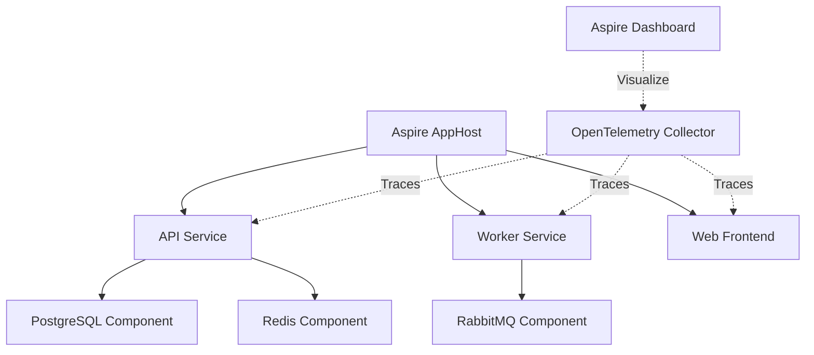

# How to Use OpenTelemetry with .NET Aspire for Cloud-Native Observability

Author: [nawazdhandala](https://www.github.com/nawazdhandala)

Tags: OpenTelemetry, .NET Aspire, Cloud-Native, Observability, Distributed Apps

Description: Complete guide to implementing comprehensive observability in .NET Aspire applications using OpenTelemetry for distributed tracing, metrics, and logs across cloud-native architectures.

.NET Aspire represents a significant shift in how we build cloud-native applications in the .NET ecosystem. It provides opinionated patterns for building distributed applications with built-in observability, service discovery, and resilience. OpenTelemetry is deeply integrated into Aspire, making it the natural choice for collecting telemetry data.

What makes Aspire unique is its approach to observability as a first-class concern. Rather than bolting on telemetry after the fact, Aspire applications are built with telemetry from the ground up. Every component, from HTTP clients to database connections, emits standardized telemetry automatically.

## Understanding .NET Aspire's Architecture

.NET Aspire applications consist of several key components: the AppHost for orchestration, service projects that implement business logic, and component integrations that provide standardized access to infrastructure like databases and message queues.

The AppHost acts as the control plane during development, managing service lifecycle and wiring up observability infrastructure. In production, it generates deployment manifests that preserve the observability configuration.



## Creating an Aspire Application with OpenTelemetry

Start by creating a new Aspire application using the .NET CLI.

```bash
dotnet new aspire-starter -n DistributedEcommerce
cd DistributedEcommerce
```

This creates an AppHost project and a default service project. The AppHost includes OpenTelemetry configuration by default.

Examine the AppHost Program.cs to see the built-in observability setup.

```csharp
using Microsoft.Extensions.Hosting;

var builder = DistributedApplication.CreateBuilder(args);

// Add PostgreSQL with automatic instrumentation
var postgres = builder.AddPostgres("postgres")
    .WithPgAdmin()
    .AddDatabase("catalogdb");

// Add Redis with automatic instrumentation
var redis = builder.AddRedis("redis");

// Add RabbitMQ with automatic instrumentation
var messaging = builder.AddRabbitMQ("messaging");

// Add the API service with all dependencies
var apiService = builder.AddProject<Projects.EcommerceApi>("api")
    .WithReference(postgres)
    .WithReference(redis)
    .WithReference(messaging)
    .WithReplicas(2); // Scale out with automatic trace correlation

// Add the worker service
var workerService = builder.AddProject<Projects.OrderProcessor>("worker")
    .WithReference(postgres)
    .WithReference(messaging);

// Add the frontend
var frontend = builder.AddProject<Projects.WebFrontend>("frontend")
    .WithReference(apiService)
    .WithReference(redis);

// All services automatically export telemetry to Aspire Dashboard
builder.Build().Run();
```

Aspire automatically configures OpenTelemetry exporters for all services. No manual OTLP exporter configuration needed during development.

## Instrumenting an Aspire Service Project

Service projects in Aspire use standard ASP.NET Core patterns but benefit from enhanced component integrations.

```csharp
using Microsoft.Extensions.ServiceDiscovery;

var builder = WebApplication.CreateBuilder(args);

// Aspire automatically adds OpenTelemetry with appropriate configuration
builder.AddServiceDefaults();

// Add Aspire components - these include automatic instrumentation
builder.AddNpgsqlDbContext<CatalogDbContext>("catalogdb");
builder.AddRedisDistributedCache("redis");
builder.AddRabbitMQClient("messaging");

// Add HTTP client with service discovery and resilience
builder.Services.AddHttpClient<IOrderService, OrderServiceClient>(client =>
{
    // Service discovery automatically resolves service endpoints
    client.BaseAddress = new Uri("https+http://api");
})
.AddStandardResilienceHandler(); // Polly with telemetry

// Add custom instrumentation
builder.Services.AddSingleton<ActivitySource>(sp =>
    new ActivitySource("EcommerceApi", "1.0.0"));

var app = builder.Build();

// Standard ASP.NET Core middleware is automatically instrumented
app.MapGet("/api/products/{id}", async (
    int id,
    CatalogDbContext db,
    ActivitySource activitySource) =>
{
    using var activity = activitySource.StartActivity("GetProduct");
    activity?.SetTag("product.id", id);

    var product = await db.Products.FindAsync(id);

    if (product == null)
    {
        activity?.SetStatus(ActivityStatusCode.Error, "Product not found");
        return Results.NotFound();
    }

    activity?.SetTag("product.name", product.Name);
    activity?.SetTag("product.price", product.Price);

    return Results.Ok(product);
});

app.Run();
```

The `AddServiceDefaults()` extension method adds comprehensive telemetry configuration, health checks, and service discovery client configuration in a single call.

## Leveraging Aspire Component Integrations

Aspire components wrap common infrastructure dependencies with automatic instrumentation and configuration.

```csharp
using Aspire.Npgsql;
using Npgsql;

// Example: Custom database operations with automatic tracing
public class ProductRepository
{
    private readonly NpgsqlDataSource _dataSource;
    private readonly ActivitySource _activitySource;

    public ProductRepository(
        NpgsqlDataSource dataSource,
        ActivitySource activitySource)
    {
        _dataSource = dataSource;
        _activitySource = activitySource;
    }

    public async Task<Product> GetProductAsync(int productId)
    {
        // NpgsqlDataSource automatically creates traced connections
        using var activity = _activitySource.StartActivity("GetProduct");
        activity?.SetTag("product.id", productId);

        await using var connection = await _dataSource.OpenConnectionAsync();
        await using var command = new NpgsqlCommand(
            "SELECT id, name, price, stock FROM products WHERE id = @id",
            connection);

        command.Parameters.AddWithValue("id", productId);

        // Database operations are automatically traced by Npgsql instrumentation
        await using var reader = await command.ExecuteReaderAsync();

        if (await reader.ReadAsync())
        {
            var product = new Product
            {
                Id = reader.GetInt32(0),
                Name = reader.GetString(1),
                Price = reader.GetDecimal(2),
                Stock = reader.GetInt32(3)
            };

            activity?.SetTag("product.stock", product.Stock);
            return product;
        }

        return null;
    }
}
```

## Distributed Tracing Across Aspire Services

Service-to-service communication in Aspire automatically propagates trace context using service discovery.

```csharp
// In the API service
public class OrderController : ControllerBase
{
    private readonly IHttpClientFactory _httpClientFactory;
    private readonly ActivitySource _activitySource;
    private readonly IMessagePublisher _messagePublisher;

    public OrderController(
        IHttpClientFactory httpClientFactory,
        ActivitySource activitySource,
        IMessagePublisher messagePublisher)
    {
        _httpClientFactory = httpClientFactory;
        _activitySource = activitySource;
        _messagePublisher = messagePublisher;
    }

    [HttpPost("/api/orders")]
    public async Task<IActionResult> CreateOrder([FromBody] CreateOrderRequest request)
    {
        using var activity = _activitySource.StartActivity("CreateOrder");
        activity?.SetTag("order.customer_id", request.CustomerId);
        activity?.SetTag("order.item_count", request.Items.Count);

        // Validate inventory by calling another service
        // Trace context automatically propagates
        var inventoryClient = _httpClientFactory.CreateClient("inventory");
        var inventoryResponse = await inventoryClient.PostAsJsonAsync(
            "/api/inventory/validate",
            new { items = request.Items });

        if (!inventoryResponse.IsSuccessStatusCode)
        {
            activity?.SetStatus(ActivityStatusCode.Error, "Inventory validation failed");
            return BadRequest("Insufficient inventory");
        }

        // Create order in database (automatically traced)
        var order = new Order
        {
            CustomerId = request.CustomerId,
            Items = request.Items,
            CreatedAt = DateTime.UtcNow
        };

        // Publish order created event (trace context propagates)
        await _messagePublisher.PublishAsync("orders.created", order);

        activity?.SetTag("order.id", order.Id);
        return Ok(order);
    }
}

// In the worker service consuming messages
public class OrderProcessorWorker : BackgroundService
{
    private readonly IMessageConsumer _messageConsumer;
    private readonly ActivitySource _activitySource;

    protected override async Task ExecuteAsync(CancellationToken stoppingToken)
    {
        await _messageConsumer.ConsumeAsync<Order>(
            "orders.created",
            async (order, context) =>
            {
                // Extract trace context from message
                using var activity = _activitySource.StartActivity(
                    "ProcessOrder",
                    ActivityKind.Consumer,
                    context.ParentContext);

                activity?.SetTag("order.id", order.Id);
                activity?.SetTag("messaging.system", "rabbitmq");

                // Process the order
                await ProcessOrderAsync(order);

                activity?.SetStatus(ActivityStatusCode.Ok);
            },
            stoppingToken);
    }

    private async Task ProcessOrderAsync(Order order)
    {
        using var activity = _activitySource.StartActivity("ProcessOrderLogic");

        // Business logic here
        await Task.Delay(100);

        activity?.AddEvent(new ActivityEvent("Order processed successfully"));
    }
}
```

## Custom Metrics for Business Observability

Beyond automatic instrumentation, create custom metrics for business-specific insights.

```csharp
using System.Diagnostics.Metrics;

public class OrderMetrics
{
    private readonly Meter _meter;
    private readonly Counter<long> _ordersCreated;
    private readonly Histogram<double> _orderValue;
    private readonly ObservableGauge<int> _pendingOrders;
    private readonly Counter<long> _ordersFailed;

    public OrderMetrics(IMeterFactory meterFactory)
    {
        _meter = meterFactory.Create("EcommerceApi.Orders", "1.0.0");

        _ordersCreated = _meter.CreateCounter<long>(
            "orders_created_total",
            description: "Total number of orders created");

        _orderValue = _meter.CreateHistogram<double>(
            "order_value_dollars",
            unit: "USD",
            description: "Order value in dollars");

        _pendingOrders = _meter.CreateObservableGauge<int>(
            "orders_pending",
            observeValue: GetPendingOrderCount,
            description: "Number of orders pending processing");

        _ordersFailed = _meter.CreateCounter<long>(
            "orders_failed_total",
            description: "Total number of failed orders");
    }

    public void RecordOrderCreated(Order order)
    {
        var tags = new TagList
        {
            { "customer_type", order.CustomerType },
            { "payment_method", order.PaymentMethod },
            { "region", order.ShippingAddress.Region }
        };

        _ordersCreated.Add(1, tags);
        _orderValue.Record(order.TotalAmount, tags);
    }

    public void RecordOrderFailed(string reason)
    {
        _ordersFailed.Add(1, new TagList { { "reason", reason } });
    }

    private int GetPendingOrderCount()
    {
        // Query your database or cache for pending count
        return 0; // Implementation specific
    }
}
```

## Structured Logging with OpenTelemetry

Aspire integrates structured logging with OpenTelemetry for correlated logs and traces.

```csharp
public class PaymentService
{
    private readonly ILogger<PaymentService> _logger;
    private readonly ActivitySource _activitySource;

    public PaymentService(
        ILogger<PaymentService> logger,
        ActivitySource activitySource)
    {
        _logger = logger;
        _activitySource = activitySource;
    }

    public async Task<PaymentResult> ProcessPaymentAsync(PaymentRequest request)
    {
        using var activity = _activitySource.StartActivity("ProcessPayment");
        activity?.SetTag("payment.amount", request.Amount);
        activity?.SetTag("payment.method", request.PaymentMethod);

        // Structured log with correlation
        _logger.LogInformation(
            "Processing payment of {Amount} for order {OrderId} using {PaymentMethod}",
            request.Amount,
            request.OrderId,
            request.PaymentMethod);

        try
        {
            // Payment processing logic
            var result = await CallPaymentGatewayAsync(request);

            if (result.Success)
            {
                _logger.LogInformation(
                    "Payment successful for order {OrderId}. Transaction ID: {TransactionId}",
                    request.OrderId,
                    result.TransactionId);

                activity?.SetTag("payment.transaction_id", result.TransactionId);
                activity?.SetStatus(ActivityStatusCode.Ok);
            }
            else
            {
                _logger.LogWarning(
                    "Payment failed for order {OrderId}. Reason: {Reason}",
                    request.OrderId,
                    result.FailureReason);

                activity?.SetStatus(ActivityStatusCode.Error, result.FailureReason);
            }

            return result;
        }
        catch (Exception ex)
        {
            _logger.LogError(
                ex,
                "Payment processing error for order {OrderId}",
                request.OrderId);

            activity?.RecordException(ex);
            activity?.SetStatus(ActivityStatusCode.Error, ex.Message);
            throw;
        }
    }

    private async Task<PaymentResult> CallPaymentGatewayAsync(PaymentRequest request)
    {
        // Implementation
        await Task.Delay(100);
        return new PaymentResult { Success = true, TransactionId = Guid.NewGuid().ToString() };
    }
}
```

## Aspire Dashboard for Local Development

The Aspire Dashboard provides a rich development experience with real-time telemetry visualization.

When you run your Aspire application, the dashboard automatically starts and shows:

- Live traces across all services
- Metrics dashboards with automatic refresh
- Structured logs with filtering and search
- Service dependency graphs
- Resource health status

Access the dashboard at the URL shown in the console output (typically http://localhost:15888).

The dashboard uses OpenTelemetry Protocol (OTLP) to receive telemetry from all services. In production, replace the dashboard with your observability backend.

## Production Deployment with Observability

Configure production telemetry exporters in your AppHost for deployment environments.

```csharp
var builder = DistributedApplication.CreateBuilder(args);

// Configure OpenTelemetry for production
if (builder.Environment.IsProduction())
{
    builder.Services.Configure<OpenTelemetryOptions>(options =>
    {
        // Export to production OTLP endpoint
        options.OtlpEndpoint = builder.Configuration["Observability:OtlpEndpoint"];

        // Configure sampling for high-volume environments
        options.TraceSampler = new TraceIdRatioBasedSampler(0.1); // 10% sampling
    });
}

// Rest of service definitions
var postgres = builder.AddPostgres("postgres");
var api = builder.AddProject<Projects.EcommerceApi>("api");

builder.Build().Run();
```

Generate deployment manifests that include observability configuration.

```bash
dotnet run --project AppHost -- --publisher manifest --output-path ../deploy
```

This generates Kubernetes manifests or Docker Compose files with proper OpenTelemetry configuration preserved.

## Monitoring Aspire Service Health

Aspire includes comprehensive health check support with automatic metrics.

```csharp
var builder = WebApplication.CreateBuilder(args);

builder.AddServiceDefaults(); // Includes health check configuration

// Add custom health checks
builder.Services.AddHealthChecks()
    .AddCheck<OrderProcessingHealthCheck>("order-processing")
    .AddCheck<PaymentGatewayHealthCheck>("payment-gateway");

var app = builder.Build();

// Health check endpoints are automatically mapped
app.MapDefaultEndpoints(); // Includes /health, /alive, /ready

app.Run();
```

Health check metrics automatically flow through OpenTelemetry to your observability platform.

## Best Practices for Aspire Observability

Use Aspire components instead of direct client libraries whenever possible. The components include optimized instrumentation and integrate seamlessly with the Aspire orchestration model.

Design your services with observability in mind from the start. Add custom spans for business operations, not just technical operations. Understanding how long it takes to calculate shipping costs is as important as knowing database query duration.

Leverage service discovery for all inter-service communication. This ensures trace context propagates correctly and makes your services more resilient to topology changes.

Use the Aspire Dashboard extensively during development. The immediate feedback loop helps you understand telemetry data and catch instrumentation gaps before production deployment.

Consider sampling strategies carefully in production. Aspire applications can generate significant telemetry volume. Use tail-based sampling at the collector level to keep complete traces for errors while reducing overall data volume.

Monitor the observability pipeline itself. Set up alerts if telemetry export fails or latency increases. An observability outage during a production incident is particularly painful.

.NET Aspire represents the future of building observable cloud-native applications in .NET. By making OpenTelemetry a first-class concern and providing opinionated patterns, Aspire makes it easier than ever to build applications with production-grade observability from day one.