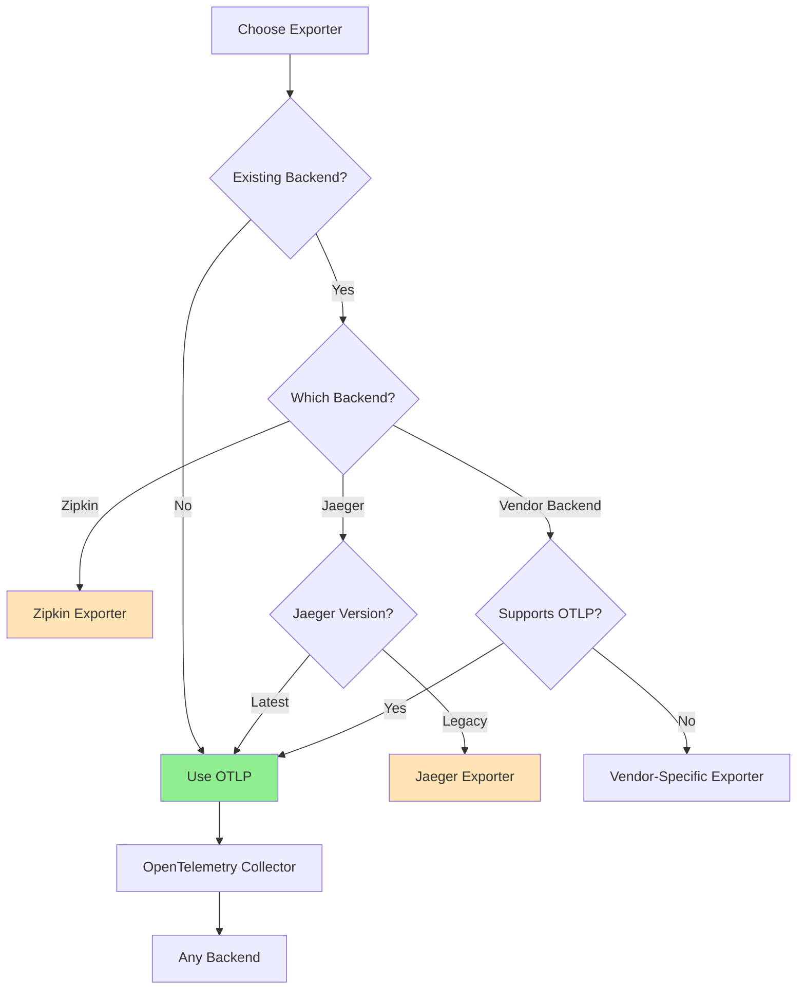

# How to Configure OpenTelemetry Exporters in Micronaut (OTLP, Zipkin, Jaeger)

Author: [nawazdhandala](https://www.github.com/nawazdhandala)

Tags: OpenTelemetry, Micronaut, Exporters, OTLP, Zipkin, Jaeger

Description: Comprehensive guide to configuring and using different OpenTelemetry exporters in Micronaut applications including OTLP, Zipkin, and Jaeger for flexible trace backend integration.

Choosing the right trace exporter for your Micronaut application depends on your observability backend, infrastructure requirements, and team preferences. OpenTelemetry supports multiple exporters, allowing you to send traces to various backends without changing your instrumentation code. This flexibility means you can switch between Jaeger, Zipkin, or vendor-specific backends by simply changing configuration.

This guide provides detailed instructions for configuring OTLP, Zipkin, and Jaeger exporters in Micronaut applications, along with best practices for each.

## Understanding OpenTelemetry Exporters

An exporter is responsible for serializing and transmitting trace data from your application to a backend system. OpenTelemetry defines a standard protocol (OTLP) while maintaining backward compatibility with popular formats like Zipkin and Jaeger.

Each exporter has different characteristics:

- **OTLP**: The native OpenTelemetry protocol, supporting gRPC and HTTP. Best for modern OpenTelemetry collectors and backends.
- **Zipkin**: Mature format with wide support. Good for existing Zipkin infrastructure.
- **Jaeger**: Originally developed by Uber, popular in Kubernetes environments. Supports both Thrift and Protobuf formats.

You can configure multiple exporters simultaneously, sending traces to multiple backends for redundancy or migration scenarios.

## Project Dependencies for Different Exporters

First, add the appropriate dependencies based on which exporters you want to use.

```gradle
// build.gradle
dependencies {
    // Core Micronaut tracing
    implementation("io.micronaut.tracing:micronaut-tracing-opentelemetry")

    // OpenTelemetry API
    implementation("io.opentelemetry:opentelemetry-api")
    implementation("io.opentelemetry:opentelemetry-sdk")

    // OTLP Exporter (gRPC)
    implementation("io.opentelemetry:opentelemetry-exporter-otlp")

    // Zipkin Exporter
    implementation("io.opentelemetry:opentelemetry-exporter-zipkin")

    // Jaeger Exporter
    implementation("io.opentelemetry:opentelemetry-exporter-jaeger")

    // Optional: Logging exporter for debugging
    implementation("io.opentelemetry:opentelemetry-exporter-logging")
}
```

For Maven projects:

```xml
<dependencies>
    <!-- Core Micronaut tracing -->
    <dependency>
        <groupId>io.micronaut.tracing</groupId>
        <artifactId>micronaut-tracing-opentelemetry</artifactId>
    </dependency>

    <!-- OpenTelemetry SDK -->
    <dependency>
        <groupId>io.opentelemetry</groupId>
        <artifactId>opentelemetry-sdk</artifactId>
    </dependency>

    <!-- OTLP Exporter -->
    <dependency>
        <groupId>io.opentelemetry</groupId>
        <artifactId>opentelemetry-exporter-otlp</artifactId>
    </dependency>

    <!-- Zipkin Exporter -->
    <dependency>
        <groupId>io.opentelemetry</groupId>
        <artifactId>opentelemetry-exporter-zipkin</artifactId>
    </dependency>

    <!-- Jaeger Exporter -->
    <dependency>
        <groupId>io.opentelemetry</groupId>
        <artifactId>opentelemetry-exporter-jaeger</artifactId>
    </dependency>
</dependencies>
```

## Configuring OTLP Exporter

OTLP (OpenTelemetry Protocol) is the recommended exporter for modern deployments. It supports both gRPC and HTTP/protobuf transports.

```yaml
# application.yml - OTLP with gRPC
tracing:
  enabled: true

opentelemetry:
  service-name: micronaut-otlp-service

  # Resource attributes
  resource-attributes:
    deployment.environment: production
    service.version: 1.0.0

  # OTLP exporter configuration
  exporter:
    otlp:
      enabled: true
      # gRPC endpoint (default port 4317)
      endpoint: http://localhost:4317
      # Protocol: grpc or http/protobuf
      protocol: grpc
      # Timeout for exports
      timeout: 10s
      # Enable compression to reduce network traffic
      compression: gzip
      # Custom headers for authentication
      headers:
        Authorization: "Bearer ${OTEL_AUTH_TOKEN:}"
        X-Custom-Header: "custom-value"

  # Batch span processor configuration
  span-processor:
    batch:
      schedule-delay: 5000
      max-queue-size: 2048
      max-export-batch-size: 512
      export-timeout: 30000
```

For HTTP/protobuf transport (useful when gRPC is not available):

```yaml
# application.yml - OTLP with HTTP
opentelemetry:
  exporter:
    otlp:
      enabled: true
      # HTTP endpoint (default port 4318)
      endpoint: http://localhost:4318/v1/traces
      protocol: http/protobuf
      timeout: 10s
      compression: gzip
```

## Configuring Zipkin Exporter

Zipkin exporter is ideal when you have existing Zipkin infrastructure or need broad compatibility.

```yaml
# application.yml - Zipkin configuration
tracing:
  enabled: true

  # Use Zipkin-compatible tracing
  zipkin:
    enabled: true
    # Zipkin collector endpoint
    url: http://localhost:9411/api/v2/spans
    # HTTP connection timeout
    connect-timeout: 1s
    # Read timeout for HTTP requests
    read-timeout: 10s

opentelemetry:
  service-name: micronaut-zipkin-service

  resource-attributes:
    deployment.environment: production

  # Disable OTLP if using only Zipkin
  exporter:
    otlp:
      enabled: false
```

For programmatic Zipkin configuration with more control:

```java
package com.example.config;

import io.micronaut.context.annotation.Factory;
import io.opentelemetry.exporter.zipkin.ZipkinSpanExporter;
import io.opentelemetry.sdk.trace.export.SpanExporter;
import jakarta.inject.Singleton;

@Factory
public class ZipkinExporterConfig {

    @Singleton
    public SpanExporter zipkinExporter() {
        return ZipkinSpanExporter.builder()
            .setEndpoint("http://localhost:9411/api/v2/spans")
            // Optional: set custom encoder
            .setEncoder(/* custom encoder */)
            // Optional: set read timeout
            .setReadTimeout(java.time.Duration.ofSeconds(10))
            .build();
    }
}
```

## Configuring Jaeger Exporter

Jaeger exporter works with Jaeger agents and collectors. Note that Jaeger now recommends using OTLP instead of the native Jaeger protocol.

```yaml
# application.yml - Jaeger configuration
tracing:
  enabled: true

  jaeger:
    enabled: true
    # Jaeger collector endpoint
    endpoint: http://localhost:14250
    # Service name
    service-name: micronaut-jaeger-service

opentelemetry:
  service-name: micronaut-jaeger-service

  resource-attributes:
    deployment.environment: production

  # Disable OTLP if using only Jaeger
  exporter:
    otlp:
      enabled: false
```

Programmatic Jaeger configuration for advanced scenarios:

```java
package com.example.config;

import io.micronaut.context.annotation.Factory;
import io.opentelemetry.exporter.jaeger.JaegerGrpcSpanExporter;
import io.opentelemetry.sdk.trace.export.SpanExporter;
import jakarta.inject.Singleton;

import java.time.Duration;

@Factory
public class JaegerExporterConfig {

    @Singleton
    public SpanExporter jaegerExporter() {
        return JaegerGrpcSpanExporter.builder()
            // Jaeger collector gRPC endpoint
            .setEndpoint("http://localhost:14250")
            // Connection timeout
            .setTimeout(Duration.ofSeconds(10))
            .build();
    }
}
```

## Configuring Multiple Exporters Simultaneously

Send traces to multiple backends for redundancy, migration, or multi-vendor scenarios.

```java
package com.example.config;

import io.micronaut.context.annotation.Factory;
import io.micronaut.context.annotation.Requires;
import io.opentelemetry.exporter.otlp.trace.OtlpGrpcSpanExporter;
import io.opentelemetry.exporter.zipkin.ZipkinSpanExporter;
import io.opentelemetry.exporter.jaeger.JaegerGrpcSpanExporter;
import io.opentelemetry.sdk.trace.export.SpanExporter;
import io.opentelemetry.sdk.trace.export.BatchSpanProcessor;
import io.opentelemetry.sdk.trace.SdkTracerProvider;
import jakarta.inject.Singleton;

import java.time.Duration;
import java.util.Arrays;

@Factory
public class MultiExporterConfig {

    @Singleton
    @Requires(property = "tracing.multi-exporter.enabled", value = "true")
    public SdkTracerProvider tracerProvider() {
        // Create OTLP exporter
        SpanExporter otlpExporter = OtlpGrpcSpanExporter.builder()
            .setEndpoint("http://otel-collector:4317")
            .setTimeout(Duration.ofSeconds(10))
            .build();

        // Create Zipkin exporter
        SpanExporter zipkinExporter = ZipkinSpanExporter.builder()
            .setEndpoint("http://zipkin:9411/api/v2/spans")
            .setReadTimeout(Duration.ofSeconds(10))
            .build();

        // Create Jaeger exporter
        SpanExporter jaegerExporter = JaegerGrpcSpanExporter.builder()
            .setEndpoint("http://jaeger:14250")
            .setTimeout(Duration.ofSeconds(10))
            .build();

        // Create a composite exporter that sends to all backends
        SpanExporter multiExporter = SpanExporter.composite(
            Arrays.asList(otlpExporter, zipkinExporter, jaegerExporter)
        );

        // Build tracer provider with batch processor
        return SdkTracerProvider.builder()
            .addSpanProcessor(
                BatchSpanProcessor.builder(multiExporter)
                    .setScheduleDelay(Duration.ofSeconds(5))
                    .setMaxQueueSize(2048)
                    .setMaxExportBatchSize(512)
                    .build()
            )
            .build();
    }
}
```

Configuration for the multi-exporter setup:

```yaml
# application.yml - Multi-exporter configuration
tracing:
  enabled: true
  multi-exporter:
    enabled: true

opentelemetry:
  service-name: micronaut-multi-backend-service

  resource-attributes:
    deployment.environment: production
    service.version: 1.0.0
```

## Exporter Selection Strategy

Here's a decision tree for choosing the right exporter:



## Environment-Specific Configurations

Create different configurations for development, staging, and production environments.

```yaml
# application.yml - Common configuration
tracing:
  enabled: true

opentelemetry:
  service-name: ${SERVICE_NAME:micronaut-service}
  resource-attributes:
    service.version: ${APP_VERSION:dev}

---
# application-dev.yml - Development configuration
micronaut:
  application:
    name: micronaut-service
  config-client:
    enabled: true

opentelemetry:
  exporter:
    otlp:
      enabled: true
      endpoint: http://localhost:4317
      protocol: grpc

  # Full sampling in development
  sampler:
    probability: 1.0

  # Shorter delays for immediate feedback
  span-processor:
    batch:
      schedule-delay: 1000

---
# application-staging.yml - Staging configuration
opentelemetry:
  resource-attributes:
    deployment.environment: staging

  exporter:
    otlp:
      enabled: true
      endpoint: ${OTEL_COLLECTOR_ENDPOINT:http://otel-collector.staging:4317}
      protocol: grpc
      compression: gzip

  # Moderate sampling
  sampler:
    probability: 0.5

  span-processor:
    batch:
      schedule-delay: 3000

---
# application-prod.yml - Production configuration
opentelemetry:
  resource-attributes:
    deployment.environment: production

  exporter:
    otlp:
      enabled: true
      endpoint: ${OTEL_COLLECTOR_ENDPOINT}
      protocol: grpc
      compression: gzip
      # Authentication headers
      headers:
        Authorization: "Bearer ${OTEL_AUTH_TOKEN}"

  # Lower sampling for high traffic
  sampler:
    type: parentbased_traceidratio
    probability: ${TRACE_SAMPLE_RATE:0.1}

  # Optimized batch processing
  span-processor:
    batch:
      schedule-delay: 5000
      max-queue-size: 2048
      max-export-batch-size: 512
```

## Custom Exporter Implementation

For specialized requirements, implement a custom exporter.

```java
package com.example.exporter;

import io.opentelemetry.sdk.common.CompletableResultCode;
import io.opentelemetry.sdk.trace.data.SpanData;
import io.opentelemetry.sdk.trace.export.SpanExporter;
import org.slf4j.Logger;
import org.slf4j.LoggerFactory;

import java.util.Collection;
import java.util.concurrent.TimeUnit;

/**
 * Custom exporter that writes spans to a custom backend
 */
public class CustomSpanExporter implements SpanExporter {

    private static final Logger log = LoggerFactory.getLogger(CustomSpanExporter.class);

    private final String endpoint;
    private final CustomBackendClient client;
    private volatile boolean isShutdown = false;

    public CustomSpanExporter(String endpoint) {
        this.endpoint = endpoint;
        this.client = new CustomBackendClient(endpoint);
    }

    @Override
    public CompletableResultCode export(Collection<SpanData> spans) {
        if (isShutdown) {
            return CompletableResultCode.ofFailure();
        }

        CompletableResultCode result = new CompletableResultCode();

        try {
            // Convert spans to custom format
            String payload = convertSpansToCustomFormat(spans);

            // Send to backend
            client.sendAsync(payload)
                .thenAccept(response -> {
                    log.debug("Exported {} spans successfully", spans.size());
                    result.succeed();
                })
                .exceptionally(throwable -> {
                    log.error("Failed to export spans", throwable);
                    result.fail();
                    return null;
                });

        } catch (Exception e) {
            log.error("Error during span export", e);
            result.fail();
        }

        return result;
    }

    @Override
    public CompletableResultCode flush() {
        if (isShutdown) {
            return CompletableResultCode.ofFailure();
        }

        CompletableResultCode result = new CompletableResultCode();

        try {
            client.flush();
            result.succeed();
        } catch (Exception e) {
            log.error("Failed to flush exporter", e);
            result.fail();
        }

        return result;
    }

    @Override
    public CompletableResultCode shutdown() {
        if (isShutdown) {
            return CompletableResultCode.ofSuccess();
        }

        isShutdown = true;
        CompletableResultCode result = new CompletableResultCode();

        try {
            client.close();
            result.succeed();
        } catch (Exception e) {
            log.error("Failed to shutdown exporter", e);
            result.fail();
        }

        return result;
    }

    private String convertSpansToCustomFormat(Collection<SpanData> spans) {
        // Convert OpenTelemetry spans to your custom format
        StringBuilder json = new StringBuilder("[");

        for (SpanData span : spans) {
            json.append("{")
                .append("\"traceId\":\"").append(span.getTraceId()).append("\",")
                .append("\"spanId\":\"").append(span.getSpanId()).append("\",")
                .append("\"name\":\"").append(span.getName()).append("\",")
                .append("\"startTime\":").append(span.getStartEpochNanos()).append(",")
                .append("\"endTime\":").append(span.getEndEpochNanos()).append(",")
                .append("\"attributes\":{");

            span.getAttributes().forEach((key, value) -> {
                json.append("\"").append(key.getKey()).append("\":\"")
                    .append(value).append("\",");
            });

            json.append("}},");
        }

        json.append("]");
        return json.toString();
    }
}
```

Register the custom exporter as a bean:

```java
package com.example.config;

import com.example.exporter.CustomSpanExporter;
import io.micronaut.context.annotation.Factory;
import io.micronaut.context.annotation.Requires;
import io.micronaut.context.annotation.Value;
import io.opentelemetry.sdk.trace.export.SpanExporter;
import jakarta.inject.Singleton;

@Factory
public class CustomExporterConfig {

    @Singleton
    @Requires(property = "tracing.custom.enabled", value = "true")
    public SpanExporter customExporter(
            @Value("${tracing.custom.endpoint}") String endpoint) {
        return new CustomSpanExporter(endpoint);
    }
}
```

## Monitoring Exporter Health

Implement health checks to monitor exporter status.

```java
package com.example.health;

import io.micronaut.health.HealthStatus;
import io.micronaut.management.health.indicator.HealthIndicator;
import io.micronaut.management.health.indicator.HealthResult;
import io.opentelemetry.sdk.trace.export.SpanExporter;
import jakarta.inject.Inject;
import jakarta.inject.Singleton;
import org.reactivestreams.Publisher;
import reactor.core.publisher.Mono;

import java.util.HashMap;
import java.util.Map;

@Singleton
public class TracingHealthIndicator implements HealthIndicator {

    @Inject
    private SpanExporter spanExporter;

    @Override
    public Publisher<HealthResult> getResult() {
        return Mono.fromCallable(() -> {
            Map<String, Object> details = new HashMap<>();

            try {
                // Test exporter by flushing
                var result = spanExporter.flush();
                boolean success = result.join(5, java.util.concurrent.TimeUnit.SECONDS)
                    .isSuccess();

                if (success) {
                    details.put("status", "operational");
                    details.put("exporter", spanExporter.getClass().getSimpleName());
                    return HealthResult.builder("tracing", HealthStatus.UP)
                        .details(details)
                        .build();
                } else {
                    details.put("status", "degraded");
                    details.put("message", "Exporter flush failed");
                    return HealthResult.builder("tracing", HealthStatus.DOWN)
                        .details(details)
                        .build();
                }

            } catch (Exception e) {
                details.put("status", "error");
                details.put("error", e.getMessage());
                return HealthResult.builder("tracing", HealthStatus.DOWN)
                    .details(details)
                    .build();
            }
        });
    }
}
```

## Performance Optimization Tips

Optimize exporter performance for production workloads:

```yaml
# application-prod.yml - Optimized configuration
opentelemetry:
  # Batch processor settings for optimal throughput
  span-processor:
    batch:
      # Balance between latency and throughput
      schedule-delay: 5000
      # Large queue for traffic bursts
      max-queue-size: 4096
      # Optimal batch size for network efficiency
      max-export-batch-size: 512
      # Timeout for slow backends
      export-timeout: 30000

  # Resource limits to prevent memory issues
  span-limits:
    max-attributes: 128
    max-events: 128
    max-links: 32
    max-attribute-length: 512

  # Efficient sampling
  sampler:
    type: parentbased_traceidratio
    probability: 0.1

  exporter:
    otlp:
      # Use compression
      compression: gzip
      # Reasonable timeout
      timeout: 10s
      # Connection pooling (if supported)
      max-connections: 5
```

Configuring OpenTelemetry exporters in Micronaut gives you flexibility in how and where you send trace data. Start with OTLP for future compatibility, but don't hesitate to use Zipkin or Jaeger exporters if they match your existing infrastructure. The ability to use multiple exporters simultaneously makes migration and redundancy straightforward, while custom exporters handle specialized requirements.
