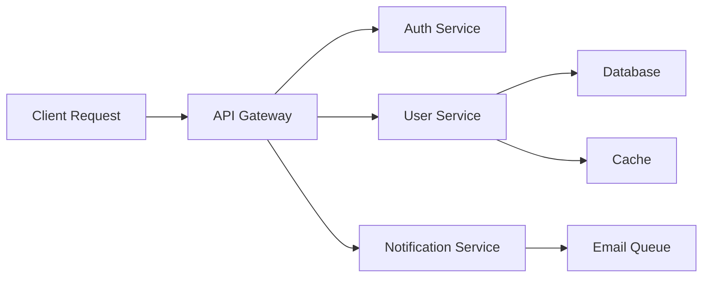

# How to Set Up OpenTelemetry for Your First Distributed System

Author: [nawazdhandala](https://www.github.com/nawazdhandala)

Tags: OpenTelemetry, Distributed Systems, Tracing, Microservices, Getting Started

Description: A hands-on guide to instrumenting your first distributed system with OpenTelemetry, covering service-to-service tracing and context propagation.

Building a distributed system introduces complexity that single-process applications don't face. When a request fails, you need to know which service caused the problem and why. OpenTelemetry provides the instrumentation infrastructure to track requests across service boundaries, making it possible to understand your distributed system's behavior in production.

## Understanding Distributed Tracing Fundamentals

A distributed trace represents a single request's journey through your system. As the request moves from service to service, each service creates spans that represent units of work. These spans are connected by trace context, which is propagated through HTTP headers, message queue metadata, or other transport mechanisms.

The trace context contains two critical pieces of information: a trace ID that identifies the entire request, and a span ID that identifies the current operation. When Service A calls Service B, it includes this context in the request. Service B extracts the context, creates a child span, and continues propagating the context to any downstream services it calls.



Each arrow in this diagram represents a span. The API Gateway creates the root span, and each downstream service creates child spans. When you view the trace in your observability platform, you see the complete request flow with timing information for each operation.

## Setting Up Your Local Environment

Before instrumenting your services, you need somewhere to send the telemetry data. The OpenTelemetry Collector is the standard component for receiving, processing, and exporting telemetry. For local development, run the collector in a Docker container.

Create a basic collector configuration that receives OTLP data and exports it to the console:

```yaml
# otel-collector-config.yaml
receivers:
  otlp:
    protocols:
      http:
        endpoint: 0.0.0.0:4318
      grpc:
        endpoint: 0.0.0.0:4317

processors:
  batch:
    timeout: 1s
    send_batch_size: 1024

exporters:
  logging:
    loglevel: debug
  otlp:
    endpoint: jaeger:4317
    tls:
      insecure: true

service:
  pipelines:
    traces:
      receivers: [otlp]
      processors: [batch]
      exporters: [logging, otlp]
```

Run the collector and Jaeger for trace visualization using Docker Compose:

```yaml
# docker-compose.yaml
version: '3.8'

services:
  jaeger:
    image: jaegertracing/all-in-one:latest
    ports:
      - "16686:16686"  # Jaeger UI
      - "4317:4317"    # OTLP gRPC receiver
    environment:
      - COLLECTOR_OTLP_ENABLED=true

  otel-collector:
    image: otel/opentelemetry-collector:latest
    command: ["--config=/etc/otel-collector-config.yaml"]
    volumes:
      - ./otel-collector-config.yaml:/etc/otel-collector-config.yaml
    ports:
      - "4318:4318"  # OTLP HTTP receiver
      - "4317:4317"  # OTLP gRPC receiver
    depends_on:
      - jaeger
```

Start the infrastructure with `docker-compose up -d`. You can access the Jaeger UI at http://localhost:16686 to view traces once your services start sending data.

## Instrumenting the API Gateway

The API gateway is the entry point for requests. It needs to create the root span and propagate context to downstream services. For this example, we'll use a Node.js Express application.

```javascript
// api-gateway/index.js
const { NodeSDK } = require('@opentelemetry/sdk-node');
const { getNodeAutoInstrumentations } = require('@opentelemetry/auto-instrumentations-node');
const { OTLPTraceExporter } = require('@opentelemetry/exporter-trace-otlp-http');
const { Resource } = require('@opentelemetry/resources');
const { SemanticResourceAttributes } = require('@opentelemetry/semantic-conventions');

// Initialize OpenTelemetry SDK before any other imports
const sdk = new NodeSDK({
  resource: new Resource({
    [SemanticResourceAttributes.SERVICE_NAME]: 'api-gateway',
    [SemanticResourceAttributes.SERVICE_VERSION]: '1.0.0',
  }),
  traceExporter: new OTLPTraceExporter({
    url: 'http://localhost:4318/v1/traces',
  }),
  instrumentations: [getNodeAutoInstrumentations()],
});

sdk.start();

const express = require('express');
const axios = require('axios');

const app = express();
app.use(express.json());

// Health check endpoint
app.get('/health', (req, res) => {
  res.json({ status: 'healthy' });
});

// Main API endpoint that calls downstream services
app.post('/users', async (req, res) => {
  try {
    // Call auth service to validate token
    const authResponse = await axios.post('http://localhost:3001/validate', {
      token: req.headers.authorization,
    });

    if (!authResponse.data.valid) {
      return res.status(401).json({ error: 'Unauthorized' });
    }

    // Call user service to create user
    const userResponse = await axios.post('http://localhost:3002/users', req.body);

    // Call notification service asynchronously
    axios.post('http://localhost:3003/notifications', {
      userId: userResponse.data.id,
      type: 'welcome_email',
    }).catch(err => console.error('Notification failed:', err));

    res.status(201).json(userResponse.data);
  } catch (error) {
    console.error('Request failed:', error);
    res.status(500).json({ error: 'Internal server error' });
  }
});

app.listen(3000, () => {
  console.log('API Gateway listening on port 3000');
});
```

The key here is initializing the OpenTelemetry SDK before importing other libraries. The automatic instrumentations will patch Express and Axios to create spans and propagate context automatically. Every incoming HTTP request creates a root span, and every outgoing Axios call creates a child span with the trace context included in the HTTP headers.

## Instrumenting Downstream Services

Each downstream service needs similar instrumentation. The difference is that these services extract existing trace context from incoming requests rather than creating new traces.

```javascript
// auth-service/index.js
const { NodeSDK } = require('@opentelemetry/sdk-node');
const { getNodeAutoInstrumentations } = require('@opentelemetry/auto-instrumentations-node');
const { OTLPTraceExporter } = require('@opentelemetry/exporter-trace-otlp-http');
const { Resource } = require('@opentelemetry/resources');
const { SemanticResourceAttributes } = require('@opentelemetry/semantic-conventions');

const sdk = new NodeSDK({
  resource: new Resource({
    [SemanticResourceAttributes.SERVICE_NAME]: 'auth-service',
    [SemanticResourceAttributes.SERVICE_VERSION]: '1.0.0',
  }),
  traceExporter: new OTLPTraceExporter({
    url: 'http://localhost:4318/v1/traces',
  }),
  instrumentations: [getNodeAutoInstrumentations()],
});

sdk.start();

const express = require('express');
const { trace } = require('@opentelemetry/api');

const app = express();
app.use(express.json());

const tracer = trace.getTracer('auth-service');

app.post('/validate', async (req, res) => {
  // Create a custom span for the validation logic
  const span = tracer.startSpan('validate_token');

  try {
    const token = req.body.token;

    if (!token) {
      span.setAttribute('validation.result', 'missing_token');
      return res.json({ valid: false, reason: 'missing_token' });
    }

    // Simulate token validation
    const isValid = token.startsWith('Bearer ');
    span.setAttribute('validation.result', isValid ? 'valid' : 'invalid');

    res.json({ valid: isValid });
  } catch (error) {
    span.recordException(error);
    res.status(500).json({ valid: false, reason: 'internal_error' });
  } finally {
    span.end();
  }
});

app.listen(3001, () => {
  console.log('Auth Service listening on port 3001');
});
```

The auth service automatically extracts trace context from incoming requests thanks to the Express instrumentation. When it creates a custom span for validation logic, that span becomes a child of the span created by the incoming HTTP request.

## Implementing the User Service with Database Calls

The user service demonstrates how database operations are automatically instrumented when using contrib packages.

```javascript
// user-service/index.js
const { NodeSDK } = require('@opentelemetry/sdk-node');
const { getNodeAutoInstrumentations } = require('@opentelemetry/auto-instrumentations-node');
const { OTLPTraceExporter } = require('@opentelemetry/exporter-trace-otlp-http');
const { Resource } = require('@opentelemetry/resources');
const { SemanticResourceAttributes } = require('@opentelemetry/semantic-conventions');

const sdk = new NodeSDK({
  resource: new Resource({
    [SemanticResourceAttributes.SERVICE_NAME]: 'user-service',
    [SemanticResourceAttributes.SERVICE_VERSION]: '1.0.0',
  }),
  traceExporter: new OTLPTraceExporter({
    url: 'http://localhost:4318/v1/traces',
  }),
  instrumentations: [getNodeAutoInstrumentations()],
});

sdk.start();

const express = require('express');
const { Pool } = require('pg');
const Redis = require('redis');

const app = express();
app.use(express.json());

// Database connection
const pool = new Pool({
  host: 'localhost',
  database: 'users',
  user: 'postgres',
  password: 'password',
});

// Redis cache
const redis = Redis.createClient({
  url: 'redis://localhost:6379',
});
redis.connect();

app.post('/users', async (req, res) => {
  try {
    const { email, name } = req.body;

    // Check cache first (automatically instrumented)
    const cached = await redis.get(`user:${email}`);
    if (cached) {
      return res.json(JSON.parse(cached));
    }

    // Insert into database (automatically instrumented)
    const result = await pool.query(
      'INSERT INTO users (email, name) VALUES ($1, $2) RETURNING *',
      [email, name]
    );

    const user = result.rows[0];

    // Update cache (automatically instrumented)
    await redis.set(`user:${email}`, JSON.stringify(user), {
      EX: 3600, // 1 hour expiration
    });

    res.status(201).json(user);
  } catch (error) {
    console.error('Failed to create user:', error);
    res.status(500).json({ error: 'Failed to create user' });
  }
});

app.listen(3002, () => {
  console.log('User Service listening on port 3002');
});
```

Both the PostgreSQL and Redis operations are automatically instrumented. Each database query and cache operation creates a span with detailed information about the operation, including the SQL statement and execution time.

## Context Propagation Across Async Boundaries

One common pitfall in distributed tracing is losing context across async boundaries. When you fire off an async operation without awaiting it, the trace context needs to be explicitly preserved.

```javascript
// notification-service/index.js
const { NodeSDK } = require('@opentelemetry/sdk-node');
const { getNodeAutoInstrumentations } = require('@opentelemetry/auto-instrumentations-node');
const { OTLPTraceExporter } = require('@opentelemetry/exporter-trace-otlp-http');
const { Resource } = require('@opentelemetry/resources');
const { SemanticResourceAttributes } = require('@opentelemetry/semantic-conventions');
const { context, trace } = require('@opentelemetry/api');

const sdk = new NodeSDK({
  resource: new Resource({
    [SemanticResourceAttributes.SERVICE_NAME]: 'notification-service',
    [SemanticResourceAttributes.SERVICE_VERSION]: '1.0.0',
  }),
  traceExporter: new OTLPTraceExporter({
    url: 'http://localhost:4318/v1/traces',
  }),
  instrumentations: [getNodeAutoInstrumentations()],
});

sdk.start();

const express = require('express');
const amqp = require('amqplib');

const app = express();
app.use(express.json());

let channel;

// Initialize message queue connection
async function initQueue() {
  const connection = await amqp.connect('amqp://localhost');
  channel = await connection.createChannel();
  await channel.assertQueue('notifications', { durable: true });
}

initQueue();

app.post('/notifications', async (req, res) => {
  const tracer = trace.getTracer('notification-service');

  // Create a span for queueing the notification
  const span = tracer.startSpan('queue_notification');
  span.setAttribute('notification.type', req.body.type);
  span.setAttribute('user.id', req.body.userId);

  try {
    // Get the current context to propagate to the message queue
    const currentContext = context.active();

    // Inject trace context into message metadata
    const carrier = {};
    trace.getSpan(currentContext)?.spanContext();

    await channel.sendToQueue(
      'notifications',
      Buffer.from(JSON.stringify(req.body)),
      {
        persistent: true,
        headers: carrier,
      }
    );

    span.setStatus({ code: 1 }); // OK
    res.json({ queued: true });
  } catch (error) {
    span.recordException(error);
    span.setStatus({ code: 2, message: error.message }); // ERROR
    res.status(500).json({ error: 'Failed to queue notification' });
  } finally {
    span.end();
  }
});

app.listen(3003, () => {
  console.log('Notification Service listening on port 3003');
});
```

When publishing messages to a queue, inject the trace context into the message metadata. The consumer can then extract this context and continue the trace.

## Testing Your Distributed Trace

Start all services and send a test request to the API gateway:

```bash
curl -X POST http://localhost:3000/users \
  -H "Content-Type: application/json" \
  -H "Authorization: Bearer test-token" \
  -d '{"email": "user@example.com", "name": "Test User"}'
```

Open Jaeger at http://localhost:16686, select the "api-gateway" service, and search for traces. You should see a complete trace showing:

1. API Gateway receiving the request
2. Auth Service validating the token
3. User Service checking the cache
4. User Service inserting into the database
5. User Service updating the cache
6. Notification Service queuing the notification

Each span includes timing information, showing you exactly how long each operation took and where time was spent.

## Debugging Common Issues

If traces aren't appearing in Jaeger, check these common issues:

First, verify the collector is receiving data by checking its logs. You should see log entries for each span batch it receives.

Second, ensure trace context is being propagated. Add debug logging to print the trace ID at each service boundary. The trace ID should be identical across all services for a single request.

Third, check for instrumentation conflicts. If you're manually creating spans and using automatic instrumentation, ensure you're not creating duplicate spans for the same operation.

For more details on the three pillars of observability that OpenTelemetry supports, check out our guide on [logs, metrics, and traces](https://oneuptime.com/blog/post/2025-08-20-three-pillars-of-observability-logs-metrics-traces/view).

## Next Steps

You now have a working distributed system with end-to-end tracing. From here, you can add metrics to track request rates and error rates, implement sampling to reduce data volume in production, and configure alerts based on trace data.

The foundation you've built demonstrates the core concepts: instrumentation at service boundaries, context propagation through headers, and centralized collection and visualization. These patterns scale from a handful of services to hundreds, making them applicable whether you're building a small system or instrumenting a large microservices architecture.
