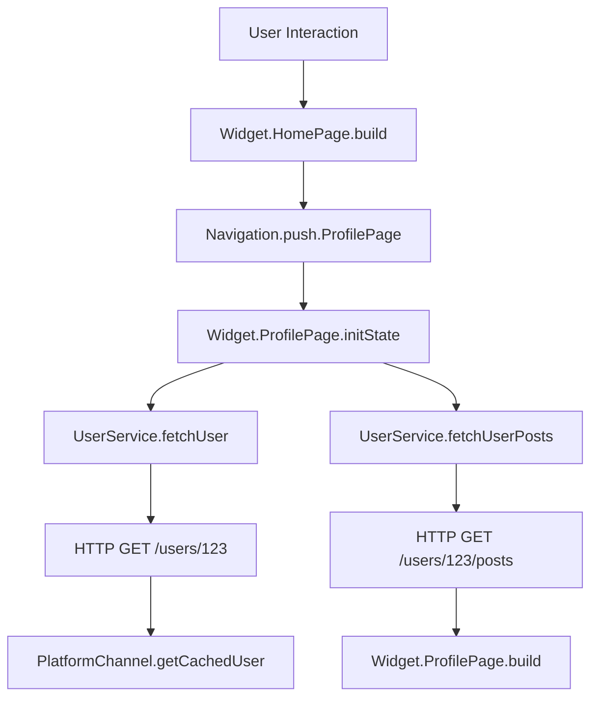

# How to Set Up OpenTelemetry for Flutter Cross-Platform Applications

Author: [nawazdhandala](https://www.github.com/nawazdhandala)

Tags: OpenTelemetry, Flutter, Dart, Cross-Platform, Mobile, Tracing

Description: Learn how to implement OpenTelemetry in Flutter applications to track performance, errors, and user behavior across iOS and Android with a single codebase while handling platform-specific considerations.

Flutter enables developers to build native iOS and Android apps from a single codebase. However, monitoring these apps requires understanding both Flutter's architecture and platform-specific considerations. OpenTelemetry provides a unified way to instrument Flutter apps, capturing telemetry data that works consistently across platforms while respecting each platform's unique characteristics.

## Understanding Flutter's Architecture for Observability

Flutter apps run in multiple layers. The Dart code executes in a VM or compiled to native code, while platform-specific features use method channels to communicate with native iOS and Android code. This architecture means telemetry must capture both Dart-level operations and platform interactions.

The Flutter engine handles rendering, while platform channels bridge to native functionality like GPS, camera, or push notifications. Network calls can happen through Dart's http package or platform-specific implementations. Effective instrumentation needs to cover all these layers to provide complete visibility.

## Adding OpenTelemetry Dependencies to Flutter

Flutter's package ecosystem includes OpenTelemetry support through the opentelemetry-dart packages. Add these to your pubspec.yaml file.

```yaml
# pubspec.yaml
dependencies:
  flutter:
    sdk: flutter

  # OpenTelemetry core packages
  opentelemetry:
    git:
      url: https://github.com/open-telemetry/opentelemetry-dart
      ref: main
      path: packages/opentelemetry_api

  opentelemetry_sdk:
    git:
      url: https://github.com/open-telemetry/opentelemetry-dart
      ref: main
      path: packages/opentelemetry_sdk

  # HTTP client with OpenTelemetry support
  http: ^1.1.0

  # Dio HTTP client (alternative with better interceptor support)
  dio: ^5.4.0
```

After adding dependencies, run `flutter pub get` to download the packages.

## Initializing OpenTelemetry in Flutter

Create a telemetry manager that initializes OpenTelemetry when your app starts. This should happen in your main function before running the app.

```dart
import 'package:flutter/material.dart';
import 'package:opentelemetry/api.dart' as otel;
import 'package:opentelemetry_sdk/sdk.dart' as sdk;
import 'dart:io' show Platform;

class TelemetryManager {
  static final TelemetryManager _instance = TelemetryManager._internal();
  factory TelemetryManager() => _instance;
  TelemetryManager._internal();

  late otel.Tracer tracer;
  late sdk.TracerProvider tracerProvider;

  Future<void> initialize() async {
    // Create resource with app and device information
    final resource = sdk.Resource([
      otel.Attribute.fromString('service.name', 'MyFlutterApp'),
      otel.Attribute.fromString('service.version', '1.0.0'),
      otel.Attribute.fromString('deployment.environment', 'production'),
      otel.Attribute.fromString('device.platform', Platform.operatingSystem),
      otel.Attribute.fromString('device.os.version', Platform.operatingSystemVersion),
    ]);

    // Configure the span exporter
    // In production, use OTLP exporter to send to your backend
    final spanExporter = _createSpanExporter();

    // Use batch span processor to reduce overhead
    final spanProcessor = sdk.BatchSpanProcessor(
      spanExporter,
      scheduleDelay: Duration(seconds: 5),
      maxQueueSize: 2048,
      maxExportBatchSize: 512,
    );

    // Create tracer provider
    tracerProvider = sdk.TracerProviderBase(
      processors: [spanProcessor],
      resource: resource,
    );

    // Register as global tracer provider
    otel.registerGlobalTracerProvider(tracerProvider);

    // Get tracer instance
    tracer = tracerProvider.getTracer(
      'com.example.myapp',
      version: '1.0.0',
    );

    debugPrint('OpenTelemetry initialized successfully');
  }

  sdk.SpanExporter _createSpanExporter() {
    // For development, you can use console exporter
    // For production, use OTLP exporter
    return sdk.ConsoleSpanExporter();

    // Production OTLP exporter configuration:
    // return sdk.OtlpGrpcSpanExporter(
    //   endpoint: 'https://your-backend.com:4317',
    //   headers: {'authorization': 'Bearer YOUR_TOKEN'},
    // );
  }

  void shutdown() {
    tracerProvider.shutdown();
  }
}

void main() async {
  WidgetsFlutterBinding.ensureInitialized();

  // Initialize telemetry before running the app
  await TelemetryManager().initialize();

  runApp(MyApp());
}
```

## Instrumenting Widget Lifecycle

Flutter's widget lifecycle differs from traditional mobile frameworks. Instrument key widgets to understand rendering performance and navigation patterns.

```dart
import 'package:flutter/material.dart';
import 'package:opentelemetry/api.dart' as otel;

/// Base class for instrumented stateful widgets
abstract class InstrumentedStatefulWidget extends StatefulWidget {
  const InstrumentedStatefulWidget({Key? key}) : super(key: key);

  @override
  InstrumentedState createState();
}

abstract class InstrumentedState<T extends InstrumentedStatefulWidget>
    extends State<T> {

  late otel.Tracer _tracer;
  otel.Span? _widgetLifecycleSpan;
  otel.Span? _buildSpan;

  @override
  void initState() {
    super.initState();
    _tracer = TelemetryManager().tracer;

    // Start a span for the widget's complete lifecycle
    _widgetLifecycleSpan = _tracer
        .spanBuilder('Widget.${widget.runtimeType}')
        .setSpanKind(otel.SpanKind.internal)
        .startSpan();

    // Create a span for the initState phase
    final initSpan = _tracer
        .spanBuilder('Widget.${widget.runtimeType}.initState')
        .setSpanKind(otel.SpanKind.internal)
        .startSpan();

    try {
      onInitState();
      initSpan.setStatus(otel.StatusCode.ok);
    } catch (e, stackTrace) {
      initSpan.recordException(e, stackTrace: stackTrace);
      initSpan.setStatus(otel.StatusCode.error, e.toString());
      rethrow;
    } finally {
      initSpan.end();
    }
  }

  /// Override this instead of initState for instrumented initialization
  void onInitState() {}

  @override
  Widget build(BuildContext context) {
    // Create a span for each build
    _buildSpan = _tracer
        .spanBuilder('Widget.${widget.runtimeType}.build')
        .setSpanKind(otel.SpanKind.internal)
        .startSpan();

    try {
      final result = buildInstrumented(context);
      _buildSpan?.setStatus(otel.StatusCode.ok);
      return result;
    } catch (e, stackTrace) {
      _buildSpan?.recordException(e, stackTrace: stackTrace);
      _buildSpan?.setStatus(otel.StatusCode.error, e.toString());
      rethrow;
    } finally {
      // End build span after frame is rendered
      WidgetsBinding.instance.addPostFrameCallback((_) {
        _buildSpan?.end();
      });
    }
  }

  /// Override this instead of build for instrumented widgets
  Widget buildInstrumented(BuildContext context);

  @override
  void dispose() {
    // Create a span for dispose
    final disposeSpan = _tracer
        .spanBuilder('Widget.${widget.runtimeType}.dispose')
        .setSpanKind(otel.SpanKind.internal)
        .startSpan();

    try {
      onDispose();
      disposeSpan.setStatus(otel.StatusCode.ok);
    } catch (e, stackTrace) {
      disposeSpan.recordException(e, stackTrace: stackTrace);
      disposeSpan.setStatus(otel.StatusCode.error, e.toString());
      rethrow;
    } finally {
      disposeSpan.end();
      _widgetLifecycleSpan?.setStatus(otel.StatusCode.ok);
      _widgetLifecycleSpan?.end();
      super.dispose();
    }
  }

  /// Override this instead of dispose for instrumented cleanup
  void onDispose() {}
}
```

## Instrumenting HTTP Requests with Dio

Dio is a popular HTTP client for Flutter with excellent interceptor support. Create an interceptor that automatically instruments all HTTP requests.

```dart
import 'package:dio/dio.dart';
import 'package:opentelemetry/api.dart' as otel;

class OpenTelemetryInterceptor extends Interceptor {
  final otel.Tracer tracer;

  OpenTelemetryInterceptor(this.tracer);

  @override
  void onRequest(
    RequestOptions options,
    RequestInterceptorHandler handler,
  ) {
    // Create a span for this HTTP request
    final span = tracer
        .spanBuilder('HTTP ${options.method} ${options.path}')
        .setSpanKind(otel.SpanKind.client)
        .startSpan();

    // Add HTTP semantic convention attributes
    span.setAttribute('http.method', options.method);
    span.setAttribute('http.url', options.uri.toString());
    span.setAttribute('http.scheme', options.uri.scheme);
    span.setAttribute('http.host', options.uri.host);
    span.setAttribute('http.target', options.uri.path);

    // Store span in request extra data so we can access it in response
    options.extra['otel_span'] = span;

    // Inject trace context into request headers for propagation
    final context = otel.Context.current.withSpan(span);
    final propagator = otel.GlobalContextPropagator();

    final carrier = <String, String>{};
    propagator.inject(context, carrier, _TextMapSetter());

    // Add propagation headers to request
    options.headers.addAll(carrier);

    handler.next(options);
  }

  @override
  void onResponse(
    Response response,
    ResponseInterceptorHandler handler,
  ) {
    // Retrieve span from request
    final span = response.requestOptions.extra['otel_span'] as otel.Span?;

    if (span != null) {
      // Add response attributes
      span.setAttribute('http.status_code', response.statusCode ?? 0);

      // Check if response indicates success
      if (response.statusCode != null && response.statusCode! >= 200 && response.statusCode! < 400) {
        span.setStatus(otel.StatusCode.ok);
      } else {
        span.setStatus(otel.StatusCode.error, 'HTTP ${response.statusCode}');
      }

      span.end();
    }

    handler.next(response);
  }

  @override
  void onError(
    DioException err,
    ErrorInterceptorHandler handler,
  ) {
    // Retrieve span from request
    final span = err.requestOptions.extra['otel_span'] as otel.Span?;

    if (span != null) {
      // Record the error
      span.recordException(err, stackTrace: err.stackTrace);
      span.setStatus(otel.StatusCode.error, err.message ?? 'Request failed');

      // Add error-specific attributes
      if (err.response != null) {
        span.setAttribute('http.status_code', err.response!.statusCode ?? 0);
      }

      span.end();
    }

    handler.next(err);
  }
}

// Helper class for injecting headers
class _TextMapSetter extends otel.TextMapSetter<Map<String, String>> {
  @override
  void set(Map<String, String> carrier, String key, String value) {
    carrier[key] = value;
  }
}

// Create a configured Dio instance
class ApiClient {
  static Dio createDioClient() {
    final dio = Dio(BaseOptions(
      baseUrl: 'https://api.example.com',
      connectTimeout: Duration(seconds: 30),
      receiveTimeout: Duration(seconds: 30),
    ));

    // Add OpenTelemetry interceptor
    dio.interceptors.add(OpenTelemetryInterceptor(TelemetryManager().tracer));

    return dio;
  }
}
```

## Instrumenting Navigation

Flutter's navigation system is central to user experience. Track navigation to understand user flows and identify slow screen transitions.

```dart
import 'package:flutter/material.dart';
import 'package:opentelemetry/api.dart' as otel;

class InstrumentedNavigatorObserver extends NavigatorObserver {
  final otel.Tracer tracer;
  final Map<Route, otel.Span> _routeSpans = {};

  InstrumentedNavigatorObserver(this.tracer);

  @override
  void didPush(Route route, Route? previousRoute) {
    super.didPush(route, previousRoute);

    final routeName = _getRouteName(route);

    // Create a span for this route
    final span = tracer
        .spanBuilder('Navigation.push.$routeName')
        .setSpanKind(otel.SpanKind.internal)
        .startSpan();

    span.setAttribute('navigation.action', 'push');
    span.setAttribute('navigation.route', routeName);

    if (previousRoute != null) {
      span.setAttribute('navigation.from', _getRouteName(previousRoute));
    }

    _routeSpans[route] = span;

    // Add event for navigation start
    span.addEvent('navigation_started');
  }

  @override
  void didPop(Route route, Route? previousRoute) {
    super.didPop(route, previousRoute);

    final span = _routeSpans.remove(route);
    if (span != null) {
      span.addEvent('navigation_completed');
      span.setAttribute('navigation.action', 'pop');
      span.setStatus(otel.StatusCode.ok);
      span.end();
    }

    if (previousRoute != null) {
      // Create a span for returning to previous route
      final returnSpan = tracer
          .spanBuilder('Navigation.pop.${_getRouteName(previousRoute)}')
          .setSpanKind(otel.SpanKind.internal)
          .startSpan();

      returnSpan.setAttribute('navigation.action', 'return');
      returnSpan.setAttribute('navigation.route', _getRouteName(previousRoute));
      returnSpan.setStatus(otel.StatusCode.ok);
      returnSpan.end();
    }
  }

  @override
  void didReplace({Route? newRoute, Route? oldRoute}) {
    super.didReplace(newRoute: newRoute, oldRoute: oldRoute);

    if (oldRoute != null) {
      final oldSpan = _routeSpans.remove(oldRoute);
      oldSpan?.setStatus(otel.StatusCode.ok);
      oldSpan?.end();
    }

    if (newRoute != null) {
      final routeName = _getRouteName(newRoute);
      final span = tracer
          .spanBuilder('Navigation.replace.$routeName')
          .setSpanKind(otel.SpanKind.internal)
          .startSpan();

      span.setAttribute('navigation.action', 'replace');
      span.setAttribute('navigation.route', routeName);

      if (oldRoute != null) {
        span.setAttribute('navigation.replaced', _getRouteName(oldRoute));
      }

      _routeSpans[newRoute] = span;
    }
  }

  String _getRouteName(Route route) {
    if (route.settings.name != null) {
      return route.settings.name!;
    }
    return route.toString();
  }
}

// Usage in your app
class MyApp extends StatelessWidget {
  @override
  Widget build(BuildContext context) {
    return MaterialApp(
      title: 'My Flutter App',
      navigatorObservers: [
        InstrumentedNavigatorObserver(TelemetryManager().tracer),
      ],
      home: HomePage(),
    );
  }
}
```

## Instrumenting Asynchronous Operations

Flutter apps heavily use asynchronous operations. Create helpers to instrument async functions consistently.

```dart
import 'package:opentelemetry/api.dart' as otel;

/// Extension to add tracing capabilities to Future
extension TracedFuture<T> on Future<T> {
  Future<T> traced(
    otel.Tracer tracer,
    String operationName, {
    Map<String, dynamic>? attributes,
  }) async {
    final span = tracer
        .spanBuilder(operationName)
        .setSpanKind(otel.SpanKind.internal)
        .startSpan();

    // Add custom attributes if provided
    if (attributes != null) {
      attributes.forEach((key, value) {
        span.setAttribute(key, value.toString());
      });
    }

    try {
      final result = await this;
      span.setStatus(otel.StatusCode.ok);
      return result;
    } catch (e, stackTrace) {
      span.recordException(e, stackTrace: stackTrace);
      span.setStatus(otel.StatusCode.error, e.toString());
      rethrow;
    } finally {
      span.end();
    }
  }
}

/// Wrapper for instrumenting async functions
Future<T> traceAsync<T>(
  otel.Tracer tracer,
  String operationName,
  Future<T> Function() operation, {
  Map<String, dynamic>? attributes,
}) async {
  final span = tracer
      .spanBuilder(operationName)
      .setSpanKind(otel.SpanKind.internal)
      .startSpan();

  // Add custom attributes
  if (attributes != null) {
    attributes.forEach((key, value) {
      span.setAttribute(key, value.toString());
    });
  }

  // Make span active for the operation
  final context = otel.Context.current.withSpan(span);

  try {
    return await context.run(() => operation());
  } catch (e, stackTrace) {
    span.recordException(e, stackTrace: stackTrace);
    span.setStatus(otel.StatusCode.error, e.toString());
    rethrow;
  } finally {
    span.end();
  }
}

// Usage example
class UserService {
  final otel.Tracer tracer = TelemetryManager().tracer;
  final ApiClient apiClient = ApiClient();

  Future<User> fetchUser(String userId) {
    return traceAsync(
      tracer,
      'UserService.fetchUser',
      () async {
        final response = await apiClient.get('/users/$userId');
        return User.fromJson(response.data);
      },
      attributes: {'user.id': userId},
    );
  }

  Future<List<Post>> fetchUserPosts(String userId) async {
    // Using the extension method
    return apiClient
        .get('/users/$userId/posts')
        .then((response) => (response.data as List)
            .map((json) => Post.fromJson(json))
            .toList())
        .traced(
          tracer,
          'UserService.fetchUserPosts',
          attributes: {'user.id': userId},
        );
  }
}
```

## Handling Platform-Specific Operations

Some operations use platform channels to call native code. Instrument these to track the overhead of crossing the platform boundary.

```dart
import 'package:flutter/services.dart';
import 'package:opentelemetry/api.dart' as otel;

class InstrumentedMethodChannel {
  final MethodChannel _channel;
  final otel.Tracer _tracer;

  InstrumentedMethodChannel(String name, this._tracer)
      : _channel = MethodChannel(name);

  Future<T?> invokeMethod<T>(String method, [dynamic arguments]) async {
    final span = _tracer
        .spanBuilder('PlatformChannel.$method')
        .setSpanKind(otel.SpanKind.client)
        .startSpan();

    span.setAttribute('platform.channel', _channel.name);
    span.setAttribute('platform.method', method);

    try {
      final result = await _channel.invokeMethod<T>(method, arguments);
      span.setStatus(otel.StatusCode.ok);
      return result;
    } on PlatformException catch (e) {
      span.recordException(e);
      span.setStatus(otel.StatusCode.error, e.message ?? 'Platform call failed');
      rethrow;
    } catch (e, stackTrace) {
      span.recordException(e, stackTrace: stackTrace);
      span.setStatus(otel.StatusCode.error, e.toString());
      rethrow;
    } finally {
      span.end();
    }
  }
}

// Usage example for device-specific operations
class DeviceInfoService {
  final InstrumentedMethodChannel _channel;

  DeviceInfoService(otel.Tracer tracer)
      : _channel = InstrumentedMethodChannel('device_info', tracer);

  Future<String?> getBatteryLevel() async {
    return await _channel.invokeMethod<String>('getBatteryLevel');
  }

  Future<Map<String, dynamic>?> getDeviceInfo() async {
    return await _channel.invokeMethod<Map<String, dynamic>>('getDeviceInfo');
  }
}
```

## Trace Flow Visualization

Here's how traces flow through a Flutter application:



## Best Practices for Flutter Instrumentation

When instrumenting Flutter applications, follow these practices to ensure effective observability across platforms:

**Minimize rebuild overhead**. Flutter rebuilds widgets frequently. Only create spans for meaningful builds, not every render frame.

**Instrument at the service layer**. Rather than instrumenting individual widgets, focus on services, repositories, and data sources that widgets consume.

**Handle platform differences**. iOS and Android have different performance characteristics. Use attributes to track platform-specific behavior.

**Batch span exports**. Mobile networks are unreliable. Use batch span processors with reasonable buffer sizes to reduce network calls.

**Test on real devices**. Emulators don't reflect real-world performance. Validate instrumentation overhead on actual devices across different tiers.

**Use meaningful span names**. Follow consistent naming conventions that make traces easy to understand and filter.

Implementing OpenTelemetry in Flutter applications provides visibility into your app's behavior across iOS and Android. You gain insights into performance bottlenecks, navigation patterns, and error conditions while writing instrumentation code once for both platforms.
