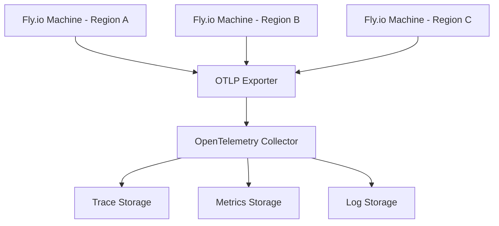
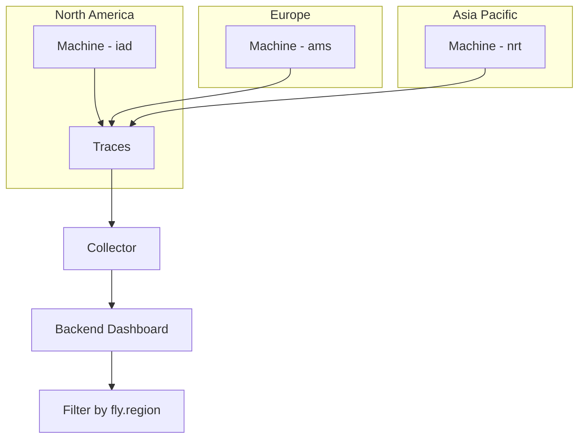

# How to Set Up OpenTelemetry on Fly.io Applications

Author: [nawazdhandala](https://www.github.com/nawazdhandala)

Tags: OpenTelemetry, Fly.io, Observability, Docker, Tracing, Metrics, Distributed Systems

Description: Step-by-step guide to setting up OpenTelemetry on Fly.io applications for distributed tracing, metrics collection, and full-stack observability.

---

Fly.io runs your applications in lightweight VMs (called Machines) close to your users across the globe. Unlike traditional PaaS platforms, Fly.io gives you more control over the runtime environment since your apps run inside Docker containers. This makes setting up OpenTelemetry relatively straightforward - you have access to the full Node.js (or Python, Go, etc.) runtime with all the standard OpenTelemetry SDKs.

This guide walks you through configuring OpenTelemetry for applications deployed on Fly.io, including traces, metrics, and handling Fly.io-specific concerns like multi-region deployments.

## How Fly.io Fits with OpenTelemetry

Fly.io Machines are long-running processes (not serverless functions), so you can use the standard OpenTelemetry SDK with batch processing. Your application starts up, initializes the SDK, and keeps running until the Machine is stopped or replaced.



The architecture is simple. Each Machine runs the OpenTelemetry SDK, which exports telemetry data over OTLP to your collector. Since Fly.io Machines have outbound internet access by default, you can send data to any external collector endpoint.

## Installing Dependencies

Let's start with a Node.js application. Install the OpenTelemetry SDK and the auto-instrumentation packages.

```bash
# Install OpenTelemetry SDK and common instrumentations
npm install @opentelemetry/sdk-node \
  @opentelemetry/auto-instrumentations-node \
  @opentelemetry/exporter-trace-otlp-http \
  @opentelemetry/exporter-metrics-otlp-http \
  @opentelemetry/sdk-metrics \
  @opentelemetry/resources \
  @opentelemetry/semantic-conventions
```

## Creating the Instrumentation File

Create a `tracing.js` file that initializes OpenTelemetry. This file needs to be loaded before your application code so the auto-instrumentation can monkey-patch HTTP, Express, database drivers, and other libraries.

```javascript
// tracing.js - OpenTelemetry initialization for Fly.io
// Load this before your application: node --require ./tracing.js app.js

const { NodeSDK } = require('@opentelemetry/sdk-node');
const { getNodeAutoInstrumentations } = require('@opentelemetry/auto-instrumentations-node');
const { OTLPTraceExporter } = require('@opentelemetry/exporter-trace-otlp-http');
const { OTLPMetricExporter } = require('@opentelemetry/exporter-metrics-otlp-http');
const { PeriodicExportingMetricReader } = require('@opentelemetry/sdk-metrics');
const { Resource } = require('@opentelemetry/resources');
const { ATTR_SERVICE_NAME } = require('@opentelemetry/semantic-conventions');

// Build a resource that identifies this service and its Fly.io context
const resource = new Resource({
  [ATTR_SERVICE_NAME]: process.env.OTEL_SERVICE_NAME || 'fly-app',
  'deployment.environment': process.env.FLY_APP_NAME ? 'production' : 'development',
  // Fly.io sets these environment variables automatically on every Machine
  'fly.app.name': process.env.FLY_APP_NAME || 'unknown',
  'fly.region': process.env.FLY_REGION || 'unknown',
  'fly.alloc.id': process.env.FLY_ALLOC_ID || 'unknown',
  'fly.machine.id': process.env.FLY_MACHINE_ID || 'unknown',
});

// Configure the trace exporter
const traceExporter = new OTLPTraceExporter({
  url: process.env.OTEL_EXPORTER_OTLP_ENDPOINT + '/v1/traces',
  headers: parseHeaders(process.env.OTEL_EXPORTER_OTLP_HEADERS),
});

// Configure metrics to export every 30 seconds
const metricReader = new PeriodicExportingMetricReader({
  exporter: new OTLPMetricExporter({
    url: process.env.OTEL_EXPORTER_OTLP_ENDPOINT + '/v1/metrics',
    headers: parseHeaders(process.env.OTEL_EXPORTER_OTLP_HEADERS),
  }),
  exportIntervalMillis: 30000,
});

// Initialize the SDK
const sdk = new NodeSDK({
  resource,
  traceExporter,
  metricReader,
  instrumentations: [
    getNodeAutoInstrumentations({
      // Configure specific instrumentations as needed
      '@opentelemetry/instrumentation-http': {
        // Ignore health check requests to reduce noise
        ignoreIncomingRequestHook: (request) => {
          return request.url === '/health' || request.url === '/ready';
        },
      },
    }),
  ],
});

sdk.start();
console.log('OpenTelemetry SDK initialized for Fly.io');

// Handle graceful shutdown when Fly.io stops the Machine
process.on('SIGTERM', () => {
  sdk.shutdown()
    .then(() => console.log('OpenTelemetry shut down'))
    .catch((err) => console.error('OpenTelemetry shutdown error:', err))
    .finally(() => process.exit(0));
});

// Utility to parse header strings like "key1=value1,key2=value2"
function parseHeaders(headerString) {
  if (!headerString) return {};
  const headers = {};
  headerString.split(',').forEach((pair) => {
    const [key, value] = pair.split('=');
    if (key && value) headers[key.trim()] = value.trim();
  });
  return headers;
}
```

There are a few Fly.io-specific details worth noting. Fly.io automatically sets environment variables like `FLY_REGION`, `FLY_APP_NAME`, `FLY_ALLOC_ID`, and `FLY_MACHINE_ID` on every Machine. We include these as resource attributes so you can filter traces by region or machine in your observability backend.

We also ignore health check requests. Fly.io's built-in health checks hit your app frequently, and tracing every single one creates a lot of noise without much value.

## Configuring the Dockerfile

Fly.io applications run in Docker containers. Update your Dockerfile to load the tracing module at startup.

```dockerfile
# Dockerfile for a Node.js app on Fly.io with OpenTelemetry
FROM node:20-slim

WORKDIR /app

# Copy package files and install dependencies
COPY package*.json ./
RUN npm ci --only=production

# Copy application code
COPY . .

# Expose the port your app listens on
EXPOSE 3000

# Use --require to load tracing before the application starts
CMD ["node", "--require", "./tracing.js", "app.js"]
```

## Setting Fly.io Secrets

Configure the OpenTelemetry endpoint and any authentication tokens as Fly.io secrets. Secrets are encrypted and injected as environment variables at runtime.

```bash
# Set the collector endpoint
fly secrets set OTEL_EXPORTER_OTLP_ENDPOINT=https://your-collector.example.com

# Set the service name
fly secrets set OTEL_SERVICE_NAME=my-fly-app

# Set authentication headers (format: key=value,key2=value2)
fly secrets set OTEL_EXPORTER_OTLP_HEADERS="x-oneuptime-token=your-token-here"
```

## Multi-Region Tracing

One of Fly.io's strengths is multi-region deployment. Your app can run in dozens of regions simultaneously. With OpenTelemetry properly configured, you can see exactly which region handled each request and how latency varies across regions.



Since we added `fly.region` as a resource attribute, you can filter and group traces by region in your observability dashboard. This helps you answer questions like "Why are requests from Asia slower?" or "Is the latency issue specific to the `ams` region?"

## Adding Custom Spans and Metrics

Beyond auto-instrumentation, add custom spans for your application's key operations.

```javascript
// Custom instrumentation for business-critical operations
const { trace, metrics } = require('@opentelemetry/api');

const tracer = trace.getTracer('fly-app.orders');
const meter = metrics.getMeter('fly-app.orders');

// Create a counter metric to track order volume by region
const orderCounter = meter.createCounter('orders.created', {
  description: 'Number of orders created',
});

// Create a histogram to track order processing duration
const processingDuration = meter.createHistogram('orders.processing_duration_ms', {
  description: 'Time to process an order in milliseconds',
  unit: 'ms',
});

async function createOrder(orderData) {
  const startTime = Date.now();

  return tracer.startActiveSpan('create-order', async (span) => {
    try {
      span.setAttribute('order.type', orderData.type);
      span.setAttribute('order.item_count', orderData.items.length);
      // Include the Fly.io region so you can correlate with region-specific issues
      span.setAttribute('fly.region', process.env.FLY_REGION || 'unknown');

      // Validate the order
      await tracer.startActiveSpan('validate-order', async (validateSpan) => {
        await validateOrderData(orderData);
        validateSpan.end();
      });

      // Save to database
      const order = await tracer.startActiveSpan('save-to-database', async (dbSpan) => {
        const result = await db.orders.create(orderData);
        dbSpan.setAttribute('db.order_id', result.id);
        dbSpan.end();
        return result;
      });

      // Record metrics
      orderCounter.add(1, { region: process.env.FLY_REGION, type: orderData.type });
      processingDuration.record(Date.now() - startTime, { region: process.env.FLY_REGION });

      span.setAttribute('order.id', order.id);
      return order;
    } catch (error) {
      span.recordException(error);
      span.setStatus({ code: 2, message: error.message });
      throw error;
    } finally {
      span.end();
    }
  });
}
```

## Running the Collector as a Sidecar

For high-throughput applications, you might want to run an OpenTelemetry Collector alongside your application on Fly.io instead of exporting directly to a remote backend. This reduces latency for telemetry export and gives you a local buffer.

You can run the Collector as a separate Fly.io app or as a process within the same Machine using a process group. Here's an example using Fly.io's multi-process support in `fly.toml`:

```toml
# fly.toml - Application configuration with process groups
app = "my-fly-app"
primary_region = "iad"

[build]
  dockerfile = "Dockerfile"

[http_service]
  internal_port = 3000
  force_https = true
  auto_stop_machines = true
  auto_start_machines = true
  min_machines_running = 1

[env]
  OTEL_SERVICE_NAME = "my-fly-app"
  # Point to a collector running as a separate Fly.io app on the private network
  OTEL_EXPORTER_OTLP_ENDPOINT = "http://otel-collector.internal:4318"

[[vm]]
  memory = "512mb"
  cpu_kind = "shared"
  cpus = 1
```

If you deploy the Collector as a separate Fly.io app, it's accessible via the `.internal` private network address, which means telemetry export stays within Fly.io's network and avoids public internet latency.

## Health Checks and Readiness

Configure Fly.io health checks in your `fly.toml` to make sure your application (and its telemetry pipeline) is healthy.

```toml
# Health check configuration
[[services.http_checks]]
  interval = 10000
  grace_period = "10s"
  method = "get"
  path = "/health"
  protocol = "http"
  timeout = 2000
```

Your health check endpoint should verify that the OpenTelemetry SDK is initialized:

```javascript
// Health check endpoint that verifies OTel is running
app.get('/health', (req, res) => {
  // Basic health check - verify the app and its dependencies are working
  res.status(200).json({
    status: 'healthy',
    region: process.env.FLY_REGION,
    machine: process.env.FLY_MACHINE_ID,
  });
});
```

## Summary

Setting up OpenTelemetry on Fly.io is clean and straightforward because Fly.io runs your code in full Linux VMs with Docker. You get access to the complete Node.js runtime, so the standard OpenTelemetry SDK works without any special adapters.

Key points to remember:

- Use the `--require` flag to load OpenTelemetry before your application code
- Include Fly.io-specific resource attributes like `fly.region` and `fly.machine.id` for multi-region visibility
- Filter out health check requests to keep your traces clean
- Handle `SIGTERM` for graceful shutdown when Machines are stopped
- Consider running an OpenTelemetry Collector on Fly.io's internal network for high-throughput workloads
- Use Fly.io secrets (not plain environment variables) for sensitive configuration like API tokens

With this setup, you have full observability across all your Fly.io regions, helping you understand performance characteristics and debug issues no matter where in the world your code is running.
