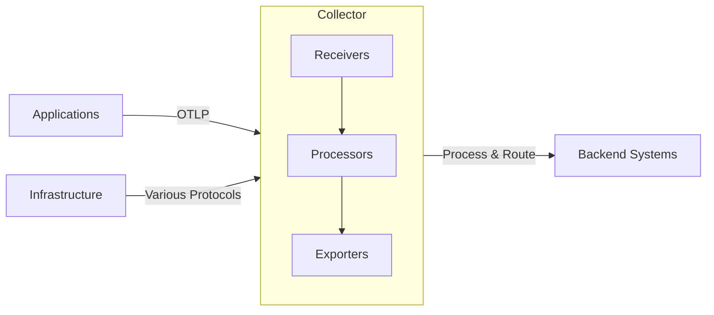

# How to Get Started with OpenTelemetry as a DevOps Engineer

Author: [nawazdhandala](https://www.github.com/nawazdhandala)

Tags: OpenTelemetry, DevOps, Getting Started, Infrastructure, Monitoring

Description: A practical guide for DevOps engineers to implement OpenTelemetry across infrastructure, from collector deployment to pipeline configuration and system monitoring.

As a DevOps engineer, you're responsible for keeping systems running smoothly. OpenTelemetry gives you a unified way to collect, process, and export telemetry data from every layer of your infrastructure. Unlike application developers who instrument code, your focus is on infrastructure deployment, data pipelines, and operational visibility.

This guide covers what DevOps engineers need to know about OpenTelemetry, from architecture decisions to production deployment patterns.

## Your Role in OpenTelemetry

DevOps engineers handle the infrastructure side of observability. While developers add instrumentation to application code, you build and maintain the data pipeline that collects, processes, and routes that telemetry.

Your responsibilities include:

- Deploying and managing OpenTelemetry Collectors
- Configuring data pipelines and transformations
- Setting up exporters to backend systems
- Monitoring the observability infrastructure itself
- Managing credentials and access control
- Ensuring high availability and performance
- Optimizing costs and resource usage

## Understanding the Collector Architecture

The OpenTelemetry Collector is your primary tool. It's a vendor-agnostic proxy that receives, processes, and exports telemetry data.



The collector has three main components:

- **Receivers** ingest telemetry data from various sources and protocols
- **Processors** transform, filter, and enrich data
- **Exporters** send data to observability backends

Think of the collector as a data router with transformation capabilities.

## Deployment Patterns

Choose the right deployment pattern based on your architecture:

**Agent Pattern (Sidecar or DaemonSet):** Deploy a collector alongside each application or on each node. This pattern keeps data local, reduces network latency, and provides isolation between tenants. Use this for high-throughput environments or when you need service-specific processing.

**Gateway Pattern (Centralized Collector):** Applications send telemetry to a centralized collector pool. This simplifies management, reduces resource overhead, and provides a single point for data transformation. Use this for smaller deployments or when centralized processing is acceptable.

**Hybrid Pattern:** Combine both approaches. Run lightweight agents close to applications for initial collection and forwarding, then send data to gateway collectors for heavy processing and routing. This balances resource usage with processing flexibility.

## Setting Up Your First Collector

Start with a Docker deployment for learning. Create a collector configuration file:

```yaml
# otel-collector-config.yaml
receivers:
  # OTLP receiver accepts data from OpenTelemetry SDKs
  otlp:
    protocols:
      grpc:
        endpoint: 0.0.0.0:4317
      http:
        endpoint: 0.0.0.0:4318

  # Prometheus receiver scrapes Prometheus-format metrics
  prometheus:
    config:
      scrape_configs:
        - job_name: 'otel-collector'
          scrape_interval: 10s
          static_configs:
            - targets: ['localhost:8888']

processors:
  # Batch processor groups data before export (reduces network calls)
  batch:
    timeout: 10s
    send_batch_size: 1024

  # Memory limiter prevents OOM by applying backpressure
  memory_limiter:
    check_interval: 1s
    limit_mib: 512
    spike_limit_mib: 128

  # Resource processor adds or modifies resource attributes
  resource:
    attributes:
      - key: environment
        value: production
        action: upsert
      - key: cluster
        value: us-west-2
        action: upsert

exporters:
  # Logging exporter for debugging (writes to stdout)
  logging:
    loglevel: info

  # OTLP exporter sends to another collector or backend
  otlp:
    endpoint: backend-collector:4317
    tls:
      insecure: false
      cert_file: /certs/client.crt
      key_file: /certs/client.key

  # Prometheus exporter exposes metrics for scraping
  prometheus:
    endpoint: "0.0.0.0:8889"

service:
  # Define data pipelines
  pipelines:
    traces:
      receivers: [otlp]
      processors: [memory_limiter, resource, batch]
      exporters: [otlp, logging]

    metrics:
      receivers: [otlp, prometheus]
      processors: [memory_limiter, resource, batch]
      exporters: [prometheus, logging]

    logs:
      receivers: [otlp]
      processors: [memory_limiter, resource, batch]
      exporters: [otlp, logging]

  # Telemetry configuration (collector self-monitoring)
  telemetry:
    logs:
      level: info
    metrics:
      level: detailed
      address: 0.0.0.0:8888
```

Run the collector with Docker:

```bash
# Pull the collector image (use contrib for more components)
docker pull otel/opentelemetry-collector-contrib:0.92.0

# Run with your config file
docker run -d \
  --name otel-collector \
  -p 4317:4317 \
  -p 4318:4318 \
  -p 8888:8888 \
  -p 8889:8889 \
  -v $(pwd)/otel-collector-config.yaml:/etc/otel-collector-config.yaml \
  otel/opentelemetry-collector-contrib:0.92.0 \
  --config=/etc/otel-collector-config.yaml
```

Verify the collector is running:

```bash
# Check health endpoint
curl http://localhost:13133/

# View collector metrics
curl http://localhost:8888/metrics

# Check logs
docker logs otel-collector
```

## Kubernetes Deployment

For production Kubernetes environments, use the official Helm chart:

```bash
# Add the OpenTelemetry Helm repository
helm repo add open-telemetry https://open-telemetry.github.io/opentelemetry-helm-charts
helm repo update

# Create a values file for customization
cat > otel-values.yaml <<EOF
mode: daemonset  # or 'deployment' for gateway pattern

image:
  repository: otel/opentelemetry-collector-contrib

config:
  receivers:
    otlp:
      protocols:
        grpc:
          endpoint: 0.0.0.0:4317
        http:
          endpoint: 0.0.0.0:4318

  processors:
    batch:
      timeout: 10s
      send_batch_size: 1024
    memory_limiter:
      check_interval: 1s
      limit_mib: 512

  exporters:
    otlp:
      endpoint: backend-system:4317

  service:
    pipelines:
      traces:
        receivers: [otlp]
        processors: [memory_limiter, batch]
        exporters: [otlp]

resources:
  limits:
    cpu: 1000m
    memory: 1Gi
  requests:
    cpu: 200m
    memory: 256Mi

ports:
  otlp:
    enabled: true
    containerPort: 4317
    servicePort: 4317
    protocol: TCP
  otlp-http:
    enabled: true
    containerPort: 4318
    servicePort: 4318
    protocol: TCP
EOF

# Install the collector
helm install otel-collector open-telemetry/opentelemetry-collector \
  --namespace observability \
  --create-namespace \
  -f otel-values.yaml
```

For DaemonSet mode (one collector per node):

```yaml
# otel-daemonset-values.yaml
mode: daemonset

# Use hostPath to access node logs and metrics
volumeMounts:
  - name: varlog
    mountPath: /var/log
    readOnly: true
  - name: varlibdockercontainers
    mountPath: /var/lib/docker/containers
    readOnly: true

volumes:
  - name: varlog
    hostPath:
      path: /var/log
  - name: varlibdockercontainers
    hostPath:
      path: /var/lib/docker/containers

# Collect Kubernetes metadata
config:
  processors:
    k8sattributes:
      extract:
        metadata:
          - k8s.pod.name
          - k8s.pod.uid
          - k8s.deployment.name
          - k8s.namespace.name
          - k8s.node.name
```

For Gateway pattern (centralized deployment):

```yaml
# otel-gateway-values.yaml
mode: deployment

replicaCount: 3  # High availability

# Use HPA for autoscaling
autoscaling:
  enabled: true
  minReplicas: 3
  maxReplicas: 10
  targetCPUUtilizationPercentage: 80

# Configure service for load balancing
service:
  type: LoadBalancer
  annotations:
    service.beta.kubernetes.io/aws-load-balancer-type: "nlb"
```

## Configuring Receivers

Receivers determine what data the collector accepts. Common receivers include:

**OTLP Receiver** for OpenTelemetry Protocol data:

```yaml
receivers:
  otlp:
    protocols:
      grpc:
        endpoint: 0.0.0.0:4317
        max_recv_msg_size_mib: 4  # Max message size
        keepalive:
          server_parameters:
            max_connection_idle: 11s
            max_connection_age: 12s
      http:
        endpoint: 0.0.0.0:4318
        cors:
          allowed_origins:
            - "http://localhost:*"
            - "https://*.example.com"
```

**Prometheus Receiver** for scraping metrics:

```yaml
receivers:
  prometheus:
    config:
      scrape_configs:
        - job_name: 'kubernetes-pods'
          kubernetes_sd_configs:
            - role: pod
          relabel_configs:
            - source_labels: [__meta_kubernetes_pod_annotation_prometheus_io_scrape]
              action: keep
              regex: true
```

**Filelog Receiver** for collecting log files:

```yaml
receivers:
  filelog:
    include:
      - /var/log/app/*.log
    start_at: end
    operators:
      # Parse JSON logs
      - type: json_parser
        timestamp:
          parse_from: attributes.time
          layout: '%Y-%m-%d %H:%M:%S'
      # Add attributes
      - type: add
        field: attributes.environment
        value: production
```

**Jaeger Receiver** for legacy Jaeger traces:

```yaml
receivers:
  jaeger:
    protocols:
      grpc:
        endpoint: 0.0.0.0:14250
      thrift_http:
        endpoint: 0.0.0.0:14268
```

**Host Metrics Receiver** for system metrics:

```yaml
receivers:
  hostmetrics:
    collection_interval: 30s
    scrapers:
      cpu:
        metrics:
          system.cpu.utilization:
            enabled: true
      memory:
        metrics:
          system.memory.utilization:
            enabled: true
      disk:
      filesystem:
      network:
      load:
      process:
        include:
          names: ["otelcol", "my-app"]
          match_type: strict
```

## Configuring Processors

Processors transform data between receivers and exporters.

**Batch Processor** reduces network calls:

```yaml
processors:
  batch:
    timeout: 10s              # Max time before sending batch
    send_batch_size: 8192     # Max items in a batch
    send_batch_max_size: 16384  # Hard limit
```

**Memory Limiter** prevents OOM crashes:

```yaml
processors:
  memory_limiter:
    check_interval: 1s
    limit_mib: 512         # Soft limit
    spike_limit_mib: 128   # Additional buffer for spikes
```

**Resource Processor** modifies resource attributes:

```yaml
processors:
  resource:
    attributes:
      - key: environment
        value: production
        action: upsert
      - key: region
        from_attribute: cloud.region
        action: insert
      - key: sensitive_data
        action: delete
```

**Attributes Processor** modifies span/log/metric attributes:

```yaml
processors:
  attributes:
    actions:
      - key: http.url
        action: delete        # Remove sensitive URLs
      - key: db.statement
        action: hash          # Hash SQL queries
      - key: user.id
        from_attribute: enduser.id
        action: upsert
```

**Filter Processor** drops unwanted data:

```yaml
processors:
  filter:
    metrics:
      exclude:
        match_type: regexp
        metric_names:
          - prefix/.*
          - .*/suffix
    spans:
      exclude:
        match_type: strict
        span_names:
          - /health
          - /metrics
```

**Tail Sampling Processor** makes smart sampling decisions:

```yaml
processors:
  tail_sampling:
    decision_wait: 10s
    num_traces: 100
    expected_new_traces_per_sec: 100
    policies:
      # Always sample errors
      - name: error-policy
        type: status_code
        status_code:
          status_codes:
            - ERROR
      # Sample slow traces
      - name: latency-policy
        type: latency
        latency:
          threshold_ms: 1000
      # Probabilistic sampling for others
      - name: probabilistic-policy
        type: probabilistic
        probabilistic:
          sampling_percentage: 10
```

## Configuring Exporters

Exporters send data to backends.

**OTLP Exporter** for OpenTelemetry-compatible backends:

```yaml
exporters:
  otlp:
    endpoint: observability-backend.example.com:4317
    headers:
      api-key: ${env:API_KEY}  # Use env vars for secrets
    compression: gzip
    timeout: 30s
    retry_on_failure:
      enabled: true
      initial_interval: 5s
      max_interval: 30s
      max_elapsed_time: 300s
    sending_queue:
      enabled: true
      num_consumers: 10
      queue_size: 5000
```

**Prometheus Exporter** exposes metrics for scraping:

```yaml
exporters:
  prometheus:
    endpoint: "0.0.0.0:8889"
    namespace: otel
    const_labels:
      cluster: production
    send_timestamps: true
    metric_expiration: 5m
```

**Prometheus Remote Write Exporter** pushes to Prometheus:

```yaml
exporters:
  prometheusremotewrite:
    endpoint: "https://prometheus.example.com/api/v1/write"
    headers:
      Authorization: "Bearer ${env:PROM_TOKEN}"
    tls:
      insecure: false
    timeout: 30s
```

**Kafka Exporter** for streaming data:

```yaml
exporters:
  kafka:
    brokers:
      - kafka-1.example.com:9092
      - kafka-2.example.com:9092
    topic: observability-data
    encoding: otlp_proto
    compression: snappy
```

**File Exporter** for debugging or archival:

```yaml
exporters:
  file:
    path: /var/log/otel/traces.json
    rotation:
      max_megabytes: 100
      max_days: 3
      max_backups: 3
```

## Managing Secrets and Configuration

Never hardcode secrets in configuration files. Use environment variables:

```yaml
exporters:
  otlp:
    endpoint: ${env:BACKEND_ENDPOINT}
    headers:
      api-key: ${env:API_KEY}
```

In Kubernetes, use Secrets:

```yaml
apiVersion: v1
kind: Secret
metadata:
  name: otel-secrets
  namespace: observability
type: Opaque
stringData:
  API_KEY: "your-actual-api-key"
  BACKEND_ENDPOINT: "backend.example.com:4317"
---
apiVersion: apps/v1
kind: Deployment
metadata:
  name: otel-collector
spec:
  template:
    spec:
      containers:
      - name: otel-collector
        env:
        - name: API_KEY
          valueFrom:
            secretKeyRef:
              name: otel-secrets
              key: API_KEY
        - name: BACKEND_ENDPOINT
          valueFrom:
            secretKeyRef:
              name: otel-secrets
              key: BACKEND_ENDPOINT
```

## Monitoring the Collector

Monitor your collectors to ensure reliability. The collector exposes metrics about itself:

```bash
# View collector metrics
curl http://localhost:8888/metrics

# Key metrics to watch:
# - otelcol_receiver_accepted_spans
# - otelcol_receiver_refused_spans
# - otelcol_exporter_sent_spans
# - otelcol_exporter_send_failed_spans
# - otelcol_process_runtime_total_alloc_bytes
# - otelcol_process_cpu_seconds
```

Create alerts for collector health:

```yaml
# Prometheus alerting rules
groups:
  - name: otel_collector_alerts
    rules:
      - alert: CollectorExporterFailing
        expr: rate(otelcol_exporter_send_failed_spans[5m]) > 0
        for: 5m
        labels:
          severity: critical
        annotations:
          summary: "Collector failing to export spans"

      - alert: CollectorHighMemory
        expr: process_resident_memory_bytes{job="otel-collector"} > 1e9
        for: 10m
        labels:
          severity: warning
        annotations:
          summary: "Collector using high memory"

      - alert: CollectorDataLoss
        expr: rate(otelcol_processor_refused_spans[5m]) > 0
        for: 5m
        labels:
          severity: critical
        annotations:
          summary: "Collector dropping data"
```

## Performance Tuning

Optimize collector performance based on load:

**Vertical scaling:** Increase CPU and memory limits when a single collector becomes a bottleneck.

**Horizontal scaling:** Run multiple collector instances behind a load balancer.

**Batching:** Tune batch processor settings to balance latency and throughput:

```yaml
processors:
  batch:
    timeout: 200ms          # Low latency for real-time systems
    send_batch_size: 10000  # High throughput for high-volume systems
```

**Queue configuration:** Adjust sending queue size for exporters:

```yaml
exporters:
  otlp:
    sending_queue:
      enabled: true
      num_consumers: 20    # More consumers = higher throughput
      queue_size: 10000    # Larger queue = better burst handling
```

**Sampling:** Use sampling to reduce data volume:

```yaml
processors:
  probabilistic_sampler:
    sampling_percentage: 10  # Sample 10% of traces
```

## Troubleshooting Common Issues

**Collector not receiving data:** Check network connectivity. Verify firewall rules allow traffic on receiver ports. Confirm applications are configured with the correct collector endpoint.

**High memory usage:** Enable memory_limiter processor. Reduce batch sizes. Check for metric cardinality explosions (too many unique label combinations).

**Data not reaching backend:** Check exporter logs for errors. Verify backend connectivity. Ensure credentials and TLS certificates are valid.

**Spans being dropped:** Check for memory_limiter kicking in. Look for receiver refused counts. Increase collector resources or add more collector instances.

**Slow performance:** Profile the collector using pprof extension. Identify bottleneck processors. Consider splitting pipelines across multiple collectors.

## Production Best Practices

Follow these practices for reliable production deployments:

**Run multiple collectors** for high availability. Use load balancers to distribute traffic.

**Set resource limits** on collectors to prevent resource exhaustion on the host.

**Enable retries and queues** in exporters to handle temporary backend outages.

**Monitor collector metrics** and set up alerts for failures.

**Use separate collectors** for different environments (dev, staging, prod) to prevent cross-contamination.

**Implement gradual rollouts** when changing collector configuration. Test in dev first.

**Document your pipeline** configuration and maintain it in version control.

**Rotate logs** and set retention policies to prevent disk exhaustion.

As a DevOps engineer, you're the backbone of the observability pipeline. Master the collector configuration, understand deployment patterns, and build reliable infrastructure that developers can depend on. Start simple, monitor closely, and iterate based on operational experience.
