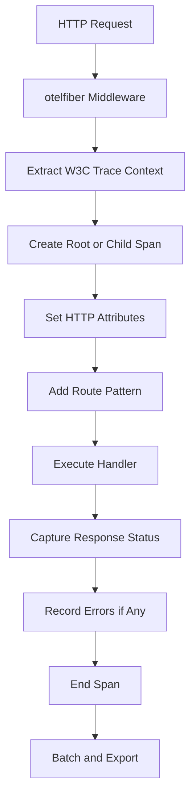

# How to Set Up OpenTelemetry in a Go Fiber Application with otelfiber

Author: [nawazdhandala](https://www.github.com/nawazdhandala)

Tags: OpenTelemetry, Go, Fiber, otelfiber, Web Framework, Tracing

Description: Learn how to implement OpenTelemetry distributed tracing in Go Fiber applications using otelfiber middleware for comprehensive observability and performance monitoring.

Fiber is an Express-inspired web framework built on top of Fasthttp, designed to be fast, flexible, and easy to use. As applications grow in complexity and scale, observability becomes critical for understanding system behavior and maintaining reliability. OpenTelemetry provides standardized instrumentation, and the otelfiber package makes it straightforward to add distributed tracing to your Fiber applications without cluttering your handler code.

## Understanding Fiber and OpenTelemetry Integration

Fiber's architecture is built for extreme performance, handling requests with minimal allocations and maximum throughput. When adding observability, the instrumentation must be equally efficient to avoid negating Fiber's performance benefits. The otelfiber middleware is specifically optimized for Fiber's execution model, creating spans with minimal overhead while capturing comprehensive metadata about each request.

Unlike frameworks that require manual span creation in each handler, otelfiber automatically instruments all routes, capturing HTTP methods, status codes, route patterns, and propagating trace context to downstream services without any changes to your business logic.

## Installing Dependencies

Start by installing Fiber, OpenTelemetry SDK, and the otelfiber instrumentation package.

```bash
# Install Fiber web framework
go get -u github.com/gofiber/fiber/v2

# Install OpenTelemetry core packages
go get -u go.opentelemetry.io/otel
go get -u go.opentelemetry.io/otel/sdk
go get -u go.opentelemetry.io/otel/trace

# Install OTLP exporter for sending traces
go get -u go.opentelemetry.io/otel/exporters/otlp/otlptrace
go get -u go.opentelemetry.io/otel/exporters/otlp/otlptrace/otlptracegrpc

# Install otelfiber middleware
go get -u github.com/gofiber/contrib/otelfiber/v2
```

## Initializing OpenTelemetry Tracer Provider

Before using the otelfiber middleware, configure the OpenTelemetry SDK with a tracer provider and exporter.

```go
package main

import (
    "context"
    "log"
    "time"

    "go.opentelemetry.io/otel"
    "go.opentelemetry.io/otel/exporters/otlp/otlptrace/otlptracegrpc"
    "go.opentelemetry.io/otel/propagation"
    "go.opentelemetry.io/otel/sdk/resource"
    sdktrace "go.opentelemetry.io/otel/sdk/trace"
    semconv "go.opentelemetry.io/otel/semconv/v1.17.0"
)

// initTracer sets up OpenTelemetry with OTLP exporter
// This sends traces to collectors like Jaeger, OneUptime, or OTEL Collector
func initTracer() (*sdktrace.TracerProvider, error) {
    ctx := context.Background()

    // Create OTLP trace exporter using gRPC
    // By default connects to localhost:4317
    exporter, err := otlptracegrpc.New(
        ctx,
        otlptracegrpc.WithInsecure(), // Use WithTLSCredentials in production
        otlptracegrpc.WithEndpoint("localhost:4317"),
    )
    if err != nil {
        return nil, err
    }

    // Define resource attributes identifying your service
    // These appear on every span and help identify the service
    resource := resource.NewWithAttributes(
        semconv.SchemaURL,
        semconv.ServiceNameKey.String("fiber-api-service"),
        semconv.ServiceVersionKey.String("1.0.0"),
        semconv.DeploymentEnvironmentKey.String("production"),
        semconv.TelemetrySDKLanguageKey.String("go"),
    )

    // Create tracer provider with batch span processor
    // Batching improves performance by reducing network overhead
    tp := sdktrace.NewTracerProvider(
        sdktrace.WithBatcher(exporter,
            sdktrace.WithBatchTimeout(5*time.Second),
            sdktrace.WithMaxExportBatchSize(512),
            sdktrace.WithMaxQueueSize(2048),
        ),
        sdktrace.WithResource(resource),
        sdktrace.WithSampler(sdktrace.AlwaysSample()),
    )

    // Set as global tracer provider
    otel.SetTracerProvider(tp)

    // Set global propagator for context propagation
    // W3C Trace Context is the standard for distributed tracing
    otel.SetTextMapPropagator(
        propagation.NewCompositeTextMapPropagator(
            propagation.TraceContext{},
            propagation.Baggage{},
        ),
    )

    return tp, nil
}
```

## Adding otelfiber Middleware to Your Application

With the tracer provider configured, add the otelfiber middleware to your Fiber application.

```go
package main

import (
    "log"

    "github.com/gofiber/fiber/v2"
    "github.com/gofiber/fiber/v2/middleware/logger"
    "github.com/gofiber/fiber/v2/middleware/recover"
    "github.com/gofiber/contrib/otelfiber/v2"
)

func main() {
    // Initialize OpenTelemetry tracer
    tp, err := initTracer()
    if err != nil {
        log.Fatalf("Failed to initialize tracer: %v", err)
    }
    defer func() {
        ctx, cancel := context.WithTimeout(context.Background(), 5*time.Second)
        defer cancel()
        if err := tp.Shutdown(ctx); err != nil {
            log.Printf("Error shutting down tracer provider: %v", err)
        }
    }()

    // Create Fiber app
    app := fiber.New(fiber.Config{
        AppName: "Fiber API Service",
    })

    // Add standard middleware
    app.Use(logger.New())
    app.Use(recover.New())

    // Add otelfiber middleware for distributed tracing
    // This instruments ALL routes registered after it
    app.Use(otelfiber.Middleware())

    // Register routes - these will be automatically traced
    app.Get("/users", getUsers)
    app.Get("/users/:id", getUser)
    app.Post("/users", createUser)
    app.Put("/users/:id", updateUser)
    app.Delete("/users/:id", deleteUser)

    // Start server
    log.Println("Server starting on :8080")
    if err := app.Listen(":8080"); err != nil {
        log.Fatalf("Server failed: %v", err)
    }
}
```

## How otelfiber Creates Spans

The otelfiber middleware intercepts every request and creates a span with comprehensive metadata:



The middleware captures:

- **HTTP Method**: GET, POST, PUT, DELETE, PATCH
- **Route Pattern**: Parameterized routes like `/users/:id`
- **Status Code**: HTTP response status
- **URL Path**: Full request path
- **User Agent**: Client user agent string
- **Request/Response Size**: Content length
- **Trace Context**: Propagated from upstream services
- **Errors**: Panic recovery and error responses

## Implementing Fiber Handlers with Context

Fiber handlers use `fiber.Ctx` which contains the request context with trace information.

```go
import (
    "github.com/gofiber/fiber/v2"
)

// User represents a user entity
type User struct {
    ID    int    `json:"id"`
    Name  string `json:"name"`
    Email string `json:"email"`
}

// getUsers retrieves all users
// The span is already active in the request context
func getUsers(c *fiber.Ctx) error {
    // Extract standard context from Fiber context
    ctx := c.Context()

    // Fetch users from database with trace propagation
    users, err := fetchUsersFromDatabase(ctx)
    if err != nil {
        return c.Status(fiber.StatusInternalServerError).JSON(fiber.Map{
            "error": "Failed to fetch users",
        })
    }

    return c.JSON(fiber.Map{
        "users": users,
        "count": len(users),
    })
}

// getUser retrieves a single user by ID
func getUser(c *fiber.Ctx) error {
    ctx := c.Context()

    // Extract route parameter
    userID := c.Params("id")

    user, err := fetchUserByID(ctx, userID)
    if err != nil {
        return c.Status(fiber.StatusNotFound).JSON(fiber.Map{
            "error": "User not found",
        })
    }

    return c.JSON(user)
}

// createUser creates a new user
func createUser(c *fiber.Ctx) error {
    ctx := c.Context()

    var user User
    if err := c.BodyParser(&user); err != nil {
        return c.Status(fiber.StatusBadRequest).JSON(fiber.Map{
            "error": "Invalid request body",
        })
    }

    if err := saveUserToDatabase(ctx, &user); err != nil {
        return c.Status(fiber.StatusInternalServerError).JSON(fiber.Map{
            "error": "Failed to create user",
        })
    }

    return c.Status(fiber.StatusCreated).JSON(user)
}

// updateUser updates an existing user
func updateUser(c *fiber.Ctx) error {
    ctx := c.Context()
    userID := c.Params("id")

    var updates User
    if err := c.BodyParser(&updates); err != nil {
        return c.Status(fiber.StatusBadRequest).JSON(fiber.Map{
            "error": "Invalid request body",
        })
    }

    if err := updateUserInDatabase(ctx, userID, &updates); err != nil {
        return c.Status(fiber.StatusInternalServerError).JSON(fiber.Map{
            "error": "Failed to update user",
        })
    }

    return c.JSON(fiber.Map{
        "message": "User updated successfully",
    })
}

// deleteUser removes a user by ID
func deleteUser(c *fiber.Ctx) error {
    ctx := c.Context()
    userID := c.Params("id")

    if err := deleteUserFromDatabase(ctx, userID); err != nil {
        return c.Status(fiber.StatusInternalServerError).JSON(fiber.Map{
            "error": "Failed to delete user",
        })
    }

    return c.JSON(fiber.Map{
        "message": "User deleted successfully",
    })
}
```

## Customizing otelfiber Middleware Configuration

The otelfiber package provides several configuration options to customize tracing behavior.

```go
import (
    "github.com/gofiber/contrib/otelfiber/v2"
)

func setupFiberWithCustomConfig() *fiber.App {
    app := fiber.New()

    // Configure otelfiber with custom options
    app.Use(otelfiber.Middleware(
        // Skip tracing for specific paths
        otelfiber.WithNext(func(c *fiber.Ctx) bool {
            path := c.Path()
            // Return true to skip tracing
            return path == "/health" || path == "/metrics"
        }),
        // Customize span naming
        otelfiber.WithSpanNameFormatter(func(ctx *fiber.Ctx) string {
            // Default format is "HTTP {METHOD} {PATH}"
            return ctx.Method() + " " + ctx.Route().Path
        }),
        // Add custom attributes to spans
        otelfiber.WithCustomAttributes(func(ctx *fiber.Ctx) []attribute.KeyValue {
            return []attribute.KeyValue{
                attribute.String("custom.field", "value"),
                attribute.Int("request.size", len(ctx.Body())),
            }
        }),
    ))

    return app
}
```

## Recording Errors and Setting Span Status

When errors occur, record them in the active span to maintain visibility into failures.

```go
import (
    "go.opentelemetry.io/otel/codes"
    "go.opentelemetry.io/otel/trace"
)

// riskyHandler performs an operation that might fail
func riskyHandler(c *fiber.Ctx) error {
    ctx := c.Context()

    // Get the current span from context
    span := trace.SpanFromContext(ctx)

    result, err := performRiskyOperation(ctx)
    if err != nil {
        // Record the error in the span
        span.RecordError(err)
        span.SetStatus(codes.Error, err.Error())

        return c.Status(fiber.StatusInternalServerError).JSON(fiber.Map{
            "error": "Operation failed",
        })
    }

    span.SetStatus(codes.Ok, "Operation successful")
    return c.JSON(result)
}
```

## Creating Custom Child Spans

Add custom spans to track specific operations within your handlers.

```go
import (
    "go.opentelemetry.io/otel"
    "go.opentelemetry.io/otel/attribute"
)

// processOrder handles order processing with multiple traced operations
func processOrder(c *fiber.Ctx) error {
    ctx := c.Context()

    var order Order
    if err := c.BodyParser(&order); err != nil {
        return c.Status(fiber.StatusBadRequest).JSON(fiber.Map{
            "error": "Invalid request body",
        })
    }

    // Get tracer for creating custom spans
    tracer := otel.Tracer("fiber-api-service")

    // Create custom span for inventory check
    ctx, inventorySpan := tracer.Start(ctx, "check_inventory",
        trace.WithAttributes(
            attribute.String("order.id", order.ID),
            attribute.String("product.id", order.ProductID),
        ),
    )
    available, err := checkInventory(ctx, order.ProductID, order.Quantity)
    inventorySpan.End()

    if err != nil || !available {
        return c.Status(fiber.StatusBadRequest).JSON(fiber.Map{
            "error": "Product not available",
        })
    }

    // Create custom span for payment processing
    ctx, paymentSpan := tracer.Start(ctx, "process_payment",
        trace.WithAttributes(
            attribute.Float64("payment.amount", order.Amount),
        ),
    )
    err = processPayment(ctx, order.Amount)
    if err != nil {
        paymentSpan.RecordError(err)
        paymentSpan.SetStatus(codes.Error, "Payment failed")
        paymentSpan.End()

        return c.Status(fiber.StatusPaymentRequired).JSON(fiber.Map{
            "error": "Payment processing failed",
        })
    }
    paymentSpan.End()

    // Create custom span for order creation
    ctx, saveSpan := tracer.Start(ctx, "save_order")
    err = saveOrderToDatabase(ctx, &order)
    saveSpan.End()

    if err != nil {
        return c.Status(fiber.StatusInternalServerError).JSON(fiber.Map{
            "error": "Failed to save order",
        })
    }

    return c.Status(fiber.StatusCreated).JSON(order)
}
```

## Integrating with Database Operations

Pass the extracted context to database operations to create child spans.

```go
import (
    "context"
    "database/sql"
)

type OrderRepository struct {
    db *sql.DB
}

// Save creates an order with trace propagation
func (r *OrderRepository) Save(ctx context.Context, order *Order) error {
    query := `
        INSERT INTO orders (id, product_id, quantity, amount, status)
        VALUES (?, ?, ?, ?, ?)
    `

    // Use ExecContext to propagate trace context
    _, err := r.db.ExecContext(ctx, query,
        order.ID,
        order.ProductID,
        order.Quantity,
        order.Amount,
        "pending",
    )

    return err
}

// FindByID retrieves an order by ID with trace propagation
func (r *OrderRepository) FindByID(ctx context.Context, orderID string) (*Order, error) {
    query := `
        SELECT id, product_id, quantity, amount, status
        FROM orders
        WHERE id = ?
    `

    var order Order
    err := r.db.QueryRowContext(ctx, query, orderID).Scan(
        &order.ID,
        &order.ProductID,
        &order.Quantity,
        &order.Amount,
        &order.Status,
    )

    if err != nil {
        return nil, err
    }

    return &order, nil
}
```

## Tracing External HTTP Requests

When calling external services, use an instrumented HTTP client to propagate trace context.

```go
import (
    "bytes"
    "encoding/json"
    "io"
    "net/http"

    "go.opentelemetry.io/contrib/instrumentation/net/http/otelhttp"
)

// ExternalServiceClient wraps HTTP calls with tracing
type ExternalServiceClient struct {
    client  *http.Client
    baseURL string
}

// NewExternalServiceClient creates a client with OpenTelemetry instrumentation
func NewExternalServiceClient(baseURL string) *ExternalServiceClient {
    return &ExternalServiceClient{
        client: &http.Client{
            Transport: otelhttp.NewTransport(http.DefaultTransport),
            Timeout:   10 * time.Second,
        },
        baseURL: baseURL,
    }
}

// SendNotification sends a notification to an external service
func (c *ExternalServiceClient) SendNotification(ctx context.Context, userID string, message string) error {
    url := c.baseURL + "/notifications"

    payload := map[string]string{
        "user_id": userID,
        "message": message,
    }

    body, err := json.Marshal(payload)
    if err != nil {
        return err
    }

    // Create request with context containing span information
    req, err := http.NewRequestWithContext(ctx, "POST", url, bytes.NewReader(body))
    if err != nil {
        return err
    }

    req.Header.Set("Content-Type", "application/json")

    // Execute request - trace context automatically propagates via headers
    resp, err := c.client.Do(req)
    if err != nil {
        return err
    }
    defer resp.Body.Close()

    if resp.StatusCode != http.StatusOK {
        return fmt.Errorf("notification service returned status %d", resp.StatusCode)
    }

    return nil
}

// Handler that uses the external service client
func sendUserNotification(c *fiber.Ctx) error {
    ctx := c.Context()

    var request struct {
        UserID  string `json:"user_id"`
        Message string `json:"message"`
    }

    if err := c.BodyParser(&request); err != nil {
        return c.Status(fiber.StatusBadRequest).JSON(fiber.Map{
            "error": "Invalid request body",
        })
    }

    // Create external service client
    client := NewExternalServiceClient("https://notifications.example.com")

    // Send notification - creates child span
    if err := client.SendNotification(ctx, request.UserID, request.Message); err != nil {
        return c.Status(fiber.StatusBadGateway).JSON(fiber.Map{
            "error": "Failed to send notification",
        })
    }

    return c.JSON(fiber.Map{
        "message": "Notification sent successfully",
    })
}
```

## Using Fiber Groups with Tracing

Fiber's group feature works seamlessly with otelfiber middleware.

```go
func setupRoutesWithGroups(app *fiber.App) {
    // Add global middleware
    app.Use(otelfiber.Middleware())

    // Health check endpoint (not traced)
    app.Get("/health", func(c *fiber.Ctx) error {
        return c.JSON(fiber.Map{"status": "healthy"})
    })

    // API v1 group
    v1 := app.Group("/api/v1")

    // User routes
    users := v1.Group("/users")
    users.Get("/", listUsers)
    users.Get("/:id", getUser)
    users.Post("/", createUser)
    users.Put("/:id", updateUser)
    users.Delete("/:id", deleteUser)

    // Order routes
    orders := v1.Group("/orders")
    orders.Get("/", listOrders)
    orders.Get("/:id", getOrder)
    orders.Post("/", createOrder)

    // Admin routes with authentication
    admin := v1.Group("/admin")
    admin.Use(authMiddleware)
    admin.Get("/stats", getStats)
    admin.Post("/config", updateConfig)
}
```

## Implementing Graceful Shutdown

Ensure all spans are exported before the application exits.

```go
import (
    "os"
    "os/signal"
    "syscall"
)

func main() {
    tp, err := initTracer()
    if err != nil {
        log.Fatalf("Failed to initialize tracer: %v", err)
    }

    app := fiber.New()
    app.Use(otelfiber.Middleware())

    setupRoutes(app)

    // Channel to listen for shutdown signal
    quit := make(chan os.Signal, 1)
    signal.Notify(quit, syscall.SIGINT, syscall.SIGTERM)

    // Start server in goroutine
    go func() {
        log.Println("Server starting on :8080")
        if err := app.Listen(":8080"); err != nil {
            log.Fatalf("Server failed: %v", err)
        }
    }()

    // Wait for shutdown signal
    <-quit
    log.Println("Shutting down server...")

    // Shutdown server gracefully
    if err := app.Shutdown(); err != nil {
        log.Printf("Server shutdown error: %v", err)
    }

    // Shutdown tracer provider to flush remaining spans
    ctx, cancel := context.WithTimeout(context.Background(), 10*time.Second)
    defer cancel()

    if err := tp.Shutdown(ctx); err != nil {
        log.Printf("Tracer shutdown error: %v", err)
    }

    log.Println("Server stopped gracefully")
}
```

## Complete Production-Ready Example

Here's a comprehensive example demonstrating all the concepts:

```go
package main

import (
    "context"
    "log"
    "os"
    "os/signal"
    "syscall"
    "time"

    "github.com/gofiber/fiber/v2"
    "github.com/gofiber/fiber/v2/middleware/logger"
    "github.com/gofiber/fiber/v2/middleware/recover"
    "github.com/gofiber/contrib/otelfiber/v2"
    "go.opentelemetry.io/otel"
    "go.opentelemetry.io/otel/exporters/otlp/otlptrace/otlptracegrpc"
    "go.opentelemetry.io/otel/propagation"
    "go.opentelemetry.io/otel/sdk/resource"
    sdktrace "go.opentelemetry.io/otel/sdk/trace"
    semconv "go.opentelemetry.io/otel/semconv/v1.17.0"
)

type User struct {
    ID    int    `json:"id"`
    Name  string `json:"name"`
    Email string `json:"email"`
}

func main() {
    // Initialize tracer
    tp, err := initTracer()
    if err != nil {
        log.Fatalf("Failed to initialize tracer: %v", err)
    }

    // Create Fiber app
    app := fiber.New(fiber.Config{
        AppName: "Fiber API Service",
    })

    // Add middleware
    app.Use(logger.New())
    app.Use(recover.New())
    app.Use(otelfiber.Middleware())

    // Register routes
    app.Get("/users", func(c *fiber.Ctx) error {
        users := []User{
            {ID: 1, Name: "Alice", Email: "alice@example.com"},
            {ID: 2, Name: "Bob", Email: "bob@example.com"},
        }
        return c.JSON(users)
    })

    app.Get("/users/:id", func(c *fiber.Ctx) error {
        id := c.Params("id")
        user := User{ID: 1, Name: "Alice", Email: "alice@example.com"}
        return c.JSON(user)
    })

    // Graceful shutdown
    quit := make(chan os.Signal, 1)
    signal.Notify(quit, syscall.SIGINT, syscall.SIGTERM)

    go func() {
        log.Println("Server starting on :8080")
        if err := app.Listen(":8080"); err != nil {
            log.Fatalf("Server failed: %v", err)
        }
    }()

    <-quit
    log.Println("Shutting down...")

    if err := app.Shutdown(); err != nil {
        log.Printf("Server shutdown error: %v", err)
    }

    ctx, cancel := context.WithTimeout(context.Background(), 10*time.Second)
    defer cancel()

    if err := tp.Shutdown(ctx); err != nil {
        log.Printf("Tracer shutdown error: %v", err)
    }

    log.Println("Server stopped")
}

func initTracer() (*sdktrace.TracerProvider, error) {
    ctx := context.Background()

    exporter, err := otlptracegrpc.New(ctx,
        otlptracegrpc.WithInsecure(),
        otlptracegrpc.WithEndpoint("localhost:4317"),
    )
    if err != nil {
        return nil, err
    }

    resource := resource.NewWithAttributes(
        semconv.SchemaURL,
        semconv.ServiceNameKey.String("fiber-api-service"),
    )

    tp := sdktrace.NewTracerProvider(
        sdktrace.WithBatcher(exporter),
        sdktrace.WithResource(resource),
    )

    otel.SetTracerProvider(tp)
    otel.SetTextMapPropagator(propagation.TraceContext{})

    return tp, nil
}
```

The otelfiber middleware provides a lightweight, high-performance solution for adding distributed tracing to Fiber applications. With minimal configuration and no changes to handler code, you gain complete visibility into request flow, timing, and errors across your entire service infrastructure.
