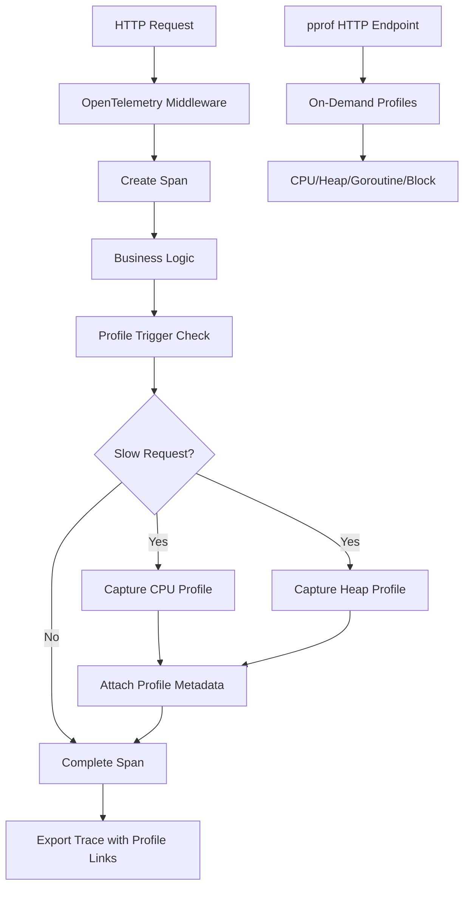

# How to Use OpenTelemetry with Go's Built-In net/http/pprof for Profiling

Author: [nawazdhandala](https://www.github.com/nawazdhandala)

Tags: OpenTelemetry, Go, pprof, Profiling, Performance, net/http

Description: Combine OpenTelemetry tracing with Go's pprof profiler to correlate distributed traces with CPU, memory, and goroutine profiles for deep performance analysis.

Go's built-in `net/http/pprof` package provides powerful profiling capabilities that help you understand CPU usage, memory allocation, goroutine behavior, and blocking events. When combined with OpenTelemetry's distributed tracing, you can correlate performance bottlenecks in your traces with detailed profiling data, creating a complete picture of your application's behavior under load.

This integration becomes particularly valuable when you notice slow spans in your traces but need deeper insights into what's happening at the runtime level. You can capture profiles during specific trace contexts and link them together for investigation.

## Why Combine OpenTelemetry with pprof

Tracing tells you *what* your application is doing and *how long* operations take across services. Profiling tells you *why* those operations take that long by showing you the actual CPU consumption, memory allocations, and goroutine states. Together, they provide both the high-level distributed view and the low-level runtime details.

Consider a scenario where you see a database query span taking 500ms. The trace shows the duration, but pprof can reveal that 400ms was spent in garbage collection due to excessive allocations in your query result processing code.

## Architecture Overview



## Setting Up OpenTelemetry with pprof

First, initialize OpenTelemetry with trace context propagation and set up the pprof HTTP handlers.

```go
package main

import (
    "context"
    "fmt"
    "log"
    "net/http"
    _ "net/http/pprof"
    "os"
    "runtime"
    "runtime/pprof"
    "time"

    "go.opentelemetry.io/otel"
    "go.opentelemetry.io/otel/attribute"
    "go.opentelemetry.io/otel/exporters/otlp/otlptrace/otlptracegrpc"
    "go.opentelemetry.io/otel/propagation"
    "go.opentelemetry.io/otel/sdk/resource"
    "go.opentelemetry.io/otel/sdk/trace"
    semconv "go.opentelemetry.io/otel/semconv/v1.21.0"
)

// Initialize OpenTelemetry with OTLP exporter
func initTracer() (*trace.TracerProvider, error) {
    ctx := context.Background()

    exporter, err := otlptracegrpc.New(ctx,
        otlptracegrpc.WithEndpoint("localhost:4317"),
        otlptracegrpc.WithInsecure(),
    )
    if err != nil {
        return nil, fmt.Errorf("creating OTLP exporter: %w", err)
    }

    res, err := resource.New(ctx,
        resource.WithAttributes(
            semconv.ServiceName("pprof-integration-service"),
            semconv.ServiceVersion("1.0.0"),
            attribute.String("environment", "production"),
        ),
    )
    if err != nil {
        return nil, fmt.Errorf("creating resource: %w", err)
    }

    tp := trace.NewTracerProvider(
        trace.WithBatcher(exporter),
        trace.WithResource(res),
        trace.WithSampler(trace.AlwaysSample()),
    )

    otel.SetTracerProvider(tp)
    otel.SetTextMapPropagator(propagation.TraceContext{})

    return tp, nil
}
```

The tracer provider configuration includes resource attributes that will help you identify profiles in your observability backend. Setting up proper context propagation ensures trace IDs flow through your entire request lifecycle.

## Creating a Profile-Aware Middleware

Build middleware that automatically captures profiles when requests exceed performance thresholds.

```go
// ProfileConfig defines thresholds for automatic profiling
type ProfileConfig struct {
    SlowRequestThreshold time.Duration
    CPUProfileDuration   time.Duration
    EnableAutoProfile    bool
    ProfileStoragePath   string
}

// ProfileMiddleware wraps HTTP handlers with profiling capabilities
func ProfileMiddleware(config ProfileConfig) func(http.Handler) http.Handler {
    return func(next http.Handler) http.Handler {
        return http.HandlerFunc(func(w http.ResponseWriter, r *http.Request) {
            tracer := otel.Tracer("profiling-middleware")
            ctx, span := tracer.Start(r.Context(), r.URL.Path)
            defer span.End()

            start := time.Now()

            // Create a custom response writer to capture status
            wrapped := &responseWriter{ResponseWriter: w, statusCode: http.StatusOK}

            // Execute the request
            next.ServeHTTP(wrapped, r.WithContext(ctx))

            duration := time.Since(start)

            // Add performance metrics to span
            span.SetAttributes(
                attribute.Int64("http.response_time_ms", duration.Milliseconds()),
                attribute.Int("http.status_code", wrapped.statusCode),
            )

            // Trigger profiling if request was slow
            if config.EnableAutoProfile && duration > config.SlowRequestThreshold {
                span.SetAttributes(attribute.Bool("profile.triggered", true))

                if err := captureProfilesForSpan(ctx, span, config); err != nil {
                    log.Printf("Failed to capture profiles: %v", err)
                    span.SetAttributes(attribute.String("profile.error", err.Error()))
                } else {
                    span.SetAttributes(attribute.Bool("profile.captured", true))
                }
            }
        })
    }
}

type responseWriter struct {
    http.ResponseWriter
    statusCode int
}

func (rw *responseWriter) WriteHeader(code int) {
    rw.statusCode = code
    rw.ResponseWriter.WriteHeader(code)
}
```

This middleware monitors request duration and automatically triggers profiling for slow requests, attaching metadata to the span that links to the captured profiles.

## Capturing Profiles with Trace Context

Implement profile capture functions that preserve trace context and store profile metadata.

```go
// captureProfilesForSpan captures CPU and heap profiles linked to a span
func captureProfilesForSpan(ctx context.Context, span trace.Span, config ProfileConfig) error {
    spanCtx := span.SpanContext()
    traceID := spanCtx.TraceID().String()
    spanID := spanCtx.SpanID().String()
    timestamp := time.Now().Unix()

    // Capture CPU profile
    cpuProfilePath := fmt.Sprintf("%s/cpu-%s-%s-%d.prof",
        config.ProfileStoragePath, traceID, spanID, timestamp)

    if err := captureCPUProfile(cpuProfilePath, config.CPUProfileDuration); err != nil {
        return fmt.Errorf("capturing CPU profile: %w", err)
    }

    span.SetAttributes(
        attribute.String("profile.cpu.path", cpuProfilePath),
        attribute.String("profile.cpu.trace_id", traceID),
        attribute.String("profile.cpu.span_id", spanID),
    )

    // Capture heap profile
    heapProfilePath := fmt.Sprintf("%s/heap-%s-%s-%d.prof",
        config.ProfileStoragePath, traceID, spanID, timestamp)

    if err := captureHeapProfile(heapProfilePath); err != nil {
        return fmt.Errorf("capturing heap profile: %w", err)
    }

    span.SetAttributes(
        attribute.String("profile.heap.path", heapProfilePath),
        attribute.Int64("profile.heap.alloc_mb", getAllocMB()),
        attribute.Int("profile.heap.num_gc", int(getNumGC())),
    )

    // Capture goroutine profile
    goroutineProfilePath := fmt.Sprintf("%s/goroutine-%s-%s-%d.prof",
        config.ProfileStoragePath, traceID, spanID, timestamp)

    if err := captureGoroutineProfile(goroutineProfilePath); err != nil {
        return fmt.Errorf("capturing goroutine profile: %w", err)
    }

    span.SetAttributes(
        attribute.String("profile.goroutine.path", goroutineProfilePath),
        attribute.Int("profile.goroutine.count", runtime.NumGoroutine()),
    )

    return nil
}

func captureCPUProfile(path string, duration time.Duration) error {
    f, err := os.Create(path)
    if err != nil {
        return err
    }
    defer f.Close()

    if err := pprof.StartCPUProfile(f); err != nil {
        return err
    }

    time.Sleep(duration)
    pprof.StopCPUProfile()

    return nil
}

func captureHeapProfile(path string) error {
    f, err := os.Create(path)
    if err != nil {
        return err
    }
    defer f.Close()

    runtime.GC() // Get accurate heap stats
    return pprof.WriteHeapProfile(f)
}

func captureGoroutineProfile(path string) error {
    f, err := os.Create(path)
    if err != nil {
        return err
    }
    defer f.Close()

    profile := pprof.Lookup("goroutine")
    if profile == nil {
        return fmt.Errorf("goroutine profile not found")
    }

    return profile.WriteTo(f, 0)
}

func getAllocMB() int64 {
    var m runtime.MemStats
    runtime.ReadMemStats(&m)
    return int64(m.Alloc / 1024 / 1024)
}

func getNumGC() uint32 {
    var m runtime.MemStats
    runtime.ReadMemStats(&m)
    return m.NumGC
}
```

Each profile is saved with a filename that includes the trace and span IDs, making it easy to correlate profiles with specific traces in your observability platform.

## Instrumenting Application Endpoints

Create instrumented endpoints that work with the profiling middleware.

```go
func main() {
    tp, err := initTracer()
    if err != nil {
        log.Fatalf("Failed to initialize tracer: %v", err)
    }
    defer func() {
        if err := tp.Shutdown(context.Background()); err != nil {
            log.Printf("Error shutting down tracer: %v", err)
        }
    }()

    // Create profile storage directory
    profilePath := "./profiles"
    if err := os.MkdirAll(profilePath, 0755); err != nil {
        log.Fatalf("Failed to create profile directory: %v", err)
    }

    config := ProfileConfig{
        SlowRequestThreshold: 100 * time.Millisecond,
        CPUProfileDuration:   2 * time.Second,
        EnableAutoProfile:    true,
        ProfileStoragePath:   profilePath,
    }

    // Set up pprof endpoints on a separate port for security
    go func() {
        pprofMux := http.NewServeMux()
        pprofMux.HandleFunc("/debug/pprof/", pprof.Index)
        pprofMux.HandleFunc("/debug/pprof/cmdline", pprof.Cmdline)
        pprofMux.HandleFunc("/debug/pprof/profile", pprof.Profile)
        pprofMux.HandleFunc("/debug/pprof/symbol", pprof.Symbol)
        pprofMux.HandleFunc("/debug/pprof/trace", pprof.Trace)

        log.Println("pprof server listening on :6060")
        if err := http.ListenAndServe(":6060", pprofMux); err != nil {
            log.Fatalf("pprof server failed: %v", err)
        }
    }()

    // Set up application endpoints with profiling middleware
    mux := http.NewServeMux()
    mux.Handle("/api/heavy", ProfileMiddleware(config)(http.HandlerFunc(heavyHandler)))
    mux.Handle("/api/allocations", ProfileMiddleware(config)(http.HandlerFunc(allocationHandler)))
    mux.Handle("/api/concurrent", ProfileMiddleware(config)(http.HandlerFunc(concurrentHandler)))

    log.Println("Application server listening on :8080")
    if err := http.ListenAndServe(":8080", mux); err != nil {
        log.Fatalf("Server failed: %v", err)
    }
}

// heavyHandler simulates CPU-intensive work
func heavyHandler(w http.ResponseWriter, r *http.Request) {
    ctx := r.Context()
    tracer := otel.Tracer("handlers")
    _, span := tracer.Start(ctx, "heavy-computation")
    defer span.End()

    // Simulate CPU-intensive work
    result := 0
    for i := 0; i < 10000000; i++ {
        result += i * i
    }

    span.SetAttributes(attribute.Int("computation.result", result))
    w.WriteHeader(http.StatusOK)
    fmt.Fprintf(w, "Computation result: %d\n", result)
}

// allocationHandler simulates memory-intensive operations
func allocationHandler(w http.ResponseWriter, r *http.Request) {
    ctx := r.Context()
    tracer := otel.Tracer("handlers")
    _, span := tracer.Start(ctx, "allocation-heavy")
    defer span.End()

    // Allocate memory to trigger heap profiling
    data := make([][]byte, 1000)
    for i := range data {
        data[i] = make([]byte, 1024*1024) // 1MB each
    }

    span.SetAttributes(attribute.Int("allocations.count", len(data)))
    w.WriteHeader(http.StatusOK)
    fmt.Fprintf(w, "Allocated %d MB\n", len(data))
}

// concurrentHandler creates many goroutines
func concurrentHandler(w http.ResponseWriter, r *http.Request) {
    ctx := r.Context()
    tracer := otel.Tracer("handlers")
    _, span := tracer.Start(ctx, "concurrent-operations")
    defer span.End()

    // Spawn goroutines to trigger goroutine profiling
    done := make(chan bool)
    for i := 0; i < 1000; i++ {
        go func(id int) {
            time.Sleep(100 * time.Millisecond)
            done <- true
        }(i)
    }

    count := 0
    for i := 0; i < 1000; i++ {
        <-done
        count++
    }

    span.SetAttributes(attribute.Int("goroutines.spawned", count))
    w.WriteHeader(http.StatusOK)
    fmt.Fprintf(w, "Completed %d concurrent operations\n", count)
}
```

The application serves on port 8080 with instrumented endpoints, while pprof endpoints are available on port 6060 for on-demand profiling.

## Analyzing Profiles with Trace Context

Once profiles are captured, you can analyze them using the `go tool pprof` command while referencing the trace IDs from your spans.

```bash
# Analyze CPU profile for a specific trace
go tool pprof -http=:8081 profiles/cpu-<trace-id>-<span-id>-<timestamp>.prof

# Compare heap profiles before and after optimization
go tool pprof -base=profiles/heap-old.prof profiles/heap-new.prof

# Generate flame graph for visualization
go tool pprof -http=:8081 profiles/cpu-profile.prof

# Check goroutine states
go tool pprof profiles/goroutine-profile.prof
```

The trace and span IDs embedded in profile filenames let you quickly find the exact profile corresponding to a slow trace you're investigating.

## Advanced Integration Patterns

For production systems, consider building a profile aggregation service that collects profiles and links them to traces in your observability backend.

```go
// ProfileCollector aggregates profiles and sends metadata to observability backend
type ProfileCollector struct {
    uploadEndpoint string
    client         *http.Client
}

func (pc *ProfileCollector) UploadProfile(ctx context.Context, span trace.Span, profilePath string, profileType string) error {
    spanCtx := span.SpanContext()

    // Read profile data
    data, err := os.ReadFile(profilePath)
    if err != nil {
        return err
    }

    // Create metadata
    metadata := map[string]string{
        "trace_id":     spanCtx.TraceID().String(),
        "span_id":      spanCtx.SpanID().String(),
        "profile_type": profileType,
        "timestamp":    time.Now().Format(time.RFC3339),
        "service":      "pprof-integration-service",
    }

    // Upload to storage backend (S3, GCS, etc.)
    // This is a simplified example
    log.Printf("Uploading %s profile for trace %s", profileType, metadata["trace_id"])

    // Add profile URL to span attributes
    profileURL := fmt.Sprintf("%s/%s-%s-%s.prof",
        pc.uploadEndpoint, profileType, metadata["trace_id"], metadata["span_id"])

    span.SetAttributes(
        attribute.String(fmt.Sprintf("profile.%s.url", profileType), profileURL),
    )

    return nil
}
```

This collector can upload profiles to cloud storage and add URLs to your spans, making profiles accessible directly from your tracing UI.

## Continuous Profiling with OpenTelemetry

For continuous profiling, capture periodic snapshots and correlate them with active traces.

```go
// ContinuousProfiler captures profiles at regular intervals
type ContinuousProfiler struct {
    interval time.Duration
    storage  string
    tracer   trace.Tracer
}

func (cp *ContinuousProfiler) Start(ctx context.Context) {
    ticker := time.NewTicker(cp.interval)
    defer ticker.Stop()

    for {
        select {
        case <-ctx.Done():
            return
        case <-ticker.C:
            cp.captureSnapshot(ctx)
        }
    }
}

func (cp *ContinuousProfiler) captureSnapshot(ctx context.Context) {
    _, span := cp.tracer.Start(ctx, "continuous-profile-snapshot")
    defer span.End()

    timestamp := time.Now().Unix()

    // Capture CPU profile
    cpuPath := fmt.Sprintf("%s/continuous-cpu-%d.prof", cp.storage, timestamp)
    if err := captureCPUProfile(cpuPath, 5*time.Second); err != nil {
        span.SetAttributes(attribute.String("error", err.Error()))
        return
    }

    // Capture heap profile
    heapPath := fmt.Sprintf("%s/continuous-heap-%d.prof", cp.storage, timestamp)
    if err := captureHeapProfile(heapPath); err != nil {
        span.SetAttributes(attribute.String("error", err.Error()))
        return
    }

    span.SetAttributes(
        attribute.String("profile.cpu.path", cpuPath),
        attribute.String("profile.heap.path", heapPath),
        attribute.Int64("profile.timestamp", timestamp),
    )
}
```

Continuous profiling provides baseline performance data that you can compare against when investigating specific slow traces.

## Performance Considerations

Profile capture itself consumes resources. CPU profiling adds 5-10% overhead during the capture period, and heap profiling triggers garbage collection. Only enable automatic profiling for requests that exceed meaningful thresholds to avoid impacting normal operations.

Store profiles in fast local storage or stream them asynchronously to remote storage to minimize impact on request latency. Consider using a separate goroutine pool for profile uploads to prevent blocking request handlers.

The combination of OpenTelemetry tracing and pprof profiling gives you the complete picture: distributed traces show you the flow and timing across services, while profiles reveal the exact CPU, memory, and concurrency behavior causing performance issues. Together, they make performance debugging systematic rather than speculative.