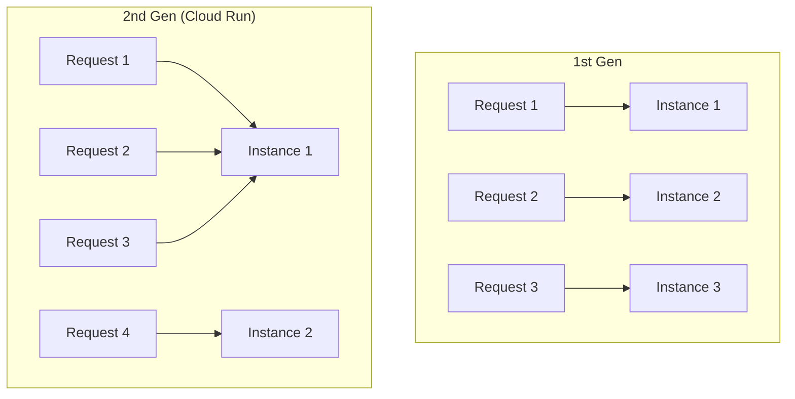

# How to Configure OpenTelemetry for Google Cloud Functions (2nd Gen)

Author: [nawazdhandala](https://www.github.com/nawazdhandala)

Tags: OpenTelemetry, Google Cloud Functions, GCP, Cloud Run, Serverless, Tracing, Observability

Description: A practical guide to configuring OpenTelemetry for Google Cloud Functions 2nd generation, covering auto-instrumentation, resource detection, and Cloud Trace integration.

---

Google Cloud Functions 2nd generation runs on Cloud Run under the hood. This is a significant architectural shift from 1st gen functions, and it changes how you approach OpenTelemetry instrumentation. The Cloud Run foundation means you get longer request timeouts, concurrency support, and a more standard HTTP server execution model. It also means you can use many of the same instrumentation techniques that work for regular Cloud Run services.

This post walks through configuring OpenTelemetry for 2nd gen Cloud Functions in Python, Node.js, and Go, including integration with Google Cloud Trace and resource detection for GCP metadata.

## How 2nd Gen Differs from 1st Gen

The execution model is the most important difference. First gen functions handle one request at a time and have a cold start for each new instance. Second gen functions can handle multiple concurrent requests on a single instance, and the instance stays alive between requests much like a regular web server.



For OpenTelemetry, this means you can initialize the SDK once and reuse it across multiple requests. You do not need the Lambda-style lifecycle management where everything has to be flushed after each invocation. The SDK behaves more like it would in a normal web application.

## Python Configuration

Python Cloud Functions use the Functions Framework, which is a lightweight wrapper around Flask. You configure OpenTelemetry at module load time, and it stays active for the lifetime of the instance.

```python
# main.py
# OpenTelemetry configuration for a Python 2nd gen Cloud Function
import functions_framework
from opentelemetry import trace
from opentelemetry.sdk.trace import TracerProvider
from opentelemetry.sdk.trace.export import BatchSpanProcessor
from opentelemetry.exporter.otlp.proto.grpc.trace_exporter import OTLPSpanExporter
from opentelemetry.sdk.resources import Resource
from opentelemetry.resourcedetector.gcp_resource_detector import (
    GoogleCloudResourceDetector,
)
from opentelemetry.instrumentation.flask import FlaskInstrumentor
from opentelemetry.instrumentation.requests import RequestsInstrumentor

# Detect GCP resource attributes automatically
# This picks up project ID, region, function name, and revision
resource = Resource.create({
    "service.name": "my-cloud-function",
}).merge(GoogleCloudResourceDetector().detect())

# Configure the TracerProvider with batch export
provider = TracerProvider(resource=resource)
provider.add_span_processor(
    BatchSpanProcessor(
        OTLPSpanExporter(
            # Export to the local OTLP endpoint or Cloud Trace
            endpoint="http://localhost:4317",
            insecure=True,
        ),
        # Batch settings tuned for serverless
        max_queue_size=256,
        schedule_delay_millis=5000,
        max_export_batch_size=64,
    )
)
trace.set_tracer_provider(provider)

# Auto-instrument Flask (which backs the Functions Framework)
FlaskInstrumentor().instrument()
# Auto-instrument the requests library for outbound HTTP calls
RequestsInstrumentor().instrument()

tracer = trace.get_tracer("my-cloud-function")

@functions_framework.http
def handle_request(request):
    """HTTP Cloud Function with OpenTelemetry tracing."""
    with tracer.start_as_current_span(
        "process-request",
        attributes={
            "http.method": request.method,
            "http.url": request.url,
        },
    ) as span:
        user_id = request.args.get("user_id")
        span.set_attribute("user.id", user_id)

        # Business logic here
        result = process_user_data(user_id)

        span.set_attribute("result.status", "success")
        return result
```

The `GoogleCloudResourceDetector` is important here. It queries the GCP metadata server to populate resource attributes like `cloud.project_id`, `cloud.region`, `faas.name`, and `faas.version`. These attributes let you filter and group traces by function name, region, or project in your trace viewer.

Install the required packages in your `requirements.txt`:

```text
# requirements.txt
# Core OpenTelemetry packages for GCP Cloud Functions
functions-framework==3.*
opentelemetry-api==1.27.0
opentelemetry-sdk==1.27.0
opentelemetry-exporter-otlp-proto-grpc==1.27.0
opentelemetry-instrumentation-flask==0.48b0
opentelemetry-instrumentation-requests==0.48b0
opentelemetry-resourcedetector-gcp==1.7.0
```

## Node.js Configuration

Node.js Cloud Functions also use a functions framework. The OpenTelemetry setup needs to happen before any other imports to ensure libraries are patched correctly.

```javascript
// tracing.js
// OpenTelemetry initialization - must be imported first
const { NodeTracerProvider } = require('@opentelemetry/sdk-trace-node');
const { BatchSpanProcessor } = require('@opentelemetry/sdk-trace-base');
const { OTLPTraceExporter } = require('@opentelemetry/exporter-trace-otlp-grpc');
const { Resource } = require('@opentelemetry/resources');
const { GcpDetector } = require('@opentelemetry/resource-detector-gcp');
const { registerInstrumentations } = require('@opentelemetry/instrumentation');
const { HttpInstrumentation } = require('@opentelemetry/instrumentation-http');
const { ExpressInstrumentation } = require('@opentelemetry/instrumentation-express');

async function initTracing() {
  // Detect GCP-specific resource attributes
  const gcpResource = await new GcpDetector().detect();

  const resource = new Resource({
    'service.name': process.env.K_SERVICE || 'my-cloud-function',
    'service.version': process.env.K_REVISION || 'unknown',
  }).merge(gcpResource);

  const provider = new NodeTracerProvider({ resource });

  // Configure batch export with serverless-friendly settings
  provider.addSpanProcessor(
    new BatchSpanProcessor(
      new OTLPTraceExporter({
        url: process.env.OTEL_EXPORTER_OTLP_ENDPOINT || 'http://localhost:4317',
      }),
      {
        maxQueueSize: 256,
        scheduledDelayMillis: 5000,
        maxExportBatchSize: 64,
      }
    )
  );

  provider.register();

  // Instrument HTTP and Express (Functions Framework uses Express)
  registerInstrumentations({
    instrumentations: [
      new HttpInstrumentation(),
      new ExpressInstrumentation(),
    ],
  });
}

// Initialize tracing immediately
initTracing();

module.exports = {};
```

Now your function handler can import the tracing module and use the OpenTelemetry API.

```javascript
// index.js
// Cloud Function handler with OpenTelemetry tracing
// Import tracing first to ensure instrumentation patches are applied
require('./tracing');

const functions = require('@google-cloud/functions-framework');
const { trace } = require('@opentelemetry/api');

const tracer = trace.getTracer('my-cloud-function');

functions.http('handleRequest', async (req, res) => {
  // Create a custom span for business logic
  const span = tracer.startSpan('process-request', {
    attributes: {
      'http.method': req.method,
      'request.path': req.path,
    },
  });

  try {
    const userId = req.query.user_id;
    span.setAttribute('user.id', userId);

    // Any HTTP calls made here are automatically traced
    const result = await processUserData(userId);

    span.setAttribute('result.status', 'success');
    res.json(result);
  } catch (error) {
    span.setStatus({ code: 2, message: error.message });
    span.recordException(error);
    res.status(500).json({ error: 'Internal server error' });
  } finally {
    span.end();
  }
});
```

The `K_SERVICE` and `K_REVISION` environment variables are set automatically by Cloud Run. They give you the function name and revision without any configuration. Using these as resource attributes connects your traces to specific deployments.

## Go Configuration

Go Cloud Functions benefit from OpenTelemetry's strong Go support. The setup is straightforward because Go's compile-time linking avoids the monkey-patching complexity of dynamic languages.

```go
// function.go
// Go Cloud Function with OpenTelemetry tracing
package function

import (
	"context"
	"encoding/json"
	"fmt"
	"net/http"
	"os"
	"sync"

	"github.com/GoogleCloudPlatform/functions-framework-go/functions"
	"go.opentelemetry.io/otel"
	"go.opentelemetry.io/otel/attribute"
	"go.opentelemetry.io/otel/exporters/otlp/otlptrace/otlptracegrpc"
	"go.opentelemetry.io/otel/sdk/resource"
	sdktrace "go.opentelemetry.io/otel/sdk/trace"
	semconv "go.opentelemetry.io/otel/semconv/v1.26.0"
	"go.opentelemetry.io/otel/trace"
)

var (
	tracer trace.Tracer
	once   sync.Once
)

func init() {
	// Register the function with the framework
	functions.HTTP("HandleRequest", handleRequest)

	// Initialize OpenTelemetry once
	once.Do(func() {
		ctx := context.Background()

		// Create OTLP exporter
		exporter, err := otlptracegrpc.New(ctx,
			otlptracegrpc.WithEndpoint(
				getEnv("OTEL_EXPORTER_OTLP_ENDPOINT", "localhost:4317"),
			),
			otlptracegrpc.WithInsecure(),
		)
		if err != nil {
			fmt.Printf("Failed to create exporter: %v\n", err)
			return
		}

		// Build resource with GCP attributes
		res, _ := resource.Merge(
			resource.Default(),
			resource.NewWithAttributes(
				semconv.SchemaURL,
				semconv.ServiceName(getEnv("K_SERVICE", "my-cloud-function")),
				semconv.ServiceVersion(getEnv("K_REVISION", "unknown")),
				attribute.String("cloud.provider", "gcp"),
				attribute.String("cloud.platform", "gcp_cloud_functions"),
			),
		)

		// Configure the TracerProvider
		tp := sdktrace.NewTracerProvider(
			sdktrace.WithBatcher(exporter,
				sdktrace.WithMaxQueueSize(256),
				sdktrace.WithBatchTimeout(5*time.Second),
				sdktrace.WithMaxExportBatchSize(64),
			),
			sdktrace.WithResource(res),
		)

		otel.SetTracerProvider(tp)
		tracer = tp.Tracer("my-cloud-function")
	})
}

func handleRequest(w http.ResponseWriter, r *http.Request) {
	ctx, span := tracer.Start(r.Context(), "process-request",
		trace.WithAttributes(
			attribute.String("http.method", r.Method),
			attribute.String("http.url", r.URL.String()),
		),
	)
	defer span.End()

	userId := r.URL.Query().Get("user_id")
	span.SetAttributes(attribute.String("user.id", userId))

	// Process the request with traced context
	result, err := processUserData(ctx, userId)
	if err != nil {
		span.SetStatus(codes.Error, err.Error())
		span.RecordError(err)
		http.Error(w, "Internal error", http.StatusInternalServerError)
		return
	}

	span.SetAttributes(attribute.String("result.status", "success"))
	json.NewEncoder(w).Encode(result)
}

func getEnv(key, fallback string) string {
	if value, ok := os.LookupEnv(key); ok {
		return value
	}
	return fallback
}
```

The `sync.Once` ensures the tracer provider is initialized exactly once, even if the `init` function is called multiple times. The Go SDK is efficient enough that initialization adds minimal cold start overhead.

## Exporting to Google Cloud Trace

If you prefer to keep your telemetry within the Google Cloud ecosystem, you can export directly to Cloud Trace using the dedicated exporter.

```python
# cloud-trace-export.py
# Configure export to Google Cloud Trace
from opentelemetry.exporter.cloud_trace import CloudTraceSpanExporter
from opentelemetry.sdk.trace import TracerProvider
from opentelemetry.sdk.trace.export import BatchSpanProcessor

provider = TracerProvider(resource=resource)

# Cloud Trace exporter uses Application Default Credentials
# No explicit credential configuration needed in Cloud Functions
provider.add_span_processor(
    BatchSpanProcessor(
        CloudTraceSpanExporter(
            # Project ID is auto-detected from the environment
            # but you can specify it explicitly if needed
            project_id="my-gcp-project",
        )
    )
)
```

Cloud Trace has native support for OpenTelemetry traces and provides tight integration with other GCP services like Cloud Logging and Error Reporting. The exporter handles authentication automatically using the function's service account.

## Handling Concurrent Requests

Since 2nd gen functions support concurrency, you need to make sure your instrumentation handles multiple simultaneous requests correctly. The OpenTelemetry SDK is thread-safe, but you need to be careful with context propagation.

```python
# concurrent-handling.py
# Thread-safe request handling with proper context isolation
import functions_framework
from opentelemetry import trace, context
from opentelemetry.context import attach, detach

tracer = trace.get_tracer("my-cloud-function")

@functions_framework.http
def handle_request(request):
    # Each request gets its own trace context
    # The Flask instrumentation handles this automatically
    # but for manual spans, use the context manager pattern

    with tracer.start_as_current_span("handle-request") as span:
        # This span is bound to the current request's context
        # Other concurrent requests have their own spans
        span.set_attribute("request.id", request.headers.get("X-Request-Id"))

        # Nested spans correctly parent to this request's span
        with tracer.start_as_current_span("database-query") as db_span:
            db_span.set_attribute("db.system", "firestore")
            result = query_firestore(request.args.get("id"))

        return result
```

The context manager pattern (`with tracer.start_as_current_span(...)`) ensures that each request's spans are isolated from concurrent requests. The SDK uses Python's `contextvars` module to maintain per-request context, so concurrent requests do not interfere with each other's trace trees.

## Deploying with OpenTelemetry Configuration

When you deploy the function, pass the OpenTelemetry environment variables.

```bash
# Deploy a 2nd gen Cloud Function with OpenTelemetry configuration
gcloud functions deploy my-function \
  --gen2 \
  --runtime python312 \
  --trigger-http \
  --region us-central1 \
  --memory 256Mi \
  --set-env-vars "OTEL_SERVICE_NAME=my-function,\
OTEL_EXPORTER_OTLP_ENDPOINT=https://your-collector.example.com:4317,\
OTEL_TRACES_SAMPLER=parentbased_traceidratio,\
OTEL_TRACES_SAMPLER_ARG=0.1,\
OTEL_RESOURCE_ATTRIBUTES=deployment.environment=production"
```

The `parentbased_traceidratio` sampler at 0.1 means 10% of new traces are sampled, but if an incoming request already has a sampling decision (from an upstream service), that decision is respected. This keeps distributed traces complete while controlling volume.

## Graceful Shutdown and Span Flushing

Unlike Lambda, 2nd gen Cloud Functions receive a SIGTERM signal before being shut down. You should handle this signal to flush any pending spans.

```python
# graceful-shutdown.py
# Flush spans on shutdown to avoid data loss
import signal
import sys
from opentelemetry import trace

def shutdown_handler(signum, frame):
    """Flush remaining spans before the instance shuts down."""
    provider = trace.get_tracer_provider()
    if hasattr(provider, 'force_flush'):
        # Give the exporter 5 seconds to flush
        provider.force_flush(timeout_millis=5000)
    sys.exit(0)

# Register the shutdown handler
signal.signal(signal.SIGTERM, shutdown_handler)
```

Cloud Run gives your function 10 seconds after SIGTERM to finish processing. The `force_flush` call ensures any spans sitting in the batch processor's buffer get exported before the instance terminates.

Configuring OpenTelemetry for 2nd gen Cloud Functions is closer to configuring a regular web service than a traditional serverless function. The Cloud Run foundation gives you concurrency, longer timeouts, and standard lifecycle hooks. Combined with GCP resource detection and Cloud Trace integration, you get deep visibility into your serverless workloads with minimal configuration overhead.
