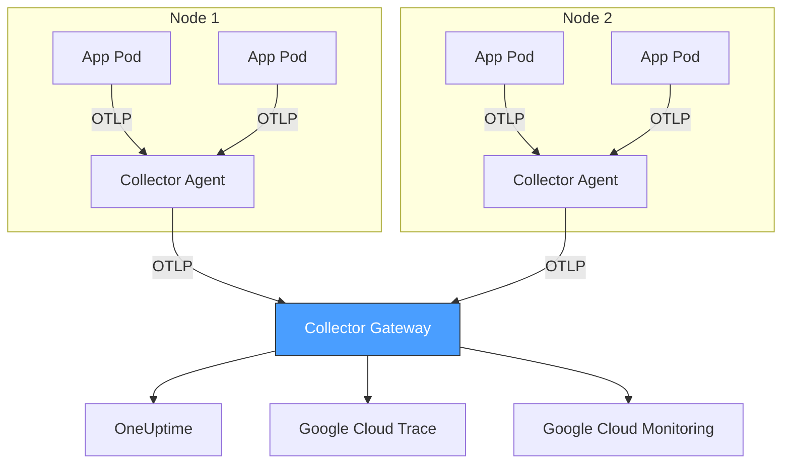

# How to Set Up OpenTelemetry on Google Kubernetes Engine (GKE)

Author: [nawazdhandala](https://www.github.com/nawazdhandala)

Tags: OpenTelemetry, GKE, Kubernetes, Google Cloud, Collector, Tracing, Metrics, Observability

Description: A hands-on guide to deploying the OpenTelemetry Collector on Google Kubernetes Engine (GKE) and instrumenting workloads for traces, metrics, and logs.

---

Google Kubernetes Engine is one of the most popular managed Kubernetes platforms, and deploying OpenTelemetry on it follows a pattern that works well for production environments. You deploy the OpenTelemetry Collector as a DaemonSet or Deployment, configure your workloads to send telemetry to it, and export the data to your observability backend.

This guide covers the full setup from creating a GKE cluster to deploying a working OpenTelemetry pipeline with instrumented applications.

## Architecture

The recommended architecture for OpenTelemetry on GKE uses two collector tiers: a DaemonSet of lightweight agent collectors on each node and a centralized gateway deployment that handles processing and export.



The agent collectors run on every node and collect telemetry from local pods. They do minimal processing and forward data to the gateway. The gateway handles batching, enrichment, and export. This two-tier setup reduces the load on your observability backend and gives you a single point to manage export configuration.

For smaller deployments, you can skip the gateway and have agents export directly. We will cover both approaches.

## Prerequisites

You need the following before starting:

- A Google Cloud project with billing enabled
- `gcloud` CLI installed and authenticated
- `kubectl` installed
- `helm` installed (version 3+)
- Basic familiarity with Kubernetes concepts

## Creating a GKE Cluster

If you do not already have a cluster, create one with Workload Identity enabled. Workload Identity is the recommended way to give pods access to Google Cloud APIs without managing service account keys.

```bash
# Create a GKE cluster with Workload Identity and the monitoring scope
gcloud container clusters create otel-demo \
  --zone us-central1-a \
  --num-nodes 3 \
  --machine-type e2-standard-4 \
  --workload-pool=$(gcloud config get-value project).svc.id.goog \
  --monitoring=SYSTEM
```

Get credentials for kubectl.

```bash
# Configure kubectl to use the new cluster
gcloud container clusters get-credentials otel-demo --zone us-central1-a
```

## Installing the OpenTelemetry Collector with Helm

The OpenTelemetry project maintains an official Helm chart that supports DaemonSet, Deployment, and StatefulSet modes. Add the Helm repo first.

```bash
# Add the OpenTelemetry Helm repository
helm repo add open-telemetry https://open-telemetry.github.io/opentelemetry-helm-charts
helm repo update
```

### Deploying the Agent DaemonSet

Create a values file for the agent collectors. These run on every node and collect telemetry from local pods using the OTLP receiver.

```yaml
# agent-values.yaml - Configuration for the DaemonSet agent collectors
mode: daemonset

# Resource limits appropriate for an agent sidecar
resources:
  limits:
    cpu: 250m
    memory: 512Mi
  requests:
    cpu: 100m
    memory: 256Mi

# The collector configuration
config:
  receivers:
    otlp:
      protocols:
        grpc:
          endpoint: 0.0.0.0:4317    # Pods send OTLP gRPC to this port
        http:
          endpoint: 0.0.0.0:4318    # Pods send OTLP HTTP to this port

    # Collect Kubernetes node and pod metrics
    kubeletstats:
      collection_interval: 30s
      auth_type: serviceAccount
      endpoint: "https://${env:K8S_NODE_NAME}:10250"
      insecure_skip_verify: true    # Required for kubelet self-signed certs
      metric_groups:
        - node
        - pod
        - container

  processors:
    batch:
      timeout: 5s
      send_batch_size: 256

    # Enrich telemetry with Kubernetes metadata
    k8sattributes:
      auth_type: serviceAccount
      extract:
        metadata:
          - k8s.namespace.name
          - k8s.deployment.name
          - k8s.pod.name
          - k8s.node.name
          - k8s.container.name
      pod_association:
        - sources:
            - from: resource_attribute
              name: k8s.pod.ip

    # Detect GCP resource attributes automatically
    resourcedetection:
      detectors: [gcp]
      timeout: 5s

    memory_limiter:
      check_interval: 1s
      limit_mib: 400
      spike_limit_mib: 100

  exporters:
    # Forward to the gateway collector
    otlp:
      endpoint: otel-gateway-collector.observability.svc.cluster.local:4317
      tls:
        insecure: true    # Cluster-internal traffic

  service:
    pipelines:
      traces:
        receivers: [otlp]
        processors: [memory_limiter, k8sattributes, resourcedetection, batch]
        exporters: [otlp]
      metrics:
        receivers: [otlp, kubeletstats]
        processors: [memory_limiter, k8sattributes, resourcedetection, batch]
        exporters: [otlp]
```

Deploy the agent DaemonSet.

```bash
# Install the agent collectors as a DaemonSet
helm install otel-agent open-telemetry/opentelemetry-collector \
  -f agent-values.yaml \
  --namespace observability \
  --create-namespace
```

### Deploying the Gateway

The gateway is a Deployment (not DaemonSet) that receives data from agents and exports to your backends.

```yaml
# gateway-values.yaml - Configuration for the centralized gateway collector
mode: deployment
replicaCount: 2    # Run two replicas for high availability

resources:
  limits:
    cpu: "1"
    memory: 2Gi
  requests:
    cpu: 500m
    memory: 1Gi

# Expose the gateway as a ClusterIP service
service:
  type: ClusterIP

config:
  receivers:
    otlp:
      protocols:
        grpc:
          endpoint: 0.0.0.0:4317
        http:
          endpoint: 0.0.0.0:4318

  processors:
    batch:
      timeout: 10s
      send_batch_size: 1024    # Larger batches for the gateway

    memory_limiter:
      check_interval: 1s
      limit_mib: 1500
      spike_limit_mib: 300

    # Filter out health check spans to reduce noise
    filter:
      error_mode: ignore
      traces:
        span:
          - 'attributes["http.target"] == "/healthz"'
          - 'attributes["http.target"] == "/readyz"'

  exporters:
    # Send to OneUptime or your preferred backend
    otlphttp:
      endpoint: "https://oneuptime.com/otlp"

    # Also export to Google Cloud Trace
    googlecloud:
      project: my-gcp-project

  service:
    pipelines:
      traces:
        receivers: [otlp]
        processors: [memory_limiter, filter, batch]
        exporters: [otlphttp, googlecloud]
      metrics:
        receivers: [otlp]
        processors: [memory_limiter, batch]
        exporters: [otlphttp]
```

Deploy the gateway.

```bash
# Install the gateway collector as a Deployment
helm install otel-gateway open-telemetry/opentelemetry-collector \
  -f gateway-values.yaml \
  --namespace observability
```

## Configuring Workloads to Send Telemetry

Your application pods need to know where to send their telemetry. The standard approach is to use environment variables that point to the local agent collector.

For the DaemonSet agent, pods can reach it via the node's host IP. Add these environment variables to your pod spec.

```yaml
# deployment.yaml - Example application deployment with OTel environment variables
apiVersion: apps/v1
kind: Deployment
metadata:
  name: my-app
  namespace: default
spec:
  replicas: 3
  selector:
    matchLabels:
      app: my-app
  template:
    metadata:
      labels:
        app: my-app
    spec:
      containers:
        - name: my-app
          image: my-app:latest
          env:
            # Service identification
            - name: OTEL_SERVICE_NAME
              value: "my-app"

            # Get the node IP to reach the DaemonSet agent
            - name: K8S_NODE_IP
              valueFrom:
                fieldRef:
                  fieldPath: status.hostIP

            # Point the OTLP exporter to the local agent on this node
            - name: OTEL_EXPORTER_OTLP_ENDPOINT
              value: "http://$(K8S_NODE_IP):4317"

            # Propagate trace context using W3C format
            - name: OTEL_PROPAGATORS
              value: "tracecontext,baggage"

            # Set the pod IP as a resource attribute for k8s correlation
            - name: OTEL_RESOURCE_ATTRIBUTES
              value: "k8s.pod.ip=$(MY_POD_IP)"
            - name: MY_POD_IP
              valueFrom:
                fieldRef:
                  fieldPath: status.podIP
```

## Setting Up Workload Identity for Google Cloud Export

If you want the gateway collector to export to Google Cloud Trace or Monitoring, it needs IAM permissions. Workload Identity lets you bind a Kubernetes service account to a Google Cloud service account.

```bash
# Create a Google Cloud service account for the collector
gcloud iam service-accounts create otel-collector \
  --display-name="OpenTelemetry Collector"

# Grant it permissions to write traces and metrics
gcloud projects add-iam-policy-binding $(gcloud config get-value project) \
  --member="serviceAccount:otel-collector@$(gcloud config get-value project).iam.gserviceaccount.com" \
  --role="roles/cloudtrace.agent"

gcloud projects add-iam-policy-binding $(gcloud config get-value project) \
  --member="serviceAccount:otel-collector@$(gcloud config get-value project).iam.gserviceaccount.com" \
  --role="roles/monitoring.metricWriter"

# Bind the Kubernetes service account to the GCP service account
gcloud iam service-accounts add-iam-policy-binding \
  otel-collector@$(gcloud config get-value project).iam.gserviceaccount.com \
  --role="roles/iam.workloadIdentityUser" \
  --member="serviceAccount:$(gcloud config get-value project).svc.id.goog[observability/otel-gateway-opentelemetry-collector]"
```

Annotate the Kubernetes service account so GKE knows about the binding.

```bash
# Annotate the collector's Kubernetes service account
kubectl annotate serviceaccount otel-gateway-opentelemetry-collector \
  --namespace observability \
  iam.gke.io/gcp-service-account=otel-collector@$(gcloud config get-value project).iam.gserviceaccount.com
```

## Verifying the Deployment

After deploying everything, verify that the collectors are running and receiving data.

```bash
# Check that agent pods are running on each node
kubectl get pods -n observability -l app.kubernetes.io/name=opentelemetry-collector

# Check gateway pods
kubectl get pods -n observability -l app.kubernetes.io/instance=otel-gateway

# View agent collector logs for incoming data
kubectl logs -n observability -l app.kubernetes.io/instance=otel-agent --tail=50

# Check the collector's internal metrics endpoint
kubectl port-forward -n observability svc/otel-gateway-opentelemetry-collector 8888:8888 &
curl http://localhost:8888/metrics | grep otelcol_receiver_accepted
```

The `otelcol_receiver_accepted_spans` metric tells you how many spans the gateway is receiving. If this number is zero, check the agent-to-gateway connectivity and your application's OTLP endpoint configuration.

## Scaling Considerations

A few things to keep in mind as you scale.

**Agent memory**: Each agent processes telemetry from all pods on its node. If you have high-throughput nodes, increase the agent's memory limit and adjust the `memory_limiter` processor accordingly.

**Gateway replicas**: The gateway should have at least two replicas for availability. For high-throughput clusters, scale the gateway horizontally. The OTLP receiver handles load balancing across replicas through the Kubernetes Service.

**Persistent queue**: If your backend has occasional downtime, enable the file-based persistent queue on the gateway exporter so spans are not lost during brief outages.

```yaml
# Add to gateway exporter configuration for durability
exporters:
  otlphttp:
    endpoint: "https://oneuptime.com/otlp"
    sending_queue:
      enabled: true
      num_consumers: 10
      queue_size: 5000
      storage: file_storage   # Persist queue to disk
```

## Summary

Setting up OpenTelemetry on GKE involves deploying collector agents as a DaemonSet on each node, optionally adding a gateway for centralized processing, and configuring your workloads to send OTLP data to the local agent. The k8sattributes and GCP resource detection processors automatically enrich all telemetry with Kubernetes and cloud metadata, making it easy to correlate issues across pods, nodes, and services. Once the pipeline is running, you can export to any combination of backends including Google Cloud native services and OTLP-compatible platforms like OneUptime.
