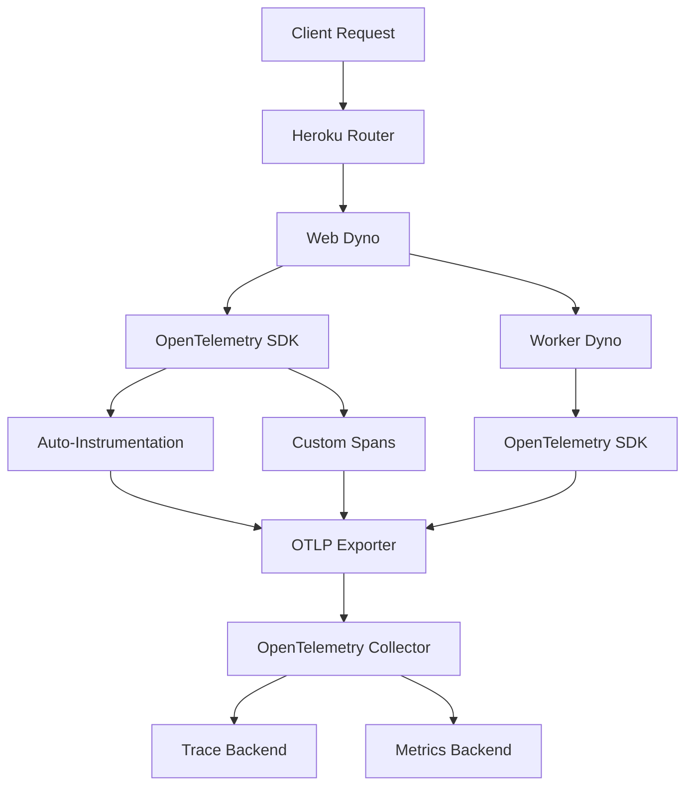

# How to Configure OpenTelemetry for Heroku Applications

Author: [nawazdhandala](https://www.github.com/nawazdhandala)

Tags: OpenTelemetry, Heroku, Observability, Node.js, Tracing, PaaS

Description: A practical guide to configuring OpenTelemetry for applications deployed on Heroku, covering auto-instrumentation, custom spans, and exporting telemetry data.

---

Heroku is still one of the most popular platforms for deploying web applications. It handles infrastructure so you can focus on code. But when something goes wrong in production, you need visibility into what your application is actually doing. That's where OpenTelemetry comes in.

OpenTelemetry gives you a vendor-neutral way to collect traces, metrics, and logs from your Heroku apps. In this guide, we'll walk through the full setup process, from installing the SDK to exporting telemetry data to a backend of your choice.

## Why OpenTelemetry on Heroku?

Heroku's ephemeral dyno architecture makes traditional monitoring tricky. Dynos restart frequently, file systems are temporary, and you don't have direct access to the underlying infrastructure. OpenTelemetry solves this by instrumenting your application code directly and shipping telemetry data to an external collector.

Here's how the data flows from your Heroku app to your observability backend:


## Prerequisites

Before getting started, make sure you have:

- A Heroku application (we'll use a Node.js example, but the concepts apply to any language)
- The Heroku CLI installed locally
- An OpenTelemetry-compatible backend (OneUptime, Jaeger, or any OTLP-compatible service)

## Installing the OpenTelemetry SDK

First, install the required OpenTelemetry packages. These packages provide the core SDK, auto-instrumentation for common libraries, and the OTLP exporter for sending data out.

```bash
# Install the core OpenTelemetry SDK and auto-instrumentation packages
npm install @opentelemetry/sdk-node \
  @opentelemetry/auto-instrumentations-node \
  @opentelemetry/exporter-trace-otlp-http \
  @opentelemetry/exporter-metrics-otlp-http \
  @opentelemetry/sdk-metrics
```

## Creating the Tracing Configuration

Create a file called `tracing.js` at the root of your project. This file initializes OpenTelemetry before your application code runs. The key here is that it must be loaded before anything else so the auto-instrumentation can patch libraries like Express, HTTP, and database drivers.

```javascript
// tracing.js - OpenTelemetry initialization for Heroku
// This file must be required before any other application code

const { NodeSDK } = require('@opentelemetry/sdk-node');
const { getNodeAutoInstrumentations } = require('@opentelemetry/auto-instrumentations-node');
const { OTLPTraceExporter } = require('@opentelemetry/exporter-trace-otlp-http');
const { OTLPMetricExporter } = require('@opentelemetry/exporter-metrics-otlp-http');
const { PeriodicExportingMetricReader } = require('@opentelemetry/sdk-metrics');
const { Resource } = require('@opentelemetry/resources');
const { ATTR_SERVICE_NAME, ATTR_DEPLOYMENT_ENVIRONMENT } = require('@opentelemetry/semantic-conventions');

// Configure the OTLP exporter to send traces to your collector
const traceExporter = new OTLPTraceExporter({
  url: process.env.OTEL_EXPORTER_OTLP_ENDPOINT + '/v1/traces',
});

// Configure metrics export on a 30-second interval
const metricReader = new PeriodicExportingMetricReader({
  exporter: new OTLPMetricExporter({
    url: process.env.OTEL_EXPORTER_OTLP_ENDPOINT + '/v1/metrics',
  }),
  exportIntervalMillis: 30000,
});

// Initialize the SDK with auto-instrumentation and resource attributes
const sdk = new NodeSDK({
  resource: new Resource({
    [ATTR_SERVICE_NAME]: process.env.OTEL_SERVICE_NAME || 'heroku-app',
    [ATTR_DEPLOYMENT_ENVIRONMENT]: process.env.NODE_ENV || 'production',
    'heroku.dyno_id': process.env.DYNO || 'unknown',
  }),
  traceExporter,
  metricReader,
  instrumentations: [
    getNodeAutoInstrumentations({
      // Disable fs instrumentation to reduce noise from Heroku's file system
      '@opentelemetry/instrumentation-fs': { enabled: false },
    }),
  ],
});

// Start the SDK and handle graceful shutdown
sdk.start();

process.on('SIGTERM', () => {
  sdk.shutdown()
    .then(() => console.log('OpenTelemetry SDK shut down successfully'))
    .catch((err) => console.error('Error shutting down OpenTelemetry SDK', err))
    .finally(() => process.exit(0));
});
```

Notice the `SIGTERM` handler. This is critical on Heroku. When a dyno restarts or scales down, Heroku sends `SIGTERM` to the process. The shutdown handler ensures any buffered telemetry data gets flushed before the process exits.

## Configuring Heroku Environment Variables

Set the required environment variables on your Heroku app. These tell the OpenTelemetry SDK where to send data and what to call your service.

```bash
# Set the endpoint for your OpenTelemetry collector
heroku config:set OTEL_EXPORTER_OTLP_ENDPOINT=https://your-collector-endpoint.example.com

# Set a meaningful service name for identifying your app in traces
heroku config:set OTEL_SERVICE_NAME=my-heroku-app

# Optional: set headers for authentication with your backend
heroku config:set OTEL_EXPORTER_OTLP_HEADERS="x-oneuptime-token=your-token-here"
```

## Updating the Procfile

Modify your `Procfile` to load the tracing configuration before your application starts. The `--require` flag tells Node.js to load and execute the tracing module first.

```
web: node --require ./tracing.js server.js
```

If you're using a framework like Next.js or a build tool, adjust accordingly:

```
web: node --require ./tracing.js node_modules/.bin/next start
```

## Adding Custom Spans

Auto-instrumentation captures HTTP requests, database queries, and other common operations automatically. But sometimes you need to trace custom business logic. Here's how to create manual spans for operations that matter to your application.

```javascript
// Adding custom spans to trace specific business operations
const { trace } = require('@opentelemetry/api');

// Get a tracer instance for your application module
const tracer = trace.getTracer('heroku-app.orders');

async function processOrder(orderId) {
  // Create a span that wraps the entire order processing flow
  return tracer.startActiveSpan('process-order', async (span) => {
    try {
      // Add attributes that help you filter and search traces later
      span.setAttribute('order.id', orderId);
      span.setAttribute('order.source', 'web');

      const result = await validateAndChargeOrder(orderId);
      span.setAttribute('order.total', result.total);

      return result;
    } catch (error) {
      // Record the error on the span so it shows up in your trace viewer
      span.recordException(error);
      span.setStatus({ code: 2, message: error.message });
      throw error;
    } finally {
      // Always end the span, even if an error occurred
      span.end();
    }
  });
}
```

## Handling Heroku-Specific Challenges

### Dyno Restarts and Data Loss

Heroku dynos restart at least once every 24 hours. This means any in-memory telemetry buffer gets wiped. To minimize data loss, configure a shorter batch export interval.

```javascript
// Use a shorter export interval to reduce data loss during dyno restarts
const traceExporter = new OTLPTraceExporter({
  url: process.env.OTEL_EXPORTER_OTLP_ENDPOINT + '/v1/traces',
});

const { BatchSpanProcessor } = require('@opentelemetry/sdk-trace-base');

// Export spans every 5 seconds instead of the default 30
const spanProcessor = new BatchSpanProcessor(traceExporter, {
  scheduledDelayMillis: 5000,
  maxExportBatchSize: 256,
});
```

### Dyno Metadata

Heroku provides a labs feature called runtime-dyno-metadata that exposes useful environment variables. Enable it to get richer resource attributes in your telemetry.

```bash
# Enable Heroku's runtime dyno metadata for richer telemetry context
heroku labs:enable runtime-dyno-metadata -a your-app-name
```

Then add those values to your resource configuration:

```javascript
// Enrich telemetry with Heroku-specific metadata
const resource = new Resource({
  [ATTR_SERVICE_NAME]: process.env.OTEL_SERVICE_NAME || 'heroku-app',
  'heroku.app.name': process.env.HEROKU_APP_NAME || 'unknown',
  'heroku.release.version': process.env.HEROKU_RELEASE_VERSION || 'unknown',
  'heroku.slug.commit': process.env.HEROKU_SLUG_COMMIT || 'unknown',
  'heroku.dyno_id': process.env.DYNO || 'unknown',
});
```

## Verifying Your Setup

Deploy your changes to Heroku and verify that telemetry data is flowing. You can check the Heroku logs to confirm the SDK initialized without errors.

```bash
# Watch the Heroku logs for OpenTelemetry-related messages
heroku logs --tail -a your-app-name | grep -i "opentelemetry\|otel\|tracing"
```

Send a few requests to your application and then check your observability backend. You should see traces showing up with span names like `GET /api/users`, `POST /api/orders`, and any custom spans you created.

## Architecture Overview

Here's the full picture of how OpenTelemetry fits into a typical Heroku deployment:



## Summary

Setting up OpenTelemetry on Heroku is straightforward once you understand the platform's constraints. The key points to remember are:

- Load the tracing configuration before your application code using `--require`
- Handle `SIGTERM` gracefully to flush telemetry before dyno shutdown
- Use shorter batch export intervals to account for dyno restarts
- Enable runtime-dyno-metadata for richer context in your traces
- Disable noisy instrumentations like `fs` that generate too many spans on Heroku

With this setup, you get full visibility into your Heroku application's behavior without being locked into any specific vendor. You can switch backends or add new ones by simply changing the exporter configuration.
