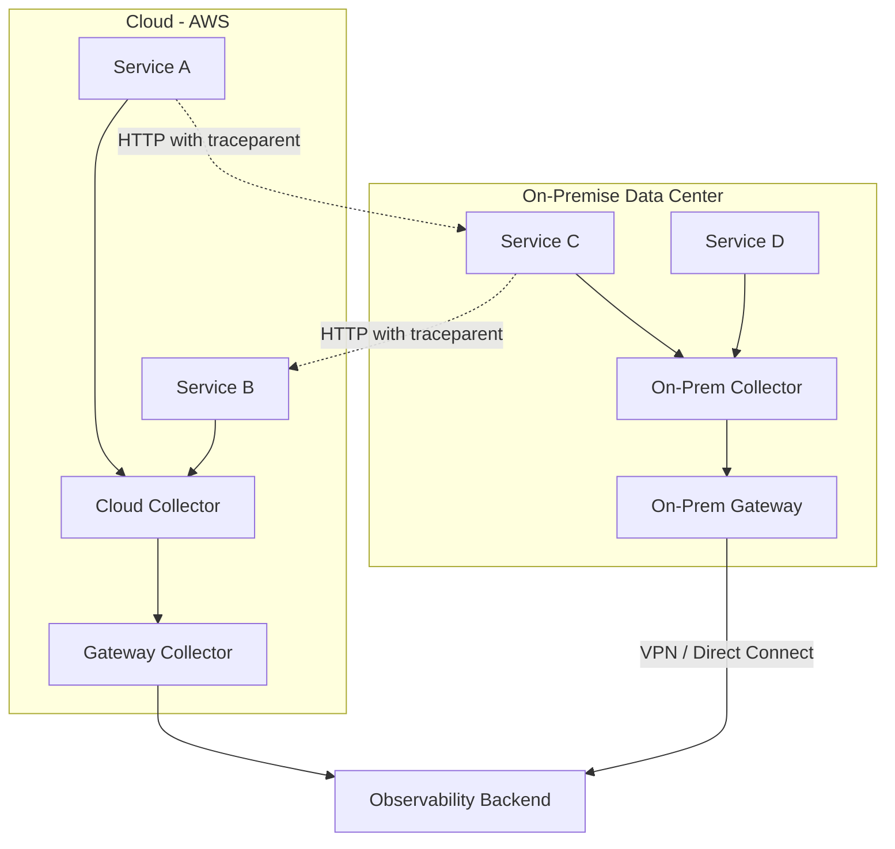

# How to Handle OpenTelemetry in Hybrid (Cloud + On-Premise) Environments

Author: [nawazdhandala](https://www.github.com/nawazdhandala)

Tags: OpenTelemetry, Hybrid Cloud, On-Premise, Multi-Cloud, Networking, Collector

Description: Learn how to deploy and configure OpenTelemetry across hybrid environments spanning cloud infrastructure and on-premise data centers.

---

Many organizations do not run entirely in the cloud. They have workloads split between cloud providers and on-premise data centers, sometimes for regulatory reasons, sometimes for latency, and sometimes because migration is still in progress. This hybrid reality creates challenges for observability. Your services in AWS need to trace requests that flow to services in your private data center. Your on-premise collectors need to export data through firewalls. And you need a unified view of the entire system regardless of where each component runs.

OpenTelemetry handles hybrid environments well because it is infrastructure-agnostic. The same SDKs, the same collector, and the same protocols work whether your service runs on a Kubernetes pod in GCP or on a bare-metal server in your data center. The challenge is in the networking, the deployment, and the configuration. This post covers the practical solutions.

## Hybrid Architecture Overview

A typical hybrid environment has workloads in at least two locations with network connectivity between them:



The key requirements are:
1. Trace context propagates between cloud and on-premise services
2. Telemetry data from both locations reaches the observability backend
3. Collector configuration is manageable across both environments
4. Network security requirements are met

## Networking Considerations

The biggest challenge in hybrid environments is network connectivity for telemetry data. On-premise services need to reach the observability backend (which may be in the cloud or SaaS), and cloud services may need to reach on-premise collectors.

### Collector as a Network Bridge

Deploy a collector in each network zone. The on-premise collector exports to a cloud collector over a secure connection:

```yaml
# on-premise-collector-config.yaml
# Collector in the on-premise data center.
# Exports to the cloud gateway collector over a VPN or direct connect link.
receivers:
  otlp:
    protocols:
      grpc:
        endpoint: 0.0.0.0:4317
      http:
        endpoint: 0.0.0.0:4318

processors:
  batch:
    timeout: 5s
    send_batch_size: 512

  resource:
    attributes:
      - key: deployment.location
        value: "on-premise-dc1"
        action: upsert
      - key: network.zone
        value: "private"
        action: insert

exporters:
  otlphttp:
    # Export to the cloud gateway over the VPN link
    endpoint: https://otel-gateway.cloud.internal:4318
    tls:
      cert_file: /etc/otel/certs/client.crt
      key_file: /etc/otel/certs/client.key
      ca_file: /etc/otel/certs/ca.crt
    # Retry aggressively since the VPN link may be unreliable
    retry_on_failure:
      enabled: true
      initial_interval: 5s
      max_interval: 60s
      max_elapsed_time: 600s
    # Use compression to reduce bandwidth over the WAN link
    compression: gzip

  # Local fallback: write to disk if the cloud gateway is unreachable
  file:
    path: /var/otel/backup/traces.json
    rotation:
      max_megabytes: 500
      max_backups: 3

service:
  pipelines:
    traces:
      receivers: [otlp]
      processors: [resource, batch]
      exporters: [otlphttp, file]
```

### Cloud Gateway Configuration

The cloud gateway collector receives from both local cloud services and the on-premise collector:

```yaml
# cloud-gateway-collector-config.yaml
# Gateway collector in the cloud that receives from all locations.
receivers:
  otlp:
    protocols:
      grpc:
        endpoint: 0.0.0.0:4317
        tls:
          cert_file: /etc/otel/certs/server.crt
          key_file: /etc/otel/certs/server.key
          client_ca_file: /etc/otel/certs/ca.crt
      http:
        endpoint: 0.0.0.0:4318
        tls:
          cert_file: /etc/otel/certs/server.crt
          key_file: /etc/otel/certs/server.key
          client_ca_file: /etc/otel/certs/ca.crt

processors:
  batch:
    timeout: 5s
    send_batch_size: 1024

  resource:
    attributes:
      - key: collector.location
        value: "cloud-gateway"
        action: insert

exporters:
  otlphttp:
    endpoint: https://oneuptime.com/otlp

service:
  pipelines:
    traces:
      receivers: [otlp]
      processors: [resource, batch]
      exporters: [otlphttp]
```

## Context Propagation Across Boundaries

Trace context propagation between cloud and on-premise services works the same as between any two services. The `traceparent` header flows in HTTP requests. The only potential issue is if you have proxies or firewalls that strip non-standard headers.

Configure your network infrastructure to pass through the trace headers:

```nginx
# NGINX proxy configuration that preserves trace context headers.
# This is needed when a reverse proxy sits between cloud and on-prem.
server {
    listen 443 ssl;

    location / {
        proxy_pass http://backend-service:8080;

        # Preserve OpenTelemetry trace context headers
        proxy_pass_header traceparent;
        proxy_pass_header tracestate;
        proxy_pass_header baggage;

        # Also preserve any vendor-specific headers
        proxy_set_header traceparent $http_traceparent;
        proxy_set_header tracestate $http_tracestate;
        proxy_set_header baggage $http_baggage;
    }
}
```

## Handling Network Unreliability

The link between cloud and on-premise environments is less reliable than local networking. Configure the collector to handle intermittent connectivity:

```yaml
# Exporters configured for unreliable network links.
# Retry with exponential backoff and buffer to disk.
exporters:
  otlphttp:
    endpoint: https://otel-gateway.cloud.internal:4318
    retry_on_failure:
      enabled: true
      initial_interval: 5s
      max_interval: 120s
      max_elapsed_time: 1800s  # Keep trying for 30 minutes

    sending_queue:
      enabled: true
      num_consumers: 10
      queue_size: 10000
      # Persist the queue to disk so data survives collector restarts
      storage: file_storage

extensions:
  file_storage:
    directory: /var/otel/queue
    timeout: 10s
    compaction:
      on_start: true
      directory: /var/otel/queue/compact
```

The persistent queue ensures that if the network link goes down for minutes or even hours, the telemetry data is buffered to disk and sent when connectivity is restored. No data is lost.

## On-Premise Deployment Without Kubernetes

Many on-premise environments do not run Kubernetes. Deploy the collector as a systemd service:

```ini
# /etc/systemd/system/otel-collector.service
# Systemd unit for the OpenTelemetry Collector on bare-metal servers.
[Unit]
Description=OpenTelemetry Collector
After=network-online.target
Wants=network-online.target

[Service]
Type=simple
ExecStart=/usr/local/bin/otelcol-contrib --config /etc/otel/config.yaml
Restart=always
RestartSec=5
User=otel
Group=otel

# Resource limits
MemoryMax=2G
CPUQuota=200%

# Security hardening
NoNewPrivileges=true
ProtectSystem=strict
ProtectHome=true
ReadWritePaths=/var/otel

[Install]
WantedBy=multi-user.target
```

Install and manage the collector configuration:

```bash
# Install the collector on a bare-metal server
#!/bin/bash

VERSION="0.96.0"
ARCH="linux_amd64"

# Download the collector binary
curl -L -o /usr/local/bin/otelcol-contrib \
  "https://github.com/open-telemetry/opentelemetry-collector-releases/releases/download/v${VERSION}/otelcol-contrib_${VERSION}_${ARCH}"

chmod +x /usr/local/bin/otelcol-contrib

# Create the otel user and directories
useradd --system --no-create-home otel
mkdir -p /etc/otel /var/otel/queue /var/otel/backup
chown -R otel:otel /var/otel

# Copy the configuration
cp on-premise-collector-config.yaml /etc/otel/config.yaml

# Enable and start the service
systemctl daemon-reload
systemctl enable otel-collector
systemctl start otel-collector
```

## Service Discovery in Hybrid Environments

In Kubernetes, the collector is accessible through a Service DNS name. On bare metal, services need to know the collector's IP or hostname. Use environment variables consistently:

```bash
# On-premise service configuration.
# The collector address is set via environment variable,
# same as in Kubernetes but with a different value.
export OTEL_EXPORTER_OTLP_ENDPOINT="http://otel-collector.dc1.internal:4318"
export OTEL_SERVICE_NAME="legacy-billing-service"
export OTEL_RESOURCE_ATTRIBUTES="deployment.location=on-premise-dc1,deployment.environment=production"
```

For services that cannot use environment variables (legacy applications), configure the on-premise collector to scrape metrics or accept logs from traditional sources:

```yaml
# On-premise collector configured to receive from legacy sources.
# This bridges legacy monitoring into the OpenTelemetry pipeline.
receivers:
  otlp:
    protocols:
      http:
        endpoint: 0.0.0.0:4318

  # Scrape Prometheus metrics from legacy services
  prometheus:
    config:
      scrape_configs:
        - job_name: "legacy-services"
          static_configs:
            - targets: ["legacy-app-1:9090", "legacy-app-2:9090"]

  # Receive syslog from legacy applications
  syslog:
    udp:
      listen_address: 0.0.0.0:514
    protocol: rfc5424
```

## Unified Resource Attributes

Use resource attributes to identify where each service runs. This lets you filter and group telemetry by location in your backend:

```yaml
# Standard resource attributes for location identification.
# Every service should include these regardless of where it runs.
resource_attributes:
  # Cloud services
  cloud:
    deployment.location: "aws-us-east-1"
    cloud.provider: "aws"
    cloud.region: "us-east-1"

  # On-premise services
  on_premise:
    deployment.location: "dc1-us-east"
    network.zone: "private"
    data_center.name: "dc1"
    data_center.rack: "r12"
```

## Conclusion

Hybrid environments add networking and deployment complexity to your OpenTelemetry setup, but the core architecture remains the same: SDKs send to local collectors, collectors forward to gateways, and gateways export to backends. The key additions for hybrid are mTLS between collectors crossing network boundaries, persistent queues for handling WAN unreliability, and systemd-based deployment for non-Kubernetes environments. With these pieces in place, you get unified observability across cloud and on-premise regardless of where each service runs.
