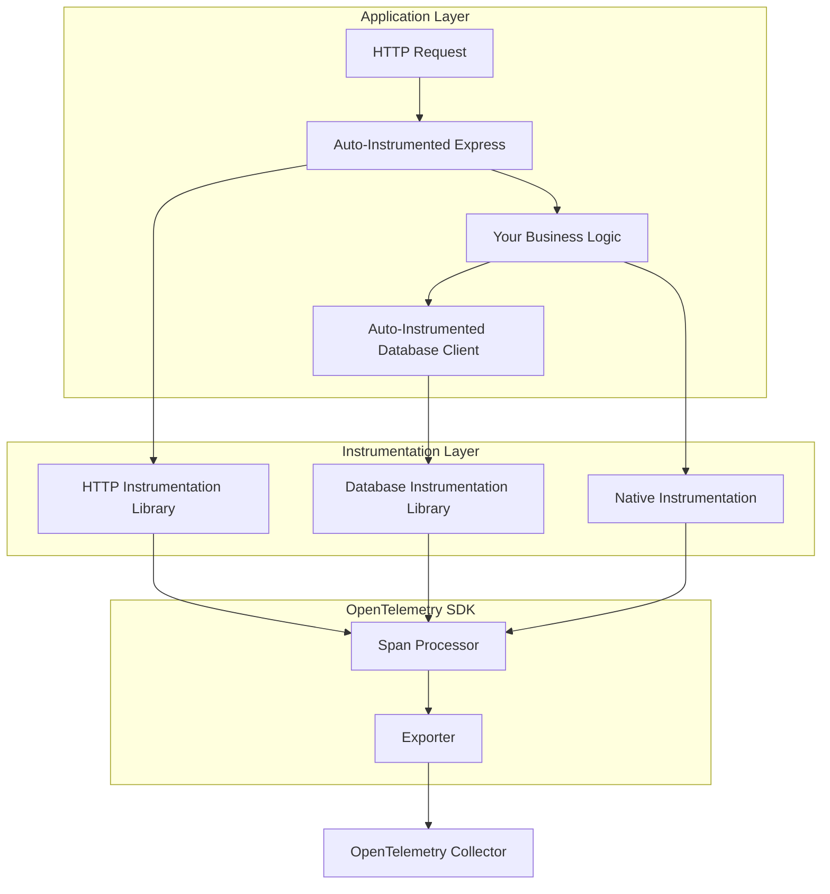

# How to Understand OpenTelemetry Instrumentation Libraries vs Native Instrumentation

Author: [nawazdhandala](https://www.github.com/nawazdhandala)

Tags: OpenTelemetry, Instrumentation, Libraries, Auto-Instrumentation, Manual Instrumentation

Description: A comprehensive guide to understanding the differences between OpenTelemetry instrumentation libraries and native instrumentation, including when to use each approach.

When implementing observability in your applications, one of the first decisions you'll face is choosing between OpenTelemetry instrumentation libraries and native instrumentation. This choice significantly impacts your development workflow, maintenance burden, and the flexibility of your observability solution.

## What is Native Instrumentation?

Native instrumentation refers to adding telemetry directly into your application code using the OpenTelemetry SDK. You manually create spans, add attributes, record metrics, and emit logs at specific points in your code. This approach gives you complete control over what data gets collected and when.

Here's a basic example of native instrumentation in a Node.js application:

```javascript
// Import the OpenTelemetry SDK components
const { trace } = require('@opentelemetry/api');
const tracer = trace.getTracer('my-application', '1.0.0');

async function processOrder(orderId) {
  // Manually create a span to track this operation
  const span = tracer.startSpan('process-order');

  try {
    // Add custom attributes to provide context
    span.setAttribute('order.id', orderId);
    span.setAttribute('order.processor', 'main-handler');

    // Your business logic here
    const order = await fetchOrder(orderId);
    span.setAttribute('order.amount', order.total);

    await validateOrder(order);
    await chargeCustomer(order);
    await fulfillOrder(order);

    // Mark the operation as successful
    span.setStatus({ code: SpanStatusCode.OK });
    return order;
  } catch (error) {
    // Capture error information in the span
    span.recordException(error);
    span.setStatus({
      code: SpanStatusCode.ERROR,
      message: error.message
    });
    throw error;
  } finally {
    // Always end the span to ensure it's exported
    span.end();
  }
}
```

Native instrumentation requires you to understand exactly where telemetry should be added. You need to know your application's critical paths, potential failure points, and the context that would be valuable during troubleshooting.

## What are OpenTelemetry Instrumentation Libraries?

Instrumentation libraries are pre-built packages that automatically add telemetry to common frameworks and libraries without requiring code changes. These libraries hook into the framework's lifecycle and automatically create spans, add relevant attributes, and propagate context.

The OpenTelemetry ecosystem includes instrumentation libraries for hundreds of popular frameworks:

- Web frameworks: Express, FastAPI, Django, Spring Boot
- HTTP clients: fetch, axios, requests, RestTemplate
- Database clients: PostgreSQL, MongoDB, Redis, MySQL
- Message queues: RabbitMQ, Kafka, AWS SQS
- RPC frameworks: gRPC, Thrift

Here's how you would add automatic instrumentation to an Express application:

```javascript
// Set up auto-instrumentation before importing your application code
const { NodeSDK } = require('@opentelemetry/sdk-node');
const { getNodeAutoInstrumentations } = require('@opentelemetry/auto-instrumentations-node');

// Initialize the SDK with auto-instrumentation
const sdk = new NodeSDK({
  instrumentations: [
    getNodeAutoInstrumentations({
      // Configure which instrumentations to enable
      '@opentelemetry/instrumentation-http': {
        enabled: true,
        // Ignore health check endpoints
        ignoreIncomingPaths: ['/health', '/readiness']
      },
      '@opentelemetry/instrumentation-express': {
        enabled: true
      },
      '@opentelemetry/instrumentation-mongodb': {
        enabled: true,
        // Enhance database spans with query information
        enhancedDatabaseReporting: true
      }
    })
  ]
});

sdk.start();

// Now import and start your application
const express = require('express');
const app = express();

// All routes automatically get traced without any additional code
app.get('/api/orders/:id', async (req, res) => {
  const order = await db.orders.findOne({ id: req.params.id });
  res.json(order);
});
```

With this setup, every HTTP request, database query, and middleware execution automatically generates spans without touching your application logic.

## Key Differences Between the Approaches

### Development Speed and Maintenance

Instrumentation libraries dramatically reduce the time needed to get basic observability running. You can instrument an entire Express application in minutes rather than hours. Maintenance is also simpler because updates to the instrumentation library automatically provide new features and bug fixes.

Native instrumentation requires more upfront work and ongoing maintenance. Every new endpoint, database query, or external service call needs manual instrumentation. However, this gives you precise control over the signal-to-noise ratio in your telemetry data.

### Granularity and Context

Instrumentation libraries provide consistent, framework-level telemetry. For an HTTP request, you'll get information about the method, path, status code, and duration. For database queries, you'll see the operation type and potentially the query itself.

Native instrumentation allows you to capture business-specific context that instrumentation libraries cannot know about. You can add attributes like customer tier, feature flags, A/B test variants, or calculated business metrics:

```javascript
// Instrumentation libraries capture technical details
// Native instrumentation captures business context
const span = tracer.startSpan('checkout');
span.setAttribute('customer.tier', user.subscriptionTier);
span.setAttribute('cart.value', cart.total);
span.setAttribute('promotion.applied', cart.promoCode);
span.setAttribute('inventory.location', warehouse.region);
```

This business context makes traces far more valuable when debugging production issues because you can filter and analyze based on real-world conditions.

### Performance Characteristics

Instrumentation libraries add overhead to every instrumented operation. While this overhead is typically minimal (microseconds), it applies broadly across your application. Some libraries offer configuration options to reduce overhead by sampling or filtering spans.

Native instrumentation has overhead only where you explicitly add it. You can optimize performance by instrumenting only critical paths and avoiding instrumentation in hot loops or high-throughput operations.

### Flexibility and Customization

Instrumentation libraries follow conventions defined by the OpenTelemetry semantic conventions. This standardization makes it easier to build dashboards and alerts that work across multiple services, but it limits customization.

Native instrumentation provides complete flexibility. You can structure your spans however makes sense for your application, create custom metric dimensions, and add any attributes you want:

```python
# Native instrumentation with custom span hierarchy
from opentelemetry import trace

tracer = trace.get_tracer(__name__)

def process_payment(order):
    # Create a parent span for the entire payment flow
    with tracer.start_as_current_span("payment.process") as payment_span:
        payment_span.set_attribute("payment.amount", order.total)
        payment_span.set_attribute("payment.currency", order.currency)

        # Create child spans for sub-operations
        with tracer.start_as_current_span("payment.validate") as validate_span:
            validate_payment_method(order.payment_method)
            validate_span.set_attribute("validation.passed", True)

        with tracer.start_as_current_span("payment.authorize") as auth_span:
            auth_response = payment_gateway.authorize(order)
            auth_span.set_attribute("auth.transaction_id", auth_response.id)
            auth_span.set_attribute("auth.provider", payment_gateway.name)

        with tracer.start_as_current_span("payment.capture") as capture_span:
            capture_payment(auth_response)
            capture_span.set_attribute("capture.confirmed", True)
```

## The Hybrid Approach: Best of Both Worlds

Most production systems benefit from combining both approaches. Use instrumentation libraries as your foundation for automatic, consistent telemetry across common frameworks. Then layer native instrumentation on top to capture business-specific context and critical operations.

Here's a practical architecture diagram showing how both approaches work together:



Here's a concrete example of this hybrid approach:

```go
// Go application with hybrid instrumentation
package main

import (
    "context"
    "net/http"

    "go.opentelemetry.io/contrib/instrumentation/net/http/otelhttp"
    "go.opentelemetry.io/otel"
    "go.opentelemetry.io/otel/attribute"
    "go.opentelemetry.io/otel/trace"
)

var tracer = otel.Tracer("order-service")

func main() {
    // Use instrumentation library for automatic HTTP tracing
    handler := otelhttp.NewHandler(http.HandlerFunc(handleOrder), "order-handler")
    http.Handle("/orders", handler)
    http.ListenAndServe(":8080", nil)
}

func handleOrder(w http.ResponseWriter, r *http.Request) {
    ctx := r.Context()

    // Add native instrumentation for business operations
    ctx, span := tracer.Start(ctx, "validate-order")

    // Capture business-specific attributes
    orderType := r.Header.Get("X-Order-Type")
    span.SetAttributes(
        attribute.String("order.type", orderType),
        attribute.Bool("order.priority", orderType == "express"),
    )

    // Your validation logic here
    valid := validateOrder(ctx, r)
    span.SetAttributes(attribute.Bool("validation.result", valid))
    span.End()

    if !valid {
        http.Error(w, "Invalid order", http.StatusBadRequest)
        return
    }

    // Process the order with more native instrumentation
    processOrderInternal(ctx, r)
    w.WriteHeader(http.StatusOK)
}

func processOrderInternal(ctx context.Context, r *http.Request) {
    // Create custom spans for complex business logic
    ctx, span := tracer.Start(ctx, "process-order-internal")
    defer span.End()

    // Add rich business context
    span.SetAttributes(
        attribute.String("customer.id", r.Header.Get("X-Customer-ID")),
        attribute.String("warehouse.region", selectWarehouse(r)),
        attribute.Int("inventory.check", 1),
    )

    // Business logic here
}
```

## When to Choose Each Approach

Use instrumentation libraries when:

- You're starting a new observability implementation
- You want consistent telemetry across multiple services
- You're instrumenting standard frameworks and libraries
- Development speed is a priority
- Your team has limited OpenTelemetry expertise

Use native instrumentation when:

- You need to capture business-specific context
- Performance optimization is critical
- You're working with custom frameworks or internal libraries
- You need precise control over what gets instrumented
- Standard instrumentation doesn't provide enough detail

Use a hybrid approach when:

- You're running production systems (almost always)
- You need both broad coverage and deep insights
- You want to balance development speed with customization
- You're building a mature observability practice

## Practical Considerations

### Testing and Development

Instrumentation libraries can complicate local development because they generate telemetry for every operation. Configure them to be easily disabled or to export to local collectors during development:

```javascript
// Development-friendly configuration
const sdk = new NodeSDK({
  instrumentations: getNodeAutoInstrumentations(),
  // Only enable in production
  enabled: process.env.NODE_ENV === 'production'
});
```

Native instrumentation is easier to test because you control when spans are created. Write unit tests that verify your instrumentation emits the expected spans and attributes.

### Performance Monitoring

Always measure the performance impact of your instrumentation. Both approaches add overhead, but the impact varies based on your application's characteristics:

```python
# Add performance monitoring to your instrumentation
import time
from opentelemetry import trace

tracer = trace.get_tracer(__name__)

def monitored_operation():
    start_time = time.time()

    with tracer.start_as_current_span("operation") as span:
        result = expensive_operation()

        duration = time.time() - start_time
        # Track instrumentation overhead
        span.set_attribute("operation.duration_ms", duration * 1000)

        return result
```

### Migration Strategy

When moving from one approach to another, do it incrementally. Start with instrumentation libraries for quick wins, then identify high-value areas for native instrumentation. Or begin with native instrumentation and gradually adopt libraries as they mature.

Understanding the tradeoffs between OpenTelemetry instrumentation libraries and native instrumentation helps you make informed decisions about your observability strategy. Most successful implementations use both approaches strategically, leveraging the strengths of each to build comprehensive, maintainable observability solutions.

For more context on OpenTelemetry fundamentals, check out our guide on [the three pillars of observability](https://oneuptime.com/blog/post/2025-08-20-three-pillars-of-observability-logs-metrics-traces/view) and [what is an OpenTelemetry Collector and why use one](https://oneuptime.com/blog/post/2025-09-18-what-is-opentelemetry-collector-and-why-use-one/view).
