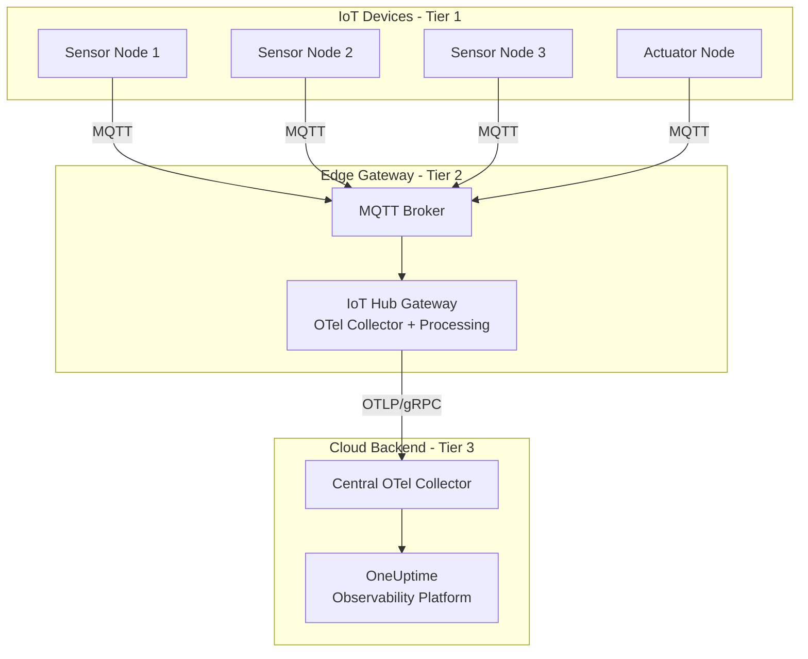

# How to Set Up OpenTelemetry for IoT Hub and Edge Device Pipelines

Author: [nawazdhandala](https://www.github.com/nawazdhandala)

Tags: OpenTelemetry, IoT, Edge Computing, Azure IoT Hub, MQTT, Telemetry Pipelines, Observability

Description: Learn how to build an OpenTelemetry pipeline that connects IoT edge devices through hub gateways to a central observability backend with practical examples.

---

IoT systems are some of the hardest environments to observe. You have hundreds or thousands of devices spread across physical locations, communicating through hub gateways, processing data at the edge, and forwarding results to the cloud. When something goes wrong, the failure could be in the device firmware, the edge gateway, the network, or the cloud backend. Without end-to-end tracing, finding the root cause is like searching in the dark.

OpenTelemetry can bridge these gaps. This guide shows you how to build a telemetry pipeline that spans from constrained IoT devices through edge gateway hubs all the way to a central observability platform.

## IoT Observability Architecture

The typical IoT architecture has three tiers, and each one needs a different approach to instrumentation:



Tier 1 devices are often too constrained for a full OpenTelemetry SDK. They might run on microcontrollers with kilobytes of RAM. Tier 2 edge gateways have more resources and serve as the translation layer. Tier 3 is your cloud infrastructure where the full observability stack lives.

## Instrumenting IoT Devices with Lightweight Telemetry

Most IoT devices cannot run an OpenTelemetry SDK. Instead, you embed lightweight telemetry into the data they already send. The approach is to include trace context and structured metadata in your MQTT messages:

```python
# iot_device.py
# Lightweight telemetry for a Python-based IoT sensor device
# Designed for devices like Raspberry Pi or similar single-board computers

import json
import time
import uuid
import paho.mqtt.client as mqtt

class DeviceTelemetry:
    """Lightweight telemetry wrapper for IoT devices.
    Embeds trace context in MQTT messages without requiring
    the full OpenTelemetry SDK."""

    def __init__(self, device_id: str, broker_host: str, broker_port: int = 1883):
        self.device_id = device_id
        self.client = mqtt.Client(client_id=device_id)
        self.client.connect(broker_host, broker_port)
        self.client.loop_start()

    def generate_trace_id(self) -> str:
        """Generate a W3C-compatible 32-character hex trace ID."""
        return uuid.uuid4().hex

    def generate_span_id(self) -> str:
        """Generate a W3C-compatible 16-character hex span ID."""
        return uuid.uuid4().hex[:16]

    def send_reading(self, topic: str, sensor_data: dict) -> None:
        """Publish a sensor reading with embedded trace context."""
        trace_id = self.generate_trace_id()
        span_id = self.generate_span_id()

        # Wrap the sensor data with trace context and device metadata
        message = {
            "data": sensor_data,
            "trace_context": {
                "trace_id": trace_id,
                "span_id": span_id,
                "span_name": "device.reading",
                "timestamp_ns": int(time.time() * 1e9),
            },
            "device": {
                "id": self.device_id,
                "type": "temperature_sensor",
                "firmware_version": "2.1.0",
                "location": "building-a-floor-3",
            },
        }

        # Publish to the MQTT broker on the edge gateway
        self.client.publish(
            topic,
            json.dumps(message),
            qos=1,  # At least once delivery
        )

    def send_health_check(self) -> None:
        """Publish device health metrics as structured telemetry."""
        import psutil  # Only available on Linux-based IoT devices

        health = {
            "data": {
                "cpu_percent": psutil.cpu_percent(),
                "memory_percent": psutil.virtual_memory().percent,
                "disk_percent": psutil.disk_usage("/").percent,
                "uptime_seconds": time.time() - psutil.boot_time(),
            },
            "trace_context": {
                "trace_id": self.generate_trace_id(),
                "span_id": self.generate_span_id(),
                "span_name": "device.health_check",
                "timestamp_ns": int(time.time() * 1e9),
            },
            "device": {
                "id": self.device_id,
                "type": "temperature_sensor",
            },
        }

        self.client.publish(
            f"devices/{self.device_id}/health",
            json.dumps(health),
            qos=0,  # Best effort for health checks
        )


# Usage example
if __name__ == "__main__":
    device = DeviceTelemetry(
        device_id="sensor-bldg-a-301",
        broker_host="edge-gateway.local",
    )

    while True:
        # Read sensor data (simplified)
        reading = {"temperature_c": 22.5, "humidity_pct": 45.0}
        device.send_reading("devices/sensor-bldg-a-301/readings", reading)
        device.send_health_check()
        time.sleep(30)  # Report every 30 seconds
```

The key idea is that the device does not need to speak OTLP. It includes trace context (trace ID, span ID, timestamps) in its MQTT messages. The edge gateway will extract this context and convert it into proper OpenTelemetry spans.

## Edge Gateway: MQTT to OpenTelemetry Bridge

The edge gateway runs an MQTT broker and a service that subscribes to device messages, converts them into OpenTelemetry spans and metrics, and forwards them to a collector. This is the critical translation layer:

```python
# gateway_bridge.py
# Edge gateway service that converts MQTT device messages
# into OpenTelemetry spans and metrics

import json
import paho.mqtt.client as mqtt
from opentelemetry import trace, metrics
from opentelemetry.sdk.trace import TracerProvider
from opentelemetry.sdk.trace.export import BatchSpanExporter
from opentelemetry.sdk.metrics import MeterProvider
from opentelemetry.sdk.metrics.export import PeriodicExportingMetricReader
from opentelemetry.exporter.otlp.proto.grpc.trace_exporter import OTLPSpanExporter
from opentelemetry.exporter.otlp.proto.grpc.metric_exporter import OTLPMetricExporter
from opentelemetry.sdk.resources import Resource
from opentelemetry.trace import SpanContext, TraceFlags, NonRecordingSpan
from opentelemetry.context import Context

# Configure the OpenTelemetry SDK on the gateway
resource = Resource.create({
    "service.name": "iot-edge-gateway",
    "service.version": "1.0.0",
    "deployment.environment": "production",
    "host.name": "edge-gw-building-a",
})

# Set up trace exporter pointing to a central collector
trace_exporter = OTLPSpanExporter(
    endpoint="central-collector.example.com:4317",
    insecure=False,
)
trace_provider = TracerProvider(resource=resource)
trace_provider.add_span_processor(BatchSpanExporter(trace_exporter))
trace.set_tracer_provider(trace_provider)

# Set up metrics exporter
metric_exporter = OTLPMetricExporter(
    endpoint="central-collector.example.com:4317",
    insecure=False,
)
metric_reader = PeriodicExportingMetricReader(
    metric_exporter,
    export_interval_millis=30000,  # Export metrics every 30 seconds
)
meter_provider = MeterProvider(resource=resource, metric_readers=[metric_reader])
metrics.set_meter_provider(meter_provider)

tracer = trace.get_tracer("iot-gateway-bridge")
meter = metrics.get_meter("iot-gateway-metrics")

# Create metrics for monitoring the device fleet
device_reading_counter = meter.create_counter(
    "iot.device.readings.total",
    description="Total sensor readings received from devices",
)
device_latency_histogram = meter.create_histogram(
    "iot.device.message_latency_ms",
    description="Latency between device reading and gateway receipt",
)
device_health_gauge = meter.create_up_down_counter(
    "iot.device.health.active",
    description="Number of active healthy devices",
)


def on_message(client, userdata, msg):
    """Handle incoming MQTT messages from IoT devices."""
    try:
        payload = json.loads(msg.payload.decode())
        topic = msg.topic

        if "/readings" in topic:
            process_reading(payload, topic)
        elif "/health" in topic:
            process_health(payload, topic)
    except Exception as e:
        print(f"Error processing message: {e}")


def process_reading(payload: dict, topic: str):
    """Convert a device sensor reading into an OpenTelemetry span."""
    device_info = payload.get("device", {})
    trace_ctx = payload.get("trace_context", {})
    sensor_data = payload.get("data", {})

    # Reconstruct the device's trace context to link spans
    device_trace_id = trace_ctx.get("trace_id", "")
    device_span_id = trace_ctx.get("span_id", "")

    if device_trace_id and device_span_id:
        # Create a span context from the device's trace info
        parent_context = SpanContext(
            trace_id=int(device_trace_id, 16),
            span_id=int(device_span_id, 16),
            is_remote=True,
            trace_flags=TraceFlags(0x01),
        )
        parent_span = NonRecordingSpan(parent_context)
        ctx = trace.set_span_in_context(parent_span)
    else:
        ctx = Context()

    # Create a gateway processing span linked to the device span
    with tracer.start_as_current_span(
        "gateway.process_reading",
        context=ctx,
        attributes={
            "device.id": device_info.get("id", "unknown"),
            "device.type": device_info.get("type", "unknown"),
            "device.firmware": device_info.get("firmware_version", "unknown"),
            "device.location": device_info.get("location", "unknown"),
            "mqtt.topic": topic,
        },
    ) as span:
        # Add sensor data as span attributes
        for key, value in sensor_data.items():
            span.set_attribute(f"sensor.{key}", value)

        # Calculate message latency (device timestamp vs gateway receipt)
        device_ts = trace_ctx.get("timestamp_ns", 0)
        if device_ts:
            import time
            latency_ms = (time.time_ns() - device_ts) / 1_000_000
            span.set_attribute("message.latency_ms", latency_ms)
            device_latency_histogram.record(latency_ms, {
                "device.id": device_info.get("id", "unknown"),
            })

        # Increment reading counter
        device_reading_counter.add(1, {
            "device.id": device_info.get("id", "unknown"),
            "device.type": device_info.get("type", "unknown"),
            "sensor.type": list(sensor_data.keys())[0] if sensor_data else "unknown",
        })


def process_health(payload: dict, topic: str):
    """Convert device health data into OpenTelemetry metrics."""
    device_info = payload.get("device", {})
    health_data = payload.get("data", {})

    with tracer.start_as_current_span(
        "gateway.process_health",
        attributes={
            "device.id": device_info.get("id", "unknown"),
        },
    ) as span:
        for key, value in health_data.items():
            span.set_attribute(f"device.health.{key}", value)


# Set up MQTT client and subscribe to device topics
mqtt_client = mqtt.Client(client_id="edge-gateway-bridge")
mqtt_client.on_message = on_message
mqtt_client.connect("localhost", 1883)

# Subscribe to all device topics
mqtt_client.subscribe("devices/+/readings", qos=1)
mqtt_client.subscribe("devices/+/health", qos=0)

print("IoT Gateway Bridge started. Listening for device messages...")
mqtt_client.loop_forever()
```

This bridge service does the heavy lifting. It takes the lightweight trace context from MQTT messages, reconstructs proper OpenTelemetry span contexts, and creates linked spans that show the full journey from device through gateway to backend.

## Collector Configuration on the Edge Gateway

The edge gateway also runs an OpenTelemetry Collector that receives spans from the bridge service and forwards them to the central collector. This collector handles buffering during network outages and adds gateway-level metadata:

```yaml
# gateway-collector-config.yaml
# OpenTelemetry Collector configuration for the IoT edge gateway

receivers:
  otlp:
    protocols:
      grpc:
        endpoint: 127.0.0.1:4317

processors:
  # Add gateway identity to all telemetry
  resource:
    attributes:
      - key: gateway.id
        value: edge-gw-building-a
        action: upsert
      - key: gateway.region
        value: us-east-1
        action: upsert

  # Limit memory on resource-constrained gateway hardware
  memory_limiter:
    check_interval: 5s
    limit_mib: 256
    spike_limit_mib: 64

  # Batch for efficient network usage
  batch:
    timeout: 15s
    send_batch_size: 200

  # Filter out noisy health checks if they are too frequent
  filter:
    spans:
      exclude:
        match_type: strict
        span_names:
          - "device.health_check_internal"

exporters:
  otlp:
    endpoint: central-collector.example.com:4317
    tls:
      insecure: false
    compression: gzip
    retry_on_failure:
      enabled: true
      initial_interval: 10s
      max_interval: 300s
    sending_queue:
      enabled: true
      # Buffer up to 1000 batches during network outages
      queue_size: 1000
      storage: file_storage

  # Local file fallback for network outages
  file:
    path: /var/otel/gateway-buffer.json
    rotation:
      max_megabytes: 50
      max_backups: 5

extensions:
  # Persistent queue storage to survive gateway restarts
  file_storage:
    directory: /var/otel/storage
    timeout: 10s

service:
  extensions: [file_storage]
  pipelines:
    traces:
      receivers: [otlp]
      processors: [memory_limiter, resource, filter, batch]
      exporters: [otlp]
    metrics:
      receivers: [otlp]
      processors: [memory_limiter, resource, batch]
      exporters: [otlp]
```

The persistent queue with file storage is especially important for IoT gateways. These devices often have intermittent connectivity, and you do not want to lose telemetry data during network interruptions. The file storage extension saves queued data to disk so it survives both network outages and gateway restarts.

## Central Collector: Aggregation and Enrichment

The central collector receives telemetry from all edge gateways and enriches it before sending it to your observability backend:

```yaml
# central-collector-config.yaml
# Central OpenTelemetry Collector that aggregates telemetry from all gateways

receivers:
  otlp:
    protocols:
      grpc:
        endpoint: 0.0.0.0:4317
      http:
        endpoint: 0.0.0.0:4318

processors:
  batch:
    timeout: 5s
    send_batch_size: 512

  # Enrich spans with fleet-level metadata
  attributes:
    actions:
      - key: fleet.name
        value: building-sensors-prod
        action: upsert

  # Group spans by gateway for fleet-level dashboards
  groupbyattrs:
    keys:
      - gateway.id
      - device.type

exporters:
  otlp:
    endpoint: your-oneuptime-endpoint.example.com:4317

service:
  pipelines:
    traces:
      receivers: [otlp]
      processors: [attributes, groupbyattrs, batch]
      exporters: [otlp]
    metrics:
      receivers: [otlp]
      processors: [attributes, batch]
      exporters: [otlp]
```

## For Extremely Constrained Devices

Some IoT devices run on microcontrollers with only kilobytes of RAM. These cannot run Python or use structured JSON. For these devices, you take a different approach: the edge gateway creates spans on behalf of the device based on protocol-level observations.

```python
# micro_device_observer.py
# Creates OpenTelemetry spans for microcontroller devices
# by observing their MQTT connection patterns and message timing

from opentelemetry import trace

tracer = trace.get_tracer("micro-device-observer")

def observe_device_message(device_id: str, topic: str, payload: bytes, arrival_time_ns: int):
    """Create a span representing a microcontroller device's activity.
    The device itself has no instrumentation. The gateway infers
    behavior from message patterns."""
    with tracer.start_as_current_span(
        "micro_device.message",
        attributes={
            "device.id": device_id,
            "device.class": "microcontroller",
            "mqtt.topic": topic,
            "message.size_bytes": len(payload),
            "message.arrival_time_ns": arrival_time_ns,
        },
    ) as span:
        # Parse the raw payload based on known device protocol
        # Each device type has its own binary format
        try:
            parsed = parse_device_protocol(device_id, payload)
            for key, value in parsed.items():
                span.set_attribute(f"reading.{key}", value)
        except Exception as e:
            span.set_attribute("parse.error", str(e))
            span.set_status(trace.StatusCode.ERROR, str(e))
```

This pattern is called "proxy instrumentation." The gateway acts as an observability proxy for devices that cannot instrument themselves. You lose the precise timing from the device side, but you gain visibility into message flow, parsing errors, and gateway processing time.

## Summary

Building an OpenTelemetry pipeline for IoT requires a layered approach. Constrained devices embed lightweight trace context in their existing messages. Edge gateways run the bridge service that converts those messages into proper OpenTelemetry spans and metrics. The gateway collector buffers and forwards telemetry to a central collector that aggregates data from the entire fleet. Each layer adds the instrumentation appropriate for its resource constraints, and the trace context threading ties everything together into coherent end-to-end traces. With this setup and a platform like OneUptime, you can pinpoint whether a problem originated at the device, the gateway, the network, or the backend, all from a single trace view.
