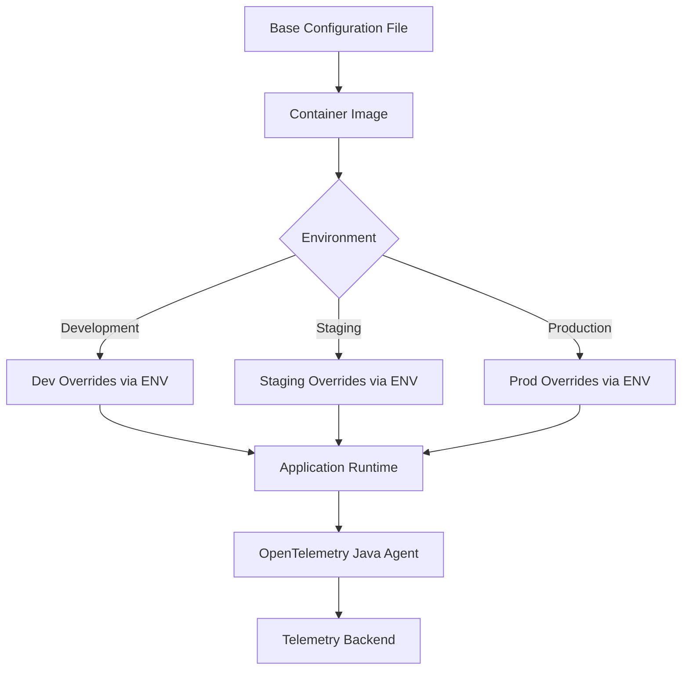

# How to Configure OpenTelemetry Java Agent Layered Configuration for Multiple Environments

Author: [nawazdhandala](https://www.github.com/nawazdhandala)

Tags: OpenTelemetry, Java Agent, Configuration, Environments, Layered Config

Description: Learn how to implement layered configuration for the OpenTelemetry Java agent across multiple environments using environment variables, system properties, and configuration files.

Managing OpenTelemetry configuration across different environments (development, staging, production) can become complex quickly. The OpenTelemetry Java agent supports a layered configuration approach that allows you to define base settings and override them per environment without code changes.

## Understanding Configuration Precedence

The OpenTelemetry Java agent resolves configuration from multiple sources with a clear precedence order. Understanding this hierarchy is essential for building maintainable multi-environment setups.

Configuration sources ranked from highest to lowest precedence:

1. System properties (-D flags)
2. Environment variables
3. Configuration file properties
4. Default values

This layered approach means you can define common settings in a configuration file, override specific values with environment variables in your deployment manifests, and still use system properties for local debugging.

## Setting Up Base Configuration

Create a base configuration file that contains settings common across all environments. This file serves as your foundation.

```properties
# otel-config-base.properties
# Service identification
otel.service.name=payment-service
otel.service.version=1.0.0

# Resource attributes shared across environments
otel.resource.attributes=service.namespace=ecommerce,deployment.environment=unset

# Instrumentation settings
otel.instrumentation.common.default-enabled=true
otel.instrumentation.jdbc.statement-sanitizer.enabled=true

# Sampling configuration - use parent-based by default
otel.traces.sampler=parentbased_traceidratio
otel.traces.sampler.arg=1.0

# Batch processor settings
otel.bsp.schedule.delay=5000
otel.bsp.max.queue.size=2048
otel.bsp.max.export.batch.size=512

# Logging exporter disabled by default
otel.logs.exporter=none
```

The base configuration establishes sensible defaults. Notice how `deployment.environment` is set to `unset` - this signals which values need environment-specific overrides.

## Environment-Specific Overrides

For each environment, create override files or use environment variables to customize behavior.

Development environment configuration:

```properties
# otel-config-dev.properties
otel.resource.attributes=service.namespace=ecommerce,deployment.environment=dev

# Development uses local OTLP collector
otel.exporter.otlp.endpoint=http://localhost:4317
otel.exporter.otlp.protocol=grpc

# Full sampling in development
otel.traces.sampler.arg=1.0

# Enable debug logging
otel.javaagent.debug=true

# Enable all instrumentations for testing
otel.instrumentation.experimental-span-attributes=true
```

Staging environment configuration:

```properties
# otel-config-staging.properties
otel.resource.attributes=service.namespace=ecommerce,deployment.environment=staging

# Staging collector endpoint
otel.exporter.otlp.endpoint=https://otel-collector.staging.company.internal:4317
otel.exporter.otlp.protocol=grpc

# Authentication for staging collector
otel.exporter.otlp.headers=authorization=Bearer ${OTEL_AUTH_TOKEN}

# Reduced sampling in staging
otel.traces.sampler.arg=0.5

# Performance settings for staging load
otel.bsp.schedule.delay=3000
otel.bsp.max.queue.size=4096
```

Production environment configuration:

```properties
# otel-config-prod.properties
otel.resource.attributes=service.namespace=ecommerce,deployment.environment=production

# Production collector with TLS
otel.exporter.otlp.endpoint=https://otel-collector.prod.company.internal:4317
otel.exporter.otlp.protocol=grpc
otel.exporter.otlp.certificate=/etc/ssl/certs/otel-ca.crt

# Authentication header from environment variable
otel.exporter.otlp.headers=authorization=Bearer ${OTEL_AUTH_TOKEN}

# Conservative sampling for production traffic
otel.traces.sampler.arg=0.1

# Optimized batch settings for high throughput
otel.bsp.schedule.delay=1000
otel.bsp.max.queue.size=8192
otel.bsp.max.export.batch.size=1024

# Disable debug logging
otel.javaagent.debug=false
```

## Loading Configuration Files

The Java agent accepts configuration files through the `otel.javaagent.configuration-file` property. To implement layered configuration, you need to merge files or use environment variables to override specific properties.

Loading base configuration with agent startup:

```bash
# Application startup with base configuration
java -javaagent:/opt/opentelemetry-javaagent.jar \
     -Dotel.javaagent.configuration-file=/config/otel-config-base.properties \
     -jar application.jar
```

Since the agent only supports a single configuration file directly, implement layering by combining files during container build or using environment variables for overrides.

## Implementing Layered Configuration with Environment Variables

Environment variables provide the cleanest way to override configuration per environment while maintaining a single base configuration file.

```yaml
# Kubernetes deployment manifest example
apiVersion: apps/v1
kind: Deployment
metadata:
  name: payment-service
spec:
  template:
    spec:
      containers:
      - name: payment-service
        image: payment-service:1.0.0
        env:
        # Override deployment environment
        - name: OTEL_RESOURCE_ATTRIBUTES
          value: "service.namespace=ecommerce,deployment.environment=production,k8s.cluster.name=prod-us-east-1"

        # Production collector endpoint
        - name: OTEL_EXPORTER_OTLP_ENDPOINT
          value: "https://otel-collector.prod.company.internal:4317"

        # Authentication from Kubernetes secret
        - name: OTEL_AUTH_TOKEN
          valueFrom:
            secretKeyRef:
              name: otel-auth
              key: token

        - name: OTEL_EXPORTER_OTLP_HEADERS
          value: "authorization=Bearer $(OTEL_AUTH_TOKEN)"

        # Production sampling rate
        - name: OTEL_TRACES_SAMPLER_ARG
          value: "0.1"

        # Service metadata from Kubernetes
        - name: OTEL_SERVICE_NAME
          value: "payment-service"

        - name: OTEL_SERVICE_VERSION
          valueFrom:
            fieldRef:
              fieldPath: metadata.labels['version']
```

Environment variables convert to configuration properties by following these rules:
- Uppercase the property name
- Replace dots with underscores
- Prefix with `OTEL_`

For example: `otel.service.name` becomes `OTEL_SERVICE_NAME`.

## Configuration Validation Strategy

Create a validation mechanism to ensure required configuration is present and correct before the application processes requests.

```java
package com.company.observability;

import io.opentelemetry.api.GlobalOpenTelemetry;
import io.opentelemetry.api.OpenTelemetry;
import io.opentelemetry.sdk.OpenTelemetrySdk;
import io.opentelemetry.sdk.resources.Resource;
import org.slf4j.Logger;
import org.slf4j.LoggerFactory;
import org.springframework.boot.context.event.ApplicationReadyEvent;
import org.springframework.context.event.EventListener;
import org.springframework.stereotype.Component;

/**
 * Validates OpenTelemetry configuration on application startup.
 * Logs warnings for missing or default configuration values.
 */
@Component
public class OpenTelemetryConfigValidator {

    private static final Logger logger = LoggerFactory.getLogger(OpenTelemetryConfigValidator.class);

    @EventListener(ApplicationReadyEvent.class)
    public void validateConfiguration() {
        OpenTelemetry openTelemetry = GlobalOpenTelemetry.get();

        if (!(openTelemetry instanceof OpenTelemetrySdk)) {
            logger.warn("OpenTelemetry SDK not properly initialized");
            return;
        }

        OpenTelemetrySdk sdk = (OpenTelemetrySdk) openTelemetry;
        Resource resource = sdk.getSdkTracerProvider().getResource();

        // Validate service name
        String serviceName = resource.getAttribute(ResourceAttributes.SERVICE_NAME);
        if (serviceName == null || serviceName.equals("unknown_service:java")) {
            logger.error("Service name not configured - using default");
        } else {
            logger.info("OpenTelemetry service name: {}", serviceName);
        }

        // Validate deployment environment
        String environment = resource.getAttribute(ResourceAttributes.DEPLOYMENT_ENVIRONMENT);
        if (environment == null || environment.equals("unset")) {
            logger.error("Deployment environment not configured");
        } else {
            logger.info("Deployment environment: {}", environment);
        }

        // Validate exporter configuration
        String otlpEndpoint = System.getenv("OTEL_EXPORTER_OTLP_ENDPOINT");
        if (otlpEndpoint == null) {
            logger.warn("OTLP endpoint not configured - telemetry may not be exported");
        } else {
            logger.info("OTLP exporter endpoint: {}", otlpEndpoint);
        }

        // Log all resource attributes for debugging
        logger.debug("OpenTelemetry resource attributes: {}", resource.getAttributes().asMap());
    }
}
```

This validation component runs after Spring Boot initialization and verifies critical configuration. It helps catch misconfiguration before it causes production issues.

## Configuration Management Architecture

Here's how the layered configuration flows through your deployment pipeline:



## Dynamic Configuration with ConfigMaps

For Kubernetes deployments, use ConfigMaps to manage environment-specific configuration without rebuilding containers.

```yaml
# ConfigMap for production environment
apiVersion: v1
kind: ConfigMap
metadata:
  name: otel-config-prod
  namespace: production
data:
  otel-config.properties: |
    otel.service.name=payment-service
    otel.service.version=1.0.0
    otel.resource.attributes=service.namespace=ecommerce,deployment.environment=production
    otel.exporter.otlp.endpoint=https://otel-collector.prod.company.internal:4317
    otel.traces.sampler=parentbased_traceidratio
    otel.traces.sampler.arg=0.1
    otel.bsp.max.queue.size=8192
---
apiVersion: apps/v1
kind: Deployment
metadata:
  name: payment-service
spec:
  template:
    spec:
      containers:
      - name: payment-service
        image: payment-service:1.0.0
        volumeMounts:
        - name: otel-config
          mountPath: /config
          readOnly: true
        env:
        - name: JAVA_TOOL_OPTIONS
          value: "-javaagent:/opt/opentelemetry-javaagent.jar -Dotel.javaagent.configuration-file=/config/otel-config.properties"
      volumes:
      - name: otel-config
        configMap:
          name: otel-config-prod
```

This approach separates configuration from code and containers, making it easy to update settings without redeployment.

## Testing Configuration Across Environments

Implement automated tests to verify configuration correctness for each environment.

```java
package com.company.observability;

import org.junit.jupiter.api.Test;
import org.junit.jupiter.params.ParameterizedTest;
import org.junit.jupiter.params.provider.ValueSource;

import java.io.FileInputStream;
import java.io.IOException;
import java.util.Properties;

import static org.junit.jupiter.api.Assertions.*;

/**
 * Tests for OpenTelemetry configuration files.
 * Validates that required properties exist and have valid values.
 */
class OpenTelemetryConfigurationTest {

    @ParameterizedTest
    @ValueSource(strings = {
        "src/main/resources/otel-config-base.properties",
        "src/main/resources/otel-config-dev.properties",
        "src/main/resources/otel-config-staging.properties",
        "src/main/resources/otel-config-prod.properties"
    })
    void testConfigurationFilesHaveRequiredProperties(String configFile) throws IOException {
        Properties props = new Properties();
        try (FileInputStream fis = new FileInputStream(configFile)) {
            props.load(fis);
        }

        // Verify required properties
        assertNotNull(props.getProperty("otel.service.name"),
            "Service name must be configured in " + configFile);
        assertNotNull(props.getProperty("otel.resource.attributes"),
            "Resource attributes must be configured in " + configFile);
        assertNotNull(props.getProperty("otel.traces.sampler"),
            "Trace sampler must be configured in " + configFile);
    }

    @Test
    void testProductionConfigHasSecureSampling() throws IOException {
        Properties props = new Properties();
        try (FileInputStream fis = new FileInputStream("src/main/resources/otel-config-prod.properties")) {
            props.load(fis);
        }

        String samplerArg = props.getProperty("otel.traces.sampler.arg");
        assertNotNull(samplerArg, "Production must have explicit sampling rate");

        double samplingRate = Double.parseDouble(samplerArg);
        assertTrue(samplingRate <= 0.2,
            "Production sampling rate should be conservative (<=20%)");
    }
}
```

These tests run in CI/CD pipelines to catch configuration errors before deployment.

## Troubleshooting Configuration Issues

Enable debug logging to see which configuration sources the agent uses:

```bash
# Enable agent debug logging
export OTEL_JAVAAGENT_DEBUG=true

# Run application and check logs
java -javaagent:/opt/opentelemetry-javaagent.jar -jar application.jar
```

The agent logs will show configuration resolution:

```
[otel.javaagent] Resolving otel.service.name
[otel.javaagent] - System property: null
[otel.javaagent] - Environment variable OTEL_SERVICE_NAME: payment-service
[otel.javaagent] - Configuration file: null
[otel.javaagent] Using value: payment-service (from environment variable)
```

Layered configuration for the OpenTelemetry Java agent gives you flexibility to manage multiple environments without duplicating code or configuration. By combining base configuration files with environment-specific overrides through environment variables, you create a maintainable and auditable observability setup that scales across your entire deployment pipeline.
