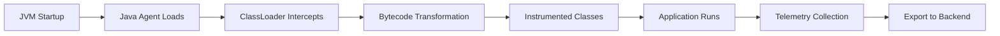

# How to Use the OpenTelemetry Java Agent for Zero-Code Spring Boot Instrumentation

Author: [nawazdhandala](https://www.github.com/nawazdhandala)

Tags: OpenTelemetry, Java Agent, Spring Boot, Zero-Code, Auto-Instrumentation

Description: Learn how to instrument Spring Boot applications with OpenTelemetry using the Java agent for automatic observability without modifying a single line of code.

The OpenTelemetry Java Agent is one of the most powerful tools for adding observability to existing applications. By attaching to the JVM at startup, it automatically instruments hundreds of libraries and frameworks without requiring code changes, recompilation, or even access to source code. This makes it perfect for legacy applications, microservices, or any scenario where you want comprehensive observability without invasive changes.

## Understanding the Java Agent

The Java agent works through bytecode instrumentation at the JVM level. When your application loads classes, the agent intercepts and modifies the bytecode to inject telemetry collection points. This happens transparently at runtime.



The agent instruments over 200 libraries automatically, including:
- Spring MVC, WebFlux, and Boot
- JDBC drivers and connection pools
- HTTP clients (Apache, OkHttp, Netty)
- Messaging systems (Kafka, RabbitMQ, JMS)
- Database clients (MongoDB, Redis, Elasticsearch)
- gRPC, GraphQL, and more

## Downloading the Agent

First, download the latest OpenTelemetry Java agent JAR. This is a standalone file that contains all dependencies.

```bash
# Download the latest agent (check for newer versions)
curl -L https://github.com/open-telemetry/opentelemetry-java-instrumentation/releases/download/v2.1.0/opentelemetry-javaagent.jar \
  -o opentelemetry-javaagent.jar

# Verify the download
ls -lh opentelemetry-javaagent.jar
# Should be around 60-70 MB
```

For production deployments, pin to a specific version and verify checksums:

```bash
# Download with checksum verification
curl -L https://github.com/open-telemetry/opentelemetry-java-instrumentation/releases/download/v2.1.0/opentelemetry-javaagent.jar \
  -o opentelemetry-javaagent.jar

curl -L https://github.com/open-telemetry/opentelemetry-java-instrumentation/releases/download/v2.1.0/opentelemetry-javaagent.jar.sha256 \
  -o opentelemetry-javaagent.jar.sha256

# Verify checksum (Linux/Mac)
sha256sum -c opentelemetry-javaagent.jar.sha256
```

## Basic Usage

Attach the agent when starting your Spring Boot application using the `-javaagent` JVM argument. The agent requires minimal configuration to get started.

```bash
# Basic usage with OTLP exporter
java -javaagent:opentelemetry-javaagent.jar \
  -Dotel.service.name=order-service \
  -Dotel.exporter.otlp.endpoint=http://localhost:4318 \
  -jar your-spring-boot-app.jar
```

This single command instruments your entire application. Traces will appear immediately for HTTP requests, database queries, and external API calls.

## Essential Configuration Options

Configure the agent through system properties or environment variables. System properties use the format `-Dotel.property.name=value`, while environment variables use `OTEL_PROPERTY_NAME=value`.

```bash
# Comprehensive configuration example
java -javaagent:opentelemetry-javaagent.jar \
  -Dotel.service.name=payment-service \
  -Dotel.service.version=1.2.3 \
  -Dotel.resource.attributes=deployment.environment=production,service.namespace=payments \
  -Dotel.exporter.otlp.endpoint=http://collector:4318 \
  -Dotel.exporter.otlp.protocol=http/protobuf \
  -Dotel.exporter.otlp.headers=api-key=your-secret-key \
  -Dotel.traces.sampler=parentbased_traceidratio \
  -Dotel.traces.sampler.arg=0.1 \
  -Dotel.metrics.exporter=otlp \
  -Dotel.logs.exporter=otlp \
  -jar payment-service.jar
```

## Environment Variables Approach

For containerized deployments, environment variables are cleaner than system properties:

```bash
# Set environment variables
export OTEL_SERVICE_NAME="order-service"
export OTEL_EXPORTER_OTLP_ENDPOINT="http://collector:4318"
export OTEL_EXPORTER_OTLP_PROTOCOL="http/protobuf"
export OTEL_RESOURCE_ATTRIBUTES="deployment.environment=production,service.namespace=orders"
export OTEL_TRACES_SAMPLER="parentbased_traceidratio"
export OTEL_TRACES_SAMPLER_ARG="0.1"

# Run application with agent
java -javaagent:opentelemetry-javaagent.jar -jar order-service.jar
```

## Docker Integration

Integrating the agent into Docker containers is straightforward. Here's a production-ready Dockerfile:

```dockerfile
FROM eclipse-temurin:17-jre-alpine

# Create app directory
WORKDIR /app

# Download OpenTelemetry agent at build time
ADD https://github.com/open-telemetry/opentelemetry-java-instrumentation/releases/download/v2.1.0/opentelemetry-javaagent.jar \
  /app/opentelemetry-javaagent.jar

# Verify agent was downloaded correctly
RUN test -f /app/opentelemetry-javaagent.jar && \
  chmod 644 /app/opentelemetry-javaagent.jar

# Copy application JAR
COPY target/payment-service.jar /app/app.jar

# Set default environment variables
ENV OTEL_SERVICE_NAME="payment-service"
ENV OTEL_EXPORTER_OTLP_ENDPOINT="http://otel-collector:4318"
ENV OTEL_EXPORTER_OTLP_PROTOCOL="http/protobuf"
ENV OTEL_METRICS_EXPORTER="otlp"
ENV OTEL_LOGS_EXPORTER="otlp"

# Configure JVM to use agent
ENV JAVA_TOOL_OPTIONS="-javaagent:/app/opentelemetry-javaagent.jar"

# Run application
ENTRYPOINT ["java", "-jar", "/app/app.jar"]
```

Using `JAVA_TOOL_OPTIONS` allows the agent to attach automatically without modifying the entrypoint command.

## Kubernetes Deployment

Deploy instrumented applications on Kubernetes with ConfigMaps for configuration:

```yaml
apiVersion: v1
kind: ConfigMap
metadata:
  name: otel-agent-config
  namespace: production
data:
  OTEL_SERVICE_NAME: "payment-service"
  OTEL_EXPORTER_OTLP_ENDPOINT: "http://otel-collector.observability.svc.cluster.local:4318"
  OTEL_EXPORTER_OTLP_PROTOCOL: "http/protobuf"
  OTEL_RESOURCE_ATTRIBUTES: "deployment.environment=production,k8s.cluster.name=prod-us-east-1"
  OTEL_TRACES_SAMPLER: "parentbased_traceidratio"
  OTEL_TRACES_SAMPLER_ARG: "0.1"
  OTEL_METRICS_EXPORTER: "otlp"
  OTEL_LOGS_EXPORTER: "otlp"

---
apiVersion: apps/v1
kind: Deployment
metadata:
  name: payment-service
  namespace: production
spec:
  replicas: 3
  selector:
    matchLabels:
      app: payment-service
  template:
    metadata:
      labels:
        app: payment-service
    spec:
      containers:
      - name: payment-service
        image: myregistry/payment-service:1.2.3
        ports:
        - containerPort: 8080
        envFrom:
        - configMapRef:
            name: otel-agent-config
        env:
        # Add pod-specific resource attributes
        - name: POD_NAME
          valueFrom:
            fieldRef:
              fieldPath: metadata.name
        - name: POD_NAMESPACE
          valueFrom:
            fieldRef:
              fieldPath: metadata.namespace
        - name: OTEL_RESOURCE_ATTRIBUTES
          value: "k8s.pod.name=$(POD_NAME),k8s.namespace.name=$(POD_NAMESPACE)"
        resources:
          requests:
            memory: "512Mi"
            cpu: "500m"
          limits:
            memory: "1Gi"
            cpu: "1000m"
```

## Sampling Configuration

Production environments need sampling to manage costs and volume. The agent supports multiple sampling strategies:

```bash
# Always sample (development only)
-Dotel.traces.sampler=always_on

# Never sample (useful for testing)
-Dotel.traces.sampler=always_off

# Sample based on trace ID ratio (10% of traces)
-Dotel.traces.sampler=traceidratio
-Dotel.traces.sampler.arg=0.1

# Parent-based sampling (respect upstream decisions)
-Dotel.traces.sampler=parentbased_traceidratio
-Dotel.traces.sampler.arg=0.1
```

Parent-based sampling is recommended for microservices architectures. It ensures that once a trace is sampled at the edge, all downstream services include their spans in that trace.

## Selective Instrumentation

You can disable specific instrumentations to reduce overhead or avoid conflicts:

```bash
# Disable JDBC instrumentation
-Dotel.instrumentation.jdbc.enabled=false

# Disable Spring Web MVC instrumentation
-Dotel.instrumentation.spring-webmvc.enabled=false

# Disable multiple instrumentations
-Dotel.instrumentation.kafka.enabled=false \
-Dotel.instrumentation.redis.enabled=false

# Enable only specific instrumentations (disable all others)
-Dotel.instrumentation.common.default-enabled=false \
-Dotel.instrumentation.spring-webmvc.enabled=true \
-Dotel.instrumentation.jdbc.enabled=true
```

This is useful when you have custom instrumentation or when certain libraries conflict with auto-instrumentation.

## Exporting to Multiple Backends

The agent can export to multiple destinations simultaneously:

```bash
# Export traces to OTLP, logs to console
-Dotel.traces.exporter=otlp \
-Dotel.logs.exporter=logging \
-Dotel.metrics.exporter=otlp

# Export to multiple trace backends (comma-separated)
-Dotel.traces.exporter=otlp,zipkin \
-Dotel.exporter.otlp.endpoint=http://collector:4318 \
-Dotel.exporter.zipkin.endpoint=http://zipkin:9411/api/v2/spans
```

## Debug and Troubleshooting

When traces don't appear, enable debug logging to diagnose issues:

```bash
# Enable debug logging for the agent
-Dotel.javaagent.debug=true

# Or use standard Java logging configuration
-Djava.util.logging.config.file=logging.properties
```

Create a logging.properties file:

```properties
# OpenTelemetry agent logging configuration
handlers=java.util.logging.ConsoleHandler
.level=INFO

# Debug all OpenTelemetry components
io.opentelemetry.level=FINE
io.opentelemetry.javaagent.level=FINE

# Trace exporter issues
io.opentelemetry.exporter.level=FINEST

# Console handler configuration
java.util.logging.ConsoleHandler.level=FINEST
java.util.logging.ConsoleHandler.formatter=java.util.logging.SimpleFormatter
java.util.logging.SimpleFormatter.format=%1$tF %1$tT %4$s %2$s %5$s%6$s%n
```

## Custom Span Attributes

Add custom attributes to auto-instrumented spans without code changes:

```bash
# Add resource attributes (apply to all spans)
-Dotel.resource.attributes=team=payments,cost.center=engineering,region=us-east-1

# Add span attributes via extensions (requires custom extension)
-Dotel.javaagent.extensions=/path/to/custom-extension.jar
```

## Performance Tuning

The agent has minimal overhead (typically 2-5% CPU, 50-100MB memory), but you can tune performance:

```bash
# Batch span processor configuration
-Dotel.bsp.schedule.delay=5000 \
-Dotel.bsp.max.queue.size=2048 \
-Dotel.bsp.max.export.batch.size=512 \
-Dotel.bsp.export.timeout=30000

# Metrics collection interval (milliseconds)
-Dotel.metric.export.interval=60000

# Reduce instrumentation scope
-Dotel.instrumentation.common.default-enabled=false \
-Dotel.instrumentation.spring-webmvc.enabled=true \
-Dotel.instrumentation.jdbc.enabled=true
```

## Using with Spring Boot Profiles

Integrate the agent with Spring Boot profiles for environment-specific configuration:

```bash
# application.properties (Spring Boot)
# These get picked up by both Spring and the agent

# Development profile
spring.application.name=payment-service
otel.service.name=${spring.application.name}
otel.exporter.otlp.endpoint=http://localhost:4318

# Production profile (application-production.properties)
otel.exporter.otlp.endpoint=http://otel-collector.prod.internal:4318
otel.traces.sampler=parentbased_traceidratio
otel.traces.sampler.arg=0.05
otel.resource.attributes=deployment.environment=production
```

Start with the profile:

```bash
java -javaagent:opentelemetry-javaagent.jar \
  -Dspring.profiles.active=production \
  -jar payment-service.jar
```

## Security Considerations

When using the agent in production, follow these security practices:

```bash
# Use secrets management for API keys (Kubernetes example)
apiVersion: v1
kind: Secret
metadata:
  name: otel-secrets
type: Opaque
stringData:
  api-key: "your-secret-api-key"

---
# Reference secret in deployment
env:
- name: OTEL_EXPORTER_OTLP_HEADERS
  value: "api-key=$(OTEL_API_KEY)"
- name: OTEL_API_KEY
  valueFrom:
    secretKeyRef:
      name: otel-secrets
      key: api-key
```

Never hardcode credentials in Docker images or configuration files.

## Verifying Instrumentation

Confirm the agent is working correctly:

```bash
# Check agent loaded successfully (look for log line at startup)
# "OpenTelemetry Javaagent version: 2.1.0"

# Enable startup logs
-Dotel.javaagent.debug=true

# Test with a simple curl request
curl http://localhost:8080/actuator/health

# Check your tracing backend for spans
```

## Common Issues and Solutions

**Issue**: Agent loads but no traces appear
```bash
# Solution: Verify exporter connectivity
curl -v http://collector:4318/v1/traces

# Check sampling isn't too aggressive
-Dotel.traces.sampler=always_on  # Temporarily for testing
```

**Issue**: High memory usage
```bash
# Solution: Reduce batch queue size
-Dotel.bsp.max.queue.size=512
-Dotel.bsp.max.export.batch.size=128
```

**Issue**: Conflicts with other agents
```bash
# Solution: Load OpenTelemetry agent last
java -javaagent:other-agent.jar \
  -javaagent:opentelemetry-javaagent.jar \
  -jar app.jar
```

## Migration Path

The Java agent provides a zero-friction way to add observability to existing Spring Boot applications. Start with full auto-instrumentation, then gradually add manual instrumentation where needed. The agent works alongside the OpenTelemetry API, so you can mix auto and manual instrumentation seamlessly.

Once you understand your telemetry needs, you might migrate to the Spring Boot Starter for tighter integration, or continue using the agent for its simplicity and zero-code approach. Both strategies are valid for production systems.
