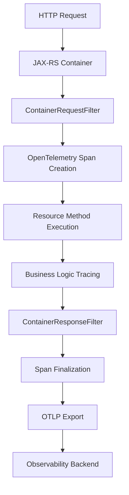

# How to Add OpenTelemetry to JAX-RS Services in Jakarta EE

Author: [nawazdhandala](https://www.github.com/nawazdhandala)

Tags: OpenTelemetry, JAX-RS, Jakarta EE, REST, Java, Tracing

Description: Comprehensive guide to instrumenting JAX-RS REST services with OpenTelemetry in Jakarta EE applications, covering automatic and manual tracing, context propagation, and custom span creation.

JAX-RS (Jakarta RESTful Web Services) provides the standard way to build REST APIs in Jakarta EE applications. When building microservices or distributed systems, understanding request flows across JAX-RS services becomes crucial. OpenTelemetry enables comprehensive tracing of JAX-RS endpoints, automatically capturing HTTP requests, response codes, and errors while allowing custom instrumentation for business logic.

## Understanding JAX-RS and OpenTelemetry Integration

JAX-RS works through annotations like `@Path`, `@GET`, `@POST`, and `@Produces` to define REST endpoints. OpenTelemetry can instrument these endpoints in two ways: automatically through the Java agent or manually through filters and interceptors. The automatic approach requires no code changes, while manual instrumentation provides deeper control over trace data.



## Automatic Instrumentation with Java Agent

The simplest way to instrument JAX-RS services is using the OpenTelemetry Java agent. This approach automatically traces all JAX-RS endpoints without code modifications.

Download and configure the Java agent for your application server:

```bash
# Download the agent
curl -L -o opentelemetry-javaagent.jar \
  https://github.com/open-telemetry/opentelemetry-java-instrumentation/releases/latest/download/opentelemetry-javaagent.jar

# Configure for WildFly (add to standalone.conf)
JAVA_OPTS="$JAVA_OPTS -javaagent:/opt/opentelemetry/opentelemetry-javaagent.jar"
JAVA_OPTS="$JAVA_OPTS -Dotel.service.name=jaxrs-api"
JAVA_OPTS="$JAVA_OPTS -Dotel.traces.exporter=otlp"
JAVA_OPTS="$JAVA_OPTS -Dotel.exporter.otlp.endpoint=http://localhost:4317"

# Enable JAX-RS specific instrumentation
JAVA_OPTS="$JAVA_OPTS -Dotel.instrumentation.jaxrs.enabled=true"
JAVA_OPTS="$JAVA_OPTS -Dotel.instrumentation.servlet.enabled=true"
```

The agent automatically creates spans for each JAX-RS request with standard attributes including HTTP method, URL, status code, and route pattern. This works immediately with any JAX-RS implementation (Jersey, RESTEasy, Apache CXF).

## Manual Instrumentation Setup

For fine-grained control over tracing, implement manual instrumentation using OpenTelemetry SDK. Add the required dependencies to your Maven project:

```xml
<properties>
    <opentelemetry.version>1.37.0</opentelemetry.version>
    <opentelemetry.semconv.version>1.23.1-alpha</opentelemetry.semconv.version>
</properties>

<dependencies>
    <!-- OpenTelemetry API -->
    <dependency>
        <groupId>io.opentelemetry</groupId>
        <artifactId>opentelemetry-api</artifactId>
        <version>${opentelemetry.version}</version>
    </dependency>

    <!-- OpenTelemetry SDK -->
    <dependency>
        <groupId>io.opentelemetry</groupId>
        <artifactId>opentelemetry-sdk</artifactId>
        <version>${opentelemetry.version}</version>
    </dependency>

    <!-- OTLP Exporter -->
    <dependency>
        <groupId>io.opentelemetry</groupId>
        <artifactId>opentelemetry-exporter-otlp</artifactId>
        <version>${opentelemetry.version}</version>
    </dependency>

    <!-- Semantic Conventions -->
    <dependency>
        <groupId>io.opentelemetry.semconv</groupId>
        <artifactId>opentelemetry-semconv</artifactId>
        <version>${opentelemetry.semconv.version}</version>
    </dependency>

    <!-- Context Propagation -->
    <dependency>
        <groupId>io.opentelemetry</groupId>
        <artifactId>opentelemetry-extension-trace-propagators</artifactId>
        <version>${opentelemetry.version}</version>
    </dependency>

    <!-- Jakarta EE API -->
    <dependency>
        <groupId>jakarta.ws.rs</groupId>
        <artifactId>jakarta.ws.rs-api</artifactId>
        <version>3.1.0</version>
        <scope>provided</scope>
    </dependency>

    <dependency>
        <groupId>jakarta.enterprise</groupId>
        <artifactId>jakarta.enterprise.cdi-api</artifactId>
        <version>4.0.1</version>
        <scope>provided</scope>
    </dependency>
</dependencies>
```

## Creating OpenTelemetry CDI Producer

Set up OpenTelemetry as a CDI bean for dependency injection throughout your application:

```java
package com.example.telemetry;

import io.opentelemetry.api.OpenTelemetry;
import io.opentelemetry.api.common.Attributes;
import io.opentelemetry.api.trace.Tracer;
import io.opentelemetry.api.trace.propagation.W3CTraceContextPropagator;
import io.opentelemetry.context.propagation.ContextPropagators;
import io.opentelemetry.exporter.otlp.trace.OtlpGrpcSpanExporter;
import io.opentelemetry.sdk.OpenTelemetrySdk;
import io.opentelemetry.sdk.resources.Resource;
import io.opentelemetry.sdk.trace.SdkTracerProvider;
import io.opentelemetry.sdk.trace.export.BatchSpanProcessor;
import io.opentelemetry.semconv.ResourceAttributes;

import jakarta.enterprise.context.ApplicationScoped;
import jakarta.enterprise.inject.Produces;
import jakarta.annotation.PostConstruct;
import jakarta.annotation.PreDestroy;

@ApplicationScoped
public class OpenTelemetryProducer {

    private SdkTracerProvider tracerProvider;
    private OpenTelemetry openTelemetry;

    @PostConstruct
    public void initialize() {
        // Create resource with service identification
        Resource resource = Resource.getDefault()
            .merge(Resource.create(Attributes.builder()
                .put(ResourceAttributes.SERVICE_NAME, "jaxrs-service")
                .put(ResourceAttributes.SERVICE_VERSION, "1.0.0")
                .put(ResourceAttributes.DEPLOYMENT_ENVIRONMENT, "production")
                .build()));

        // Configure OTLP exporter for traces
        OtlpGrpcSpanExporter spanExporter = OtlpGrpcSpanExporter.builder()
            .setEndpoint("http://localhost:4317")
            .build();

        // Build tracer provider with batch processing
        tracerProvider = SdkTracerProvider.builder()
            .addSpanProcessor(BatchSpanProcessor.builder(spanExporter)
                .setScheduleDelay(java.time.Duration.ofSeconds(5))
                .build())
            .setResource(resource)
            .build();

        // Create OpenTelemetry instance with W3C propagation
        openTelemetry = OpenTelemetrySdk.builder()
            .setTracerProvider(tracerProvider)
            .setPropagators(ContextPropagators.create(
                W3CTraceContextPropagator.getInstance()))
            .build();
    }

    @Produces
    @ApplicationScoped
    public OpenTelemetry getOpenTelemetry() {
        return openTelemetry;
    }

    @Produces
    @ApplicationScoped
    public Tracer getTracer(OpenTelemetry openTelemetry) {
        return openTelemetry.getTracer("com.example.jaxrs", "1.0.0");
    }

    @PreDestroy
    public void cleanup() {
        if (tracerProvider != null) {
            tracerProvider.close();
        }
    }
}
```

## Implementing JAX-RS Tracing Filter

Create a JAX-RS filter to automatically trace all incoming requests and outgoing responses:

```java
package com.example.telemetry;

import io.opentelemetry.api.trace.Span;
import io.opentelemetry.api.trace.SpanKind;
import io.opentelemetry.api.trace.StatusCode;
import io.opentelemetry.api.trace.Tracer;
import io.opentelemetry.context.Context;
import io.opentelemetry.context.Scope;
import io.opentelemetry.context.propagation.TextMapGetter;
import io.opentelemetry.semconv.SemanticAttributes;

import jakarta.annotation.Priority;
import jakarta.inject.Inject;
import jakarta.ws.rs.container.*;
import jakarta.ws.rs.core.MultivaluedMap;
import jakarta.ws.rs.ext.Provider;
import java.io.IOException;

@Provider
@Priority(1000)
public class OpenTelemetryTracingFilter implements ContainerRequestFilter, ContainerResponseFilter {

    private static final String SPAN_PROPERTY = "otel.span";
    private static final String SCOPE_PROPERTY = "otel.scope";
    private static final String CONTEXT_PROPERTY = "otel.context";

    @Inject
    private Tracer tracer;

    @Inject
    private io.opentelemetry.api.OpenTelemetry openTelemetry;

    // TextMapGetter for extracting context from HTTP headers
    private static final TextMapGetter<MultivaluedMap<String, String>> getter =
        new TextMapGetter<>() {
            @Override
            public Iterable<String> keys(MultivaluedMap<String, String> carrier) {
                return carrier.keySet();
            }

            @Override
            public String get(MultivaluedMap<String, String> carrier, String key) {
                if (carrier == null) {
                    return null;
                }
                return carrier.getFirst(key);
            }
        };

    @Override
    public void filter(ContainerRequestContext requestContext) throws IOException {
        // Extract parent context from incoming headers
        Context parentContext = openTelemetry.getPropagators().getTextMapPropagator()
            .extract(Context.current(), requestContext.getHeaders(), getter);

        // Build span name from HTTP method and route
        String httpMethod = requestContext.getMethod();
        String httpRoute = getHttpRoute(requestContext);
        String spanName = httpMethod + " " + httpRoute;

        // Create new span as child of extracted context
        Span span = tracer.spanBuilder(spanName)
            .setParent(parentContext)
            .setSpanKind(SpanKind.SERVER)
            .startSpan();

        // Add standard HTTP semantic attributes
        span.setAttribute(SemanticAttributes.HTTP_REQUEST_METHOD, httpMethod);
        span.setAttribute(SemanticAttributes.HTTP_ROUTE, httpRoute);
        span.setAttribute(SemanticAttributes.URL_FULL,
            requestContext.getUriInfo().getRequestUri().toString());
        span.setAttribute(SemanticAttributes.URL_PATH,
            requestContext.getUriInfo().getPath());
        span.setAttribute(SemanticAttributes.URL_QUERY,
            requestContext.getUriInfo().getRequestUri().getQuery());
        span.setAttribute(SemanticAttributes.SERVER_ADDRESS,
            requestContext.getUriInfo().getBaseUri().getHost());
        span.setAttribute(SemanticAttributes.SERVER_PORT,
            requestContext.getUriInfo().getBaseUri().getPort());

        // Add user agent if present
        String userAgent = requestContext.getHeaderString("User-Agent");
        if (userAgent != null) {
            span.setAttribute(SemanticAttributes.USER_AGENT_ORIGINAL, userAgent);
        }

        // Store span and scope for response filter
        Context context = parentContext.with(span);
        Scope scope = context.makeCurrent();

        requestContext.setProperty(SPAN_PROPERTY, span);
        requestContext.setProperty(SCOPE_PROPERTY, scope);
        requestContext.setProperty(CONTEXT_PROPERTY, context);
    }

    @Override
    public void filter(ContainerRequestContext requestContext,
                      ContainerResponseContext responseContext) throws IOException {
        Span span = (Span) requestContext.getProperty(SPAN_PROPERTY);
        Scope scope = (Scope) requestContext.getProperty(SCOPE_PROPERTY);

        if (span != null && scope != null) {
            try {
                // Add response status code
                int statusCode = responseContext.getStatus();
                span.setAttribute(SemanticAttributes.HTTP_RESPONSE_STATUS_CODE, statusCode);

                // Set span status based on HTTP status code
                if (statusCode >= 500) {
                    span.setStatus(StatusCode.ERROR, "Server error");
                } else if (statusCode >= 400) {
                    span.setStatus(StatusCode.ERROR, "Client error");
                } else {
                    span.setStatus(StatusCode.OK);
                }

                // Add content type if present
                String contentType = responseContext.getHeaderString("Content-Type");
                if (contentType != null) {
                    span.setAttribute("http.response.content_type", contentType);
                }

            } finally {
                // End span and close scope
                span.end();
                scope.close();
            }
        }
    }

    // Extract the route pattern from the request
    private String getHttpRoute(ContainerRequestContext requestContext) {
        String path = requestContext.getUriInfo().getPath();

        // Try to get the matched resource for better route pattern
        // This returns the actual JAX-RS path template like /users/{id}
        if (requestContext.getUriInfo().getMatchedURIs().size() > 0) {
            return "/" + requestContext.getUriInfo().getMatchedURIs().get(0);
        }

        return path;
    }
}
```

## Creating Custom Span Annotations

Define a custom annotation for tracing specific JAX-RS resource methods:

```java
package com.example.telemetry;

import java.lang.annotation.ElementType;
import java.lang.annotation.Retention;
import java.lang.annotation.RetentionPolicy;
import java.lang.annotation.Target;

@Target({ElementType.METHOD, ElementType.TYPE})
@Retention(RetentionPolicy.RUNTIME)
public @interface TraceOperation {
    String value() default "";
    String[] attributes() default {};
}
```

## Instrumenting JAX-RS Resources

Apply tracing to your JAX-RS resources with custom instrumentation:

```java
package com.example.api;

import com.example.model.User;
import com.example.service.UserService;
import com.example.telemetry.TraceOperation;
import io.opentelemetry.api.trace.Span;
import io.opentelemetry.api.trace.SpanKind;
import io.opentelemetry.api.trace.StatusCode;
import io.opentelemetry.api.trace.Tracer;
import io.opentelemetry.context.Scope;

import jakarta.inject.Inject;
import jakarta.ws.rs.*;
import jakarta.ws.rs.core.MediaType;
import jakarta.ws.rs.core.Response;
import java.util.List;

@Path("/users")
@Produces(MediaType.APPLICATION_JSON)
@Consumes(MediaType.APPLICATION_JSON)
public class UserResource {

    @Inject
    private UserService userService;

    @Inject
    private Tracer tracer;

    @GET
    @TraceOperation("list_all_users")
    public Response listUsers(
            @QueryParam("page") @DefaultValue("0") int page,
            @QueryParam("size") @DefaultValue("20") int size) {

        // Current span is already created by the filter
        Span currentSpan = Span.current();
        currentSpan.setAttribute("pagination.page", page);
        currentSpan.setAttribute("pagination.size", size);

        // Create a child span for the service call
        Span serviceSpan = tracer.spanBuilder("UserService.findAll")
            .setSpanKind(SpanKind.INTERNAL)
            .startSpan();

        try (Scope scope = serviceSpan.makeCurrent()) {
            List<User> users = userService.findAll(page, size);

            serviceSpan.setAttribute("result.count", users.size());
            serviceSpan.setStatus(StatusCode.OK);

            // Add count to parent span as well
            currentSpan.setAttribute("users.count", users.size());

            return Response.ok(users).build();

        } catch (Exception e) {
            serviceSpan.recordException(e);
            serviceSpan.setStatus(StatusCode.ERROR, e.getMessage());
            throw new WebApplicationException("Failed to retrieve users",
                Response.Status.INTERNAL_SERVER_ERROR);
        } finally {
            serviceSpan.end();
        }
    }

    @GET
    @Path("/{id}")
    @TraceOperation("get_user_by_id")
    public Response getUser(@PathParam("id") Long id) {
        Span currentSpan = Span.current();
        currentSpan.setAttribute("user.id", id);

        Span serviceSpan = tracer.spanBuilder("UserService.findById")
            .setSpanKind(SpanKind.INTERNAL)
            .startSpan();

        try (Scope scope = serviceSpan.makeCurrent()) {
            serviceSpan.setAttribute("user.id", id);

            User user = userService.findById(id);

            if (user == null) {
                serviceSpan.setAttribute("user.found", false);
                serviceSpan.setStatus(StatusCode.OK);
                return Response.status(Response.Status.NOT_FOUND)
                    .entity("{\"error\": \"User not found\"}")
                    .build();
            }

            serviceSpan.setAttribute("user.found", true);
            serviceSpan.setAttribute("user.email", user.getEmail());
            serviceSpan.setStatus(StatusCode.OK);

            return Response.ok(user).build();

        } catch (Exception e) {
            serviceSpan.recordException(e);
            serviceSpan.setStatus(StatusCode.ERROR, e.getMessage());
            throw new WebApplicationException("Failed to retrieve user",
                Response.Status.INTERNAL_SERVER_ERROR);
        } finally {
            serviceSpan.end();
        }
    }

    @POST
    @TraceOperation("create_user")
    public Response createUser(User user) {
        Span currentSpan = Span.current();
        currentSpan.setAttribute("user.email", user.getEmail());
        currentSpan.setAttribute("operation.type", "create");

        // Validate input
        if (user.getEmail() == null || user.getEmail().isEmpty()) {
            currentSpan.setAttribute("validation.failed", true);
            currentSpan.setStatus(StatusCode.ERROR, "Invalid email");
            return Response.status(Response.Status.BAD_REQUEST)
                .entity("{\"error\": \"Email is required\"}")
                .build();
        }

        Span serviceSpan = tracer.spanBuilder("UserService.create")
            .setSpanKind(SpanKind.INTERNAL)
            .startSpan();

        try (Scope scope = serviceSpan.makeCurrent()) {
            User created = userService.create(user);

            serviceSpan.setAttribute("user.id", created.getId());
            serviceSpan.setAttribute("user.email", created.getEmail());
            serviceSpan.setStatus(StatusCode.OK);

            currentSpan.setAttribute("user.created.id", created.getId());

            return Response.status(Response.Status.CREATED)
                .entity(created)
                .build();

        } catch (Exception e) {
            serviceSpan.recordException(e);
            serviceSpan.setStatus(StatusCode.ERROR, e.getMessage());
            throw new WebApplicationException("Failed to create user",
                Response.Status.INTERNAL_SERVER_ERROR);
        } finally {
            serviceSpan.end();
        }
    }

    @PUT
    @Path("/{id}")
    @TraceOperation("update_user")
    public Response updateUser(@PathParam("id") Long id, User user) {
        Span currentSpan = Span.current();
        currentSpan.setAttribute("user.id", id);
        currentSpan.setAttribute("operation.type", "update");

        Span serviceSpan = tracer.spanBuilder("UserService.update")
            .setSpanKind(SpanKind.INTERNAL)
            .startSpan();

        try (Scope scope = serviceSpan.makeCurrent()) {
            serviceSpan.setAttribute("user.id", id);

            User updated = userService.update(id, user);

            if (updated == null) {
                serviceSpan.setAttribute("user.found", false);
                return Response.status(Response.Status.NOT_FOUND).build();
            }

            serviceSpan.setAttribute("user.found", true);
            serviceSpan.setStatus(StatusCode.OK);

            return Response.ok(updated).build();

        } catch (Exception e) {
            serviceSpan.recordException(e);
            serviceSpan.setStatus(StatusCode.ERROR, e.getMessage());
            throw new WebApplicationException("Failed to update user",
                Response.Status.INTERNAL_SERVER_ERROR);
        } finally {
            serviceSpan.end();
        }
    }

    @DELETE
    @Path("/{id}")
    @TraceOperation("delete_user")
    public Response deleteUser(@PathParam("id") Long id) {
        Span currentSpan = Span.current();
        currentSpan.setAttribute("user.id", id);
        currentSpan.setAttribute("operation.type", "delete");

        Span serviceSpan = tracer.spanBuilder("UserService.delete")
            .setSpanKind(SpanKind.INTERNAL)
            .startSpan();

        try (Scope scope = serviceSpan.makeCurrent()) {
            serviceSpan.setAttribute("user.id", id);

            boolean deleted = userService.delete(id);

            if (!deleted) {
                serviceSpan.setAttribute("user.found", false);
                return Response.status(Response.Status.NOT_FOUND).build();
            }

            serviceSpan.setAttribute("user.deleted", true);
            serviceSpan.setStatus(StatusCode.OK);

            return Response.noContent().build();

        } catch (Exception e) {
            serviceSpan.recordException(e);
            serviceSpan.setStatus(StatusCode.ERROR, e.getMessage());
            throw new WebApplicationException("Failed to delete user",
                Response.Status.INTERNAL_SERVER_ERROR);
        } finally {
            serviceSpan.end();
        }
    }
}
```

## Tracing JAX-RS Client Calls

When your JAX-RS service calls other services, propagate trace context:

```java
package com.example.client;

import io.opentelemetry.api.OpenTelemetry;
import io.opentelemetry.api.trace.Span;
import io.opentelemetry.api.trace.SpanKind;
import io.opentelemetry.api.trace.Tracer;
import io.opentelemetry.context.Context;
import io.opentelemetry.context.Scope;
import io.opentelemetry.context.propagation.TextMapSetter;

import jakarta.inject.Inject;
import jakarta.ws.rs.client.Client;
import jakarta.ws.rs.client.ClientBuilder;
import jakarta.ws.rs.client.Invocation;
import jakarta.ws.rs.core.MultivaluedMap;
import jakarta.ws.rs.core.Response;

public class ExternalServiceClient {

    @Inject
    private Tracer tracer;

    @Inject
    private OpenTelemetry openTelemetry;

    private final Client client = ClientBuilder.newClient();

    // TextMapSetter for injecting context into HTTP headers
    private static final TextMapSetter<MultivaluedMap<String, Object>> setter =
        (carrier, key, value) -> carrier.putSingle(key, value);

    public String callExternalService(String endpoint) {
        // Create span for external call
        Span span = tracer.spanBuilder("GET " + endpoint)
            .setSpanKind(SpanKind.CLIENT)
            .startSpan();

        try (Scope scope = span.makeCurrent()) {
            span.setAttribute("http.method", "GET");
            span.setAttribute("http.url", endpoint);

            // Build request
            Invocation.Builder request = client.target(endpoint)
                .request();

            // Inject trace context into headers
            MultivaluedMap<String, Object> headers =
                request.getHeaders();
            openTelemetry.getPropagators().getTextMapPropagator()
                .inject(Context.current(), headers, setter);

            // Execute request
            Response response = request.get();

            span.setAttribute("http.status_code", response.getStatus());

            String body = response.readEntity(String.class);
            return body;

        } catch (Exception e) {
            span.recordException(e);
            throw e;
        } finally {
            span.end();
        }
    }
}
```

## Handling Exceptions with Tracing

Create an exception mapper that adds exception information to spans:

```java
package com.example.exception;

import io.opentelemetry.api.trace.Span;
import io.opentelemetry.api.trace.StatusCode;

import jakarta.ws.rs.WebApplicationException;
import jakarta.ws.rs.core.Response;
import jakarta.ws.rs.ext.ExceptionMapper;
import jakarta.ws.rs.ext.Provider;

@Provider
public class OpenTelemetryExceptionMapper implements ExceptionMapper<Exception> {

    @Override
    public Response toResponse(Exception exception) {
        Span currentSpan = Span.current();

        // Record the exception in the current span
        currentSpan.recordException(exception);
        currentSpan.setStatus(StatusCode.ERROR, exception.getMessage());

        // Add exception attributes
        currentSpan.setAttribute("exception.type", exception.getClass().getName());
        currentSpan.setAttribute("exception.message", exception.getMessage());

        // Determine response based on exception type
        if (exception instanceof WebApplicationException) {
            WebApplicationException webEx = (WebApplicationException) exception;
            return webEx.getResponse();
        }

        // Generic error response
        return Response.status(Response.Status.INTERNAL_SERVER_ERROR)
            .entity("{\"error\": \"Internal server error\"}")
            .build();
    }
}
```

## Configuration via MicroProfile Config

Use MicroProfile Config for externalized OpenTelemetry settings:

```properties
# microprofile-config.properties

# OpenTelemetry service identification
otel.service.name=jaxrs-api
otel.service.version=1.0.0
otel.deployment.environment=production

# OTLP endpoint configuration
otel.exporter.otlp.endpoint=http://localhost:4317
otel.exporter.otlp.protocol=grpc

# Sampling configuration
otel.traces.sampler=parentbased_traceidratio
otel.traces.sampler.arg=1.0

# Batch processor configuration
otel.bsp.schedule.delay=5000
otel.bsp.max.queue.size=2048
```

JAX-RS services instrumented with OpenTelemetry provide comprehensive visibility into REST API operations. The combination of automatic instrumentation for standard HTTP metrics and manual instrumentation for business logic gives you complete observability. This approach works across all JAX-RS implementations and application servers, making it easy to adopt in any Jakarta EE environment.
