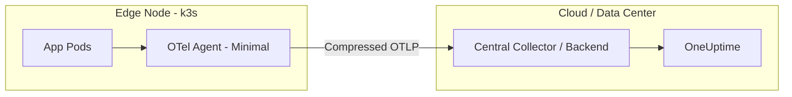
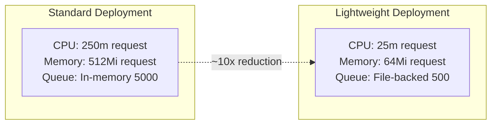

# How to Use OpenTelemetry with k3s and Lightweight Kubernetes Distributions

Author: [nawazdhandala](https://www.github.com/nawazdhandala)

Tags: OpenTelemetry, Kubernetes, k3s, Observability, Edge Computing, Lightweight

Description: A practical guide to deploying OpenTelemetry on k3s and other lightweight Kubernetes distributions for edge and resource-constrained environments.

---

Lightweight Kubernetes distributions like k3s, MicroK8s, and K0s have become the go-to choice for edge deployments, IoT clusters, and development environments. They strip away the overhead of full Kubernetes while keeping the API compatibility. But observability on these resource-constrained systems needs a different approach than what you would use on a beefy cloud cluster.

This guide covers how to deploy and configure OpenTelemetry on k3s and similar lightweight distributions, keeping resource usage minimal while still getting meaningful telemetry.

## Why Lightweight Kubernetes Needs Special Attention

A standard OpenTelemetry Collector deployment designed for a cloud cluster might request 512MB of memory and a full CPU core. On a k3s node running on a Raspberry Pi or a small edge device with 2GB of RAM, that is simply too much.

The challenges are specific:

- **Limited CPU and memory** - every millicore and megabyte counts on edge nodes.
- **Storage constraints** - persistent volume support might be limited or nonexistent.
- **Network bandwidth** - edge locations often have constrained or intermittent connectivity.
- **No dedicated observability infrastructure** - you cannot run Prometheus, Grafana, and a full collector stack alongside your workloads.



## Installing k3s

If you do not already have k3s running, here is a quick setup. k3s installs as a single binary and includes everything you need.

```bash
# Install k3s with the default configuration
# This gives you a single-node cluster in about 30 seconds
curl -sfL https://get.k3s.io | sh -

# Verify the cluster is running
sudo k3s kubectl get nodes

# Copy the kubeconfig for kubectl access
mkdir -p ~/.kube
sudo cp /etc/rancher/k3s/k3s.yaml ~/.kube/config
sudo chown $(id -u):$(id -g) ~/.kube/config
```

## Deploying a Minimal OpenTelemetry Collector

The key to running OpenTelemetry on k3s is using a stripped-down collector configuration. We will use the DaemonSet mode so one collector instance runs per node, and we will keep the resource requests low.

First, install the OpenTelemetry Operator using Helm. The operator makes it easier to manage collector lifecycle.

```bash
# Add the OpenTelemetry Helm repository
helm repo add open-telemetry https://open-telemetry.github.io/opentelemetry-helm-charts
helm repo update

# Install the operator with reduced resource requests
helm install otel-operator open-telemetry/opentelemetry-operator \
  --namespace otel-system \
  --create-namespace \
  --set manager.resources.requests.cpu=50m \
  --set manager.resources.requests.memory=64Mi \
  --set manager.resources.limits.cpu=100m \
  --set manager.resources.limits.memory=128Mi
```

Now deploy a lightweight collector configuration tailored for k3s.

```yaml
# Minimal collector for k3s - DaemonSet mode
apiVersion: opentelemetry.io/v1beta1
kind: OpenTelemetryCollector
metadata:
  name: otel-lightweight
  namespace: otel-system
spec:
  mode: daemonset
  # Keep resource usage minimal for edge nodes
  resources:
    requests:
      cpu: 25m
      memory: 64Mi
    limits:
      cpu: 100m
      memory: 128Mi
  config:
    receivers:
      otlp:
        protocols:
          grpc:
            endpoint: 0.0.0.0:4317
          http:
            endpoint: 0.0.0.0:4318

      # Collect host metrics with a longer interval to reduce CPU usage
      hostmetrics:
        collection_interval: 60s
        scrapers:
          cpu: {}
          memory: {}
          disk: {}
          filesystem: {}
          network: {}

    processors:
      # Strict memory limiter to prevent OOM on constrained nodes
      memory_limiter:
        check_interval: 5s
        limit_mib: 100
        spike_limit_mib: 20

      # Batch with smaller sizes for lower memory footprint
      batch:
        send_batch_size: 256
        send_batch_max_size: 512
        timeout: 10s

      # Reduce attribute cardinality to save bandwidth
      resource:
        attributes:
          - key: k8s.cluster.name
            value: "edge-cluster-01"
            action: upsert

    exporters:
      otlp:
        endpoint: "https://oneuptime-ingest.example.com:4317"
        headers:
          Authorization: "Bearer ${OTEL_API_KEY}"
        # Enable compression to save bandwidth on edge connections
        compression: gzip
        # Retry settings for intermittent connectivity
        retry_on_failure:
          enabled: true
          initial_interval: 10s
          max_interval: 120s
          max_elapsed_time: 600s
        # Queue to buffer during network outages
        sending_queue:
          enabled: true
          num_consumers: 2
          queue_size: 500

    service:
      pipelines:
        traces:
          receivers: [otlp]
          processors: [memory_limiter, batch]
          exporters: [otlp]
        metrics:
          receivers: [otlp, hostmetrics]
          processors: [memory_limiter, resource, batch]
          exporters: [otlp]
        logs:
          receivers: [otlp]
          processors: [memory_limiter, batch]
          exporters: [otlp]
```

## Handling Intermittent Connectivity

Edge deployments often deal with unreliable networks. The collector configuration above already includes retry logic and a sending queue. But there are additional strategies worth considering.

The `file_storage` extension lets the collector persist queued telemetry to disk so it survives restarts.

```yaml
# File storage extension for durable queuing on edge nodes
extensions:
  file_storage:
    directory: /var/lib/otel/storage
    timeout: 2s
    compaction:
      # Clean up old data to prevent filling disk
      on_start: true
      on_rebound: true
      directory: /tmp/otel-compaction

exporters:
  otlp:
    endpoint: "https://oneuptime-ingest.example.com:4317"
    sending_queue:
      enabled: true
      # Use file-backed storage instead of in-memory queue
      storage: file_storage
      queue_size: 5000

service:
  extensions: [file_storage]
```

You will need to mount a host volume for the storage directory.

```yaml
# Volume mount for persistent queue storage
spec:
  volumeMounts:
    - name: otel-storage
      mountPath: /var/lib/otel/storage
  volumes:
    - name: otel-storage
      hostPath:
        path: /var/lib/otel/storage
        type: DirectoryOrCreate
```

## Instrumenting Applications on k3s

Application instrumentation works the same as on any Kubernetes cluster. The main difference is being mindful of the overhead that auto-instrumentation adds.

For lightweight deployments, manual instrumentation often makes more sense than auto-instrumentation because you control exactly what gets traced.

Here is a Python example using the OpenTelemetry SDK with minimal overhead.

```python
# Lightweight OpenTelemetry setup for edge applications
from opentelemetry import trace
from opentelemetry.sdk.trace import TracerProvider
from opentelemetry.sdk.trace.export import BatchSpanExporter
from opentelemetry.exporter.otlp.proto.grpc.trace_exporter import OTLPSpanExporter
from opentelemetry.sdk.resources import Resource

# Create a resource identifying this service and its location
resource = Resource.create({
    "service.name": "edge-sensor-reader",
    "service.version": "1.0.0",
    "deployment.environment": "edge",
    "k8s.cluster.name": "edge-cluster-01",
})

# Configure the tracer with a small batch size for constrained environments
provider = TracerProvider(resource=resource)
exporter = OTLPSpanExporter(
    endpoint="http://otel-lightweight-collector.otel-system:4317",
    insecure=True,
)
# Use a smaller batch and shorter schedule to minimize memory usage
provider.add_span_processor(
    BatchSpanExporter(
        exporter,
        max_queue_size=256,
        max_export_batch_size=64,
        schedule_delay_millis=5000,
    )
)
trace.set_tracer_provider(provider)

# Get a tracer for this module
tracer = trace.get_tracer(__name__)

# Use the tracer to instrument specific operations
with tracer.start_as_current_span("read-sensor-data") as span:
    span.set_attribute("sensor.type", "temperature")
    span.set_attribute("sensor.location", "warehouse-a")
    # ... your sensor reading logic here
```

## Collecting k3s-Specific Metrics

k3s uses SQLite or etcd for its datastore, and it bundles components like Traefik as the default ingress controller. You can collect metrics from these k3s-specific components.

```yaml
# Prometheus receiver to scrape k3s component metrics
receivers:
  prometheus:
    config:
      scrape_configs:
        # Scrape k3s server metrics
        - job_name: 'k3s-server'
          scrape_interval: 60s
          static_configs:
            - targets: ['127.0.0.1:10249']
          metrics_path: /metrics

        # Scrape Traefik ingress metrics (k3s default ingress)
        - job_name: 'traefik'
          scrape_interval: 60s
          kubernetes_sd_configs:
            - role: pod
              namespaces:
                names: ['kube-system']
          relabel_configs:
            - source_labels: [__meta_kubernetes_pod_label_app_kubernetes_io_name]
              action: keep
              regex: traefik
```

## Resource Comparison

Here is how the collector resource usage compares between a standard and lightweight configuration.



## Tips for Other Lightweight Distributions

The same principles apply to MicroK8s, K0s, and Kind clusters.

For **MicroK8s**, enable the community addon for observability:

```bash
# Enable the OpenTelemetry addon on MicroK8s
microk8s enable community
microk8s enable observability
```

For **K0s**, the Helm-based installation works the same as k3s. Just make sure to adjust the kubeconfig path:

```bash
# K0s uses a different kubeconfig location
export KUBECONFIG=/var/lib/k0s/pki/admin.conf
helm install otel-operator open-telemetry/opentelemetry-helm-charts \
  --namespace otel-system --create-namespace
```

## Summary

Running OpenTelemetry on k3s and lightweight Kubernetes distributions is entirely practical if you respect the resource constraints. Keep collector memory requests under 128Mi, use file-backed queues for durability, enable compression for bandwidth-limited links, and prefer manual instrumentation over auto-instrumentation when every megabyte counts.

The goal is not to replicate a full-scale observability stack at the edge. It is to collect the telemetry that matters and ship it efficiently to your central backend for analysis. With the configurations in this guide, you can get meaningful traces, metrics, and logs from even the smallest k3s clusters.
