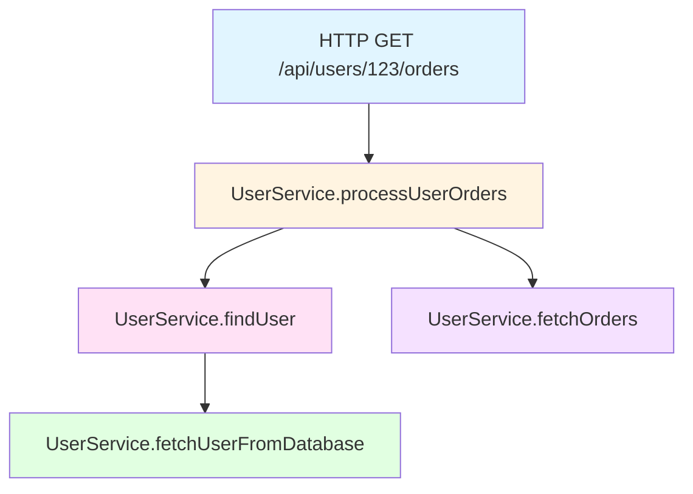

# How to Configure OpenTelemetry for Kotlin Coroutines in Spring Boot

Author: [nawazdhandala](https://www.github.com/nawazdhandala)

Tags: OpenTelemetry, Kotlin, Coroutines, Spring Boot, Context Propagation

Description: Learn how to properly configure OpenTelemetry for Kotlin coroutines in Spring Boot applications, ensuring trace context propagation across suspend functions and asynchronous operations.

Kotlin coroutines have transformed how we write asynchronous code in Spring Boot applications. However, instrumenting coroutine-based code with OpenTelemetry requires careful attention to context propagation. Without proper configuration, traces can become disconnected, making it difficult to track requests across suspend functions and asynchronous boundaries.

This guide shows you how to configure OpenTelemetry to work seamlessly with Kotlin coroutines, maintaining trace context throughout your asynchronous operations.

## Understanding Context Propagation in Coroutines

Coroutines in Kotlin use a CoroutineContext to carry information across suspension points. OpenTelemetry relies on context propagation to maintain trace information, but it wasn't designed specifically for coroutines. The challenge is bridging these two context mechanisms.

When a coroutine suspends and resumes on a different thread, the OpenTelemetry context can be lost if not properly propagated. This results in orphaned spans that don't connect to their parent traces.

## Setting Up Dependencies

First, add the necessary dependencies to your build.gradle.kts file:

```kotlin
// Core OpenTelemetry dependencies
implementation("io.opentelemetry:opentelemetry-api:1.34.1")
implementation("io.opentelemetry:opentelemetry-sdk:1.34.1")
implementation("io.opentelemetry.instrumentation:opentelemetry-spring-boot-starter:2.0.0")

// Kotlin coroutines support
implementation("org.jetbrains.kotlinx:kotlinx-coroutines-core:1.8.0")
implementation("org.jetbrains.kotlinx:kotlinx-coroutines-reactor:1.8.0")

// OpenTelemetry context propagation for coroutines
implementation("io.opentelemetry:opentelemetry-extension-kotlin:1.34.1")
```

The opentelemetry-extension-kotlin library provides the critical bridge between OpenTelemetry's Context and Kotlin's CoroutineContext.

## Creating a Custom CoroutineContext Element

To propagate OpenTelemetry context through coroutines, create a custom CoroutineContext element:

```kotlin
import io.opentelemetry.context.Context
import kotlin.coroutines.CoroutineContext

// This element wraps OpenTelemetry Context in a CoroutineContext element
class OpenTelemetryContext(
    val context: Context = Context.current()
) : CoroutineContext.Element {
    companion object Key : CoroutineContext.Key<OpenTelemetryContext>

    override val key: CoroutineContext.Key<*>
        get() = Key
}
```

This class allows OpenTelemetry context to travel with coroutine execution, ensuring spans remain connected even when coroutines switch threads.

## Implementing Context Propagation Interceptor

Create a coroutine context interceptor that automatically propagates OpenTelemetry context:

```kotlin
import io.opentelemetry.api.trace.Span
import io.opentelemetry.context.Context
import kotlinx.coroutines.ThreadContextElement
import kotlin.coroutines.CoroutineContext

// This interceptor ensures OpenTelemetry context is set when coroutine resumes
class OpenTelemetryContextElement(
    private val context: Context = Context.current()
) : ThreadContextElement<Context> {

    companion object Key : CoroutineContext.Key<OpenTelemetryContextElement>

    override val key: CoroutineContext.Key<*> = Key

    // Save current context and install our context when coroutine starts/resumes
    override fun updateThreadContext(context: CoroutineContext): Context {
        val oldContext = Context.current()
        this.context.makeCurrent()
        return oldContext
    }

    // Restore previous context when coroutine suspends
    override fun restoreThreadContext(context: CoroutineContext, oldState: Context) {
        oldState.makeCurrent()
    }
}
```

This interceptor handles the context switching that occurs when coroutines suspend and resume.

## Configuring Spring Boot Application

Configure your Spring Boot application to automatically include OpenTelemetry context in coroutine scopes:

```kotlin
import io.opentelemetry.api.OpenTelemetry
import io.opentelemetry.api.trace.Tracer
import kotlinx.coroutines.CoroutineScope
import kotlinx.coroutines.asCoroutineDispatcher
import org.springframework.context.annotation.Bean
import org.springframework.context.annotation.Configuration
import java.util.concurrent.Executors

@Configuration
class OpenTelemetryCoroutineConfig {

    @Bean
    fun tracer(openTelemetry: OpenTelemetry): Tracer {
        return openTelemetry.getTracer("spring-boot-kotlin-app", "1.0.0")
    }

    @Bean
    fun coroutineScope(): CoroutineScope {
        // Create a dispatcher with context propagation
        val dispatcher = Executors.newFixedThreadPool(10)
            .asCoroutineDispatcher()

        return CoroutineScope(dispatcher + OpenTelemetryContextElement())
    }
}
```

This configuration ensures that all coroutines launched from this scope automatically carry OpenTelemetry context.

## Creating a Tracing Extension Function

Build a convenient extension function for creating spans within suspend functions:

```kotlin
import io.opentelemetry.api.trace.Span
import io.opentelemetry.api.trace.StatusCode
import io.opentelemetry.api.trace.Tracer
import io.opentelemetry.context.Context

// Extension function to trace suspend functions
suspend fun <T> Tracer.traceSuspend(
    spanName: String,
    block: suspend (Span) -> T
): T {
    val span = this.spanBuilder(spanName)
        .setParent(Context.current())
        .startSpan()

    return try {
        // Make span current for the duration of the block
        Context.current().with(span).makeCurrent().use {
            val result = block(span)
            span.setStatus(StatusCode.OK)
            result
        }
    } catch (e: Exception) {
        span.setStatus(StatusCode.ERROR, e.message ?: "Unknown error")
        span.recordException(e)
        throw e
    } finally {
        span.end()
    }
}
```

This function handles span lifecycle management while respecting coroutine semantics.

## Instrumenting Service Layer

Apply tracing to a typical service layer with suspend functions:

```kotlin
import io.opentelemetry.api.trace.Tracer
import kotlinx.coroutines.delay
import org.springframework.stereotype.Service

@Service
class UserService(
    private val tracer: Tracer
) {

    suspend fun findUser(userId: String): User {
        return tracer.traceSuspend("UserService.findUser") { span ->
            span.setAttribute("user.id", userId)

            // Simulate database call
            delay(50)

            val user = fetchUserFromDatabase(userId)
            span.setAttribute("user.found", user != null)

            user ?: throw UserNotFoundException("User $userId not found")
        }
    }

    private suspend fun fetchUserFromDatabase(userId: String): User? {
        return tracer.traceSuspend("UserService.fetchUserFromDatabase") { span ->
            span.setAttribute("db.system", "postgresql")
            span.setAttribute("db.operation", "SELECT")

            // Actual database call would go here
            delay(30)
            User(userId, "John Doe")
        }
    }

    suspend fun processUserOrders(userId: String): List<Order> {
        return tracer.traceSuspend("UserService.processUserOrders") { span ->
            val user = findUser(userId)
            span.setAttribute("user.email", user.email)

            // Process orders in parallel
            val orders = fetchOrders(userId)
            span.setAttribute("order.count", orders.size)

            orders
        }
    }

    private suspend fun fetchOrders(userId: String): List<Order> {
        return tracer.traceSuspend("UserService.fetchOrders") { span ->
            delay(40)
            listOf(Order("order-1", userId, 99.99))
        }
    }
}

data class User(val id: String, val name: String, val email: String = "")
data class Order(val id: String, val userId: String, val amount: Double)
class UserNotFoundException(message: String) : Exception(message)
```

Each suspend function creates a child span that properly inherits from its parent, maintaining trace continuity.

## Controller Implementation with Coroutines

Create a REST controller that uses suspend functions:

```kotlin
import org.springframework.web.bind.annotation.*

@RestController
@RequestMapping("/api/users")
class UserController(
    private val userService: UserService
) {

    // Spring WebFlux automatically handles suspend functions
    @GetMapping("/{userId}")
    suspend fun getUser(@PathVariable userId: String): User {
        return userService.findUser(userId)
    }

    @GetMapping("/{userId}/orders")
    suspend fun getUserOrders(@PathVariable userId: String): List<Order> {
        return userService.processUserOrders(userId)
    }
}
```

Spring WebFlux natively supports suspend functions, and with proper configuration, traces flow seamlessly from controller to service layer.

## Handling Parallel Coroutine Execution

When launching multiple coroutines in parallel, ensure context propagation:

```kotlin
import kotlinx.coroutines.async
import kotlinx.coroutines.awaitAll
import kotlinx.coroutines.coroutineScope
import org.springframework.stereotype.Service

@Service
class AggregationService(
    private val tracer: Tracer
) {

    suspend fun aggregateUserData(userId: String): UserData {
        return tracer.traceSuspend("AggregationService.aggregateUserData") { span ->
            coroutineScope {
                // Launch parallel operations, context propagates to each
                val profileDeferred = async {
                    tracer.traceSuspend("fetch.profile") {
                        delay(50)
                        Profile(userId, "John Doe", 30)
                    }
                }

                val ordersDeferred = async {
                    tracer.traceSuspend("fetch.orders") {
                        delay(60)
                        listOf(Order("order-1", userId, 99.99))
                    }
                }

                val preferencesDeferred = async {
                    tracer.traceSuspend("fetch.preferences") {
                        delay(40)
                        Preferences(userId, "dark", "en")
                    }
                }

                // Wait for all operations
                val results = awaitAll(profileDeferred, ordersDeferred, preferencesDeferred)

                span.setAttribute("operations.completed", 3)

                UserData(
                    profile = results[0] as Profile,
                    orders = results[1] as List<Order>,
                    preferences = results[2] as Preferences
                )
            }
        }
    }
}

data class Profile(val userId: String, val name: String, val age: Int)
data class Preferences(val userId: String, val theme: String, val language: String)
data class UserData(val profile: Profile, val orders: List<Order>, val preferences: Preferences)
```

The coroutineScope function ensures all child coroutines inherit the parent's context.

## Trace Visualization

Here's how the trace hierarchy appears for a typical request:



Each span maintains parent-child relationships despite coroutines potentially executing on different threads.

## Testing Context Propagation

Verify context propagation with a test:

```kotlin
import io.opentelemetry.api.trace.SpanKind
import io.opentelemetry.sdk.testing.junit5.OpenTelemetryExtension
import kotlinx.coroutines.runBlocking
import org.junit.jupiter.api.Test
import org.junit.jupiter.api.extension.RegisterExtension

class CoroutineTracingTest {

    companion object {
        @JvmField
        @RegisterExtension
        val otelTesting = OpenTelemetryExtension.create()
    }

    @Test
    fun `should propagate context through coroutines`() = runBlocking {
        val tracer = otelTesting.openTelemetry.getTracer("test")

        tracer.traceSuspend("parent-operation") { parentSpan ->
            parentSpan.setAttribute("test.key", "test.value")

            tracer.traceSuspend("child-operation") { childSpan ->
                childSpan.setAttribute("child.key", "child.value")
                // Child span should have parent span as parent
            }
        }

        val spans = otelTesting.spans
        assert(spans.size == 2)

        val parentSpan = spans.find { it.name == "parent-operation" }
        val childSpan = spans.find { it.name == "child-operation" }

        assert(childSpan?.parentSpanId == parentSpan?.spanId)
    }
}
```

This test confirms that child spans correctly reference their parent spans.

## Common Pitfalls and Solutions

**Pitfall 1: Using GlobalScope**

GlobalScope doesn't inherit coroutine context. Always use structured concurrency with coroutineScope or create properly configured scopes.

**Pitfall 2: Forgetting Context Element**

When creating custom dispatchers, always include OpenTelemetryContextElement in the context.

**Pitfall 3: Blocking Calls in Coroutines**

Blocking calls can hold threads and prevent proper context switching. Use withContext(Dispatchers.IO) for blocking operations.

## Performance Considerations

Context propagation adds minimal overhead. The OpenTelemetry context is lightweight, and the coroutine interceptor only activates during thread switches. In typical applications, the performance impact is negligible compared to the benefits of distributed tracing.

## Conclusion

Integrating OpenTelemetry with Kotlin coroutines in Spring Boot requires explicit context propagation configuration. By creating custom context elements and interceptors, you ensure trace continuity across asynchronous boundaries. The traceSuspend extension function provides a clean API for instrumenting suspend functions, while coroutineScope ensures parallel operations maintain proper parent-child relationships.

With this setup, your Kotlin coroutine-based application gains full observability without sacrificing the elegance and performance benefits that coroutines provide.
