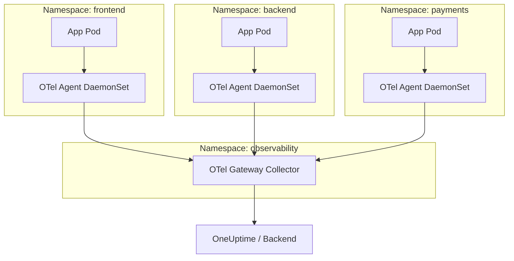

# How to Configure OpenTelemetry for Kubernetes Multi-Namespace Environments

Author: [nawazdhandala](https://www.github.com/nawazdhandala)

Tags: OpenTelemetry, Kubernetes, Observability, Multi-Namespace, Collector

Description: Learn how to configure OpenTelemetry collectors and instrumentation across multiple Kubernetes namespaces for unified observability.

---

Running a Kubernetes cluster with a single namespace is straightforward. But production environments rarely stay that simple. You end up with dozens of namespaces for different teams, environments, or microservices. Observability across all of them becomes a real challenge.

This guide walks through how to configure OpenTelemetry in multi-namespace Kubernetes environments. We will cover collector deployment strategies, namespace-aware routing, and practical configurations that scale.

## Why Multi-Namespace Observability Is Tricky

Each Kubernetes namespace acts as a logical boundary. Services in one namespace might talk to services in another, but your telemetry pipeline needs to understand these boundaries without being blocked by them.

Common problems include:

- **Telemetry data missing namespace context** - traces and metrics lack the information needed to identify which namespace generated them.
- **Collector deployment confusion** - should you run one collector per namespace or one central collector?
- **RBAC restrictions** - collectors need permissions to discover and scrape services across namespaces.
- **Routing complexity** - different namespaces might need different sampling rates or export destinations.

## Deployment Architecture Options

There are two primary patterns for deploying the OpenTelemetry Collector in multi-namespace clusters. You can use them independently or combine them.



The recommended approach is a two-tier architecture: DaemonSet agents in each namespace that forward to a central gateway collector.

## Setting Up the Gateway Collector

Start by creating a dedicated namespace for your observability stack. This keeps the collector infrastructure separate from application workloads.

```yaml
# Create a dedicated namespace for observability components
apiVersion: v1
kind: Namespace
metadata:
  name: observability
  labels:
    purpose: monitoring
```

Next, deploy the gateway collector in this namespace. The gateway receives telemetry from all namespace-level agents and handles exporting.

```yaml
# Gateway collector deployment - central aggregation point
apiVersion: opentelemetry.io/v1beta1
kind: OpenTelemetryCollector
metadata:
  name: otel-gateway
  namespace: observability
spec:
  mode: deployment
  replicas: 2
  config:
    receivers:
      otlp:
        protocols:
          grpc:
            endpoint: 0.0.0.0:4317
          http:
            endpoint: 0.0.0.0:4318

    processors:
      batch:
        # Batch telemetry to reduce export overhead
        send_batch_size: 1024
        timeout: 5s

      # Add namespace metadata from resource attributes
      resource:
        attributes:
          - key: deployment.environment
            from_attribute: k8s.namespace.name
            action: upsert

    exporters:
      otlp:
        # Send to your observability backend
        endpoint: "https://oneuptime-ingest.example.com:4317"
        headers:
          Authorization: "Bearer ${ONEUPTIME_API_KEY}"

    service:
      pipelines:
        traces:
          receivers: [otlp]
          processors: [batch, resource]
          exporters: [otlp]
        metrics:
          receivers: [otlp]
          processors: [batch, resource]
          exporters: [otlp]
        logs:
          receivers: [otlp]
          processors: [batch, resource]
          exporters: [otlp]
```

Expose the gateway within the cluster so agents can reach it from any namespace.

```yaml
# Service to expose the gateway collector cluster-wide
apiVersion: v1
kind: Service
metadata:
  name: otel-gateway
  namespace: observability
spec:
  selector:
    app.kubernetes.io/name: otel-gateway-collector
  ports:
    - name: otlp-grpc
      port: 4317
      targetPort: 4317
    - name: otlp-http
      port: 4318
      targetPort: 4318
  type: ClusterIP
```

## Deploying Namespace-Level Agents

Each namespace gets a DaemonSet-based agent collector. These agents run on every node and collect telemetry from local pods. They enrich the data with Kubernetes metadata and forward it to the gateway.

```yaml
# DaemonSet agent collector - runs on every node
apiVersion: opentelemetry.io/v1beta1
kind: OpenTelemetryCollector
metadata:
  name: otel-agent
  namespace: frontend  # Deploy one per namespace or cluster-wide
spec:
  mode: daemonset
  config:
    receivers:
      otlp:
        protocols:
          grpc:
            endpoint: 0.0.0.0:4317
          http:
            endpoint: 0.0.0.0:4318

    processors:
      # Enrich telemetry with Kubernetes metadata
      k8sattributes:
        auth_type: "serviceAccount"
        passthrough: false
        extract:
          metadata:
            - k8s.pod.name
            - k8s.pod.uid
            - k8s.namespace.name
            - k8s.node.name
            - k8s.deployment.name
          labels:
            - tag_name: app.label.team
              key: team
              from: pod

      # Memory limiter to prevent OOM on nodes
      memory_limiter:
        check_interval: 5s
        limit_mib: 256
        spike_limit_mib: 64

      batch:
        send_batch_size: 512
        timeout: 2s

    exporters:
      otlp:
        # Forward to the gateway collector in the observability namespace
        endpoint: "otel-gateway.observability.svc.cluster.local:4317"
        tls:
          insecure: true

    service:
      pipelines:
        traces:
          receivers: [otlp]
          processors: [memory_limiter, k8sattributes, batch]
          exporters: [otlp]
        metrics:
          receivers: [otlp]
          processors: [memory_limiter, k8sattributes, batch]
          exporters: [otlp]
```

## RBAC Configuration for Cross-Namespace Discovery

The `k8sattributes` processor needs permission to query the Kubernetes API for pod metadata. You need a ClusterRole and ClusterRoleBinding, not a namespace-scoped Role.

```yaml
# ClusterRole granting read access to pods and namespaces
apiVersion: rbac.authorization.k8s.io/v1
kind: ClusterRole
metadata:
  name: otel-collector-k8s-reader
rules:
  - apiGroups: [""]
    resources: ["pods", "namespaces", "nodes"]
    verbs: ["get", "list", "watch"]
  - apiGroups: ["apps"]
    resources: ["deployments", "replicasets", "statefulsets"]
    verbs: ["get", "list", "watch"]
---
# Bind the role to the collector's service account
apiVersion: rbac.authorization.k8s.io/v1
kind: ClusterRoleBinding
metadata:
  name: otel-collector-k8s-reader-binding
roleRef:
  apiGroup: rbac.authorization.k8s.io
  kind: ClusterRole
  name: otel-collector-k8s-reader
subjects:
  - kind: ServiceAccount
    name: otel-agent-collector
    namespace: frontend
  - kind: ServiceAccount
    name: otel-agent-collector
    namespace: backend
  - kind: ServiceAccount
    name: otel-agent-collector
    namespace: payments
```

## Namespace-Specific Routing and Filtering

Sometimes you want different behavior for different namespaces. The `filter` processor lets you include or exclude telemetry based on resource attributes.

For example, you might want to sample more aggressively in staging namespaces while keeping full fidelity for production.

```yaml
# Routing processor to send telemetry to different pipelines based on namespace
processors:
  # Filter for production namespaces - keep everything
  filter/production:
    error_mode: ignore
    traces:
      span:
        - 'resource.attributes["k8s.namespace.name"] == "staging"'

  # Tail sampling for staging namespaces - keep only errors and slow spans
  tail_sampling:
    decision_wait: 10s
    policies:
      - name: errors-policy
        type: status_code
        status_code:
          status_codes: [ERROR]
      - name: latency-policy
        type: latency
        latency:
          threshold_ms: 1000

service:
  pipelines:
    # Production traces - full fidelity
    traces/production:
      receivers: [otlp]
      processors: [filter/production, batch]
      exporters: [otlp]
    # Staging traces - sampled
    traces/staging:
      receivers: [otlp]
      processors: [tail_sampling, batch]
      exporters: [otlp]
```

## Application-Level Configuration

Applications inside each namespace need to know where to send their telemetry. The simplest approach is to set environment variables on your pods.

```yaml
# Pod spec with OpenTelemetry environment variables
apiVersion: apps/v1
kind: Deployment
metadata:
  name: my-service
  namespace: backend
spec:
  template:
    spec:
      containers:
        - name: my-service
          image: my-service:latest
          env:
            # Point to the local agent's OTLP endpoint
            - name: OTEL_EXPORTER_OTLP_ENDPOINT
              value: "http://otel-agent-collector.backend.svc.cluster.local:4317"
            # Service name for identifying this application
            - name: OTEL_SERVICE_NAME
              value: "my-service"
            # Automatically include namespace in resource attributes
            - name: OTEL_RESOURCE_ATTRIBUTES
              value: "k8s.namespace.name=backend,service.version=1.2.3"
```

If you are using the OpenTelemetry Operator, you can use the `Instrumentation` CRD to inject these settings automatically.

```yaml
# Auto-instrumentation configuration for a specific namespace
apiVersion: opentelemetry.io/v1alpha1
kind: Instrumentation
metadata:
  name: auto-instrumentation
  namespace: backend
spec:
  exporter:
    endpoint: http://otel-agent-collector.backend.svc.cluster.local:4317
  propagators:
    - tracecontext
    - baggage
  sampler:
    type: parentbased_traceidratio
    argument: "0.5"
  python:
    image: ghcr.io/open-telemetry/opentelemetry-operator/autoinstrumentation-python:latest
  java:
    image: ghcr.io/open-telemetry/opentelemetry-operator/autoinstrumentation-java:latest
  nodejs:
    image: ghcr.io/open-telemetry/opentelemetry-operator/autoinstrumentation-nodejs:latest
```

## Verifying Cross-Namespace Traces

Once everything is deployed, test that traces flow correctly across namespaces. A request from the frontend namespace that calls a backend service should produce a single trace spanning both namespaces.

Look for these resource attributes in your traces:

- `k8s.namespace.name` - should reflect the actual namespace of each span
- `k8s.pod.name` - the specific pod that generated the span
- `k8s.deployment.name` - the deployment that owns the pod

If namespaces are missing from your spans, check that the `k8sattributes` processor is configured and that the RBAC permissions are correct.

## Summary

Configuring OpenTelemetry across multiple Kubernetes namespaces comes down to a few key decisions. Use a two-tier architecture with namespace agents and a central gateway. Set up proper RBAC so collectors can discover pods across namespace boundaries. Leverage the `k8sattributes` processor to enrich every piece of telemetry with namespace context. And use routing or filtering processors when different namespaces need different treatment.

This setup gives you full visibility across your entire cluster while respecting the organizational boundaries that namespaces provide. The telemetry pipeline itself stays manageable even as your cluster grows.
