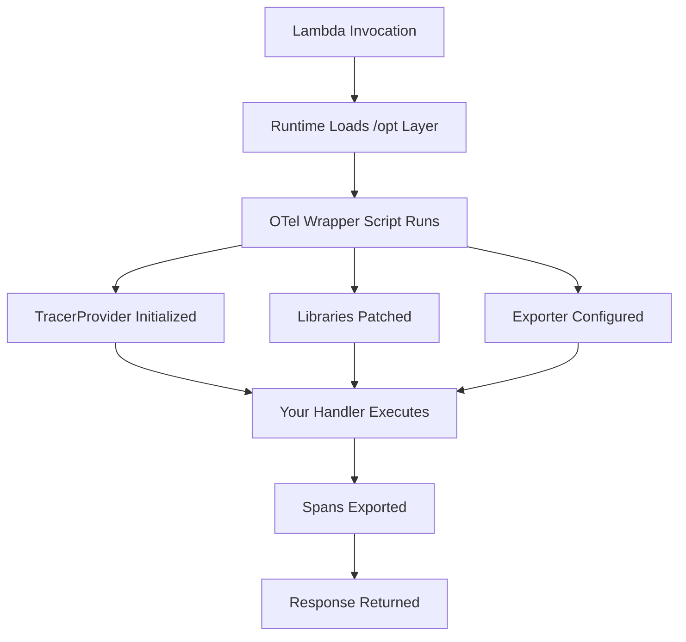
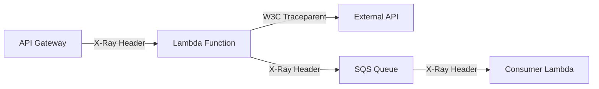

# How to Use OpenTelemetry Lambda Layers for Auto-Instrumentation

Author: [nawazdhandala](https://www.github.com/nawazdhandala)

Tags: OpenTelemetry, AWS Lambda, Lambda Layers, Auto-Instrumentation, Serverless, Tracing

Description: A hands-on guide to adding OpenTelemetry auto-instrumentation to AWS Lambda functions using managed Lambda layers for Python, Node.js, and Java.

---

AWS Lambda layers let you package libraries and tools separately from your function code. The OpenTelemetry project publishes official Lambda layers that add auto-instrumentation to your functions without any code changes. You attach a layer, set a few environment variables, and your function starts producing traces, metrics, and logs.

This approach is appealing because it keeps your function code clean and makes it easy to roll instrumentation out across dozens or hundreds of functions. This post covers how to set up and configure these layers for Python, Node.js, and Java runtimes.

## How Lambda Layers Work with OpenTelemetry

A Lambda layer is a ZIP archive that gets extracted into the `/opt` directory of your function's execution environment. OpenTelemetry Lambda layers contain the SDK, auto-instrumentation libraries, and a wrapper script that initializes everything before your handler runs.



The wrapper script is the key piece. It intercepts the normal Lambda handler invocation, sets up the OpenTelemetry SDK, and then calls your actual handler. From your function's perspective, nothing changes. But every HTTP call, AWS SDK operation, and database query now produces spans automatically.

## Setting Up the Python Layer

The AWS-managed OpenTelemetry Python layer includes the OpenTelemetry SDK, the AWS Lambda instrumentation, and auto-instrumentation for popular libraries like `boto3`, `requests`, and `urllib3`.

First, add the layer to your function. You can do this through the AWS Console, CLI, or infrastructure as code.

```bash
# Add the OpenTelemetry Python layer to your function
# Replace the ARN with the latest version for your region
aws lambda update-function-configuration \
  --function-name my-python-function \
  --layers arn:aws:lambda:us-east-1:184161586896:layer:opentelemetry-python-aws-sdk-amd64:1 \
  --environment "Variables={
    AWS_LAMBDA_EXEC_WRAPPER=/opt/otel-instrument,
    OTEL_SERVICE_NAME=my-python-function,
    OTEL_EXPORTER_OTLP_ENDPOINT=http://localhost:4318,
    OTEL_TRACES_EXPORTER=otlp,
    OTEL_METRICS_EXPORTER=otlp,
    OTEL_PROPAGATORS=tracecontext,baggage,xray
  }"
```

The `AWS_LAMBDA_EXEC_WRAPPER` environment variable tells the Lambda runtime to execute the `/opt/otel-instrument` script before your handler. This script sets up the Python auto-instrumentation agent.

Here is what a basic Python handler looks like. No OpenTelemetry imports needed.

```python
# handler.py
# Standard Lambda handler - no OTel code required
# The layer handles all instrumentation automatically
import json
import boto3

dynamodb = boto3.resource('dynamodb')
table = dynamodb.Table('users')

def lambda_handler(event, context):
    # This DynamoDB call will be traced automatically
    user_id = event.get('pathParameters', {}).get('id')

    response = table.get_item(Key={'userId': user_id})

    if 'Item' not in response:
        return {
            'statusCode': 404,
            'body': json.dumps({'error': 'User not found'})
        }

    return {
        'statusCode': 200,
        'body': json.dumps(response['Item'])
    }
```

The layer automatically creates spans for the DynamoDB `get_item` call, including attributes like the table name, operation, and response status. You get this visibility without writing a single line of instrumentation code.

## Setting Up the Node.js Layer

The Node.js layer works similarly but uses a different wrapper mechanism. Node.js supports the `--require` flag to preload modules, which the layer leverages for initialization.

```bash
# Add the OpenTelemetry Node.js layer
aws lambda update-function-configuration \
  --function-name my-node-function \
  --layers arn:aws:lambda:us-east-1:184161586896:layer:opentelemetry-nodejs-amd64:1 \
  --environment "Variables={
    AWS_LAMBDA_EXEC_WRAPPER=/opt/otel-handler,
    OTEL_SERVICE_NAME=my-node-function,
    OTEL_EXPORTER_OTLP_ENDPOINT=http://localhost:4318,
    OTEL_NODE_ENABLED_INSTRUMENTATIONS=aws-sdk,http,fetch
  }"
```

The `OTEL_NODE_ENABLED_INSTRUMENTATIONS` variable is particularly useful. Instead of instrumenting every library the layer supports, you can specify exactly which instrumentations to activate. This reduces initialization time and keeps your traces focused.

```javascript
// handler.js
// Standard Node.js handler - auto-instrumented by the layer
const { DynamoDBClient, GetItemCommand } = require('@aws-sdk/client-dynamodb');

const client = new DynamoDBClient({});

exports.handler = async (event) => {
  const userId = event.pathParameters?.id;

  // This AWS SDK v3 call is automatically traced
  const command = new GetItemCommand({
    TableName: 'users',
    Key: { userId: { S: userId } },
  });

  try {
    const result = await client.send(command);

    if (!result.Item) {
      return { statusCode: 404, body: JSON.stringify({ error: 'Not found' }) };
    }

    return { statusCode: 200, body: JSON.stringify(result.Item) };
  } catch (error) {
    // Errors are captured as span events automatically
    return { statusCode: 500, body: JSON.stringify({ error: 'Internal error' }) };
  }
};
```

The Node.js layer patches the AWS SDK v3 client, so every `send()` call produces a span with the service name, operation, and request ID as attributes. HTTP calls made through `node:http`, `node:https`, or the `fetch` API are also traced.

## Setting Up the Java Layer

Java Lambda functions benefit from the OpenTelemetry Java Agent, which performs bytecode manipulation to instrument libraries at the JVM level. The layer packages this agent along with Lambda-specific configuration.

```bash
# Add the OpenTelemetry Java layer
aws lambda update-function-configuration \
  --function-name my-java-function \
  --layers arn:aws:lambda:us-east-1:184161586896:layer:opentelemetry-java-agent-amd64:1 \
  --environment "Variables={
    AWS_LAMBDA_EXEC_WRAPPER=/opt/otel-handler,
    OTEL_SERVICE_NAME=my-java-function,
    OTEL_EXPORTER_OTLP_ENDPOINT=http://localhost:4318,
    JAVA_TOOL_OPTIONS=-javaagent:/opt/opentelemetry-javaagent.jar
  }"
```

The `JAVA_TOOL_OPTIONS` environment variable injects the OpenTelemetry Java agent into the JVM. This is the standard mechanism for attaching Java agents in Lambda.

```java
// Handler.java
// Standard Java Lambda handler with automatic instrumentation
package com.example;

import com.amazonaws.services.lambda.runtime.Context;
import com.amazonaws.services.lambda.runtime.RequestHandler;
import com.amazonaws.services.lambda.runtime.events.APIGatewayProxyRequestEvent;
import com.amazonaws.services.lambda.runtime.events.APIGatewayProxyResponseEvent;
import software.amazon.awssdk.services.dynamodb.DynamoDbClient;
import software.amazon.awssdk.services.dynamodb.model.GetItemRequest;
import software.amazon.awssdk.services.dynamodb.model.GetItemResponse;
import software.amazon.awssdk.services.dynamodb.model.AttributeValue;

import java.util.Map;

public class Handler implements RequestHandler<APIGatewayProxyRequestEvent, APIGatewayProxyResponseEvent> {

    // The DynamoDB client is automatically instrumented by the agent
    private final DynamoDbClient dynamoDb = DynamoDbClient.create();

    @Override
    public APIGatewayProxyResponseEvent handleRequest(
            APIGatewayProxyRequestEvent event, Context context) {

        String userId = event.getPathParameters().get("id");

        // This call produces a DynamoDB span with full attributes
        GetItemResponse response = dynamoDb.getItem(GetItemRequest.builder()
                .tableName("users")
                .key(Map.of("userId", AttributeValue.builder().s(userId).build()))
                .build());

        if (!response.hasItem()) {
            return new APIGatewayProxyResponseEvent()
                    .withStatusCode(404)
                    .withBody("{\"error\": \"Not found\"}");
        }

        return new APIGatewayProxyResponseEvent()
                .withStatusCode(200)
                .withBody(response.item().toString());
    }
}
```

Java cold starts are already significant, and the agent adds to that. For Java functions, consider pairing the layer with SnapStart or provisioned concurrency to offset the initialization cost.

## Configuring Propagation for Distributed Traces

Lambda functions rarely operate in isolation. They are triggered by API Gateway, SQS, SNS, or other AWS services. For distributed tracing to work, context must propagate across these service boundaries.

```bash
# Environment variables for cross-service trace propagation
OTEL_PROPAGATORS=tracecontext,baggage,xray
```

The `xray` propagator is important because many AWS services inject X-Ray trace headers. By including it alongside `tracecontext`, your Lambda function can participate in traces that originate from X-Ray instrumented services while also supporting W3C Trace Context for non-AWS callers.



This dual-propagation setup ensures your traces are connected regardless of whether the upstream service uses X-Ray or W3C Trace Context.

## Managing Layer Versions with Infrastructure as Code

In production, you will want to pin layer versions and update them deliberately. Here is how to manage layers in a CloudFormation template.

```yaml
# template.yaml
# CloudFormation template with pinned layer versions
AWSTemplateFormatVersion: '2010-09-09'
Transform: AWS::Serverless-2016-10-31

Parameters:
  OTelLayerVersion:
    Type: String
    # Pin the version and update through your deployment pipeline
    Default: "1"
    Description: Version of the OpenTelemetry Lambda layer

Resources:
  MyFunction:
    Type: AWS::Serverless::Function
    Properties:
      Handler: handler.lambda_handler
      Runtime: python3.12
      MemorySize: 256
      Timeout: 30
      Layers:
        # Reference the layer with a parameterized version
        - !Sub "arn:aws:lambda:${AWS::Region}:184161586896:layer:opentelemetry-python-aws-sdk-amd64:${OTelLayerVersion}"
      Environment:
        Variables:
          AWS_LAMBDA_EXEC_WRAPPER: /opt/otel-instrument
          OTEL_SERVICE_NAME: !Ref AWS::StackName
          OTEL_EXPORTER_OTLP_ENDPOINT: http://localhost:4318
          OTEL_RESOURCE_ATTRIBUTES: !Sub "deployment.environment=${Environment}"
```

By parameterizing the layer version, you can test new versions in staging before promoting them to production. This avoids surprises from breaking changes in the instrumentation layer.

## Troubleshooting Common Issues

A few things trip people up when working with Lambda layers.

If you see no traces at all, check that `AWS_LAMBDA_EXEC_WRAPPER` is set correctly. The wrapper path differs between runtimes and layer versions. Also verify that your function's execution role has permission to make outbound network calls to your OTLP endpoint.

If traces appear but are missing spans for specific libraries, the auto-instrumentation may not include that library. Check the layer's documentation for the list of supported instrumentations. You can supplement auto-instrumentation with manual spans for unsupported libraries.

If cold starts are too slow, reduce the number of active instrumentations using `OTEL_NODE_ENABLED_INSTRUMENTATIONS` for Node.js or `OTEL_INSTRUMENTATION_[NAME]_ENABLED=false` for Python. Only instrument the libraries that matter for your observability goals.

Lambda layers make OpenTelemetry adoption straightforward for serverless workloads. The zero-code-change approach means platform teams can roll out instrumentation across all functions without requiring application developers to learn the OpenTelemetry API.
