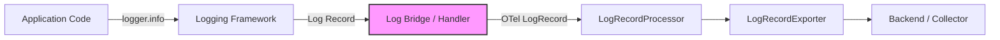
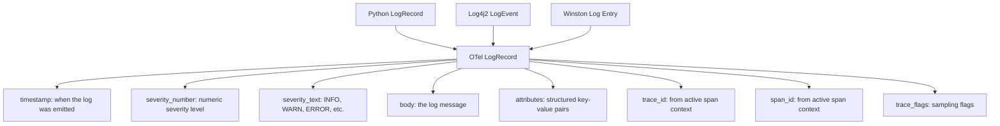

# How to Use the OpenTelemetry Log Bridge API with Existing Logging Frameworks

Author: [nawazdhandala](https://www.github.com/nawazdhandala)

Tags: OpenTelemetry, Logging, Log Bridge API, Python, Java, Observability, Integration

Description: Learn how to use the OpenTelemetry Log Bridge API to connect existing logging frameworks like Python logging, Log4j, and Winston to the OpenTelemetry ecosystem.

---

Most applications already have logging in place long before they adopt OpenTelemetry. The Log Bridge API exists to connect those existing logging frameworks to OpenTelemetry without rewriting all your log statements. Instead of replacing your current logging with OpenTelemetry-native calls, the bridge captures logs from your existing framework and funnels them into the OpenTelemetry pipeline. This means your logs get trace context correlation, unified export, and consistent processing alongside your traces and metrics.

## What the Log Bridge API Does

The Log Bridge API is not a logging API for end users. The OpenTelemetry specification is explicit about this. Application developers should continue using their preferred logging framework (Python's `logging`, Java's `Log4j` or `SLF4J`, Node.js's `winston` or `pino`). The bridge sits between the logging framework and OpenTelemetry, translating log records into the OpenTelemetry log data model.



The bridge component (shown in pink) is the translation layer. It receives log records in the framework's native format and converts them to OpenTelemetry `LogRecord` objects. These objects flow through the same processor and exporter pipeline used by all OpenTelemetry signals.

## Python: Bridging the `logging` Module

Python's built-in `logging` module is the most common logging framework in the Python ecosystem. OpenTelemetry provides a handler that plugs into the standard logging infrastructure.

First, install the required packages:

```bash
# Install the OpenTelemetry logging SDK and OTLP exporter
pip install opentelemetry-sdk opentelemetry-exporter-otlp-proto-grpc
```

Now configure the bridge. The key class is `LoggingHandler`, which is a standard Python logging handler that forwards records to OpenTelemetry:

```python
import logging
from opentelemetry import trace
from opentelemetry.sdk.trace import TracerProvider
from opentelemetry.sdk.trace.export import BatchSpanProcessor
from opentelemetry.sdk._logs import LoggerProvider, LoggingHandler
from opentelemetry.sdk._logs.export import (
    BatchLogRecordProcessor,
    ConsoleLogExporter,
)
from opentelemetry.exporter.otlp.proto.grpc._log_exporter import (
    OTLPLogExporter,
)

# Step 1: Set up tracing (needed for trace context correlation)
trace_provider = TracerProvider()
trace.set_tracer_provider(trace_provider)

# Step 2: Set up the log provider and exporter
log_provider = LoggerProvider()

# Use OTLP exporter for production
# For demonstration, we use the console exporter
log_provider.add_log_record_processor(
    BatchLogRecordProcessor(ConsoleLogExporter())
)

# Step 3: Create the bridge handler
# This handler converts Python log records to OTel log records
handler = LoggingHandler(
    level=logging.INFO,
    logger_provider=log_provider,
)

# Step 4: Attach the handler to Python's root logger
logging.getLogger().addHandler(handler)
logging.getLogger().setLevel(logging.INFO)
```

With this setup in place, every call to `logging.info()`, `logging.error()`, or any other log method flows through the bridge. The bridge automatically attaches the current trace context to each log record:

```python
import logging
from opentelemetry import trace

logger = logging.getLogger("my.service")
tracer = trace.get_tracer("my.service")

def handle_request(request_id):
    # Start a span for this request
    with tracer.start_as_current_span("handle-request") as span:
        span.set_attribute("request.id", request_id)

        # These log calls automatically get trace_id and span_id
        # attached by the LoggingHandler bridge
        logger.info("Processing request %s", request_id)

        try:
            result = process(request_id)
            logger.info("Request %s completed successfully", request_id)
        except Exception as e:
            # The error log will carry the same trace context
            logger.error("Request %s failed: %s", request_id, str(e))
            raise
```

The exported log records will contain `trace_id`, `span_id`, and `trace_flags` fields that match the active span. This correlation is what makes the bridge so valuable. When you view a trace in your backend, you can see the associated logs without any manual correlation.

## Controlling What Gets Bridged

You probably do not want every log record from every library flowing into OpenTelemetry. Third-party libraries often emit verbose debug logs that would overwhelm your pipeline. Control this with standard Python logging configuration:

```python
import logging
from opentelemetry.sdk._logs import LoggingHandler

# Create the bridge handler at WARNING level
# Only WARNING and above go to OpenTelemetry
otel_handler = LoggingHandler(level=logging.WARNING)

# Your application logger sends everything to OpenTelemetry
app_logger = logging.getLogger("my.application")
app_logger.addHandler(otel_handler)
app_logger.setLevel(logging.DEBUG)

# But noisy libraries only send warnings and errors
noisy_lib_logger = logging.getLogger("urllib3")
noisy_lib_logger.addHandler(otel_handler)
noisy_lib_logger.setLevel(logging.WARNING)

# You can also keep your existing handlers for console/file output
console_handler = logging.StreamHandler()
console_handler.setLevel(logging.DEBUG)
app_logger.addHandler(console_handler)
```

This approach lets you keep detailed local logs while only sending important records to the OpenTelemetry pipeline.

## Java: Bridging Log4j2

The Java ecosystem has several logging frameworks, with Log4j2 and SLF4J being the most popular. OpenTelemetry provides an appender for Log4j2 that acts as the bridge.

Add the dependency to your `pom.xml`:

```xml
<!-- OpenTelemetry Log4j2 Appender -->
<dependency>
    <groupId>io.opentelemetry.instrumentation</groupId>
    <artifactId>opentelemetry-log4j-appender-2.17</artifactId>
    <version>2.12.0-alpha</version>
</dependency>
```

Configure the appender in your `log4j2.xml`:

```xml
<?xml version="1.0" encoding="UTF-8"?>
<Configuration>
    <Appenders>
        <!-- Standard console appender for local output -->
        <Console name="Console" target="SYSTEM_OUT">
            <PatternLayout pattern="%d{HH:mm:ss.SSS} [%t] %-5level %logger{36} - %msg%n"/>
        </Console>

        <!-- OpenTelemetry bridge appender -->
        <!-- This captures log records and sends them to the OTel pipeline -->
        <OpenTelemetry name="OTelAppender"
                       captureExperimentalAttributes="true"
                       captureCodeAttributes="true"
                       captureMarkerAttribute="true">
        </OpenTelemetry>
    </Appenders>

    <Loggers>
        <!-- Application logger: send to both console and OTel -->
        <Logger name="com.mycompany" level="info" additivity="false">
            <AppenderRef ref="Console"/>
            <AppenderRef ref="OTelAppender"/>
        </Logger>

        <!-- Noisy library: only warnings to OTel -->
        <Logger name="org.apache.http" level="warn" additivity="false">
            <AppenderRef ref="Console" level="info"/>
            <AppenderRef ref="OTelAppender" level="warn"/>
        </Logger>

        <!-- Root logger -->
        <Root level="info">
            <AppenderRef ref="Console"/>
        </Root>
    </Loggers>
</Configuration>
```

The `captureExperimentalAttributes` flag tells the appender to include extra attributes like thread name and logger name. The `captureCodeAttributes` flag adds source location information (file, line number, method).

Your application code does not change at all:

```java
import org.apache.logging.log4j.LogManager;
import org.apache.logging.log4j.Logger;
import io.opentelemetry.api.trace.Span;
import io.opentelemetry.api.trace.Tracer;

public class OrderService {
    // Standard Log4j2 logger, nothing OTel-specific
    private static final Logger logger = LogManager.getLogger(OrderService.class);

    private final Tracer tracer;

    public OrderService(Tracer tracer) {
        this.tracer = tracer;
    }

    public void processOrder(String orderId) {
        // Start a span
        Span span = tracer.spanBuilder("process-order")
            .setAttribute("order.id", orderId)
            .startSpan();

        try (var scope = span.makeCurrent()) {
            // Log statements automatically get trace context
            logger.info("Starting order processing for {}", orderId);

            validateOrder(orderId);
            chargePayment(orderId);
            fulfillOrder(orderId);

            logger.info("Order {} processed successfully", orderId);
        } catch (Exception e) {
            logger.error("Order {} processing failed", orderId, e);
            span.recordException(e);
            throw e;
        } finally {
            span.end();
        }
    }
}
```

The Log4j2 appender automatically picks up the active span context and attaches it to the log record. When the record flows through the OpenTelemetry pipeline, it carries the trace ID and span ID.

## Node.js: Bridging Winston

Winston is one of the most popular logging libraries for Node.js. You can bridge it to OpenTelemetry using the instrumentation package:

```bash
# Install the Winston instrumentation
npm install @opentelemetry/instrumentation-winston
```

Set up the instrumentation before creating your Winston logger:

```javascript
const { NodeSDK } = require('@opentelemetry/sdk-node');
const { WinstonInstrumentation } = require('@opentelemetry/instrumentation-winston');
const { OTLPLogExporter } = require('@opentelemetry/exporter-logs-otlp-grpc');
const { BatchLogRecordProcessor } = require('@opentelemetry/sdk-logs');
const winston = require('winston');

// Initialize the SDK with Winston instrumentation
// This must happen before creating Winston loggers
const sdk = new NodeSDK({
    instrumentations: [
        new WinstonInstrumentation({
            // Inject trace context into log messages
            logHook: (span, record) => {
                // Add custom attributes from the span to log records
                record['service.name'] = 'my-node-service';
            },
        }),
    ],
    logRecordProcessor: new BatchLogRecordProcessor(
        new OTLPLogExporter({
            url: 'http://localhost:4317',
        })
    ),
});

sdk.start();

// Create a Winston logger as usual
const logger = winston.createLogger({
    level: 'info',
    format: winston.format.combine(
        winston.format.timestamp(),
        winston.format.json()
    ),
    transports: [
        // Console output for local development
        new winston.transports.Console(),
    ],
});
```

With the instrumentation active, Winston log records automatically include trace context fields. Your application code stays the same:

```javascript
const { trace } = require('@opentelemetry/api');

const tracer = trace.getTracer('my.service');

async function handleRequest(req, res) {
    // Start a span for this request
    const span = tracer.startSpan('handle-request');

    try {
        // Winston logs within this span context automatically
        // get trace_id and span_id injected
        logger.info('Processing request', {
            requestId: req.id,
            path: req.path,
        });

        const result = await processRequest(req);

        logger.info('Request completed', {
            requestId: req.id,
            duration: result.duration,
        });

        return result;
    } catch (error) {
        logger.error('Request failed', {
            requestId: req.id,
            error: error.message,
        });
        throw error;
    } finally {
        span.end();
    }
}
```

## Understanding the Log Data Model

The bridge translates framework-specific log records into the OpenTelemetry log data model. Understanding this model helps you verify that the bridge is working correctly:



Each framework maps its fields slightly differently:

- Python's `logging.INFO` maps to severity number 9 and severity text "INFO"
- Log4j2's `Level.WARN` maps to severity number 13 and severity text "WARN"
- Winston's `error` level maps to severity number 17 and severity text "ERROR"

The severity mapping follows the OpenTelemetry specification's severity number table, which defines ranges for each severity level. Bridges handle this mapping automatically.

## Log Record Processors and Exporters

Once logs are in the OpenTelemetry format, they flow through the same processor/exporter pattern as traces:

```python
from opentelemetry.sdk._logs import LoggerProvider
from opentelemetry.sdk._logs.export import (
    BatchLogRecordProcessor,
    SimpleLogRecordProcessor,
)
from opentelemetry.exporter.otlp.proto.grpc._log_exporter import (
    OTLPLogExporter,
)

log_provider = LoggerProvider()

# BatchLogRecordProcessor is recommended for production
# It batches log records and sends them in bulk
log_provider.add_log_record_processor(
    BatchLogRecordProcessor(
        OTLPLogExporter(endpoint="http://localhost:4317"),
        # Tune batch parameters for your workload
        max_queue_size=2048,
        max_export_batch_size=512,
        schedule_delay_millis=5000,
    )
)

# SimpleLogRecordProcessor sends each record immediately
# Only use for development or debugging
# log_provider.add_log_record_processor(
#     SimpleLogRecordProcessor(ConsoleLogExporter())
# )
```

The `BatchLogRecordProcessor` accumulates log records and exports them in batches, reducing the overhead of individual network calls. For production use, always prefer the batch processor. The `SimpleLogRecordProcessor` exports each record immediately and is useful for debugging but adds latency to every log call.

## Adding Custom Attributes

The bridge captures standard fields from the logging framework, but you often want to add application-specific attributes. Use your framework's built-in structured logging support:

```python
import logging

logger = logging.getLogger("order.service")

def process_order(order_id, customer_id):
    # Use the 'extra' parameter to add structured attributes
    # The bridge converts these to OpenTelemetry attributes
    logger.info(
        "Processing order",
        extra={
            "order.id": order_id,
            "customer.id": customer_id,
            "order.priority": "high",
        },
    )
```

In Java with Log4j2, use the `ThreadContext` (MDC) for attributes that apply to all log records in a request:

```java
import org.apache.logging.log4j.ThreadContext;
import org.apache.logging.log4j.LogManager;
import org.apache.logging.log4j.Logger;

public class OrderService {
    private static final Logger logger = LogManager.getLogger();

    public void processOrder(String orderId, String customerId) {
        // MDC values are captured as log record attributes
        ThreadContext.put("order.id", orderId);
        ThreadContext.put("customer.id", customerId);

        try {
            logger.info("Processing order");
            // All log records in this scope carry the MDC attributes
        } finally {
            ThreadContext.clearAll();
        }
    }
}
```

## Common Pitfalls

There are a few things to watch out for when using the Log Bridge API:

**Double emission**: If you add the OpenTelemetry handler to the root logger and also to a specific logger without setting `propagate=False`, log records may be emitted twice. Be explicit about handler attachment and propagation.

```python
# Wrong: logs from "my.app" go to root handler AND app handler
app_logger = logging.getLogger("my.app")
app_logger.addHandler(otel_handler)  # This handler
logging.getLogger().addHandler(otel_handler)  # AND this one

# Right: disable propagation or only attach to root
app_logger = logging.getLogger("my.app")
app_logger.addHandler(otel_handler)
app_logger.propagate = False  # Prevents double emission
```

**Missing trace context**: The bridge can only attach trace context if there is an active span when the log is emitted. Logs emitted outside of any span will have empty trace and span IDs. This is normal for startup logs and background tasks.

**Performance overhead**: The bridge adds a small amount of overhead to each log call. For extremely hot paths that log at high frequency, consider whether every record needs to flow through the OpenTelemetry pipeline, or if local-only logging is sufficient for some messages.

## Conclusion

The Log Bridge API solves the practical problem of unifying existing logs with OpenTelemetry without rewriting your application's logging code. By adding a handler, appender, or instrumentation to your existing framework, you get trace context correlation, unified export, and consistent processing. Python's `LoggingHandler`, Java's Log4j2 appender, and Node.js's Winston instrumentation all follow the same pattern: intercept logs at the framework level, translate them into the OpenTelemetry log data model, and send them through the standard processor and exporter pipeline. Start with your most important services, tune the severity levels to control volume, and let the bridge handle the translation.
