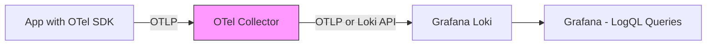

# How to Send OpenTelemetry Logs to Grafana Loki via the Collector

Author: [nawazdhandala](https://www.github.com/nawazdhandala)

Tags: OpenTelemetry, Grafana Loki, Logs, OpenTelemetry Collector, Observability

Description: How to configure the OpenTelemetry Collector to send structured logs to Grafana Loki with label mapping, resource attributes, and LogQL queries.

---

Grafana Loki is a log aggregation system designed to be cost-effective and easy to operate. Unlike traditional log platforms that index the full text of every log line, Loki only indexes a small set of labels and stores the log content as compressed chunks. This means it is significantly cheaper to run at scale. In this guide, we will set up the OpenTelemetry Collector to forward logs to Loki and then query them in Grafana.

## How Loki Handles OpenTelemetry Logs

Loki has native support for OpenTelemetry log ingestion. Starting with Loki 3.0, you can send OTLP logs directly to Loki's OTLP endpoint. Loki maps OpenTelemetry resource attributes and log attributes to Loki labels and structured metadata. This is a big improvement over earlier versions where you had to use the Collector's Loki exporter and manually map attributes to labels.



You have two options for sending logs from the Collector to Loki. The first is using the `otlphttp` exporter to send logs in OTLP format directly to Loki's OTLP endpoint. The second is using the dedicated `loki` exporter, which translates OTel logs into Loki's native push format. We will cover both approaches.

## Option 1: Using the OTLP Endpoint (Recommended for Loki 3.x)

If you are running Loki 3.0 or newer, the cleanest approach is to send OTLP directly to Loki. No format translation needed.

```yaml
# otel-collector-config-otlp.yaml
# Sends OTel logs to Loki via its native OTLP endpoint

receivers:
  otlp:
    protocols:
      grpc:
        endpoint: 0.0.0.0:4317
      http:
        endpoint: 0.0.0.0:4318

  # Also collect logs from files on the host
  filelog:
    include:
      - /var/log/app/*.log
    operators:
      # Parse JSON-formatted log files
      - type: json_parser
        timestamp:
          parse_from: attributes.timestamp
          layout: "%Y-%m-%dT%H:%M:%S.%fZ"
      # Move the message field to the log body
      - type: move
        from: attributes.message
        to: body

processors:
  batch:
    # Batch logs to reduce the number of HTTP requests to Loki
    send_batch_size: 1024
    timeout: 2s

  resource:
    attributes:
      # Ensure every log record has a service name
      - key: service.name
        value: "unknown-service"
        action: insert

  attributes:
    actions:
      # Remove noisy attributes that inflate label cardinality
      - key: log.file.path
        action: delete

exporters:
  otlphttp/loki:
    # Send logs to Loki's OTLP endpoint
    endpoint: http://loki:3100/otlp
    tls:
      insecure: true

service:
  pipelines:
    logs:
      receivers: [otlp, filelog]
      processors: [resource, attributes, batch]
      exporters: [otlphttp/loki]
```

When Loki receives OTLP logs, it automatically maps certain resource attributes to index labels. By default, `service.name`, `service.namespace`, and `service.instance.id` become labels. Everything else becomes structured metadata, which you can still query but is not indexed. This keeps the index small and Loki performant.

## Option 2: Using the Loki Exporter

If you are running an older version of Loki or need more control over label mapping, use the dedicated Loki exporter.

```yaml
# otel-collector-config-loki.yaml
# Sends OTel logs to Loki using the dedicated Loki exporter

receivers:
  otlp:
    protocols:
      grpc:
        endpoint: 0.0.0.0:4317

processors:
  batch:
    send_batch_size: 512
    timeout: 2s

  resource:
    attributes:
      # Add a static label for the environment
      - key: environment
        value: production
        action: upsert
      # Promote this attribute to a Loki label using the loki.attribute.labels hint
      - key: loki.attribute.labels
        value: environment
        action: insert

exporters:
  loki:
    # Send logs to Loki's push API
    endpoint: http://loki:3100/loki/api/v1/push
    default_labels_enabled:
      # Automatically add these OTel fields as Loki labels
      exporter: false
      job: true
      instance: true
      level: true

service:
  pipelines:
    logs:
      receivers: [otlp]
      processors: [resource, batch]
      exporters: [loki]
```

The `default_labels_enabled` section controls which OpenTelemetry fields automatically become Loki labels. Setting `level: true` maps the log severity level to a `level` label, which is extremely useful for filtering logs by severity in LogQL. The `loki.attribute.labels` resource attribute is a hint that tells the exporter to promote specific attributes to Loki labels.

## Loki Configuration

Here is a Loki configuration that accepts both OTLP and native push formats.

```yaml
# loki-config.yaml
# Configures Loki to accept OTLP logs and store them locally

auth_enabled: false

server:
  http_listen_port: 3100

common:
  path_prefix: /loki
  storage:
    filesystem:
      chunks_directory: /loki/chunks
      rules_directory: /loki/rules
  replication_factor: 1
  ring:
    kvstore:
      store: inmemory

limits_config:
  # Allow OTLP log ingestion
  allow_structured_metadata: true
  # Maximum log line size in bytes
  max_line_size: 256000
  # Retention period for logs
  retention_period: 720h

schema_config:
  configs:
    - from: 2024-01-01
      store: tsdb
      object_store: filesystem
      schema: v13
      index:
        prefix: index_
        period: 24h

storage_config:
  tsdb_shipper:
    active_index_directory: /loki/tsdb-index
    cache_location: /loki/tsdb-cache

query_range:
  results_cache:
    cache:
      embedded_cache:
        enabled: true
        max_size_mb: 100
```

The important setting here is `allow_structured_metadata: true`. This enables Loki to store OpenTelemetry attributes as structured metadata, which makes them queryable without indexing them as labels.

## Docker Compose Setup

```yaml
# docker-compose.yaml
# Runs Loki, the OTel Collector, and Grafana for log visualization

version: "3.8"

services:
  loki:
    image: grafana/loki:latest
    command: ["-config.file=/etc/loki.yaml"]
    volumes:
      - ./loki-config.yaml:/etc/loki.yaml
      - loki-data:/loki
    ports:
      - "3100:3100"

  otel-collector:
    image: otel/opentelemetry-collector-contrib:latest
    volumes:
      - ./otel-collector-config-otlp.yaml:/etc/otelcol-contrib/config.yaml
      - /var/log/app:/var/log/app:ro
    ports:
      - "4317:4317"
      - "4318:4318"
    depends_on:
      - loki

  grafana:
    image: grafana/grafana:latest
    ports:
      - "3000:3000"
    environment:
      - GF_SECURITY_ADMIN_PASSWORD=admin
    volumes:
      - ./grafana-datasources.yaml:/etc/grafana/provisioning/datasources/datasources.yaml
    depends_on:
      - loki

volumes:
  loki-data:
```

## Sending Logs from Your Application

Here is how to configure the OpenTelemetry SDK to send logs from a Python application. The OTel logging bridge connects Python's built-in logging module to the OTel pipeline.

```python
# logging_setup.py
# Configures Python logging to send structured logs via OpenTelemetry

import logging
from opentelemetry import trace
from opentelemetry.sdk._logs import LoggerProvider, LoggingHandler
from opentelemetry.sdk._logs.export import BatchLogRecordProcessor
from opentelemetry.exporter.otlp.proto.grpc._log_exporter import OTLPLogExporter
from opentelemetry.sdk.resources import Resource

# Define service resource attributes
resource = Resource.create({
    "service.name": "user-service",
    "service.version": "1.3.0",
    "deployment.environment": "production",
})

# Set up the OTel log exporter pointing to the Collector
log_exporter = OTLPLogExporter(endpoint="localhost:4317", insecure=True)

# Create the logger provider with a batch processor
logger_provider = LoggerProvider(resource=resource)
logger_provider.add_log_record_processor(BatchLogRecordProcessor(log_exporter))

# Create a logging handler that bridges Python logging to OTel
handler = LoggingHandler(
    level=logging.INFO,
    logger_provider=logger_provider,
)

# Attach the handler to the root logger
logging.getLogger().addHandler(handler)
logging.getLogger().setLevel(logging.INFO)

# Now standard Python logging calls will be sent to the Collector
logger = logging.getLogger("user-service")

def handle_user_request(user_id):
    # Get the current trace context so logs are correlated with traces
    current_span = trace.get_current_span()
    span_context = current_span.get_span_context()

    # Log with structured attributes - these become OTel log attributes
    logger.info(
        "Processing user request",
        extra={
            "user.id": user_id,
            "trace_id": format(span_context.trace_id, '032x'),
        }
    )
```

The key insight here is the trace context correlation. When you log inside an active span, the OpenTelemetry SDK automatically attaches the trace ID and span ID to the log record. This means you can click from a log line in Loki straight to the corresponding trace in Tempo.

## Querying Logs with LogQL

Once logs are in Loki, you query them using LogQL. Here are some practical examples.

```logql
# Find all error logs from the user-service
{service_name="user-service"} |= "error" | logfmt

# Parse JSON logs and filter by a specific field
{service_name="order-service"} | json | status_code >= 500

# Count error logs per service over time (useful for dashboards)
sum by (service_name) (count_over_time({level="error"}[5m]))

# Find logs with a specific trace ID for debugging
{service_name="user-service"} | trace_id = "abc123def456"
```

## Grafana Data Source Configuration

```yaml
# grafana-datasources.yaml
# Configures Loki as a data source with trace correlation

apiVersion: 1

datasources:
  - name: Loki
    type: loki
    access: proxy
    url: http://loki:3100
    jsonData:
      # Enable derived fields to extract trace IDs from log lines
      derivedFields:
        - datasourceUid: tempo
          matcherRegex: "trace_id=(\\w+)"
          name: TraceID
          url: "$${__value.raw}"
          matcherType: label
```

The `derivedFields` configuration creates clickable links from trace IDs in log lines to traces in Tempo. This is essential for the logs-to-traces correlation workflow.

## Dealing with Log Volume

Logs tend to be the highest-volume signal in observability. A few strategies can help manage costs. First, use the Collector's `filter` processor to drop logs you do not need before they reach Loki.

```yaml
# Filter processor to reduce log volume
processors:
  filter/drop-debug:
    logs:
      # Drop all debug-level logs in production
      log_record:
        - 'severity_number < 9'

  filter/drop-health:
    logs:
      # Drop health check logs that add noise but no value
      log_record:
        - 'IsMatch(body, ".*health.*check.*")'
```

Second, keep the number of Loki labels low. Every unique combination of label values creates a new stream, and too many streams degrade performance. Stick to a handful of labels like `service_name`, `level`, and `environment`. Put everything else in structured metadata.

Third, set appropriate retention periods. Not all logs need to be kept for the same duration. Use Loki's per-tenant retention overrides to keep error logs longer than info logs.

Getting OpenTelemetry logs into Loki through the Collector is straightforward once you understand the label mapping and the two export options. The OTLP path is cleaner and should be your default choice for Loki 3.x. The dedicated Loki exporter gives you more label control for older Loki versions. Either way, you end up with structured, queryable logs that correlate with your traces and metrics in Grafana.
