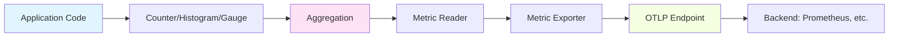

# How to Set Up OpenTelemetry Metrics Collection in C++ Applications

Author: [nawazdhandala](https://www.github.com/nawazdhandala)

Tags: OpenTelemetry, C++, Metrics, Collection, Counters, Histograms

Description: Complete guide to implementing OpenTelemetry metrics in C++ applications, covering counters, gauges, histograms, and metric exporters.

Metrics provide quantitative measurements of your application's behavior over time. Unlike traces that capture individual requests, metrics aggregate data to show trends, distributions, and statistical summaries. In high-performance C++ applications, metrics help you understand resource utilization, throughput, latency distributions, and business KPIs without the overhead of detailed tracing.

OpenTelemetry's metrics API provides a vendor-neutral way to instrument your code. The SDK handles aggregation, export, and collection intervals, letting you focus on what to measure rather than how to collect it.

## Understanding OpenTelemetry Metric Instruments

OpenTelemetry defines several metric instrument types, each suited for different measurement scenarios. Choosing the right instrument type determines how your metrics are aggregated and interpreted.

Counters measure values that only increase, like request counts or bytes sent. Gauges represent current values that can go up or down, like CPU usage or queue depth. Histograms capture distributions of values, perfect for latency measurements or request sizes.

```cpp
// Basic metrics SDK setup
#include "opentelemetry/metrics/provider.h"
#include "opentelemetry/sdk/metrics/meter_provider.h"
#include "opentelemetry/sdk/metrics/export/periodic_exporting_metric_reader.h"
#include "opentelemetry/exporters/otlp/otlp_http_metric_exporter.h"

namespace metrics_api = opentelemetry::metrics;
namespace metrics_sdk = opentelemetry::sdk::metrics;
namespace nostd = opentelemetry::nostd;

// Initialize the metrics SDK with OTLP exporter
void InitializeMetrics() {
    // Configure the OTLP exporter
    opentelemetry::exporter::otlp::OtlpHttpMetricExporterOptions exporter_opts;
    exporter_opts.url = "http://localhost:4318/v1/metrics";
    exporter_opts.content_type = opentelemetry::exporter::otlp::HttpRequestContentType::kJson;

    auto exporter = std::make_unique<opentelemetry::exporter::otlp::OtlpHttpMetricExporter>(
        exporter_opts
    );

    // Configure the periodic metric reader
    // This controls how often metrics are collected and exported
    metrics_sdk::PeriodicExportingMetricReaderOptions reader_opts;
    reader_opts.export_interval_millis = std::chrono::milliseconds(10000);  // 10 seconds
    reader_opts.export_timeout_millis = std::chrono::milliseconds(5000);    // 5 second timeout

    auto reader = std::make_unique<metrics_sdk::PeriodicExportingMetricReader>(
        std::move(exporter),
        reader_opts
    );

    // Create meter provider with resource information
    auto resource = CreateServiceResource();  // From previous resource detection post

    auto provider = std::shared_ptr<metrics_api::MeterProvider>(
        new metrics_sdk::MeterProvider(std::move(reader), resource)
    );

    // Set as global meter provider
    metrics_api::Provider::SetMeterProvider(provider);
}
```

The periodic reader automatically collects metrics at regular intervals. You don't need to manually trigger exports, making the code simpler and more reliable.

## Implementing Counters for Event Counting

Counters are the simplest metric type. They monotonically increase and represent cumulative counts.

```cpp
// Counter implementation for HTTP request counting
class HTTPServerMetrics {
private:
    nostd::shared_ptr<metrics_api::Meter> meter_;
    std::unique_ptr<metrics_api::Counter<uint64_t>> request_counter_;
    std::unique_ptr<metrics_api::Counter<uint64_t>> error_counter_;
    std::unique_ptr<metrics_api::Counter<uint64_t>> bytes_sent_counter_;

public:
    HTTPServerMetrics() {
        // Get a meter from the global provider
        auto provider = metrics_api::Provider::GetMeterProvider();
        meter_ = provider->GetMeter("http-server", "1.0.0");

        // Create counter instruments
        request_counter_ = meter_->CreateUInt64Counter(
            "http.server.requests",
            "Total number of HTTP requests received",
            "requests"
        );

        error_counter_ = meter_->CreateUInt64Counter(
            "http.server.errors",
            "Total number of HTTP errors",
            "errors"
        );

        bytes_sent_counter_ = meter_->CreateUInt64Counter(
            "http.server.bytes_sent",
            "Total bytes sent in responses",
            "bytes"
        );
    }

    // Record a successful request
    void RecordRequest(const std::string& method, const std::string& route, int status_code) {
        // Attributes provide dimensions for filtering and aggregation
        std::map<std::string, std::string> attributes = {
            {"http.method", method},
            {"http.route", route},
            {"http.status_code", std::to_string(status_code)}
        };

        // Convert to OpenTelemetry's attribute format
        auto context = opentelemetry::context::Context{};
        request_counter_->Add(1, attributes, context);

        // Track errors separately
        if (status_code >= 400) {
            error_counter_->Add(1, attributes, context);
        }
    }

    // Record response size
    void RecordBytesSent(uint64_t bytes, const std::string& method, const std::string& route) {
        std::map<std::string, std::string> attributes = {
            {"http.method", method},
            {"http.route", route}
        };

        auto context = opentelemetry::context::Context{};
        bytes_sent_counter_->Add(bytes, attributes, context);
    }
};

// Usage in request handler
void HandleHTTPRequest(const HTTPRequest& req, HTTPResponse& resp) {
    static HTTPServerMetrics metrics;

    // Process request
    ProcessRequest(req, resp);

    // Record metrics
    metrics.RecordRequest(req.method, req.route, resp.status_code);
    metrics.RecordBytesSent(resp.body.size(), req.method, req.route);
}
```

Attributes (also called labels in some systems) add dimensions to your metrics. This lets you break down request counts by method, route, or status code without creating separate counters for each combination.

## Using Histograms for Distribution Measurements

Histograms capture the distribution of values, providing percentiles, min, max, and sum. They're perfect for latency measurements.

```cpp
// Histogram implementation for latency tracking
class LatencyMetrics {
private:
    nostd::shared_ptr<metrics_api::Meter> meter_;
    std::unique_ptr<metrics_api::Histogram<double>> request_duration_;
    std::unique_ptr<metrics_api::Histogram<double>> db_query_duration_;

public:
    LatencyMetrics() {
        auto provider = metrics_api::Provider::GetMeterProvider();
        meter_ = provider->GetMeter("latency-metrics", "1.0.0");

        // Create histogram instruments
        // Units should be in base units (seconds, not milliseconds)
        request_duration_ = meter_->CreateDoubleHistogram(
            "http.server.request.duration",
            "Duration of HTTP requests",
            "s"  // seconds
        );

        db_query_duration_ = meter_->CreateDoubleHistogram(
            "db.query.duration",
            "Duration of database queries",
            "s"
        );
    }

    // Record request duration
    void RecordRequestDuration(
        double duration_seconds,
        const std::string& method,
        const std::string& route,
        int status_code
    ) {
        std::map<std::string, std::string> attributes = {
            {"http.method", method},
            {"http.route", route},
            {"http.status_code", std::to_string(status_code)}
        };

        auto context = opentelemetry::context::Context{};
        request_duration_->Record(duration_seconds, attributes, context);
    }

    // Record database query duration
    void RecordQueryDuration(
        double duration_seconds,
        const std::string& operation,
        const std::string& table
    ) {
        std::map<std::string, std::string> attributes = {
            {"db.operation", operation},
            {"db.table", table}
        };

        auto context = opentelemetry::context::Context{};
        db_query_duration_->Record(duration_seconds, attributes, context);
    }
};

// RAII helper for automatic duration measurement
class ScopedLatencyTimer {
private:
    std::chrono::steady_clock::time_point start_time_;
    std::function<void(double)> callback_;

public:
    explicit ScopedLatencyTimer(std::function<void(double)> callback)
        : start_time_(std::chrono::steady_clock::now()),
          callback_(std::move(callback)) {}

    ~ScopedLatencyTimer() {
        auto end_time = std::chrono::steady_clock::now();
        auto duration = std::chrono::duration_cast<std::chrono::microseconds>(
            end_time - start_time_
        );
        double duration_seconds = duration.count() / 1'000'000.0;
        callback_(duration_seconds);
    }
};

// Usage with RAII timer
void HandleRequest(const HTTPRequest& req, HTTPResponse& resp) {
    static LatencyMetrics metrics;

    // Automatically record duration when scope exits
    ScopedLatencyTimer timer([&](double duration) {
        metrics.RecordRequestDuration(duration, req.method, req.route, resp.status_code);
    });

    // Process request
    ProcessRequest(req, resp);
}
```

The RAII pattern ensures latency is always recorded, even if exceptions occur. This prevents gaps in your metrics data.

## Implementing Observable Gauges for Current State

Gauges represent current values that can increase or decrease. OpenTelemetry uses observable gauges that are read periodically rather than pushed continuously.

```cpp
// Observable gauge for monitoring system resources
class SystemMetrics {
private:
    nostd::shared_ptr<metrics_api::Meter> meter_;
    std::unique_ptr<metrics_api::ObservableInstrument> memory_gauge_;
    std::unique_ptr<metrics_api::ObservableInstrument> cpu_gauge_;
    std::unique_ptr<metrics_api::ObservableInstrument> thread_gauge_;

    // Callbacks are invoked during collection
    static void MemoryCallback(
        metrics_api::ObserverResult observer_result,
        void* /* state */
    ) {
        // Get current memory usage
        auto memory_info = GetMemoryInfo();

        std::map<std::string, std::string> attributes = {
            {"memory.type", "physical"}
        };

        observer_result.Observe(memory_info.used_bytes, attributes);
    }

    static void CPUCallback(
        metrics_api::ObserverResult observer_result,
        void* /* state */
    ) {
        // Get current CPU usage
        auto cpu_usage = GetCPUUsagePercent();

        std::map<std::string, std::string> attributes = {
            {"cpu.state", "user"}
        };

        observer_result.Observe(cpu_usage, attributes);
    }

    static void ThreadCountCallback(
        metrics_api::ObserverResult observer_result,
        void* /* state */
    ) {
        // Get current thread count
        auto thread_count = GetActiveThreadCount();

        observer_result.Observe(static_cast<double>(thread_count), {});
    }

public:
    SystemMetrics() {
        auto provider = metrics_api::Provider::GetMeterProvider();
        meter_ = provider->GetMeter("system-metrics", "1.0.0");

        // Register observable gauges with callbacks
        memory_gauge_ = meter_->CreateInt64ObservableGauge(
            "process.memory.usage",
            "Current memory usage",
            "bytes",
            MemoryCallback,
            nullptr  // Optional state pointer
        );

        cpu_gauge_ = meter_->CreateDoubleObservableGauge(
            "process.cpu.usage",
            "Current CPU usage",
            "percent",
            CPUCallback,
            nullptr
        );

        thread_gauge_ = meter_->CreateInt64ObservableGauge(
            "process.thread.count",
            "Number of active threads",
            "threads",
            ThreadCountCallback,
            nullptr
        );
    }

private:
    struct MemoryInfo {
        int64_t used_bytes;
        int64_t available_bytes;
    };

    static MemoryInfo GetMemoryInfo() {
        // Platform-specific memory retrieval
#ifdef __linux__
        // Read from /proc/self/status or use getrusage
#elif _WIN32
        // Use GetProcessMemoryInfo
#elif __APPLE__
        // Use task_info
#endif
        return {0, 0};  // Placeholder
    }

    static double GetCPUUsagePercent() {
        // Calculate CPU usage percentage
        return 0.0;  // Placeholder
    }

    static int GetActiveThreadCount() {
        // Get thread count from system
        return 0;  // Placeholder
    }
};
```

Observable instruments are lazy. The callbacks only execute during collection, preventing continuous polling overhead.

## Application-Level Business Metrics

Beyond system metrics, track business KPIs that matter to your domain.

```cpp
// E-commerce application metrics
class OrderMetrics {
private:
    nostd::shared_ptr<metrics_api::Meter> meter_;
    std::unique_ptr<metrics_api::Counter<uint64_t>> orders_placed_;
    std::unique_ptr<metrics_api::Counter<uint64_t>> orders_cancelled_;
    std::unique_ptr<metrics_api::Histogram<double>> order_value_;
    std::unique_ptr<metrics_api::Counter<uint64_t>> revenue_;

public:
    OrderMetrics() {
        auto provider = metrics_api::Provider::GetMeterProvider();
        meter_ = provider->GetMeter("order-service", "1.0.0");

        orders_placed_ = meter_->CreateUInt64Counter(
            "orders.placed",
            "Total number of orders placed",
            "orders"
        );

        orders_cancelled_ = meter_->CreateUInt64Counter(
            "orders.cancelled",
            "Total number of orders cancelled",
            "orders"
        );

        order_value_ = meter_->CreateDoubleHistogram(
            "order.value",
            "Distribution of order values",
            "USD"
        );

        revenue_ = meter_->CreateUInt64Counter(
            "revenue.total",
            "Total revenue (in cents to avoid floating point)",
            "cents"
        );
    }

    void RecordOrderPlaced(double value_usd, const std::string& category) {
        std::map<std::string, std::string> attributes = {
            {"product.category", category}
        };

        auto context = opentelemetry::context::Context{};

        orders_placed_->Add(1, attributes, context);
        order_value_->Record(value_usd, attributes, context);

        // Store revenue in cents to avoid floating point issues
        uint64_t value_cents = static_cast<uint64_t>(value_usd * 100);
        revenue_->Add(value_cents, attributes, context);
    }

    void RecordOrderCancelled(const std::string& reason) {
        std::map<std::string, std::string> attributes = {
            {"cancellation.reason", reason}
        };

        auto context = opentelemetry::context::Context{};
        orders_cancelled_->Add(1, attributes, context);
    }
};
```

Business metrics connect technical performance to business outcomes. Track what matters to stakeholders, not just what's easy to measure.

## Thread-Safe Metrics in Concurrent Applications

C++ applications often use multiple threads. OpenTelemetry's metrics API is thread-safe, but you need to manage instrument instances correctly.

```cpp
// Thread-safe metrics singleton
class MetricsRegistry {
private:
    static std::once_flag init_flag_;
    static std::unique_ptr<MetricsRegistry> instance_;

    nostd::shared_ptr<metrics_api::Meter> meter_;
    std::unique_ptr<metrics_api::Counter<uint64_t>> task_counter_;
    std::unique_ptr<metrics_api::Histogram<double>> task_duration_;

    MetricsRegistry() {
        auto provider = metrics_api::Provider::GetMeterProvider();
        meter_ = provider->GetMeter("task-processor", "1.0.0");

        task_counter_ = meter_->CreateUInt64Counter(
            "tasks.processed",
            "Number of tasks processed",
            "tasks"
        );

        task_duration_ = meter_->CreateDoubleHistogram(
            "task.duration",
            "Task processing duration",
            "s"
        );
    }

public:
    static MetricsRegistry& Instance() {
        std::call_once(init_flag_, []() {
            instance_.reset(new MetricsRegistry());
        });
        return *instance_;
    }

    // Thread-safe metric recording
    void RecordTaskProcessed(const std::string& task_type, double duration_seconds) {
        std::map<std::string, std::string> attributes = {
            {"task.type", task_type}
        };

        auto context = opentelemetry::context::Context{};
        task_counter_->Add(1, attributes, context);
        task_duration_->Record(duration_seconds, attributes, context);
    }
};

std::once_flag MetricsRegistry::init_flag_;
std::unique_ptr<MetricsRegistry> MetricsRegistry::instance_;

// Usage from multiple threads
void ProcessTaskInThread(const Task& task) {
    auto start = std::chrono::steady_clock::now();

    // Process task
    task.Execute();

    auto duration = std::chrono::duration_cast<std::chrono::microseconds>(
        std::chrono::steady_clock::now() - start
    ).count() / 1'000'000.0;

    // Thread-safe metric recording
    MetricsRegistry::Instance().RecordTaskProcessed(task.type, duration);
}
```

## Metric Aggregation and Views

OpenTelemetry allows configuring how metrics are aggregated through views. This happens at SDK initialization.

```cpp
// Configure custom aggregation views
void InitializeMetricsWithViews() {
    auto resource = CreateServiceResource();

    // Create exporter
    opentelemetry::exporter::otlp::OtlpHttpMetricExporterOptions exporter_opts;
    exporter_opts.url = "http://localhost:4318/v1/metrics";
    auto exporter = std::make_unique<opentelemetry::exporter::otlp::OtlpHttpMetricExporter>(
        exporter_opts
    );

    // Create reader
    metrics_sdk::PeriodicExportingMetricReaderOptions reader_opts;
    reader_opts.export_interval_millis = std::chrono::milliseconds(10000);
    auto reader = std::make_unique<metrics_sdk::PeriodicExportingMetricReader>(
        std::move(exporter),
        reader_opts
    );

    // Configure views for custom histogram boundaries
    std::vector<std::unique_ptr<metrics_sdk::View>> views;

    // Custom buckets for HTTP request duration (in seconds)
    auto http_duration_view = std::make_unique<metrics_sdk::View>(
        "http_duration_view",
        "Custom buckets for HTTP duration",
        "http.server.request.duration",
        metrics_sdk::AggregationType::kHistogram,
        std::vector<double>{0.001, 0.005, 0.01, 0.05, 0.1, 0.5, 1.0, 5.0, 10.0}
    );
    views.push_back(std::move(http_duration_view));

    // Create meter provider with views
    auto provider = std::shared_ptr<metrics_api::MeterProvider>(
        new metrics_sdk::MeterProvider(
            std::move(views),
            std::move(reader),
            resource
        )
    );

    metrics_api::Provider::SetMeterProvider(provider);
}
```

Custom histogram boundaries let you optimize for your specific latency distribution, providing more useful percentile calculations.

## Metrics Data Flow Visualization

Understanding how metrics flow through the SDK helps with troubleshooting.



The periodic reader triggers collection at regular intervals, pulling data from aggregators and pushing to exporters.

## Performance Considerations

Metrics add overhead, but proper implementation minimizes impact.

```cpp
// Efficient metric recording patterns
class EfficientMetrics {
private:
    // Cache instruments to avoid repeated lookups
    std::unique_ptr<metrics_api::Counter<uint64_t>> counter_;

    // Use attribute caching for frequently used combinations
    std::unordered_map<std::string, std::map<std::string, std::string>> attribute_cache_;

public:
    void RecordWithCachedAttributes(const std::string& key) {
        auto it = attribute_cache_.find(key);
        if (it == attribute_cache_.end()) {
            // Create and cache attributes
            std::map<std::string, std::string> attrs = {
                {"key", key}
            };
            attribute_cache_[key] = attrs;
            it = attribute_cache_.find(key);
        }

        auto context = opentelemetry::context::Context{};
        counter_->Add(1, it->second, context);
    }
};
```

Caching instrument instances and attribute maps reduces allocation overhead in hot paths.

OpenTelemetry metrics provide a standardized, efficient way to measure application behavior. By choosing appropriate instrument types, using semantic conventions, and configuring aggregation properly, you build a metrics system that scales from simple counters to complex business analytics. The key is measuring what matters and ensuring the overhead stays manageable even in high-throughput scenarios.
