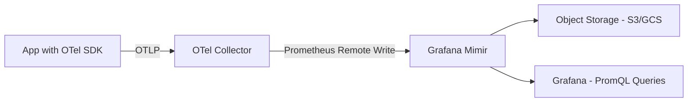
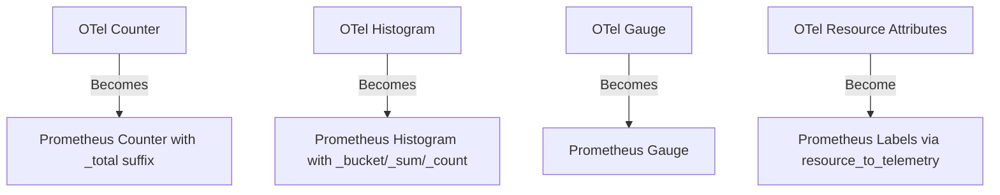

# How to Send OpenTelemetry Metrics to Grafana Mimir

Author: [nawazdhandala](https://www.github.com/nawazdhandala)

Tags: OpenTelemetry, Grafana Mimir, Metrics, Prometheus, Observability

Description: Step-by-step guide to sending OpenTelemetry metrics to Grafana Mimir using the Collector's Prometheus remote write exporter.

---

Grafana Mimir is a horizontally scalable, highly available metrics backend that is fully compatible with Prometheus. It can ingest millions of active time series and stores them durably in object storage. When combined with OpenTelemetry, you get a metrics pipeline where your applications use the OpenTelemetry SDK for instrumentation and Mimir handles long-term storage and querying. This guide covers the complete setup.

## Why Use Mimir Instead of Vanilla Prometheus

Prometheus works great for single-cluster deployments. But it was not designed for multi-tenant, horizontally scalable setups. When your metrics volume grows beyond what a single Prometheus instance can handle, you need something like Mimir. It provides unlimited cardinality (within reason), multi-tenancy, long-term storage in S3 or GCS, and global query capabilities across multiple clusters. And since it speaks PromQL, all your existing dashboards and alerts work without changes.

## The Metrics Pipeline Architecture

OpenTelemetry metrics flow through the Collector and into Mimir via the Prometheus remote write protocol. Here is how the pieces connect.



The Collector translates OpenTelemetry metrics into the Prometheus data model and pushes them to Mimir using the remote write API. This translation happens automatically in the `prometheusremotewrite` exporter. Grafana queries Mimir using standard PromQL, the same query language used by Prometheus.

## Configuring the OpenTelemetry Collector

The Collector needs an OTLP receiver to accept metrics from your applications and a Prometheus remote write exporter to forward them to Mimir.

```yaml
# otel-collector-config.yaml
# Receives OTel metrics and sends them to Mimir via remote write

receivers:
  otlp:
    protocols:
      grpc:
        endpoint: 0.0.0.0:4317
      http:
        endpoint: 0.0.0.0:4318

  # Optionally scrape Prometheus endpoints from existing services
  prometheus:
    config:
      scrape_configs:
        - job_name: 'kubernetes-pods'
          scrape_interval: 30s
          kubernetes_sd_configs:
            - role: pod
          relabel_configs:
            # Only scrape pods that have the prometheus.io/scrape annotation
            - source_labels: [__meta_kubernetes_pod_annotation_prometheus_io_scrape]
              action: keep
              regex: true

processors:
  batch:
    # Batch metrics together to improve write efficiency
    send_batch_size: 2048
    timeout: 10s

  memory_limiter:
    # Prevent the Collector from using too much memory
    check_interval: 5s
    limit_mib: 512
    spike_limit_mib: 128

  resource:
    attributes:
      # Add cluster identification to all metrics
      - key: cluster
        value: us-east-1-prod
        action: upsert

exporters:
  prometheusremotewrite:
    # Mimir endpoint for Prometheus remote write
    endpoint: http://mimir:9009/api/v1/push
    # Add a tenant header for multi-tenant Mimir deployments
    headers:
      X-Scope-OrgID: "team-backend"
    resource_to_telemetry_conversion:
      # Convert OTel resource attributes to metric labels
      enabled: true
    tls:
      insecure: true

service:
  pipelines:
    metrics:
      receivers: [otlp, prometheus]
      processors: [memory_limiter, batch, resource]
      exporters: [prometheusremotewrite]
```

There are a few important details in this configuration. The `resource_to_telemetry_conversion` setting converts OpenTelemetry resource attributes (like `service.name` and `service.version`) into Prometheus labels on the metric. Without this, you would not be able to filter metrics by service name in PromQL. The `X-Scope-OrgID` header enables multi-tenancy in Mimir, which lets different teams send metrics to the same Mimir cluster without interfering with each other.

Also notice that we include a `prometheus` receiver alongside the `otlp` receiver. This is useful during migration periods when some services already expose Prometheus endpoints and others use the OpenTelemetry SDK. The Collector can scrape both and send everything to the same Mimir instance.

## Setting Up Grafana Mimir

Here is a basic Mimir configuration for local development. It runs in monolithic mode, which means all components run in a single process.

```yaml
# mimir-config.yaml
# Runs Mimir in monolithic mode for development and testing

multitenancy_enabled: false

blocks_storage:
  backend: filesystem
  filesystem:
    dir: /data/mimir/blocks
  tsdb:
    dir: /data/mimir/tsdb
  bucket_store:
    sync_dir: /data/mimir/sync

compactor:
  data_dir: /data/mimir/compactor
  sharding_ring:
    kvstore:
      store: memberlist

distributor:
  ring:
    kvstore:
      store: memberlist

ingester:
  ring:
    kvstore:
      store: memberlist
    replication_factor: 1

server:
  http_listen_port: 9009

store_gateway:
  sharding_ring:
    kvstore:
      store: memberlist

limits:
  # Maximum number of label names per series
  max_label_names_per_series: 30
  # Maximum number of active series per tenant
  max_global_series_per_user: 1500000
```

For production, you would switch `blocks_storage.backend` to `s3` or `gcs` and run Mimir in microservices mode with separate distributor, ingester, compactor, store-gateway, and querier processes.

## Docker Compose Setup

Here is a Docker Compose file that puts everything together.

```yaml
# docker-compose.yaml
# Runs Mimir, the OTel Collector, and Grafana for metric visualization

version: "3.8"

services:
  mimir:
    image: grafana/mimir:latest
    command: ["-config.file=/etc/mimir.yaml", "-target=all"]
    volumes:
      - ./mimir-config.yaml:/etc/mimir.yaml
      - mimir-data:/data/mimir
    ports:
      - "9009:9009"

  otel-collector:
    image: otel/opentelemetry-collector-contrib:latest
    volumes:
      - ./otel-collector-config.yaml:/etc/otelcol-contrib/config.yaml
    ports:
      - "4317:4317"
      - "4318:4318"
    depends_on:
      - mimir

  grafana:
    image: grafana/grafana:latest
    ports:
      - "3000:3000"
    environment:
      - GF_SECURITY_ADMIN_PASSWORD=admin
    volumes:
      - ./grafana-datasources.yaml:/etc/grafana/provisioning/datasources/datasources.yaml
    depends_on:
      - mimir

volumes:
  mimir-data:
```

## Instrumenting Your Application with OTel Metrics

Your application needs to create and record metrics using the OpenTelemetry SDK. Here is a Python example that creates a counter and a histogram.

```python
# metrics_example.py
# Demonstrates creating and recording OpenTelemetry metrics in Python

from opentelemetry import metrics
from opentelemetry.sdk.metrics import MeterProvider
from opentelemetry.sdk.metrics.export import PeriodicExportingMetricReader
from opentelemetry.exporter.otlp.proto.grpc.metric_exporter import OTLPMetricExporter
from opentelemetry.sdk.resources import Resource

# Define the service resource so metrics are tagged with the service name
resource = Resource.create({
    "service.name": "order-service",
    "service.version": "2.1.0",
    "deployment.environment": "production",
})

# Configure the OTLP exporter to send metrics to the Collector
exporter = OTLPMetricExporter(endpoint="localhost:4317", insecure=True)

# Export metrics every 15 seconds
reader = PeriodicExportingMetricReader(exporter, export_interval_millis=15000)

# Set up the meter provider with the resource and reader
provider = MeterProvider(resource=resource, metric_readers=[reader])
metrics.set_meter_provider(provider)

# Create a meter for this module
meter = metrics.get_meter("order-service.metrics")

# Counter for tracking total orders processed
orders_counter = meter.create_counter(
    name="orders.processed.total",
    description="Total number of orders processed",
    unit="1",
)

# Histogram for tracking order processing duration
order_duration = meter.create_histogram(
    name="orders.processing.duration",
    description="Time taken to process an order",
    unit="ms",
)

def process_order(order):
    import time
    start = time.time()

    # Your order processing logic here
    # ...

    duration_ms = (time.time() - start) * 1000

    # Record the counter increment with attributes
    orders_counter.add(1, {"order.type": order.type, "payment.method": order.payment})

    # Record the processing duration
    order_duration.record(duration_ms, {"order.type": order.type})
```

Notice that metric names use dots as separators. The Prometheus remote write exporter in the Collector automatically converts these to underscores, since Prometheus does not allow dots in metric names. So `orders.processed.total` becomes `orders_processed_total` in Mimir.

## Understanding the OTel to Prometheus Translation

The translation from OpenTelemetry metrics to Prometheus metrics is mostly automatic, but there are some things to be aware of.



Counters get a `_total` suffix added automatically. Histograms are converted into the Prometheus histogram format with `_bucket`, `_sum`, and `_count` series. Gauges pass through without changes. OpenTelemetry attribute keys that contain dots are converted to underscores in the Prometheus label names.

## Querying Metrics in Grafana

Once metrics are flowing into Mimir, you can query them in Grafana using PromQL. Add Mimir as a Prometheus data source.

```yaml
# grafana-datasources.yaml
# Configures Mimir as a Prometheus-compatible data source in Grafana

apiVersion: 1

datasources:
  - name: Mimir
    type: prometheus
    access: proxy
    url: http://mimir:9009/prometheus
    isDefault: true
    jsonData:
      # Set a reasonable timeout for long-range queries
      timeInterval: "15s"
      httpMethod: POST
```

Then you can run queries like these:

```promql
# Rate of orders processed per second over the last 5 minutes
rate(orders_processed_total[5m])

# 95th percentile order processing duration
histogram_quantile(0.95, rate(orders_processing_duration_bucket[5m]))

# Total orders by payment method
sum by (payment_method) (increase(orders_processed_total[1h]))
```

## Handling High Cardinality

One common pitfall is creating metrics with high cardinality labels. If you add a `user_id` label to a metric, you could end up with millions of unique time series. Mimir handles this better than vanilla Prometheus, but it still has limits.

Use the Collector's `metricstransform` processor to drop or aggregate high-cardinality labels before they reach Mimir.

```yaml
# Add this processor to the Collector config to control cardinality
processors:
  metricstransform:
    transforms:
      - include: http_server_request_duration_seconds
        action: update
        operations:
          # Remove the URL path label to reduce cardinality
          # Use http.route instead, which has bounded values
          - action: delete_label_value
            label: url.full
```

## Scaling for Production

For production deployments, run Mimir in microservices mode with components scaled independently. The distributor handles incoming writes and can be horizontally scaled. Ingesters hold recent data in memory and need adequate RAM. The compactor runs in the background and merges blocks in object storage. Store gateways serve historical data from object storage.

A typical production Mimir deployment on Kubernetes uses the official Helm chart, which handles all of this for you. The chart sets up proper ring-based sharding, replication, and anti-affinity rules out of the box.

Sending OpenTelemetry metrics to Mimir gives you the best of both worlds. You get vendor-neutral instrumentation through the OTel SDK and battle-tested, scalable storage through Mimir. Combined with Grafana, you have a metrics platform that can grow with your infrastructure.
