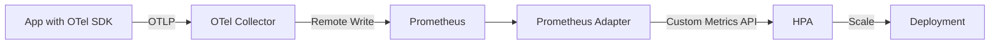

# How to Use OpenTelemetry Metrics for Kubernetes Horizontal Pod Autoscaler (HPA) Decisions

Author: [nawazdhandala](https://www.github.com/nawazdhandala)

Tags: OpenTelemetry, Kubernetes, HPA, Autoscaling, Custom Metrics

Description: Configure Kubernetes HPA to scale pods based on custom OpenTelemetry application metrics instead of just CPU and memory.

The default Kubernetes Horizontal Pod Autoscaler (HPA) scales based on CPU and memory utilization. This works for compute-bound workloads, but most real applications need to scale on application-level signals - request latency, queue depth, active connections, or business metrics like orders per second. OpenTelemetry lets you collect these custom metrics and feed them to the HPA through the Kubernetes custom metrics API.

This post covers the full pipeline: instrumenting your app with OpenTelemetry metrics, collecting them with the OTel Collector, storing them in Prometheus, and configuring the Prometheus Adapter to expose them as custom metrics the HPA can use.

## The Pipeline



The Prometheus Adapter bridges the gap between Prometheus (where your metrics live) and the Kubernetes custom metrics API (where HPA reads scaling signals).

## Instrumenting Application Metrics

First, instrument your application with the metrics that reflect real load. For an HTTP API, requests per second and request latency are better scaling signals than CPU.

```python
# metrics.py - Application metrics for autoscaling
from opentelemetry import metrics

meter = metrics.get_meter("api-service")

# Track in-flight requests - good for connection-based scaling
inflight_requests = meter.create_up_down_counter(
    name="http.server.active_requests",
    description="Number of requests currently being processed",
    unit="{request}",
)

# Request rate and latency
request_duration = meter.create_histogram(
    name="http.server.request.duration",
    description="Duration of HTTP server requests",
    unit="s",
)

# Business metric - orders per second
orders_processed = meter.create_counter(
    name="business.orders.processed",
    description="Number of orders processed",
    unit="{order}",
)

# Middleware that tracks active requests
class MetricsMiddleware:
    def __init__(self, app):
        self.app = app

    async def __call__(self, request, call_next):
        labels = {"http.method": request.method, "http.route": request.url.path}
        inflight_requests.add(1, labels)
        try:
            start = time.time()
            response = await call_next(request)
            elapsed = time.time() - start
            request_duration.record(elapsed, {**labels, "http.status_code": str(response.status_code)})
            return response
        finally:
            inflight_requests.add(-1, labels)
```

## OTel Collector Configuration

The collector receives OTLP metrics and writes them to Prometheus. Make sure the metric names are preserved in a format the Prometheus Adapter can query.

```yaml
# otel-collector-hpa.yaml
receivers:
  otlp:
    protocols:
      grpc:
        endpoint: 0.0.0.0:4317

processors:
  batch:
    timeout: 10s

  # Add pod and namespace labels from K8s metadata
  k8sattributes:
    extract:
      metadata:
        - k8s.namespace.name
        - k8s.deployment.name
        - k8s.pod.name
    pod_association:
      - sources:
          - from: connection

exporters:
  prometheusremotewrite:
    endpoint: http://prometheus:9090/api/v1/write
    resource_to_telemetry_conversion:
      enabled: true

service:
  pipelines:
    metrics:
      receivers: [otlp]
      processors: [k8sattributes, batch]
      exporters: [prometheusremotewrite]
```

## Setting Up the Prometheus Adapter

The Prometheus Adapter translates Prometheus queries into the Kubernetes custom metrics API format. Install it via Helm.

```bash
# Install the Prometheus Adapter
helm install prometheus-adapter prometheus-community/prometheus-adapter \
  --namespace monitoring \
  --values prometheus-adapter-values.yaml
```

The values file defines how Prometheus metrics map to Kubernetes custom metrics. Each rule specifies a Prometheus query and how to associate it with Kubernetes objects.

```yaml
# prometheus-adapter-values.yaml
prometheus:
  url: http://prometheus.monitoring.svc
  port: 9090

rules:
  custom:
    # Rule 1: Requests per second per pod
    - seriesQuery: 'http_server_request_duration_count{namespace!="",pod!=""}'
      resources:
        overrides:
          namespace: {resource: "namespace"}
          pod: {resource: "pod"}
      name:
        matches: "^(.*)_count$"
        as: "requests_per_second"
      metricsQuery: 'sum(rate(<<.Series>>{<<.LabelMatchers>>}[2m])) by (<<.GroupBy>>)'

    # Rule 2: Active in-flight requests per pod
    - seriesQuery: 'http_server_active_requests{namespace!="",pod!=""}'
      resources:
        overrides:
          namespace: {resource: "namespace"}
          pod: {resource: "pod"}
      name:
        as: "active_requests"
      metricsQuery: 'sum(<<.Series>>{<<.LabelMatchers>>}) by (<<.GroupBy>>)'

    # Rule 3: Request latency p99 per pod
    - seriesQuery: 'http_server_request_duration_bucket{namespace!="",pod!=""}'
      resources:
        overrides:
          namespace: {resource: "namespace"}
          pod: {resource: "pod"}
      name:
        as: "request_latency_p99"
      metricsQuery: 'histogram_quantile(0.99, sum(rate(<<.Series>>{<<.LabelMatchers>>}[2m])) by (le, <<.GroupBy>>))'
```

After deploying, verify the custom metrics are available.

```bash
# Check that custom metrics are registered
kubectl get --raw "/apis/custom.metrics.k8s.io/v1beta1" | jq '.resources[].name'

# Query a specific metric value
kubectl get --raw "/apis/custom.metrics.k8s.io/v1beta1/namespaces/default/pods/*/requests_per_second" | jq .
```

## Configuring the HPA

Now create an HPA that scales based on your OpenTelemetry-derived custom metrics.

```yaml
# hpa-custom-metrics.yaml
apiVersion: autoscaling/v2
kind: HorizontalPodAutoscaler
metadata:
  name: api-service-hpa
  namespace: default
spec:
  scaleTargetRef:
    apiVersion: apps/v1
    kind: Deployment
    name: api-service
  minReplicas: 2
  maxReplicas: 20

  # Scale based on multiple signals
  metrics:
    # Primary signal: requests per second per pod
    - type: Pods
      pods:
        metric:
          name: requests_per_second
        target:
          type: AverageValue
          averageValue: "100"  # Scale up when each pod handles > 100 rps

    # Secondary signal: active in-flight requests
    - type: Pods
      pods:
        metric:
          name: active_requests
        target:
          type: AverageValue
          averageValue: "50"  # Scale up when each pod has > 50 concurrent requests

  behavior:
    scaleUp:
      stabilizationWindowSeconds: 60
      policies:
        # Add up to 4 pods at a time, no more than every 60 seconds
        - type: Pods
          value: 4
          periodSeconds: 60
    scaleDown:
      stabilizationWindowSeconds: 300
      policies:
        # Remove at most 2 pods at a time, no more than every 120 seconds
        - type: Pods
          value: 2
          periodSeconds: 120
```

The `behavior` section is critical for production. Without stabilization windows, the HPA will thrash - scaling up and down rapidly as metrics fluctuate around the target. The configuration above allows fast scale-up (60 seconds) but slow scale-down (5-minute stabilization) which works well for most web services.

## Monitoring the HPA

You should also monitor the HPA itself to understand scaling behavior.

```bash
# Watch HPA scaling decisions in real time
kubectl get hpa api-service-hpa --watch

# Check HPA events for scaling history
kubectl describe hpa api-service-hpa
```

For a more complete view, scrape the `kube_hpa_*` metrics from kube-state-metrics and add them to your dashboard. Key metrics include `kube_hpa_status_current_replicas`, `kube_hpa_status_desired_replicas`, and `kube_hpa_spec_target_metric`. Overlaying these with your application metrics on the same dashboard shows you exactly why the HPA made each scaling decision.

## Pitfalls to Watch For

A few things to be careful about. First, make sure your metric resolution is fine-grained enough. If the Prometheus scrape interval is 60 seconds but traffic spikes last 30 seconds, the HPA will never see the spike. Set the OTel Collector batch timeout and the Prometheus scrape interval to 15 seconds or less for scaling-critical metrics.

Second, choose the right metric for scaling. CPU-based scaling fails for I/O-bound services. Request-rate scaling fails for services with highly variable request costs. Active in-flight requests is often the most reliable general-purpose signal because it directly reflects how saturated the service is, regardless of whether the load is CPU-bound or I/O-bound.
