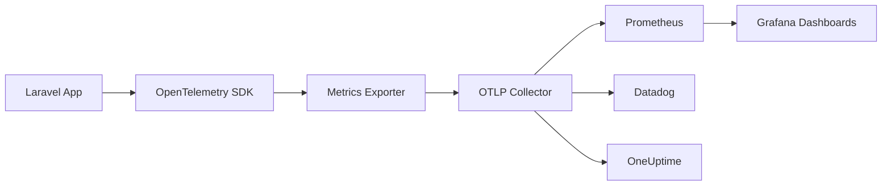

# How to Set Up OpenTelemetry Metrics in Laravel (Counters, Gauges, Histograms)

Author: [nawazdhandala](https://www.github.com/nawazdhandala)

Tags: OpenTelemetry, PHP, Laravel, Metrics, Counters, Gauges, Histograms

Description: Learn how to implement OpenTelemetry metrics in Laravel applications using counters, gauges, and histograms for comprehensive performance monitoring.

Traces show you what happened in individual requests. Metrics show you what's happening across your entire system. Request rate, error rate, response times, queue depth - these aggregate measurements are critical for understanding system health.

OpenTelemetry provides three fundamental metric types: counters for tracking totals, gauges for current values, and histograms for distributions. This guide shows you how to implement all three in Laravel applications.

## Understanding OpenTelemetry Metric Types

**Counters**: Monotonically increasing values. Use for counting requests, errors, jobs processed, or any event that accumulates over time.

**Gauges**: Point-in-time measurements that can go up or down. Use for current queue depth, active connections, memory usage, or cache size.

**Histograms**: Distribution of values across buckets. Use for request duration, payload size, or any measurement where you need percentiles and averages.

Each metric type serves a specific purpose. Choose wrong and your data becomes meaningless.

## Setting Up OpenTelemetry Metrics in Laravel

Install the OpenTelemetry SDK with metrics support:

```bash
composer require open-telemetry/sdk
composer require open-telemetry/opentelemetry-auto-laravel
```

Create a metrics service provider in `app/Providers/MetricsServiceProvider.php`:

```php
<?php

namespace App\Providers;

use Illuminate\Support\ServiceProvider;
use OpenTelemetry\API\Globals;
use OpenTelemetry\SDK\Metrics\MeterProvider;
use OpenTelemetry\SDK\Metrics\MetricExporter\ConsoleMetricExporter;
use OpenTelemetry\SDK\Metrics\MetricReader\ExportingReader;
use OpenTelemetry\SDK\Resource\ResourceInfo;
use OpenTelemetry\SDK\Resource\ResourceInfoFactory;
use OpenTelemetry\SDK\Common\Attribute\Attributes;

class MetricsServiceProvider extends ServiceProvider
{
    public function register()
    {
        $this->app->singleton('metrics.meter', function () {
            $resource = ResourceInfo::create(Attributes::create([
                'service.name' => config('app.name'),
                'service.version' => config('app.version', '1.0.0'),
                'deployment.environment' => config('app.env'),
            ]));

            $exporter = new ConsoleMetricExporter();
            $reader = new ExportingReader($exporter);

            $meterProvider = MeterProvider::builder()
                ->setResource($resource)
                ->addReader($reader)
                ->build();

            Globals::registerInitialMeterProvider($meterProvider);

            return $meterProvider->getMeter('laravel-app');
        });
    }

    public function boot()
    {
        // Metrics will be collected and exported
    }
}
```

Register this provider in `config/app.php`:

```php
'providers' => [
    // Other providers...
    App\Providers\MetricsServiceProvider::class,
],
```

## Implementing HTTP Request Counters

Track request counts by method, route, and status code.

Create `app/Services/HttpMetrics.php`:

```php
<?php

namespace App\Services;

use OpenTelemetry\API\Metrics\CounterInterface;
use OpenTelemetry\API\Metrics\MeterInterface;

class HttpMetrics
{
    private CounterInterface $requestCounter;
    private CounterInterface $errorCounter;

    public function __construct(MeterInterface $meter)
    {
        // Counter for total HTTP requests
        $this->requestCounter = $meter->createCounter(
            'http.requests.total',
            'requests',
            'Total number of HTTP requests received'
        );

        // Counter for HTTP errors
        $this->errorCounter = $meter->createCounter(
            'http.errors.total',
            'errors',
            'Total number of HTTP errors'
        );
    }

    /**
     * Record an HTTP request
     */
    public function recordRequest(string $method, string $route, int $statusCode): void
    {
        $this->requestCounter->add(1, [
            'http.method' => $method,
            'http.route' => $route,
            'http.status_code' => $statusCode,
            'http.status_class' => $this->getStatusClass($statusCode),
        ]);

        // Record as error if status code >= 400
        if ($statusCode >= 400) {
            $this->errorCounter->add(1, [
                'http.method' => $method,
                'http.route' => $route,
                'http.status_code' => $statusCode,
                'error.type' => $this->getErrorType($statusCode),
            ]);
        }
    }

    /**
     * Get status code class (2xx, 3xx, 4xx, 5xx)
     */
    private function getStatusClass(int $statusCode): string
    {
        return (string) floor($statusCode / 100) . 'xx';
    }

    /**
     * Get error type from status code
     */
    private function getErrorType(int $statusCode): string
    {
        return match(true) {
            $statusCode === 400 => 'bad_request',
            $statusCode === 401 => 'unauthorized',
            $statusCode === 403 => 'forbidden',
            $statusCode === 404 => 'not_found',
            $statusCode === 422 => 'validation_error',
            $statusCode === 429 => 'rate_limited',
            $statusCode >= 500 => 'server_error',
            default => 'client_error',
        };
    }
}
```

Create middleware to record metrics in `app/Http/Middleware/RecordHttpMetrics.php`:

```php
<?php

namespace App\Http\Middleware;

use Closure;
use Illuminate\Http\Request;
use App\Services\HttpMetrics;

class RecordHttpMetrics
{
    private HttpMetrics $metrics;

    public function __construct(HttpMetrics $metrics)
    {
        $this->metrics = $metrics;
    }

    public function handle(Request $request, Closure $next)
    {
        $response = $next($request);

        // Record the request metric
        $this->metrics->recordRequest(
            $request->method(),
            $request->route()?->uri() ?? 'unknown',
            $response->status()
        );

        return $response;
    }
}
```

Register the middleware in `app/Http/Kernel.php`:

```php
protected $middleware = [
    // Other middleware...
    \App\Http\Middleware\RecordHttpMetrics::class,
];
```

## Creating Histograms for Response Times

Histograms capture the distribution of request durations, allowing you to calculate percentiles.

Add histogram support to `app/Services/HttpMetrics.php`:

```php
<?php

namespace App\Services;

use OpenTelemetry\API\Metrics\CounterInterface;
use OpenTelemetry\API\Metrics\HistogramInterface;
use OpenTelemetry\API\Metrics\MeterInterface;

class HttpMetrics
{
    private CounterInterface $requestCounter;
    private CounterInterface $errorCounter;
    private HistogramInterface $durationHistogram;

    public function __construct(MeterInterface $meter)
    {
        $this->requestCounter = $meter->createCounter(
            'http.requests.total',
            'requests',
            'Total number of HTTP requests received'
        );

        $this->errorCounter = $meter->createCounter(
            'http.errors.total',
            'errors',
            'Total number of HTTP errors'
        );

        // Histogram for request duration
        $this->durationHistogram = $meter->createHistogram(
            'http.request.duration',
            'ms',
            'HTTP request duration in milliseconds'
        );
    }

    /**
     * Record request with duration
     */
    public function recordRequest(
        string $method,
        string $route,
        int $statusCode,
        float $durationMs
    ): void {
        $attributes = [
            'http.method' => $method,
            'http.route' => $route,
            'http.status_code' => $statusCode,
            'http.status_class' => $this->getStatusClass($statusCode),
        ];

        // Record counter
        $this->requestCounter->add(1, $attributes);

        // Record duration histogram
        $this->durationHistogram->record($durationMs, $attributes);

        // Record errors
        if ($statusCode >= 400) {
            $this->errorCounter->add(1, array_merge($attributes, [
                'error.type' => $this->getErrorType($statusCode),
            ]));
        }
    }

    // Previous methods...
}
```

Update the middleware to capture timing:

```php
<?php

namespace App\Http\Middleware;

use Closure;
use Illuminate\Http\Request;
use App\Services\HttpMetrics;

class RecordHttpMetrics
{
    private HttpMetrics $metrics;

    public function __construct(HttpMetrics $metrics)
    {
        $this->metrics = $metrics;
    }

    public function handle(Request $request, Closure $next)
    {
        $startTime = microtime(true);

        $response = $next($request);

        $duration = (microtime(true) - $startTime) * 1000; // Convert to milliseconds

        $this->metrics->recordRequest(
            $request->method(),
            $request->route()?->uri() ?? 'unknown',
            $response->status(),
            $duration
        );

        return $response;
    }
}
```

## Implementing Gauges for System State

Gauges measure current state. Use them for queue depth, cache size, active users, and resource utilization.

Create `app/Services/SystemMetrics.php`:

```php
<?php

namespace App\Services;

use Illuminate\Support\Facades\Redis;
use Illuminate\Support\Facades\DB;
use Illuminate\Support\Facades\Cache;
use OpenTelemetry\API\Metrics\MeterInterface;
use OpenTelemetry\API\Metrics\ObserverInterface;

class SystemMetrics
{
    private MeterInterface $meter;

    public function __construct(MeterInterface $meter)
    {
        $this->meter = $meter;
        $this->registerGauges();
    }

    /**
     * Register observable gauges
     */
    private function registerGauges(): void
    {
        // Queue depth gauge
        $queueDepth = $this->meter->createObservableGauge(
            'queue.depth',
            'jobs',
            'Number of jobs waiting in queue'
        );

        $queueDepth->observe(function (ObserverInterface $observer) {
            $queues = ['default', 'high', 'low', 'emails'];

            foreach ($queues as $queue) {
                $depth = $this->getQueueDepth($queue);
                $observer->observe($depth, ['queue.name' => $queue]);
            }
        });

        // Active database connections gauge
        $dbConnections = $this->meter->createObservableGauge(
            'database.connections.active',
            'connections',
            'Number of active database connections'
        );

        $dbConnections->observe(function (ObserverInterface $observer) {
            $connections = $this->getActiveConnections();
            $observer->observe($connections, [
                'database.system' => config('database.default'),
            ]);
        });

        // Cache hit rate gauge
        $cacheHitRate = $this->meter->createObservableGauge(
            'cache.hit_rate',
            'ratio',
            'Cache hit rate as a ratio between 0 and 1'
        );

        $cacheHitRate->observe(function (ObserverInterface $observer) {
            $hitRate = $this->getCacheHitRate();
            $observer->observe($hitRate, [
                'cache.driver' => config('cache.default'),
            ]);
        });

        // Memory usage gauge
        $memoryUsage = $this->meter->createObservableGauge(
            'process.memory.usage',
            'bytes',
            'Current memory usage in bytes'
        );

        $memoryUsage->observe(function (ObserverInterface $observer) {
            $usage = memory_get_usage(true);
            $observer->observe($usage);
        });
    }

    /**
     * Get queue depth for a specific queue
     */
    private function getQueueDepth(string $queue): int
    {
        try {
            return Redis::llen("queues:{$queue}");
        } catch (\Exception $e) {
            return 0;
        }
    }

    /**
     * Get number of active database connections
     */
    private function getActiveConnections(): int
    {
        try {
            $result = DB::select("SHOW STATUS LIKE 'Threads_connected'");
            return (int) ($result[0]->Value ?? 0);
        } catch (\Exception $e) {
            return 0;
        }
    }

    /**
     * Calculate cache hit rate
     */
    private function getCacheHitRate(): float
    {
        try {
            $stats = Cache::getStore()->getMemcached()->getStats();

            if (empty($stats)) {
                return 0.0;
            }

            $firstServer = array_values($stats)[0];
            $hits = $firstServer['get_hits'] ?? 0;
            $misses = $firstServer['get_misses'] ?? 0;

            $total = $hits + $misses;

            return $total > 0 ? $hits / $total : 0.0;
        } catch (\Exception $e) {
            return 0.0;
        }
    }
}
```

Register this service in `MetricsServiceProvider`:

```php
public function boot()
{
    $meter = $this->app->make('metrics.meter');
    new SystemMetrics($meter);
}
```

## Tracking Business Metrics

Go beyond infrastructure metrics to track business KPIs.

Create `app/Services/BusinessMetrics.php`:

```php
<?php

namespace App\Services;

use OpenTelemetry\API\Metrics\CounterInterface;
use OpenTelemetry\API\Metrics\HistogramInterface;
use OpenTelemetry\API\Metrics\MeterInterface;

class BusinessMetrics
{
    private CounterInterface $ordersCreated;
    private CounterInterface $ordersCompleted;
    private CounterInterface $ordersFailed;
    private HistogramInterface $orderValue;
    private CounterInterface $revenue;

    public function __construct(MeterInterface $meter)
    {
        $this->ordersCreated = $meter->createCounter(
            'orders.created.total',
            'orders',
            'Total number of orders created'
        );

        $this->ordersCompleted = $meter->createCounter(
            'orders.completed.total',
            'orders',
            'Total number of orders completed'
        );

        $this->ordersFailed = $meter->createCounter(
            'orders.failed.total',
            'orders',
            'Total number of orders that failed'
        );

        $this->orderValue = $meter->createHistogram(
            'order.value',
            'USD',
            'Distribution of order values'
        );

        $this->revenue = $meter->createCounter(
            'revenue.total',
            'USD',
            'Total revenue generated'
        );
    }

    /**
     * Record order creation
     */
    public function recordOrderCreated(float $value, string $paymentMethod): void
    {
        $this->ordersCreated->add(1, [
            'payment.method' => $paymentMethod,
        ]);

        $this->orderValue->record($value, [
            'payment.method' => $paymentMethod,
        ]);
    }

    /**
     * Record order completion
     */
    public function recordOrderCompleted(float $value, string $paymentMethod): void
    {
        $this->ordersCompleted->add(1, [
            'payment.method' => $paymentMethod,
        ]);

        $this->revenue->add($value, [
            'payment.method' => $paymentMethod,
        ]);
    }

    /**
     * Record order failure
     */
    public function recordOrderFailed(string $reason, string $paymentMethod): void
    {
        $this->ordersFailed->add(1, [
            'failure.reason' => $reason,
            'payment.method' => $paymentMethod,
        ]);
    }
}
```

Use these metrics in your order processing logic:

```php
<?php

namespace App\Services;

use App\Models\Order;

class OrderService
{
    private BusinessMetrics $metrics;

    public function __construct(BusinessMetrics $metrics)
    {
        $this->metrics = $metrics;
    }

    public function createOrder(array $data): Order
    {
        $order = Order::create($data);

        $this->metrics->recordOrderCreated(
            $order->total,
            $order->payment_method
        );

        return $order;
    }

    public function completeOrder(Order $order): void
    {
        $order->update(['status' => 'completed']);

        $this->metrics->recordOrderCompleted(
            $order->total,
            $order->payment_method
        );
    }

    public function failOrder(Order $order, string $reason): void
    {
        $order->update(['status' => 'failed']);

        $this->metrics->recordOrderFailed(
            $reason,
            $order->payment_method
        );
    }
}
```

## Database Query Metrics

Track database performance with query counters and duration histograms.

Create `app/Services/DatabaseMetrics.php`:

```php
<?php

namespace App\Services;

use Illuminate\Database\Events\QueryExecuted;
use Illuminate\Support\Facades\DB;
use OpenTelemetry\API\Metrics\CounterInterface;
use OpenTelemetry\API\Metrics\HistogramInterface;
use OpenTelemetry\API\Metrics\MeterInterface;

class DatabaseMetrics
{
    private CounterInterface $queryCounter;
    private HistogramInterface $queryDuration;
    private CounterInterface $slowQueryCounter;

    public function __construct(MeterInterface $meter)
    {
        $this->queryCounter = $meter->createCounter(
            'database.queries.total',
            'queries',
            'Total number of database queries executed'
        );

        $this->queryDuration = $meter->createHistogram(
            'database.query.duration',
            'ms',
            'Database query execution time in milliseconds'
        );

        $this->slowQueryCounter = $meter->createCounter(
            'database.queries.slow.total',
            'queries',
            'Total number of slow database queries'
        );

        $this->register();
    }

    /**
     * Register database query listener
     */
    private function register(): void
    {
        DB::listen(function (QueryExecuted $query) {
            $operation = $this->extractOperation($query->sql);

            $attributes = [
                'database.system' => $query->connection->getDriverName(),
                'database.operation' => $operation,
                'database.connection' => $query->connectionName,
            ];

            // Record query count
            $this->queryCounter->add(1, $attributes);

            // Record query duration
            $this->queryDuration->record($query->time, $attributes);

            // Record slow queries (> 100ms)
            if ($query->time > 100) {
                $this->slowQueryCounter->add(1, array_merge($attributes, [
                    'query.slow' => true,
                    'query.threshold_ms' => 100,
                ]));
            }
        });
    }

    /**
     * Extract SQL operation type
     */
    private function extractOperation(string $sql): string
    {
        $sql = trim(strtoupper($sql));

        if (str_starts_with($sql, 'SELECT')) return 'SELECT';
        if (str_starts_with($sql, 'INSERT')) return 'INSERT';
        if (str_starts_with($sql, 'UPDATE')) return 'UPDATE';
        if (str_starts_with($sql, 'DELETE')) return 'DELETE';

        return 'OTHER';
    }
}
```

## Cache Metrics

Monitor cache performance with hit/miss counters and operation duration.

Create `app/Services/CacheMetrics.php`:

```php
<?php

namespace App\Services;

use OpenTelemetry\API\Metrics\CounterInterface;
use OpenTelemetry\API\Metrics\HistogramInterface;
use OpenTelemetry\API\Metrics\MeterInterface;

class CacheMetrics
{
    private CounterInterface $hitCounter;
    private CounterInterface $missCounter;
    private HistogramInterface $operationDuration;

    public function __construct(MeterInterface $meter)
    {
        $this->hitCounter = $meter->createCounter(
            'cache.hits.total',
            'hits',
            'Total number of cache hits'
        );

        $this->missCounter = $meter->createCounter(
            'cache.misses.total',
            'misses',
            'Total number of cache misses'
        );

        $this->operationDuration = $meter->createHistogram(
            'cache.operation.duration',
            'ms',
            'Cache operation duration in milliseconds'
        );
    }

    /**
     * Record cache hit
     */
    public function recordHit(string $key, float $durationMs): void
    {
        $this->hitCounter->add(1, [
            'cache.driver' => config('cache.default'),
        ]);

        $this->operationDuration->record($durationMs, [
            'cache.operation' => 'get',
            'cache.result' => 'hit',
        ]);
    }

    /**
     * Record cache miss
     */
    public function recordMiss(string $key, float $durationMs): void
    {
        $this->missCounter->add(1, [
            'cache.driver' => config('cache.default'),
        ]);

        $this->operationDuration->record($durationMs, [
            'cache.operation' => 'get',
            'cache.result' => 'miss',
        ]);
    }

    /**
     * Record cache write
     */
    public function recordWrite(string $key, float $durationMs): void
    {
        $this->operationDuration->record($durationMs, [
            'cache.operation' => 'set',
        ]);
    }
}
```

Create a caching facade wrapper to automatically record metrics:

```php
<?php

namespace App\Support;

use Illuminate\Support\Facades\Cache;
use App\Services\CacheMetrics;

class MetricsCache
{
    private CacheMetrics $metrics;

    public function __construct(CacheMetrics $metrics)
    {
        $this->metrics = $metrics;
    }

    /**
     * Get value from cache with metrics
     */
    public function get(string $key, $default = null)
    {
        $startTime = microtime(true);

        $value = Cache::get($key, $default);

        $duration = (microtime(true) - $startTime) * 1000;

        if ($value !== null && $value !== $default) {
            $this->metrics->recordHit($key, $duration);
        } else {
            $this->metrics->recordMiss($key, $duration);
        }

        return $value;
    }

    /**
     * Put value in cache with metrics
     */
    public function put(string $key, $value, $ttl = null): bool
    {
        $startTime = microtime(true);

        $result = Cache::put($key, $value, $ttl);

        $duration = (microtime(true) - $startTime) * 1000;

        $this->metrics->recordWrite($key, $duration);

        return $result;
    }

    /**
     * Remember value with metrics
     */
    public function remember(string $key, $ttl, \Closure $callback)
    {
        $startTime = microtime(true);

        $value = Cache::get($key);

        if ($value !== null) {
            $duration = (microtime(true) - $startTime) * 1000;
            $this->metrics->recordHit($key, $duration);
            return $value;
        }

        $value = $callback();

        Cache::put($key, $value, $ttl);

        $duration = (microtime(true) - $startTime) * 1000;
        $this->metrics->recordMiss($key, $duration);

        return $value;
    }
}
```

## Visualizing Metrics Data

Metrics data flows to your observability backend where you can create dashboards:



Common dashboard panels:

**Request Rate**: `rate(http_requests_total[5m])` shows requests per second
**Error Rate**: `rate(http_errors_total[5m])` shows errors per second
**Latency Percentiles**: `histogram_quantile(0.95, http_request_duration)` shows P95 latency
**Queue Depth**: `queue_depth` shows pending jobs
**Cache Hit Rate**: `cache_hits_total / (cache_hits_total + cache_misses_total)`

## Exporting Metrics to OTLP

Configure the OTLP exporter to send metrics to your collector:

```php
<?php

namespace App\Providers;

use Illuminate\Support\ServiceProvider;
use OpenTelemetry\API\Globals;
use OpenTelemetry\Contrib\Otlp\MetricExporter;
use OpenTelemetry\SDK\Metrics\MeterProvider;
use OpenTelemetry\SDK\Metrics\MetricReader\ExportingReader;

class MetricsServiceProvider extends ServiceProvider
{
    public function register()
    {
        $this->app->singleton('metrics.meter', function () {
            $exporter = new MetricExporter(
                config('opentelemetry.metrics.endpoint', 'http://localhost:4318/v1/metrics')
            );

            $reader = new ExportingReader(
                $exporter,
                config('opentelemetry.metrics.interval', 60000) // Export every 60 seconds
            );

            $meterProvider = MeterProvider::builder()
                ->addReader($reader)
                ->build();

            Globals::registerInitialMeterProvider($meterProvider);

            return $meterProvider->getMeter('laravel-app');
        });
    }
}
```

Add configuration to `config/opentelemetry.php`:

```php
return [
    'metrics' => [
        'enabled' => env('OTEL_METRICS_ENABLED', true),
        'endpoint' => env('OTEL_EXPORTER_OTLP_METRICS_ENDPOINT', 'http://localhost:4318/v1/metrics'),
        'interval' => env('OTEL_METRICS_EXPORT_INTERVAL', 60000),
    ],
];
```

## Production Best Practices

**Cardinality control**: Limit unique label combinations. High cardinality metrics consume excessive memory and storage.

**Sampling**: For high-traffic applications, sample metrics rather than recording every event.

**Aggregation**: Pre-aggregate metrics at the application level before exporting.

**Resource limits**: Set memory and CPU limits for metric collection to prevent impact on application performance.

OpenTelemetry metrics in Laravel provide comprehensive visibility into application and business performance. Counters track totals, gauges measure current state, and histograms capture distributions. Together, they give you the data needed to understand system behavior and make informed optimization decisions.
