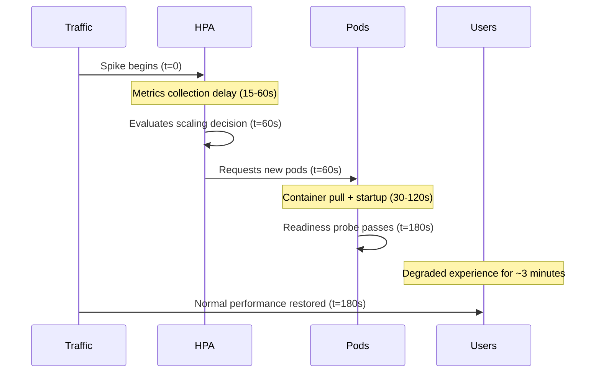

# How to Use OpenTelemetry Metrics to Predict Infrastructure Scaling Needs Before Traffic Spikes

Author: [nawazdhandala](https://www.github.com/nawazdhandala)

Tags: OpenTelemetry, Predictive Scaling, Traffic Forecasting, Infrastructure, Autoscaling

Description: Predict traffic spikes and pre-scale infrastructure using OpenTelemetry historical metrics and time-series forecasting models.

Reactive autoscaling has a fundamental timing problem. By the time your HPA detects a traffic spike, starts new pods, and waits for them to become ready, users have already experienced degraded performance. For workloads with predictable traffic patterns - daily peaks, weekly cycles, event-driven bursts - you can do better by predicting the spike and scaling ahead of it.

OpenTelemetry provides the historical metrics you need for traffic forecasting. This post shows how to build a predictive scaling system that analyzes historical patterns and pre-scales infrastructure before anticipated load increases.

## Why Reactive Scaling Is Not Enough

Consider the timeline of a traffic spike with reactive scaling:



For a 3-minute spike, reactive scaling provides zero benefit - the spike is over before new pods are ready. Predictive scaling eliminates this gap by having pods running before the traffic arrives.

## Collecting Historical Traffic Patterns

The first step is ensuring you have enough historical data with the right granularity. Traffic prediction works best with at least 4 weeks of hourly data, and ideally 3 or more months.

```python
# traffic_metrics.py - Metrics for traffic pattern analysis
from opentelemetry import metrics

meter = metrics.get_meter("traffic.patterns")

# Request counter with time-relevant attributes
request_counter = meter.create_counter(
    name="http.server.request.total",
    description="Total HTTP requests",
    unit="{request}",
)

# Track request arrival rate at fine granularity
# This histogram captures the distribution of inter-arrival times
arrival_rate = meter.create_histogram(
    name="http.server.arrival_rate",
    description="Requests per second measured at 10-second intervals",
    unit="{request}/s",
)

def track_request(request):
    labels = {
        "service.name": "api-gateway",
        "http.route": request.route,
        # Include day_of_week and hour for pattern analysis
        # (These are also available in the timestamp, but having them
        # as labels makes PromQL queries simpler)
        "traffic.source": request.headers.get("X-Traffic-Source", "organic"),
    }
    request_counter.add(1, labels)
```

## Collector Configuration for Historical Data

Configure the collector to route traffic metrics to long-term storage with appropriate retention.

```yaml
# otel-collector-predictive.yaml
receivers:
  otlp:
    protocols:
      grpc:
        endpoint: 0.0.0.0:4317

processors:
  batch:
    timeout: 10s

  # Add temporal attributes for easier querying
  transform:
    metric_statements:
      - context: datapoint
        statements:
          - set(attributes["cluster"], "prod-us-east")

exporters:
  # Short-term: full resolution for real-time monitoring
  prometheusremotewrite/realtime:
    endpoint: http://prometheus:9090/api/v1/write

  # Long-term: for forecasting models (via Thanos or Cortex)
  prometheusremotewrite/longterm:
    endpoint: http://thanos-receive:19291/api/v1/receive

service:
  pipelines:
    metrics:
      receivers: [otlp]
      processors: [batch, transform]
      exporters: [prometheusremotewrite/realtime, prometheusremotewrite/longterm]
```

## Building the Forecasting Model

A practical forecasting model for infrastructure scaling does not need to be complex. Most traffic patterns are dominated by daily and weekly seasonality. The Facebook Prophet library handles this well with minimal configuration.

```python
# traffic_forecast.py
from prophet import Prophet
import pandas as pd
import requests
from datetime import datetime, timedelta

PROMETHEUS_URL = "http://thanos-query:9090"

def fetch_historical_traffic(service, lookback_days=90):
    """Pull hourly request rates from Prometheus/Thanos."""
    end = datetime.now()
    start = end - timedelta(days=lookback_days)

    query = f'sum(rate(http_server_request_total{{service_name="{service}"}}[5m]))'
    response = requests.get(f"{PROMETHEUS_URL}/api/v1/query_range", params={
        "query": query,
        "start": start.timestamp(),
        "end": end.timestamp(),
        "step": "1h",
    })

    results = response.json()["data"]["result"][0]["values"]

    # Prophet expects columns named 'ds' (datestamp) and 'y' (value)
    df = pd.DataFrame(results, columns=["ds", "y"])
    df["ds"] = pd.to_datetime(df["ds"].astype(float), unit="s")
    df["y"] = df["y"].astype(float)
    return df

def forecast_traffic(service, forecast_hours=48):
    """Generate a traffic forecast for the next N hours."""
    historical = fetch_historical_traffic(service)

    model = Prophet(
        daily_seasonality=True,
        weekly_seasonality=True,
        yearly_seasonality=False,  # Not enough data for yearly patterns usually
        changepoint_prior_scale=0.05,  # Lower value = less sensitive to trend changes
    )
    model.fit(historical)

    # Create future dataframe
    future = model.make_future_dataframe(periods=forecast_hours, freq="h")
    forecast = model.predict(future)

    # Return only the future predictions
    future_forecast = forecast[forecast["ds"] > historical["ds"].max()]

    return future_forecast[["ds", "yhat", "yhat_lower", "yhat_upper"]]

def compute_required_replicas(forecast_df, rps_per_pod=100):
    """Convert traffic forecast into pod count recommendations."""
    recommendations = []
    for _, row in forecast_df.iterrows():
        # Use the upper bound for safety margin
        predicted_rps = row["yhat_upper"]
        # Calculate replicas needed, minimum of 2 for redundancy
        replicas = max(2, int(predicted_rps / rps_per_pod) + 1)
        recommendations.append({
            "timestamp": row["ds"].isoformat(),
            "predicted_rps": round(predicted_rps, 1),
            "recommended_replicas": replicas,
        })
    return recommendations
```

## Implementing Pre-Scaling with CronJobs

Once you have the forecast, use Kubernetes CronJobs to adjust the HPA min replicas ahead of predicted traffic increases.

```yaml
# predictive-scaler-cronjob.yaml
apiVersion: batch/v1
kind: CronJob
metadata:
  name: predictive-scaler
  namespace: default
spec:
  # Run every hour to update scaling predictions
  schedule: "0 * * * *"
  jobTemplate:
    spec:
      template:
        spec:
          containers:
            - name: scaler
              image: predictive-scaler:latest
              env:
                - name: PROMETHEUS_URL
                  value: "http://thanos-query:9090"
                - name: TARGET_DEPLOYMENT
                  value: "api-gateway"
                - name: TARGET_NAMESPACE
                  value: "default"
                - name: RPS_PER_POD
                  value: "100"
              command:
                - python
                - /app/prescale.py
          serviceAccountName: predictive-scaler
          restartPolicy: OnFailure
```

The prescaler script patches the HPA to adjust minimum replicas based on the forecast.

```python
# prescale.py - Adjust HPA min replicas based on forecast
from kubernetes import client, config
import os

def apply_prescaling(namespace, hpa_name, min_replicas):
    """Patch HPA min replicas to pre-scale for predicted traffic."""
    config.load_incluster_config()
    api = client.AutoscalingV2Api()

    # Get current HPA
    hpa = api.read_namespaced_horizontal_pod_autoscaler(hpa_name, namespace)
    current_min = hpa.spec.min_replicas

    if min_replicas != current_min:
        # Patch the HPA with new minimum
        body = {"spec": {"minReplicas": min_replicas}}
        api.patch_namespaced_horizontal_pod_autoscaler(
            hpa_name, namespace, body
        )
        print(f"Updated HPA {hpa_name} minReplicas: {current_min} -> {min_replicas}")
    else:
        print(f"HPA {hpa_name} already at minReplicas={min_replicas}, no change needed")

# Run the forecast and apply
service = os.getenv("TARGET_DEPLOYMENT")
forecast = forecast_traffic(service, forecast_hours=2)
recommendations = compute_required_replicas(forecast)

# Use the max recommended replicas for the next 2 hours
next_min_replicas = max(r["recommended_replicas"] for r in recommendations)

apply_prescaling(
    os.getenv("TARGET_NAMESPACE"),
    f"{service}-hpa",
    next_min_replicas,
)
```

## Monitoring Forecast Accuracy

A forecasting model is only useful if it is accurate. Track forecast accuracy as a metric so you know when the model needs retraining or when traffic patterns have fundamentally changed.

```python
# Record forecast accuracy as an OpenTelemetry metric
forecast_error = meter.create_histogram(
    name="forecast.error.percentage",
    description="Percentage error between predicted and actual traffic",
    unit="%",
)

def evaluate_forecast_accuracy(predicted_rps, actual_rps):
    """Compare forecast to actual traffic and record the error."""
    if actual_rps > 0:
        error_pct = abs(predicted_rps - actual_rps) / actual_rps * 100
        forecast_error.record(error_pct, {
            "service": "api-gateway",
            "direction": "over" if predicted_rps > actual_rps else "under",
        })
```

Add a dashboard panel showing forecast accuracy over time. If the mean absolute percentage error (MAPE) stays under 15%, the model is performing well. If it drifts higher, investigate whether traffic patterns have shifted - perhaps a new marketing campaign changed user behavior, or a new API integration brought a different traffic profile. In those cases, retrain the model with the more recent data weighted higher.

## Handling Unpredictable Spikes

Predictive scaling handles regular patterns, but unexpected viral events or DDoS attacks will always exist outside the forecast. Keep reactive HPA scaling active as a safety net. The predictive scaler sets the floor (minimum replicas), and the HPA can still scale up beyond that floor when actual traffic exceeds the prediction. This layered approach gives you the best of both worlds: warm capacity for predictable load, plus reactive scaling for surprises.
