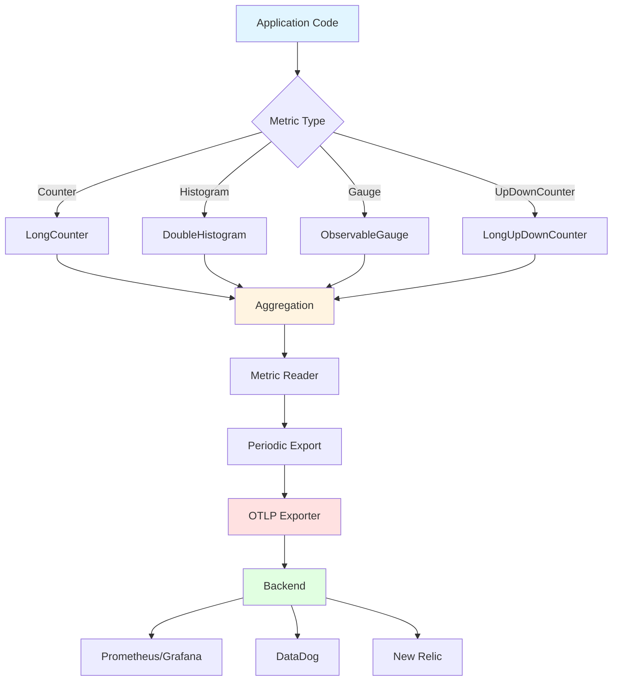

# How to Configure OpenTelemetry Metrics in Quarkus

Author: [nawazdhandala](https://www.github.com/nawazdhandala)

Tags: OpenTelemetry, Quarkus, Metrics, Java, Micrometer, Configuration

Description: Comprehensive guide to implementing and configuring OpenTelemetry metrics in Quarkus applications, including Micrometer integration, custom metrics, native image support, and performance monitoring for cloud-native workloads.

Metrics provide the foundation for understanding application health, performance trends, and capacity planning. While traces show individual request flows and logs capture discrete events, metrics aggregate data over time to reveal patterns invisible in single operations. Quarkus applications benefit from OpenTelemetry's standardized metrics API, which ensures consistency across environments and compatibility with any backend that supports OTLP.

Traditional Java metrics frameworks like Dropwizard and Micrometer have served the ecosystem well, but they tie applications to specific vendors or require translation layers. OpenTelemetry solves this by defining vendor-neutral metric types: counters for accumulating values, gauges for point-in-time measurements, histograms for distributions, and more. Quarkus integrates both OpenTelemetry's native metrics API and Micrometer, giving developers flexibility in choosing their preferred approach.

## Setting Up OpenTelemetry Metrics

Start by adding the required Quarkus extensions for metrics collection and export.

```xml
<dependencies>
    <!-- Quarkus core -->
    <dependency>
        <groupId>io.quarkus</groupId>
        <artifactId>quarkus-resteasy-reactive</artifactId>
    </dependency>

    <!-- OpenTelemetry extension with metrics support -->
    <dependency>
        <groupId>io.quarkus</groupId>
        <artifactId>quarkus-opentelemetry</artifactId>
    </dependency>

    <!-- Micrometer integration for familiar API -->
    <dependency>
        <groupId>io.quarkus</groupId>
        <artifactId>quarkus-micrometer-registry-opentelemetry</artifactId>
    </dependency>

    <!-- OTLP exporter for metrics -->
    <dependency>
        <groupId>io.opentelemetry</groupId>
        <artifactId>opentelemetry-exporter-otlp</artifactId>
    </dependency>

    <!-- Optional: Prometheus compatibility -->
    <dependency>
        <groupId>io.quarkus</groupId>
        <artifactId>quarkus-micrometer-registry-prometheus</artifactId>
    </dependency>
</dependencies>
```

Configure OpenTelemetry metrics in application.properties.

```properties
# Application identification
quarkus.application.name=payment-service

# OpenTelemetry configuration
quarkus.opentelemetry.enabled=true

# Metrics configuration
quarkus.otel.metrics.enabled=true
quarkus.otel.metrics.exporter=otlp

# OTLP endpoint for metrics
quarkus.otel.exporter.otlp.endpoint=http://localhost:4318
quarkus.otel.exporter.otlp.protocol=http/protobuf

# Metric export interval (default: 60 seconds)
quarkus.otel.metric.export.interval=30s

# Resource attributes for metrics
quarkus.otel.resource.attributes=\
  service.name=payment-service,\
  service.version=1.0.0,\
  deployment.environment=production

# Micrometer configuration
quarkus.micrometer.enabled=true
quarkus.micrometer.binder-enabled-default=true
quarkus.micrometer.binder.http-server.enabled=true
quarkus.micrometer.binder.http-client.enabled=true
quarkus.micrometer.binder.jvm=true
quarkus.micrometer.binder.system=true

# Prometheus endpoint (optional)
quarkus.micrometer.export.prometheus.enabled=true
quarkus.micrometer.export.prometheus.path=/metrics

# Native image support
quarkus.native.additional-build-args=--initialize-at-run-time=io.opentelemetry.sdk.metrics
```

## Creating Custom Metrics with OpenTelemetry API

Use the OpenTelemetry metrics API directly for fine-grained control over metric creation and recording.

```java
package com.oneuptime.metrics;

import io.opentelemetry.api.common.Attributes;
import io.opentelemetry.api.common.AttributeKey;
import io.opentelemetry.api.metrics.*;
import jakarta.enterprise.context.ApplicationScoped;
import jakarta.inject.Inject;

/**
 * Service that creates and records custom metrics using OpenTelemetry API
 */
@ApplicationScoped
public class PaymentMetricsService {

    private final LongCounter paymentCounter;
    private final DoubleHistogram paymentAmountHistogram;
    private final LongUpDownCounter activePaymentsCounter;
    private final ObservableDoubleGauge pendingPaymentsGauge;

    @Inject
    public PaymentMetricsService(Meter meter) {
        // Counter: monotonically increasing value
        // Use for counting events like total payments processed
        this.paymentCounter = meter
            .counterBuilder("payment.processed.total")
            .setDescription("Total number of payments processed")
            .setUnit("payments")
            .build();

        // Histogram: distribution of values
        // Use for measuring payment amounts, latencies, sizes
        this.paymentAmountHistogram = meter
            .histogramBuilder("payment.amount")
            .setDescription("Distribution of payment amounts")
            .setUnit("USD")
            .build();

        // UpDownCounter: can increase or decrease
        // Use for tracking current active operations
        this.activePaymentsCounter = meter
            .upDownCounterBuilder("payment.active")
            .setDescription("Number of currently active payment transactions")
            .setUnit("payments")
            .build();

        // Gauge: point-in-time measurement
        // Use for values that go up and down like queue depth
        this.pendingPaymentsGauge = meter
            .gaugeBuilder("payment.pending")
            .setDescription("Number of pending payment approvals")
            .setUnit("payments")
            .buildWithCallback(measurement -> {
                // This callback is invoked during metric collection
                long pendingCount = getPendingPaymentCount();
                measurement.record(pendingCount);
            });
    }

    /**
     * Record a successful payment with attributes
     */
    public void recordPaymentSuccess(String customerId, String paymentMethod, double amount) {
        // Increment counter with dimensional attributes
        Attributes attributes = Attributes.of(
            AttributeKey.stringKey("customer.id"), customerId,
            AttributeKey.stringKey("payment.method"), paymentMethod,
            AttributeKey.stringKey("status"), "success"
        );

        paymentCounter.add(1, attributes);

        // Record payment amount in histogram
        paymentAmountHistogram.record(amount, attributes);
    }

    /**
     * Record a failed payment
     */
    public void recordPaymentFailure(
            String customerId,
            String paymentMethod,
            double amount,
            String errorCode) {

        Attributes attributes = Attributes.of(
            AttributeKey.stringKey("customer.id"), customerId,
            AttributeKey.stringKey("payment.method"), paymentMethod,
            AttributeKey.stringKey("status"), "failed",
            AttributeKey.stringKey("error.code"), errorCode
        );

        paymentCounter.add(1, attributes);
        paymentAmountHistogram.record(amount, attributes);
    }

    /**
     * Track when a payment transaction starts
     */
    public void paymentStarted(String transactionId) {
        Attributes attributes = Attributes.of(
            AttributeKey.stringKey("transaction.id"), transactionId
        );
        activePaymentsCounter.add(1, attributes);
    }

    /**
     * Track when a payment transaction completes
     */
    public void paymentCompleted(String transactionId) {
        Attributes attributes = Attributes.of(
            AttributeKey.stringKey("transaction.id"), transactionId
        );
        activePaymentsCounter.add(-1, attributes);
    }

    private long getPendingPaymentCount() {
        // Simulate querying pending payments
        // In real implementation, query database or cache
        return 42L;
    }
}
```

Integrate metrics into your business logic.

```java
package com.oneuptime.service;

import com.oneuptime.metrics.PaymentMetricsService;
import io.opentelemetry.api.trace.Span;
import io.opentelemetry.api.trace.Tracer;
import io.opentelemetry.context.Scope;
import jakarta.enterprise.context.ApplicationScoped;
import jakarta.inject.Inject;
import org.slf4j.Logger;
import org.slf4j.LoggerFactory;

import java.util.UUID;

/**
 * Payment service that records metrics for all operations
 */
@ApplicationScoped
public class PaymentService {

    private static final Logger logger = LoggerFactory.getLogger(PaymentService.class);

    @Inject
    PaymentMetricsService metricsService;

    @Inject
    PaymentGateway gateway;

    @Inject
    Tracer tracer;

    /**
     * Process payment with comprehensive metrics
     */
    public PaymentResult processPayment(PaymentRequest request) {
        String transactionId = UUID.randomUUID().toString();

        Span span = tracer.spanBuilder("process.payment")
            .setAttribute("transaction.id", transactionId)
            .setAttribute("customer.id", request.getCustomerId())
            .setAttribute("amount", request.getAmount())
            .startSpan();

        // Track that payment processing started
        metricsService.paymentStarted(transactionId);

        try (Scope scope = span.makeCurrent()) {
            // Process payment through gateway
            PaymentResult result = gateway.charge(
                request.getCustomerId(),
                request.getPaymentMethod(),
                request.getAmount()
            );

            if (result.isSuccess()) {
                // Record success metrics
                metricsService.recordPaymentSuccess(
                    request.getCustomerId(),
                    request.getPaymentMethod(),
                    request.getAmount()
                );

                span.setAttribute("payment.status", "success");
                logger.info("Payment successful: {}", transactionId);

            } else {
                // Record failure metrics
                metricsService.recordPaymentFailure(
                    request.getCustomerId(),
                    request.getPaymentMethod(),
                    request.getAmount(),
                    result.getErrorCode()
                );

                span.setAttribute("payment.status", "failed");
                span.setAttribute("error.code", result.getErrorCode());
                logger.warn("Payment failed: {} - {}", transactionId, result.getErrorCode());
            }

            return result;

        } catch (Exception e) {
            // Record exception as failure
            metricsService.recordPaymentFailure(
                request.getCustomerId(),
                request.getPaymentMethod(),
                request.getAmount(),
                "EXCEPTION"
            );

            span.recordException(e);
            logger.error("Payment exception: {}", transactionId, e);
            throw e;

        } finally {
            // Track that payment processing completed
            metricsService.paymentCompleted(transactionId);
            span.end();
        }
    }
}
```

## Using Micrometer API for Metrics

Micrometer provides a familiar API for developers coming from Spring Boot. Quarkus supports Micrometer with OpenTelemetry as the backend.

```java
package com.oneuptime.metrics;

import io.micrometer.core.instrument.*;
import jakarta.enterprise.context.ApplicationScoped;
import jakarta.inject.Inject;

import java.time.Duration;
import java.util.concurrent.atomic.AtomicLong;

/**
 * Metrics using Micrometer API with OpenTelemetry backend
 */
@ApplicationScoped
public class OrderMetricsCollector {

    private final Counter orderCounter;
    private final Timer orderProcessingTimer;
    private final DistributionSummary orderValueSummary;
    private final Gauge orderQueueGauge;
    private final AtomicLong queueSize;

    @Inject
    public OrderMetricsCollector(MeterRegistry registry) {
        // Counter: count order events
        this.orderCounter = Counter.builder("orders.created")
            .description("Total number of orders created")
            .tag("service", "order")
            .register(registry);

        // Timer: measure duration of operations
        this.orderProcessingTimer = Timer.builder("order.processing.duration")
            .description("Time spent processing orders")
            .tag("service", "order")
            .publishPercentiles(0.5, 0.95, 0.99) // P50, P95, P99
            .minimumExpectedValue(Duration.ofMillis(1))
            .maximumExpectedValue(Duration.ofSeconds(10))
            .register(registry);

        // Distribution summary: track distribution of values
        this.orderValueSummary = DistributionSummary.builder("order.value")
            .description("Distribution of order values")
            .tag("service", "order")
            .baseUnit("USD")
            .publishPercentiles(0.5, 0.95, 0.99)
            .register(registry);

        // Gauge: current value of a measurement
        this.queueSize = new AtomicLong(0);
        this.orderQueueGauge = Gauge.builder("order.queue.size", queueSize, AtomicLong::get)
            .description("Current number of orders in processing queue")
            .tag("service", "order")
            .register(registry);
    }

    /**
     * Record order creation
     */
    public void recordOrderCreated(String orderType) {
        orderCounter.increment();
    }

    /**
     * Time order processing operation
     */
    public <T> T timeOrderProcessing(java.util.function.Supplier<T> operation) {
        return orderProcessingTimer.record(operation);
    }

    /**
     * Record order value for distribution tracking
     */
    public void recordOrderValue(double value, String currency) {
        orderValueSummary.record(value);
    }

    /**
     * Update queue size
     */
    public void updateQueueSize(long size) {
        queueSize.set(size);
    }

    /**
     * Increment queue size
     */
    public void incrementQueue() {
        queueSize.incrementAndGet();
    }

    /**
     * Decrement queue size
     */
    public void decrementQueue() {
        queueSize.decrementAndGet();
    }
}
```

Use Micrometer metrics in REST endpoints.

```java
package com.oneuptime.resource;

import com.oneuptime.metrics.OrderMetricsCollector;
import io.micrometer.core.annotation.Counted;
import io.micrometer.core.annotation.Timed;
import jakarta.inject.Inject;
import jakarta.ws.rs.*;
import jakarta.ws.rs.core.MediaType;
import jakarta.ws.rs.core.Response;

/**
 * REST resource with automatic metrics via annotations
 */
@Path("/orders")
@Produces(MediaType.APPLICATION_JSON)
@Consumes(MediaType.APPLICATION_JSON)
public class OrderResource {

    @Inject
    OrderService orderService;

    @Inject
    OrderMetricsCollector metrics;

    /**
     * Automatically count invocations with @Counted
     */
    @GET
    @Path("/{orderId}")
    @Counted(value = "orders.get", description = "Number of order lookups")
    public Response getOrder(@PathParam("orderId") String orderId) {
        Order order = orderService.findById(orderId);

        if (order != null) {
            return Response.ok(order).build();
        }
        return Response.status(Response.Status.NOT_FOUND).build();
    }

    /**
     * Automatically time operations with @Timed
     */
    @POST
    @Timed(
        value = "orders.create",
        description = "Time spent creating orders",
        percentiles = {0.5, 0.95, 0.99}
    )
    public Response createOrder(CreateOrderRequest request) {
        // Record that processing started
        metrics.incrementQueue();

        try {
            // Time the actual processing
            Order order = metrics.timeOrderProcessing(() ->
                orderService.createOrder(request)
            );

            // Record order value distribution
            metrics.recordOrderValue(order.getTotalAmount(), "USD");

            // Record creation event
            metrics.recordOrderCreated(order.getType());

            return Response.status(Response.Status.CREATED)
                .entity(order)
                .build();

        } finally {
            // Processing complete
            metrics.decrementQueue();
        }
    }
}
```

## HTTP Metrics with Built-in Instrumentation

Quarkus automatically collects HTTP metrics when Micrometer is enabled.

```properties
# Enable HTTP server metrics
quarkus.micrometer.binder.http-server.enabled=true
quarkus.micrometer.binder.http-server.match-patterns=/api/.*,/orders/.*

# Enable HTTP client metrics
quarkus.micrometer.binder.http-client.enabled=true

# Configure histogram buckets for latency tracking
quarkus.micrometer.binder.http-server.percentiles=0.5,0.95,0.99
quarkus.micrometer.binder.http-server.slo=100ms,200ms,500ms,1s,2s
```

These configurations automatically produce metrics like:

- `http.server.requests` - HTTP request counts and durations
- `http.server.active.requests` - Currently active requests
- `http.client.requests` - Outbound HTTP request metrics

## JVM and System Metrics

Enable automatic collection of JVM and system-level metrics.

```properties
# JVM metrics
quarkus.micrometer.binder.jvm=true

# System metrics
quarkus.micrometer.binder.system=true

# Specific JVM metrics
quarkus.micrometer.binder.jvm.memory=true
quarkus.micrometer.binder.jvm.gc=true
quarkus.micrometer.binder.jvm.threads=true
quarkus.micrometer.binder.jvm.classes=true
```

Access detailed JVM metrics programmatically.

```java
package com.oneuptime.health;

import io.micrometer.core.instrument.MeterRegistry;
import io.micrometer.core.instrument.binder.jvm.JvmMemoryMetrics;
import io.micrometer.core.instrument.binder.jvm.JvmGcMetrics;
import io.micrometer.core.instrument.binder.system.ProcessorMetrics;
import jakarta.enterprise.context.ApplicationScoped;
import jakarta.inject.Inject;

/**
 * Register additional system metrics
 */
@ApplicationScoped
public class SystemMetricsRegistrar {

    @Inject
    public SystemMetricsRegistrar(MeterRegistry registry) {
        // JVM memory metrics
        new JvmMemoryMetrics().bindTo(registry);

        // GC metrics
        new JvmGcMetrics().bindTo(registry);

        // CPU metrics
        new ProcessorMetrics().bindTo(registry);
    }
}
```

## Metrics Architecture

Understanding how metrics flow through the system helps with configuration and troubleshooting.



## Custom Metric Exporters

Create custom logic for metric processing before export.

```java
package com.oneuptime.metrics;

import io.opentelemetry.sdk.common.CompletableResultCode;
import io.opentelemetry.sdk.metrics.InstrumentType;
import io.opentelemetry.sdk.metrics.data.AggregationTemporality;
import io.opentelemetry.sdk.metrics.data.MetricData;
import io.opentelemetry.sdk.metrics.export.MetricExporter;
import org.slf4j.Logger;
import org.slf4j.LoggerFactory;

import java.util.Collection;

/**
 * Custom metric exporter that logs metrics before forwarding
 * Useful for debugging and audit trails
 */
public class LoggingMetricExporter implements MetricExporter {

    private static final Logger logger = LoggerFactory.getLogger(LoggingMetricExporter.class);

    private final MetricExporter delegate;

    public LoggingMetricExporter(MetricExporter delegate) {
        this.delegate = delegate;
    }

    @Override
    public CompletableResultCode export(Collection<MetricData> metrics) {
        // Log metric summaries
        for (MetricData metric : metrics) {
            logger.debug("Exporting metric: {} - {} - {} points",
                metric.getName(),
                metric.getType(),
                metric.getData().getPoints().size()
            );
        }

        // Forward to actual exporter
        return delegate.export(metrics);
    }

    @Override
    public CompletableResultCode flush() {
        return delegate.flush();
    }

    @Override
    public CompletableResultCode shutdown() {
        return delegate.shutdown();
    }

    @Override
    public AggregationTemporality getAggregationTemporality(InstrumentType instrumentType) {
        return delegate.getAggregationTemporality(instrumentType);
    }
}
```

## Testing Metrics

Verify that metrics are recorded correctly with unit tests.

```java
package com.oneuptime.metrics;

import io.micrometer.core.instrument.MeterRegistry;
import io.micrometer.core.instrument.simple.SimpleMeterRegistry;
import io.quarkus.test.junit.QuarkusTest;
import jakarta.inject.Inject;
import org.junit.jupiter.api.Test;

import static org.junit.jupiter.api.Assertions.*;

/**
 * Test metrics recording
 */
@QuarkusTest
class OrderMetricsCollectorTest {

    @Inject
    OrderMetricsCollector metrics;

    @Test
    void testOrderCreatedIncrementsCounter() {
        // Record order creation
        metrics.recordOrderCreated("RETAIL");

        // Verify counter incremented
        // In real tests, use TestMeterRegistry to inspect values
        assertNotNull(metrics);
    }

    @Test
    void testOrderProcessingTimerRecordsLatency() {
        // Time an operation
        String result = metrics.timeOrderProcessing(() -> {
            try {
                Thread.sleep(100);
            } catch (InterruptedException e) {
                // Ignore
            }
            return "completed";
        });

        assertEquals("completed", result);
        // Verify timer recorded the duration
    }

    @Test
    void testQueueSizeTracking() {
        long initialSize = 0;

        metrics.incrementQueue();
        // Verify size increased

        metrics.decrementQueue();
        // Verify size decreased
    }
}
```

## Production Metrics Best Practices

Configure metrics for production workloads with appropriate cardinality and export intervals.

```properties
# Limit cardinality to prevent metric explosion
quarkus.otel.metrics.exemplars.enabled=false

# Adjust export interval based on your needs
# More frequent exports increase overhead but provide fresher data
quarkus.otel.metric.export.interval=60s

# Configure batch size for efficient export
quarkus.otel.exporter.otlp.metrics.batch-size=512

# Set timeout for export operations
quarkus.otel.exporter.otlp.timeout=30s

# Enable compression for network efficiency
quarkus.otel.exporter.otlp.compression=gzip

# Resource attributes for filtering in backend
quarkus.otel.resource.attributes=\
  service.name=payment-service,\
  service.version=${quarkus.application.version},\
  service.namespace=production,\
  deployment.environment=production,\
  host.name=${HOSTNAME}
```

OpenTelemetry metrics in Quarkus provide production-ready observability with minimal configuration. Automatic instrumentation covers HTTP requests, JVM internals, and system resources. The dual API support through both native OpenTelemetry and Micrometer accommodates different developer preferences. Custom metrics enable domain-specific monitoring of business operations. Native image support ensures metrics work identically whether running on the JVM or as a compiled binary. This comprehensive metrics foundation enables effective monitoring, alerting, and capacity planning for cloud-native applications.
