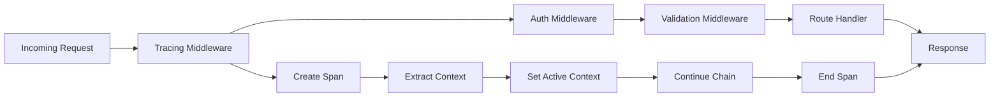

# How to Add OpenTelemetry Middleware to an Express.js Application

Author: [nawazdhandala](https://www.github.com/nawazdhandala)

Tags: OpenTelemetry, Express.js, Middleware, Node.js, Tracing, HTTP

Description: Complete guide to integrating OpenTelemetry tracing into Express.js applications using middleware, covering request tracking, context propagation, and custom instrumentation.

Express.js middleware provides the perfect integration point for OpenTelemetry tracing. By adding tracing middleware to your Express application, you can capture every HTTP request, propagate trace context, and build a complete picture of how requests flow through your system. This guide shows you how to implement OpenTelemetry middleware correctly.

## Understanding Express Middleware and Tracing

Express processes requests through a chain of middleware functions. Each middleware can inspect the request, modify the response, or pass control to the next handler. OpenTelemetry middleware sits at the beginning of this chain, creating a span for each incoming request and ensuring trace context flows through the entire request lifecycle.

The flow looks like this:



## Installing Dependencies

Install the OpenTelemetry SDK and Express instrumentation:

```bash
npm install @opentelemetry/sdk-node \
            @opentelemetry/api \
            @opentelemetry/instrumentation-express \
            @opentelemetry/instrumentation-http \
            @opentelemetry/exporter-trace-otlp-http \
            @opentelemetry/resources \
            @opentelemetry/semantic-conventions
```

## Basic OpenTelemetry Setup

Create a tracing initialization file that must run before your Express app:

```typescript
// src/tracing.ts

import { NodeSDK } from '@opentelemetry/sdk-node';
import { OTLPTraceExporter } from '@opentelemetry/exporter-trace-otlp-http';
import { Resource } from '@opentelemetry/resources';
import { SemanticResourceAttributes } from '@opentelemetry/semantic-conventions';
import { ExpressInstrumentation } from '@opentelemetry/instrumentation-express';
import { HttpInstrumentation } from '@opentelemetry/instrumentation-http';

export function initializeTracing() {
  const resource = new Resource({
    [SemanticResourceAttributes.SERVICE_NAME]: 'express-app',
    [SemanticResourceAttributes.SERVICE_VERSION]: '1.0.0',
  });

  const traceExporter = new OTLPTraceExporter({
    url: process.env.OTEL_EXPORTER_OTLP_ENDPOINT || 'http://localhost:4318/v1/traces',
  });

  const sdk = new NodeSDK({
    resource,
    traceExporter,
    instrumentations: [
      new HttpInstrumentation(),
      new ExpressInstrumentation(),
    ],
  });

  sdk.start();
  console.log('OpenTelemetry tracing initialized');

  process.on('SIGTERM', () => {
    sdk.shutdown()
      .then(() => console.log('Tracing shut down'))
      .catch((error) => console.error('Error shutting down tracing', error))
      .finally(() => process.exit(0));
  });

  return sdk;
}
```

## Creating a Basic Express App with Tracing

Initialize tracing before creating your Express application:

```typescript
// src/index.ts

import { initializeTracing } from './tracing';

// CRITICAL: Initialize tracing FIRST
initializeTracing();

// Now import and create Express app
import express from 'express';

const app = express();
const port = process.env.PORT || 3000;

// Middleware
app.use(express.json());
app.use(express.urlencoded({ extended: true }));

// Routes
app.get('/', (req, res) => {
  res.json({ message: 'Hello, traced world!' });
});

app.get('/users', (req, res) => {
  res.json({ users: [{ id: 1, name: 'Alice' }, { id: 2, name: 'Bob' }] });
});

app.listen(port, () => {
  console.log(`Server running on http://localhost:${port}`);
});
```

## Creating Custom Tracing Middleware

While auto-instrumentation handles basic tracing, custom middleware gives you more control:

```typescript
// src/middleware/tracing-middleware.ts

import { Request, Response, NextFunction } from 'express';
import { trace, context, SpanStatusCode, Span } from '@opentelemetry/api';

const tracer = trace.getTracer('express-app', '1.0.0');

export function tracingMiddleware() {
  return (req: Request, res: Response, next: NextFunction) => {
    // Create a span for this request
    const span = tracer.startSpan(`${req.method} ${req.path}`, {
      kind: 1, // SpanKind.SERVER
      attributes: {
        'http.method': req.method,
        'http.url': req.url,
        'http.target': req.path,
        'http.host': req.hostname,
        'http.scheme': req.protocol,
        'http.user_agent': req.get('user-agent') || 'unknown',
      },
    });

    // Add request ID if present
    const requestId = req.get('x-request-id');
    if (requestId) {
      span.setAttribute('request.id', requestId);
    }

    // Set span as active for this request context
    const ctx = trace.setSpan(context.active(), span);

    // Store span in request for later access
    (req as any).span = span;

    // Capture response details when response finishes
    const originalEnd = res.end;
    res.end = function (this: Response, ...args: any[]) {
      // Add response attributes
      span.setAttribute('http.status_code', res.statusCode);
      span.setAttribute('http.response.content_length', res.get('content-length') || 0);

      // Set span status based on status code
      if (res.statusCode >= 400) {
        span.setStatus({
          code: SpanStatusCode.ERROR,
          message: `HTTP ${res.statusCode}`,
        });
      } else {
        span.setStatus({ code: SpanStatusCode.OK });
      }

      // End the span
      span.end();

      // Call original end method
      return originalEnd.apply(this, args);
    };

    // Continue with request in traced context
    context.with(ctx, () => {
      next();
    });
  };
}
```

Apply the middleware to your Express app:

```typescript
// src/index.ts (updated)

import { initializeTracing } from './tracing';
initializeTracing();

import express from 'express';
import { tracingMiddleware } from './middleware/tracing-middleware';

const app = express();

// Add custom tracing middleware early in the chain
app.use(tracingMiddleware());

// Other middleware
app.use(express.json());

// Routes
app.get('/', (req, res) => {
  res.json({ message: 'Hello, traced world!' });
});

app.listen(3000);
```

## Adding Request Context Enrichment

Enhance spans with additional context from your application:

```typescript
// src/middleware/context-enrichment.ts

import { Request, Response, NextFunction } from 'express';
import { trace } from '@opentelemetry/api';

export function contextEnrichmentMiddleware() {
  return (req: Request, res: Response, next: NextFunction) => {
    const span = trace.getActiveSpan();

    if (span) {
      // Add user information if authenticated
      if (req.user) {
        span.setAttribute('user.id', (req.user as any).id);
        span.setAttribute('user.email', (req.user as any).email);
        span.setAttribute('auth.authenticated', true);
      } else {
        span.setAttribute('auth.authenticated', false);
      }

      // Add tenant/organization context
      const tenantId = req.get('x-tenant-id');
      if (tenantId) {
        span.setAttribute('tenant.id', tenantId);
      }

      // Add API version
      const apiVersion = req.get('x-api-version') || '1.0';
      span.setAttribute('api.version', apiVersion);

      // Add client information
      const clientId = req.get('x-client-id');
      if (clientId) {
        span.setAttribute('client.id', clientId);
      }

      // Add query parameters (be careful with sensitive data)
      const queryKeys = Object.keys(req.query);
      if (queryKeys.length > 0) {
        span.setAttribute('http.query.keys', queryKeys.join(','));
      }
    }

    next();
  };
}
```

## Creating Performance Monitoring Middleware

Track request duration and performance metrics:

```typescript
// src/middleware/performance-middleware.ts

import { Request, Response, NextFunction } from 'express';
import { trace } from '@opentelemetry/api';

export function performanceMiddleware() {
  return (req: Request, res: Response, next: NextFunction) => {
    const startTime = Date.now();
    const startHrTime = process.hrtime();

    // Store original end method
    const originalEnd = res.end;

    res.end = function (this: Response, ...args: any[]) {
      const duration = Date.now() - startTime;
      const [seconds, nanoseconds] = process.hrtime(startHrTime);
      const durationMs = seconds * 1000 + nanoseconds / 1000000;

      const span = trace.getActiveSpan();
      if (span) {
        // Add performance metrics
        span.setAttribute('request.duration_ms', durationMs);
        span.setAttribute('request.start_time', new Date(startTime).toISOString());
        span.setAttribute('request.end_time', new Date().toISOString());

        // Add performance event
        span.addEvent('request.completed', {
          duration_ms: durationMs,
          status_code: res.statusCode,
        });

        // Flag slow requests
        if (durationMs > 1000) {
          span.setAttribute('request.slow', true);
          span.addEvent('slow_request_detected', {
            threshold_ms: 1000,
            actual_ms: durationMs,
          });
        }
      }

      return originalEnd.apply(this, args);
    };

    next();
  };
}
```

## Error Handling Middleware with Tracing

Capture and trace errors properly:

```typescript
// src/middleware/error-middleware.ts

import { Request, Response, NextFunction } from 'express';
import { trace, SpanStatusCode } from '@opentelemetry/api';

export function errorMiddleware() {
  return (err: Error, req: Request, res: Response, next: NextFunction) => {
    const span = trace.getActiveSpan();

    if (span) {
      // Record the exception in the span
      span.recordException(err);

      // Set error status
      span.setStatus({
        code: SpanStatusCode.ERROR,
        message: err.message,
      });

      // Add error attributes
      span.setAttribute('error', true);
      span.setAttribute('error.type', err.constructor.name);
      span.setAttribute('error.message', err.message);

      if (err.stack) {
        span.setAttribute('error.stack', err.stack);
      }

      // Add error event
      span.addEvent('error.occurred', {
        exception_type: err.constructor.name,
        exception_message: err.message,
        timestamp: new Date().toISOString(),
      });
    }

    // Send error response
    res.status(500).json({
      error: 'Internal Server Error',
      message: process.env.NODE_ENV === 'development' ? err.message : undefined,
    });
  };
}
```

## Combining Multiple Middleware Layers

Build a complete middleware stack with tracing:

```typescript
// src/index.ts (complete example)

import { initializeTracing } from './tracing';
initializeTracing();

import express from 'express';
import { tracingMiddleware } from './middleware/tracing-middleware';
import { contextEnrichmentMiddleware } from './middleware/context-enrichment';
import { performanceMiddleware } from './middleware/performance-middleware';
import { errorMiddleware } from './middleware/error-middleware';

const app = express();

// Apply middleware in order
app.use(tracingMiddleware());
app.use(express.json());
app.use(performanceMiddleware());
app.use(contextEnrichmentMiddleware());

// Routes
app.get('/', (req, res) => {
  res.json({ message: 'Hello, world!' });
});

app.get('/users/:id', (req, res) => {
  const span = trace.getActiveSpan();
  if (span) {
    span.setAttribute('user.id', req.params.id);
  }

  res.json({ id: req.params.id, name: 'Alice' });
});

app.post('/users', (req, res) => {
  const span = trace.getActiveSpan();
  if (span) {
    span.addEvent('user.creation.requested');
  }

  // Simulate user creation
  const user = { id: Math.random(), ...req.body };

  res.status(201).json(user);
});

// Error route for testing
app.get('/error', (req, res, next) => {
  next(new Error('Test error'));
});

// Error handling middleware (must be last)
app.use(errorMiddleware());

app.listen(3000, () => {
  console.log('Server running on http://localhost:3000');
});
```

## Route-Specific Middleware

Add tracing middleware to specific routes:

```typescript
// src/routes/api.ts

import { Router } from 'express';
import { trace } from '@opentelemetry/api';

const router = Router();

// Middleware for specific route
function apiTracingMiddleware() {
  return (req, res, next) => {
    const span = trace.getActiveSpan();
    if (span) {
      span.setAttribute('api.route', req.route.path);
      span.setAttribute('api.version', 'v1');
      span.addEvent('api.request.started');
    }
    next();
  };
}

// Apply to specific routes
router.get('/data', apiTracingMiddleware(), (req, res) => {
  const span = trace.getActiveSpan();
  if (span) {
    span.addEvent('fetching.data');
  }

  res.json({ data: [1, 2, 3] });
});

router.post('/process', apiTracingMiddleware(), async (req, res) => {
  const span = trace.getActiveSpan();
  if (span) {
    span.addEvent('processing.started');
    span.setAttribute('process.type', req.body.type);
  }

  // Simulate processing
  await new Promise(resolve => setTimeout(resolve, 100));

  if (span) {
    span.addEvent('processing.completed');
  }

  res.json({ status: 'processed' });
});

export default router;
```

## Excluding Routes from Tracing

Skip tracing for health checks and other noise:

```typescript
// src/middleware/selective-tracing.ts

import { Request, Response, NextFunction } from 'express';
import { trace, context, ROOT_CONTEXT } from '@opentelemetry/api';

const EXCLUDED_PATHS = ['/health', '/metrics', '/ready', '/favicon.ico'];

export function selectiveTracingMiddleware() {
  return (req: Request, res: Response, next: NextFunction) => {
    // Skip tracing for excluded paths
    if (EXCLUDED_PATHS.includes(req.path)) {
      // Continue without tracing context
      return context.with(ROOT_CONTEXT, () => {
        next();
      });
    }

    // Continue with normal tracing
    next();
  };
}
```

Apply before the tracing middleware:

```typescript
app.use(selectiveTracingMiddleware());
app.use(tracingMiddleware());
```

## Testing Traced Middleware

Verify your tracing middleware works correctly:

```typescript
// src/middleware/__tests__/tracing-middleware.test.ts

import request from 'supertest';
import express from 'express';
import { initializeTracing } from '../../tracing';
import { tracingMiddleware } from '../tracing-middleware';

describe('Tracing Middleware', () => {
  let app: express.Application;

  beforeAll(() => {
    initializeTracing();
  });

  beforeEach(() => {
    app = express();
    app.use(tracingMiddleware());
    app.get('/test', (req, res) => {
      res.json({ message: 'test' });
    });
  });

  it('should trace GET requests', async () => {
    const response = await request(app)
      .get('/test')
      .expect(200);

    expect(response.body.message).toBe('test');
    // In real tests, you'd verify span creation
  });

  it('should handle errors in traced context', async () => {
    app.get('/error', (req, res, next) => {
      next(new Error('Test error'));
    });

    await request(app)
      .get('/error')
      .expect(500);
  });
});
```

## Common Middleware Patterns

**Async Middleware**: Always use async/await properly to maintain trace context:

```typescript
app.use(async (req, res, next) => {
  const span = trace.getActiveSpan();
  try {
    await someAsyncOperation();
    next();
  } catch (error) {
    if (span) {
      span.recordException(error);
    }
    next(error);
  }
});
```

**Context Propagation**: Ensure trace context flows through async operations:

```typescript
app.get('/data', async (req, res) => {
  const span = trace.getActiveSpan();

  // Context automatically propagates through await
  const data = await fetchData();

  res.json(data);
});
```

**Conditional Tracing**: Enable/disable tracing based on environment:

```typescript
const shouldTrace = process.env.ENABLE_TRACING === 'true';

if (shouldTrace) {
  app.use(tracingMiddleware());
}
```

OpenTelemetry middleware transforms Express.js applications into observable systems. By strategically placing tracing middleware in your request pipeline, you gain complete visibility into how requests flow through your application, where time is spent, and what errors occur. The key is finding the right balance between detailed tracing and performance overhead.
