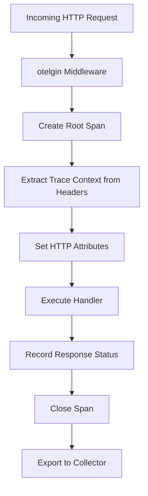

# How to Add OpenTelemetry Middleware to a Go Gin Application with otelgin

Author: [nawazdhandala](https://www.github.com/nawazdhandala)

Tags: OpenTelemetry, Go, Gin, Middleware, otelgin, Tracing

Description: Learn how to implement OpenTelemetry middleware in Go Gin applications using otelgin for comprehensive HTTP request tracing and observability.

The Gin web framework is one of the most popular choices for building HTTP services in Go, known for its speed and minimalist design. When building production services, observability becomes critical for understanding system behavior, debugging issues, and maintaining service health. OpenTelemetry provides a standardized approach to instrumentation, and the otelgin package makes it straightforward to add distributed tracing to your Gin applications.

## Understanding otelgin Middleware

The otelgin package is an official OpenTelemetry contribution that provides middleware specifically designed for Gin applications. It automatically creates spans for incoming HTTP requests, captures essential metadata like HTTP method, status code, route patterns, and propagates trace context to downstream services.

Unlike manual instrumentation where you'd need to create spans for each endpoint, otelgin handles this automatically. Every request that hits your Gin router gets traced without requiring changes to individual handler functions.

## Installing Required Dependencies

First, you need to install the necessary packages for your Go project.

```bash
# Install Gin web framework
go get -u github.com/gin-gonic/gin

# Install OpenTelemetry SDK and API
go get -u go.opentelemetry.io/otel
go get -u go.opentelemetry.io/otel/sdk

# Install otelgin middleware
go get -u go.opentelemetry.io/contrib/instrumentation/github.com/gin-gonic/gin/otelgin

# Install OTLP exporter for sending traces
go get -u go.opentelemetry.io/otel/exporters/otlp/otlptrace
go get -u go.opentelemetry.io/otel/exporters/otlp/otlptrace/otlptracegrpc
```

## Setting Up OpenTelemetry Tracer Provider

Before using the middleware, you need to configure the OpenTelemetry SDK with a tracer provider and exporter.

```go
package main

import (
    "context"
    "log"
    "time"

    "go.opentelemetry.io/otel"
    "go.opentelemetry.io/otel/exporters/otlp/otlptrace/otlptracegrpc"
    "go.opentelemetry.io/otel/sdk/resource"
    sdktrace "go.opentelemetry.io/otel/sdk/trace"
    semconv "go.opentelemetry.io/otel/semconv/v1.17.0"
)

// initTracer sets up the OpenTelemetry tracer provider with OTLP exporter
// This sends traces to a collector endpoint (like Jaeger, OneUptime, or OTEL Collector)
func initTracer() (*sdktrace.TracerProvider, error) {
    ctx := context.Background()

    // Create OTLP trace exporter that sends data via gRPC
    // By default, this connects to localhost:4317
    exporter, err := otlptracegrpc.New(ctx,
        otlptracegrpc.WithInsecure(), // Use WithTLSCredentials() in production
        otlptracegrpc.WithEndpoint("localhost:4317"),
    )
    if err != nil {
        return nil, err
    }

    // Define resource attributes that identify your service
    // These appear in every span and help identify the source
    resource := resource.NewWithAttributes(
        semconv.SchemaURL,
        semconv.ServiceNameKey.String("gin-api-service"),
        semconv.ServiceVersionKey.String("1.0.0"),
        semconv.DeploymentEnvironmentKey.String("production"),
    )

    // Create tracer provider with batch span processor
    // Batching improves performance by reducing network calls
    tp := sdktrace.NewTracerProvider(
        sdktrace.WithBatcher(exporter),
        sdktrace.WithResource(resource),
        sdktrace.WithSampler(sdktrace.AlwaysSample()), // Sample all traces
    )

    // Set global tracer provider so otelgin can access it
    otel.SetTracerProvider(tp)

    return tp, nil
}
```

## Adding otelgin Middleware to Your Gin Router

With the tracer provider configured, you can now add the otelgin middleware to your Gin application.

```go
package main

import (
    "net/http"

    "github.com/gin-gonic/gin"
    "go.opentelemetry.io/contrib/instrumentation/github.com/gin-gonic/gin/otelgin"
)

func main() {
    // Initialize OpenTelemetry tracer
    tp, err := initTracer()
    if err != nil {
        log.Fatalf("Failed to initialize tracer: %v", err)
    }
    defer func() {
        // Ensure all spans are exported before shutdown
        ctx, cancel := context.WithTimeout(context.Background(), 5*time.Second)
        defer cancel()
        if err := tp.Shutdown(ctx); err != nil {
            log.Printf("Error shutting down tracer provider: %v", err)
        }
    }()

    // Create Gin router
    router := gin.Default()

    // Add otelgin middleware - this instruments ALL routes registered after it
    // The service name should match what you set in the tracer provider
    router.Use(otelgin.Middleware("gin-api-service"))

    // Define routes - these will automatically be traced
    router.GET("/users", getUsers)
    router.GET("/users/:id", getUserByID)
    router.POST("/users", createUser)

    // Start server
    log.Println("Server starting on :8080")
    if err := router.Run(":8080"); err != nil {
        log.Fatalf("Failed to start server: %v", err)
    }
}
```

## Understanding What otelgin Captures

When a request comes in, otelgin automatically creates a span with several important attributes that follow OpenTelemetry semantic conventions.



The middleware captures:

- **HTTP Method**: GET, POST, PUT, DELETE, etc.
- **Route Pattern**: The parameterized route like `/users/:id` rather than `/users/123`
- **Status Code**: HTTP response code (200, 404, 500, etc.)
- **Request URL**: Full URL path
- **User Agent**: Client user agent string
- **Trace Context**: Propagated from upstream services via W3C Trace Context headers

## Implementing Handler Functions with Context

Your handler functions should accept the Gin context, which otelgin automatically enhances with trace information.

```go
// getUsers retrieves all users from the database
// The span created by otelgin is already in the context
func getUsers(c *gin.Context) {
    // Extract the context for passing to other functions
    ctx := c.Request.Context()

    // If you need to create child spans for internal operations
    // you can get the tracer and create them manually
    users, err := fetchUsersFromDatabase(ctx)
    if err != nil {
        c.JSON(http.StatusInternalServerError, gin.H{
            "error": "Failed to fetch users",
        })
        return
    }

    c.JSON(http.StatusOK, users)
}

// getUserByID retrieves a specific user by ID
// Route parameters are automatically captured in the span
func getUserByID(c *gin.Context) {
    userID := c.Param("id")

    // The context already contains the active span
    ctx := c.Request.Context()

    user, err := fetchUserByID(ctx, userID)
    if err != nil {
        c.JSON(http.StatusNotFound, gin.H{
            "error": "User not found",
        })
        return
    }

    c.JSON(http.StatusOK, user)
}

// createUser creates a new user
func createUser(c *gin.Context) {
    var user User

    if err := c.ShouldBindJSON(&user); err != nil {
        c.JSON(http.StatusBadRequest, gin.H{
            "error": "Invalid request body",
        })
        return
    }

    ctx := c.Request.Context()
    if err := saveUserToDatabase(ctx, &user); err != nil {
        c.JSON(http.StatusInternalServerError, gin.H{
            "error": "Failed to create user",
        })
        return
    }

    c.JSON(http.StatusCreated, user)
}
```

## Customizing Middleware Behavior with Options

The otelgin package provides several options to customize how spans are created and what information they contain.

```go
// Custom middleware configuration with filters and span attributes
router.Use(otelgin.Middleware(
    "gin-api-service",
    // Filter out health check endpoints from tracing
    otelgin.WithFilter(func(req *http.Request) bool {
        // Return true to trace, false to skip
        return req.URL.Path != "/health" && req.URL.Path != "/metrics"
    }),
    // Customize span naming
    otelgin.WithSpanNameFormatter(func(req *http.Request) string {
        // Default format is "HTTP {METHOD}"
        // You can customize it to include more context
        return req.Method + " " + req.URL.Path
    }),
))
```

## Handling Errors and Recording Exceptions

When errors occur in your handlers, you should record them in the active span to maintain visibility into failures.

```go
import (
    "go.opentelemetry.io/otel/codes"
    "go.opentelemetry.io/otel/trace"
)

func riskyHandler(c *gin.Context) {
    ctx := c.Request.Context()

    // Get the current span from context
    span := trace.SpanFromContext(ctx)

    result, err := performRiskyOperation(ctx)
    if err != nil {
        // Record the error in the span
        span.RecordError(err)
        span.SetStatus(codes.Error, err.Error())

        c.JSON(http.StatusInternalServerError, gin.H{
            "error": "Operation failed",
        })
        return
    }

    c.JSON(http.StatusOK, result)
}
```

## Testing Your Instrumented Application

To verify that traces are being generated correctly, you can run an OpenTelemetry Collector locally or use a service like Jaeger.

```bash
# Run Jaeger all-in-one for local testing
docker run -d --name jaeger \
  -e COLLECTOR_OTLP_ENABLED=true \
  -p 16686:16686 \
  -p 4317:4317 \
  -p 4318:4318 \
  jaegertracing/all-in-one:latest

# Access Jaeger UI at http://localhost:16686
```

After starting your Gin application and making some requests, you should see traces appear in the Jaeger UI with detailed timing information for each HTTP request.

## Production Considerations

When deploying instrumented applications to production, consider these factors:

**Sampling Strategy**: Always sampling (AlwaysSample) works for low-traffic services, but high-traffic services should use probabilistic sampling or parent-based sampling to reduce overhead.

**Export Configuration**: Use batching with appropriate timeout and queue settings to balance between data freshness and performance.

**Resource Attributes**: Include environment, version, and host information to make traces more useful for debugging.

**Security**: Use TLS credentials when connecting to remote collectors, never send traces over insecure connections in production.

**Performance Impact**: The otelgin middleware adds minimal overhead (typically under 1ms per request), but measure the impact in your specific workload.

## Complete Working Example

Here's a complete, runnable example that demonstrates otelgin integration with proper error handling and graceful shutdown.

```go
package main

import (
    "context"
    "log"
    "net/http"
    "os"
    "os/signal"
    "syscall"
    "time"

    "github.com/gin-gonic/gin"
    "go.opentelemetry.io/contrib/instrumentation/github.com/gin-gonic/gin/otelgin"
    "go.opentelemetry.io/otel"
    "go.opentelemetry.io/otel/exporters/otlp/otlptrace/otlptracegrpc"
    "go.opentelemetry.io/otel/sdk/resource"
    sdktrace "go.opentelemetry.io/otel/sdk/trace"
    semconv "go.opentelemetry.io/otel/semconv/v1.17.0"
)

type User struct {
    ID   string `json:"id"`
    Name string `json:"name"`
}

func main() {
    tp, err := initTracer()
    if err != nil {
        log.Fatalf("Failed to initialize tracer: %v", err)
    }

    router := gin.Default()
    router.Use(otelgin.Middleware("gin-api-service"))

    router.GET("/users", func(c *gin.Context) {
        users := []User{
            {ID: "1", Name: "Alice"},
            {ID: "2", Name: "Bob"},
        }
        c.JSON(http.StatusOK, users)
    })

    srv := &http.Server{
        Addr:    ":8080",
        Handler: router,
    }

    go func() {
        if err := srv.ListenAndServe(); err != nil && err != http.ErrServerClosed {
            log.Fatalf("Server failed: %v", err)
        }
    }()

    log.Println("Server started on :8080")

    // Wait for interrupt signal
    quit := make(chan os.Signal, 1)
    signal.Notify(quit, syscall.SIGINT, syscall.SIGTERM)
    <-quit

    log.Println("Shutting down server...")

    ctx, cancel := context.WithTimeout(context.Background(), 5*time.Second)
    defer cancel()

    if err := srv.Shutdown(ctx); err != nil {
        log.Printf("Server shutdown error: %v", err)
    }

    if err := tp.Shutdown(ctx); err != nil {
        log.Printf("Tracer shutdown error: %v", err)
    }
}

func initTracer() (*sdktrace.TracerProvider, error) {
    ctx := context.Background()

    exporter, err := otlptracegrpc.New(ctx,
        otlptracegrpc.WithInsecure(),
        otlptracegrpc.WithEndpoint("localhost:4317"),
    )
    if err != nil {
        return nil, err
    }

    resource := resource.NewWithAttributes(
        semconv.SchemaURL,
        semconv.ServiceNameKey.String("gin-api-service"),
    )

    tp := sdktrace.NewTracerProvider(
        sdktrace.WithBatcher(exporter),
        sdktrace.WithResource(resource),
    )

    otel.SetTracerProvider(tp)
    return tp, nil
}
```

The otelgin middleware provides a robust foundation for observability in Gin applications. By adding just a few lines of code, you gain deep visibility into request patterns, performance characteristics, and error conditions across your entire service.
