# How to Instrument Netlify Functions with OpenTelemetry

Author: [nawazdhandala](https://www.github.com/nawazdhandala)

Tags: OpenTelemetry, Netlify, Serverless, Functions, Tracing, Observability, JavaScript

Description: A practical guide to adding OpenTelemetry instrumentation to Netlify Functions for tracing, error tracking, and observability in serverless environments.

---

Netlify Functions give you a simple way to run server-side code alongside your static sites and frontend applications. Under the hood, they run on AWS Lambda, which means they have the same cold start behavior and execution lifecycle as Lambda functions. When things go wrong in production, you need visibility into what your functions are actually doing.

OpenTelemetry lets you instrument your Netlify Functions with distributed tracing and metrics. You can see exactly how long database queries take, which external API calls are failing, and where errors are happening. This guide walks through the complete setup.

## Understanding Netlify Functions Execution

Netlify Functions come in two flavors: standard functions (Node.js on Lambda) and edge functions (Deno on Cloudflare Workers). This guide focuses on standard functions since they're more commonly used and have broader library support.

```mermaid
graph LR
    A[Client Request] --> B[Netlify CDN]
    B --> C[/.netlify/functions/*]
    C --> D[AWS Lambda]
    D --> E[Your Function Code]
    E --> F[OpenTelemetry SDK]
    F --> G[OTLP Exporter]
    G --> H[Collector / Backend]
```

Each function invocation is a short-lived process. The function boots up (on cold start), handles the request, and may stay warm for subsequent invocations. The key challenge is making sure telemetry data is exported before the function finishes executing.

## Installing Dependencies

Add the OpenTelemetry packages to your project. Since Netlify Functions run on Node.js, we can use the standard Node.js SDK.

```bash
# Install OpenTelemetry for Netlify Functions
npm install @opentelemetry/sdk-node \
  @opentelemetry/sdk-trace-base \
  @opentelemetry/exporter-trace-otlp-http \
  @opentelemetry/resources \
  @opentelemetry/semantic-conventions \
  @opentelemetry/api \
  @opentelemetry/instrumentation-http \
  @opentelemetry/instrumentation-fetch
```

We're installing specific instrumentations rather than the full auto-instrumentation package. In serverless environments, keeping the dependency footprint small helps with cold start times.

## Creating a Telemetry Wrapper

The biggest challenge with serverless OpenTelemetry is lifecycle management. You need to initialize the SDK once (ideally reused across warm invocations) and flush all spans before the function returns. Let's create a wrapper that handles this.

```javascript
// lib/telemetry.js - OpenTelemetry wrapper for Netlify Functions
const { NodeSDK } = require('@opentelemetry/sdk-node');
const { SimpleSpanProcessor } = require('@opentelemetry/sdk-trace-base');
const { OTLPTraceExporter } = require('@opentelemetry/exporter-trace-otlp-http');
const { Resource } = require('@opentelemetry/resources');
const { ATTR_SERVICE_NAME } = require('@opentelemetry/semantic-conventions');
const { trace } = require('@opentelemetry/api');

let sdk = null;
let isInitialized = false;

// Initialize the SDK once per cold start
function initTelemetry() {
  if (isInitialized) return;

  const exporter = new OTLPTraceExporter({
    url: process.env.OTEL_EXPORTER_OTLP_ENDPOINT + '/v1/traces',
    headers: {
      'x-oneuptime-token': process.env.ONEUPTIME_TOKEN || '',
    },
  });

  sdk = new NodeSDK({
    resource: new Resource({
      [ATTR_SERVICE_NAME]: process.env.OTEL_SERVICE_NAME || 'netlify-functions',
      'deployment.environment': process.env.CONTEXT || 'production',
      'faas.name': 'netlify-function',
      // Netlify provides these environment variables
      'netlify.site.name': process.env.SITE_NAME || 'unknown',
      'netlify.deploy.id': process.env.DEPLOY_ID || 'unknown',
      'netlify.build.id': process.env.BUILD_ID || 'unknown',
    }),
    // Use SimpleSpanProcessor to export spans immediately
    // BatchSpanProcessor can lose data in serverless because the function
    // may freeze before the batch timer fires
    spanProcessor: new SimpleSpanProcessor(exporter),
  });

  sdk.start();
  isInitialized = true;
}

// Force export all pending spans
async function flushTelemetry() {
  if (sdk) {
    const provider = trace.getTracerProvider();
    if (provider && typeof provider.forceFlush === 'function') {
      await provider.forceFlush();
    }
  }
}

// Get a tracer instance for creating custom spans
function getTracer(name) {
  initTelemetry();
  return trace.getTracer(name);
}

module.exports = { initTelemetry, flushTelemetry, getTracer };
```

Two important design decisions here. First, we use `SimpleSpanProcessor` instead of `BatchSpanProcessor`. In serverless, the batch processor's timer might not fire before the function freezes, which means spans get lost. `SimpleSpanProcessor` exports each span immediately when it ends. Second, we check `isInitialized` to avoid reinitializing the SDK on warm invocations.

## Instrumenting a Basic Netlify Function

Here's how to use the telemetry wrapper in a Netlify Function. The pattern is: initialize on cold start, create spans during execution, and flush before returning.

```javascript
// netlify/functions/get-users.js - Instrumented Netlify Function
const { getTracer, flushTelemetry, initTelemetry } = require('../../lib/telemetry');

// Initialize telemetry on cold start (outside the handler)
initTelemetry();

const tracer = getTracer('netlify-functions.get-users');

exports.handler = async function(event, context) {
  // Create a root span for the entire function invocation
  return tracer.startActiveSpan('get-users', async (span) => {
    try {
      // Add request context as span attributes
      span.setAttribute('http.method', event.httpMethod);
      span.setAttribute('http.path', event.path);
      span.setAttribute('faas.trigger', 'http');

      // Parse query parameters
      const page = parseInt(event.queryStringParameters?.page || '1');
      span.setAttribute('query.page', page);

      // Trace the database query as a child span
      const users = await tracer.startActiveSpan('query-database', async (dbSpan) => {
        dbSpan.setAttribute('db.system', 'postgresql');
        dbSpan.setAttribute('db.operation', 'SELECT');

        const result = await fetchUsersFromDB(page);

        dbSpan.setAttribute('db.result_count', result.length);
        dbSpan.end();
        return result;
      });

      span.setAttribute('response.user_count', users.length);

      return {
        statusCode: 200,
        headers: { 'Content-Type': 'application/json' },
        body: JSON.stringify({ users, page }),
      };
    } catch (error) {
      // Record the error on the span
      span.recordException(error);
      span.setStatus({ code: 2, message: error.message });

      return {
        statusCode: 500,
        body: JSON.stringify({ error: 'Internal server error' }),
      };
    } finally {
      span.end();
      // Flush all spans before the function returns
      await flushTelemetry();
    }
  });
};
```

The `flushTelemetry()` call in the `finally` block is critical. Without it, spans might be lost when Lambda freezes the execution environment between invocations.

## Higher-Order Function Pattern

If you have many Netlify Functions, wrapping each one with telemetry boilerplate gets repetitive. Create a higher-order function that handles the common parts.

```javascript
// lib/withTelemetry.js - Higher-order function for instrumenting Netlify Functions
const { getTracer, flushTelemetry, initTelemetry } = require('./telemetry');

initTelemetry();

// Wrap any Netlify Function handler with OpenTelemetry instrumentation
function withTelemetry(functionName, handler) {
  const tracer = getTracer(`netlify-functions.${functionName}`);

  return async function(event, context) {
    return tracer.startActiveSpan(functionName, async (span) => {
      try {
        // Automatically capture common request attributes
        span.setAttribute('http.method', event.httpMethod);
        span.setAttribute('http.path', event.path);
        span.setAttribute('faas.trigger', 'http');
        span.setAttribute('faas.name', functionName);

        if (event.headers?.['x-forwarded-for']) {
          span.setAttribute('http.client_ip', event.headers['x-forwarded-for']);
        }

        // Call the actual handler
        const response = await handler(event, context, span);

        // Record the response status
        span.setAttribute('http.status_code', response.statusCode);

        return response;
      } catch (error) {
        span.recordException(error);
        span.setStatus({ code: 2, message: error.message });

        return {
          statusCode: 500,
          body: JSON.stringify({ error: 'Internal server error' }),
        };
      } finally {
        span.end();
        await flushTelemetry();
      }
    });
  };
}

module.exports = { withTelemetry };
```

Now your functions become much cleaner:

```javascript
// netlify/functions/create-order.js - Clean function using the wrapper
const { withTelemetry } = require('../../lib/withTelemetry');
const { getTracer } = require('../../lib/telemetry');

const tracer = getTracer('netlify-functions.create-order');

// The third argument (span) is the root span from the wrapper
const handler = async (event, context, span) => {
  const orderData = JSON.parse(event.body);
  span.setAttribute('order.item_count', orderData.items.length);

  // Create a child span for payment processing
  const paymentResult = await tracer.startActiveSpan('process-payment', async (paymentSpan) => {
    paymentSpan.setAttribute('payment.method', orderData.paymentMethod);

    const result = await chargePayment(orderData);
    paymentSpan.setAttribute('payment.status', result.status);
    paymentSpan.end();
    return result;
  });

  return {
    statusCode: 201,
    body: JSON.stringify({ orderId: paymentResult.orderId }),
  };
};

// Export the instrumented handler
exports.handler = withTelemetry('create-order', handler);
```

## Setting Environment Variables

Configure your OpenTelemetry settings in the Netlify dashboard. Go to Site settings, then Environment variables.

```
OTEL_EXPORTER_OTLP_ENDPOINT = https://your-collector.example.com
OTEL_SERVICE_NAME = my-netlify-site
ONEUPTIME_TOKEN = your-auth-token
```

You can also set these in your `netlify.toml` file for non-sensitive values:

```toml
# netlify.toml - Build and function configuration
[build]
  functions = "netlify/functions"

[context.production.environment]
  OTEL_SERVICE_NAME = "my-site-production"

[context.deploy-preview.environment]
  OTEL_SERVICE_NAME = "my-site-preview"
```

## Tracing External API Calls

Netlify Functions often call external APIs. You can trace these calls by wrapping `fetch` with custom spans. The OpenTelemetry SDK will also propagate trace context to downstream services that support W3C Trace Context.

```javascript
// lib/tracedFetch.js - Fetch wrapper that creates spans for external calls
const { getTracer } = require('./telemetry');
const { propagation, context } = require('@opentelemetry/api');

const tracer = getTracer('netlify-functions.http-client');

async function tracedFetch(url, options = {}) {
  const parsedUrl = new URL(url);

  return tracer.startActiveSpan(`HTTP ${options.method || 'GET'} ${parsedUrl.hostname}`, async (span) => {
    try {
      // Set span attributes describing the outgoing request
      span.setAttribute('http.method', options.method || 'GET');
      span.setAttribute('http.url', url);
      span.setAttribute('net.peer.name', parsedUrl.hostname);

      // Inject trace context headers into the outgoing request
      const headers = { ...options.headers };
      propagation.inject(context.active(), headers);

      const response = await fetch(url, { ...options, headers });

      span.setAttribute('http.status_code', response.status);

      if (response.status >= 400) {
        span.setStatus({ code: 2, message: `HTTP ${response.status}` });
      }

      return response;
    } catch (error) {
      span.recordException(error);
      span.setStatus({ code: 2, message: error.message });
      throw error;
    } finally {
      span.end();
    }
  });
}

module.exports = { tracedFetch };
```

## Handling Scheduled Functions

Netlify supports scheduled functions (cron jobs). These work similarly to regular functions but are triggered by a schedule instead of an HTTP request.

```javascript
// netlify/functions/cleanup-sessions.js - Scheduled function with telemetry
const { getTracer, flushTelemetry, initTelemetry } = require('../../lib/telemetry');

initTelemetry();
const tracer = getTracer('netlify-functions.scheduled');

// Netlify scheduled function configuration
exports.handler = async function(event, context) {
  return tracer.startActiveSpan('scheduled-cleanup', async (span) => {
    try {
      span.setAttribute('faas.trigger', 'timer');
      span.setAttribute('faas.name', 'cleanup-sessions');

      // Perform the scheduled work
      const deletedCount = await deleteExpiredSessions();
      span.setAttribute('cleanup.deleted_count', deletedCount);

      console.log(`Cleaned up ${deletedCount} expired sessions`);

      return { statusCode: 200 };
    } catch (error) {
      span.recordException(error);
      span.setStatus({ code: 2, message: error.message });
      return { statusCode: 500 };
    } finally {
      span.end();
      await flushTelemetry();
    }
  });
};

// Schedule configuration (run every hour)
exports.config = {
  schedule: "0 * * * *",
};
```

## Trace Visualization

Once your functions are instrumented and exporting data, you'll see traces in your observability backend that look something like this:

```mermaid
gantt
    title Netlify Function Trace - create-order
    dateFormat X
    axisFormat %L ms
    section Function
    create-order           :0, 450
    section Payment
    process-payment        :50, 300
    section Database
    save-order             :310, 100
    section Notifications
    send-confirmation      :350, 80
```



Each bar represents a span. The parent-child relationships show you the call hierarchy, and the durations help you identify where time is being spent. If the payment processing step suddenly starts taking 2 seconds instead of 200 milliseconds, you'll see it immediately.

## Cold Start Impact

OpenTelemetry adds some overhead to cold starts because the SDK needs to initialize. In testing, the typical overhead is 50-150 milliseconds for the initial cold start. After that, warm invocations have minimal overhead since the SDK is already initialized and reused.

To minimize cold start impact:

- Only install the instrumentations you actually need
- Use `SimpleSpanProcessor` to avoid background timers
- Keep your function's dependency tree small
- Consider using Netlify's background functions for non-latency-sensitive operations

## Summary

Instrumenting Netlify Functions with OpenTelemetry requires handling the serverless lifecycle carefully, but the payoff is full visibility into your function's behavior. The key patterns are:

- Initialize the SDK outside the handler for reuse across warm invocations
- Use `SimpleSpanProcessor` instead of batching to prevent data loss
- Always flush telemetry in a `finally` block before the function returns
- Use a higher-order wrapper function to reduce boilerplate across your functions
- Include Netlify-specific context like deploy ID and site name in resource attributes

With this setup, you can trace requests from your frontend through Netlify Functions and into your backend services, giving you a complete picture of how your application behaves in production.
