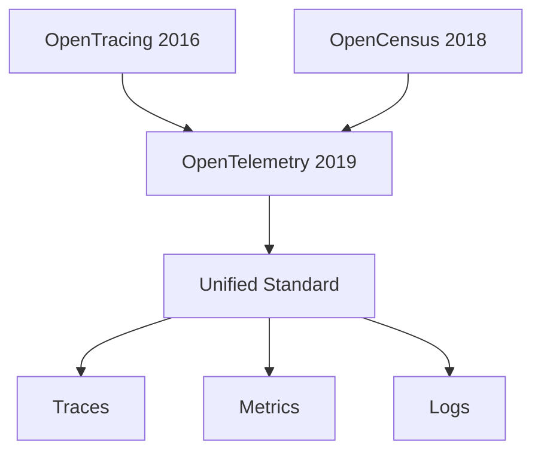

# How to Understand the Relationship Between OpenTelemetry, OpenTracing, and OpenCensus

Author: [nawazdhandala](https://www.github.com/nawazdhandala)

Tags: OpenTelemetry, OpenTracing, OpenCensus, History, Migration

Description: Understanding the history and relationships between OpenTelemetry, OpenTracing, and OpenCensus to make informed migration and adoption decisions.

The observability landscape evolved rapidly over the past decade, resulting in multiple competing standards before consolidating into OpenTelemetry. If you're working with distributed systems, you've likely encountered OpenTracing or OpenCensus in existing codebases. Understanding how these projects relate to OpenTelemetry helps you make informed decisions about migration timelines and compatibility.

## The Pre-OpenTelemetry Era

Before 2019, the observability ecosystem was fragmented. Vendors built proprietary instrumentation libraries that locked you into their platforms. If you wanted to switch from one observability vendor to another, you had to rip out all your instrumentation and replace it with the new vendor's libraries. This created enormous friction and made vendor lock-in a serious concern.

Two projects emerged to solve this problem: OpenTracing and OpenCensus. Both aimed to provide vendor-neutral instrumentation APIs, but they took different approaches and gained traction in different communities.

## OpenTracing: The Specification-First Approach

OpenTracing started in 2016 as a vendor-neutral API for distributed tracing. The project defined a specification for how traces and spans should work, then provided implementations in multiple languages. The goal was simple: instrument your code once using the OpenTracing API, then swap out backend implementations without changing your application code.

OpenTracing focused purely on distributed tracing. It didn't handle metrics or logs. The API defined core concepts like spans, span context, and trace propagation, but left the actual implementation details to backend providers.

Here's what OpenTracing instrumentation looked like:

```java
// Java OpenTracing example
import io.opentracing.Tracer;
import io.opentracing.Span;
import io.opentracing.util.GlobalTracer;

public class PaymentService {
    private final Tracer tracer = GlobalTracer.get();

    public void processPayment(String userId, double amount) {
        Span span = tracer.buildSpan("process_payment")
            .withTag("user.id", userId)
            .withTag("payment.amount", amount)
            .start();

        try {
            // Payment processing logic
            chargeCustomer(userId, amount);
            span.setTag("payment.status", "success");
        } catch (Exception e) {
            span.setTag("error", true);
            span.log(ImmutableMap.of("event", "error", "message", e.getMessage()));
            throw e;
        } finally {
            span.finish();
        }
    }
}
```

The tracer implementation came from a separate library. You could use Jaeger, Zipkin, or any vendor that provided an OpenTracing-compatible tracer. The application code remained unchanged when switching backends.

## OpenCensus: Google's Take on Observability

OpenCensus emerged from Google in 2018, bringing a different philosophy. Rather than focusing on specifications, OpenCensus provided a complete implementation that handled both tracing and metrics. It came from Google's internal observability infrastructure and represented battle-tested patterns from running massive distributed systems.

OpenCensus was more opinionated than OpenTracing. It included the full SDK, not just an API specification. This meant you got features like sampling, context propagation, and metric aggregation out of the box.

```python
# Python OpenCensus example
from opencensus.trace import tracer as tracer_module
from opencensus.trace.samplers import AlwaysOnSampler
from opencensus.ext.stackdriver import trace_exporter

# Initialize the tracer with a specific exporter
exporter = trace_exporter.StackdriverExporter()
tracer = tracer_module.Tracer(
    exporter=exporter,
    sampler=AlwaysOnSampler()
)

def process_payment(user_id, amount):
    with tracer.span(name='process_payment') as span:
        span.add_attribute('user.id', user_id)
        span.add_attribute('payment.amount', amount)

        try:
            # Payment processing logic
            charge_customer(user_id, amount)
            span.add_attribute('payment.status', 'success')
        except Exception as e:
            span.add_attribute('error', True)
            span.add_attribute('error.message', str(e))
            raise
```

OpenCensus also introduced the concept of an agent or collector that could receive telemetry data from multiple applications and export it to various backends. This architectural pattern became central to OpenTelemetry's design.

## Why Two Standards Was One Too Many

Having two competing standards created problems. Library maintainers had to choose which to support, or support both and maintain separate instrumentation. Application developers faced the same choice, and switching between them required significant refactoring.

Both projects had strengths. OpenTracing had broader vendor support and a cleaner API focused on tracing. OpenCensus had more features and better performance characteristics. Neither was clearly superior.

In 2019, the two projects merged to form OpenTelemetry. This wasn't a hostile takeover where one project won. It was a genuine merger that took the best ideas from both projects and built something new.



## OpenTelemetry: The Unified Standard

OpenTelemetry combined OpenTracing's broad vendor support with OpenCensus's comprehensive implementation. The project defined specifications for traces, metrics, and logs, plus provided SDKs, automatic instrumentation, and a collector for processing telemetry data.

The API design drew heavily from both predecessors. The span API looks similar to OpenTracing, while the SDK architecture and collector design came from OpenCensus. The project also introduced new concepts like semantic conventions, which standardize attribute names across different types of operations.

```javascript
// OpenTelemetry example in Node.js
const { trace } = require('@opentelemetry/api');
const tracer = trace.getTracer('payment-service', '1.0.0');

async function processPayment(userId, amount) {
    const span = tracer.startSpan('process_payment', {
        attributes: {
            'user.id': userId,
            'payment.amount': amount,
        },
    });

    try {
        await chargeCustomer(userId, amount);
        span.setAttribute('payment.status', 'success');
        span.setStatus({ code: SpanStatusCode.OK });
    } catch (error) {
        span.recordException(error);
        span.setStatus({
            code: SpanStatusCode.ERROR,
            message: error.message
        });
        throw error;
    } finally {
        span.end();
    }
}
```

The similarities to both OpenTracing and OpenCensus are visible, but OpenTelemetry introduced improvements like explicit status codes, better error handling with `recordException`, and the ability to specify service version alongside the tracer name.

## Migration Paths from OpenTracing

If you have an existing OpenTracing codebase, OpenTelemetry provides a compatibility layer called the OpenTracing shim. This allows you to use OpenTelemetry as the backend while keeping your OpenTracing instrumentation.

The shim works by translating OpenTracing API calls to OpenTelemetry equivalents. This gives you time to migrate gradually rather than requiring a big-bang rewrite.

```java
// Using OpenTracing shim with OpenTelemetry
import io.opentelemetry.opentracingshim.OpenTracingShim;
import io.opentelemetry.api.GlobalOpenTelemetry;
import io.opentracing.Tracer;
import io.opentracing.util.GlobalTracer;

// Initialize OpenTelemetry
OpenTelemetry openTelemetry = // ... initialize OpenTelemetry SDK

// Create an OpenTracing tracer backed by OpenTelemetry
Tracer tracer = OpenTracingShim.createTracerShim(openTelemetry);
GlobalTracer.registerIfAbsent(tracer);

// Existing OpenTracing code continues to work
Span span = GlobalTracer.get().buildSpan("operation").start();
// ...
span.finish();
```

This shim is a stopgap, not a long-term solution. OpenTracing is archived and no longer maintained. Plan to migrate to native OpenTelemetry APIs, but the shim buys you time to do it incrementally.

## Migration Paths from OpenCensus

OpenCensus users have a similar bridge available. The OpenCensus shim allows you to use OpenCensus instrumentation with OpenTelemetry exporters. This is particularly useful if you're using Google Cloud with Stackdriver, now called Cloud Trace and Cloud Monitoring.

```python
# OpenCensus bridge for Python
from opencensus.trace import tracer as tracer_module
from opentelemetry.shim.opencensus import install_shim

# Install the shim to route OpenCensus telemetry through OpenTelemetry
install_shim()

# Existing OpenCensus code continues to work
tracer = tracer_module.Tracer()
with tracer.span(name='operation') as span:
    span.add_attribute('key', 'value')
```

Google Cloud's client libraries have largely migrated to OpenTelemetry, making this transition smoother for GCP users. If you're running on other platforms, check whether your observability vendor provides OpenTelemetry support before planning your migration.

## Practical Migration Strategy

Migrating a production system from OpenTracing or OpenCensus to OpenTelemetry requires planning. You can't afford downtime, and you need to ensure telemetry data remains consistent during the transition.

Start by identifying all the places where you've instrumented code. This includes manual instrumentation in your application code, plus any library instrumentation you're using. Make a list of dependencies and check whether OpenTelemetry versions exist.

Next, set up OpenTelemetry in a development environment using the appropriate shim. Verify that traces appear correctly in your backend and that the data matches what you had with OpenTracing or OpenCensus. Pay attention to sampling rates, attribute names, and span relationships.

Roll out the shim to production gradually. Start with a canary deployment on a small percentage of traffic, monitor for issues, then expand to more services. The shim should be transparent, but real-world systems always have edge cases.

Once the shim is stable in production, begin replacing OpenTracing or OpenCensus API calls with native OpenTelemetry equivalents. Do this service by service, starting with the least critical services. Each service migration should include thorough testing to ensure trace context propagation still works correctly.

```javascript
// Before: OpenTracing
const span = tracer.startSpan('database_query');
span.setTag('db.statement', sql);
span.setTag('db.system', 'postgresql');
span.finish();

// After: OpenTelemetry
const span = tracer.startSpan('database_query', {
    attributes: {
        'db.statement': sql,
        'db.system': 'postgresql',
    },
});
span.end();
```

The migration is mostly mechanical, but watch for subtle differences in behavior. OpenTelemetry's span status model is more explicit than OpenTracing's error tagging, so you may need to adjust error handling code.

## What About Vendor Lock-In Now

OpenTelemetry achieved what OpenTracing and OpenCensus set out to do: eliminate vendor lock-in for observability data. Major vendors like Datadog, New Relic, Dynatrace, Honeycomb, and Grafana all support OpenTelemetry natively. Cloud providers including AWS, Google Cloud, and Azure have built-in OpenTelemetry support.

This widespread adoption means you can instrument your applications once and switch vendors by changing exporter configuration. The instrumentation code remains the same regardless of where you send the data.

```yaml
# Switch vendors by changing exporter configuration
exporters:
  # Use Jaeger
  otlp/jaeger:
    endpoint: jaeger:4317

  # Or use Honeycomb
  otlp/honeycomb:
    endpoint: api.honeycomb.io:443
    headers:
      x-honeycomb-team: your-api-key

  # Or use any OTLP-compatible backend
  otlp/generic:
    endpoint: observability.example.com:4317
```

The collector makes this even easier by allowing you to change backends without modifying your applications. Point your services at the collector, then configure the collector to export data wherever you want.

## Understanding the Archive Status

Both OpenTracing and OpenCensus are now archived. This means they're no longer maintained, and no new features or bug fixes are being released. The projects won't disappear, and existing implementations continue to work, but they're no longer evolving.

The archive status underscores the importance of migrating to OpenTelemetry. Security vulnerabilities in OpenTracing or OpenCensus won't be patched. Compatibility with new language versions or frameworks won't be maintained. These projects served their purpose by proving demand for vendor-neutral observability, but their time has passed.

If you're starting a new project, use OpenTelemetry directly. If you're maintaining existing OpenTracing or OpenCensus instrumentation, plan your migration timeline. The shims provide a bridge, but shouldn't be considered a permanent solution.

## The Broader Observability Ecosystem

OpenTelemetry's success created momentum for vendor-neutral observability. The project operates under the Cloud Native Computing Foundation with governance that prevents any single vendor from controlling the specification. This neutrality gives it credibility that earlier efforts lacked.

The standardization also improved the ecosystem for library maintainers. Instead of supporting multiple tracing APIs, libraries can provide OpenTelemetry instrumentation and know it will work with any backend. This reduces maintenance burden and increases the likelihood that libraries will provide first-class observability support.

For more context on why OpenTelemetry matters for avoiding vendor lock-in, see our article on [escaping the observability cartel](https://oneuptime.com/blog/post/2025-11-03-opentelemetry-escape-from-observability-cartel/view).

Understanding the relationship between OpenTelemetry, OpenTracing, and OpenCensus clarifies why the industry consolidated around a single standard. The merger wasn't just political convenience. It represented recognition that fragmenting the ecosystem hurt everyone. OpenTelemetry took the best ideas from both predecessors and created something better than either alone. If you're still using OpenTracing or OpenCensus, the shims provide a migration path that lets you modernize at your own pace.
