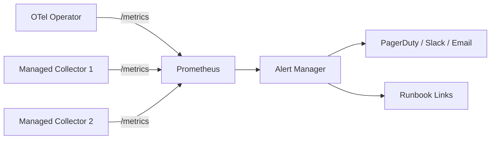
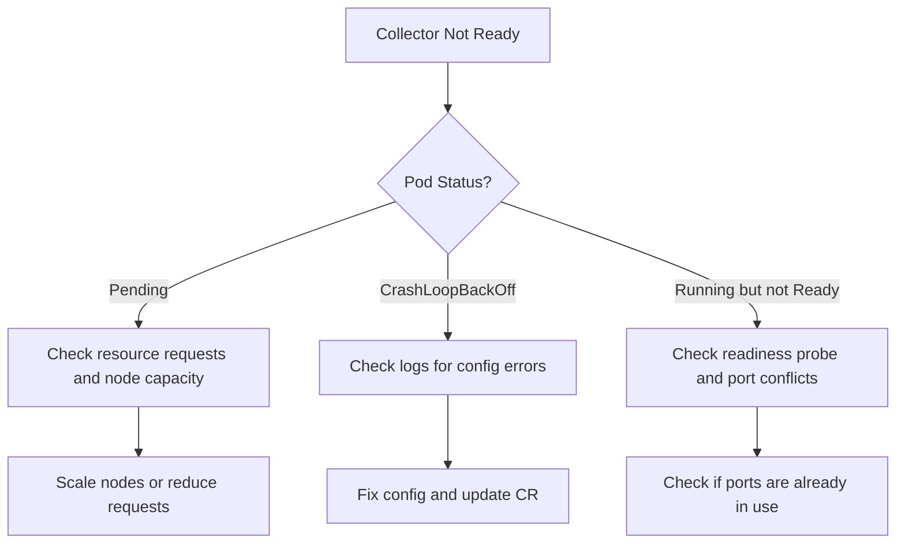

# How to Use OpenTelemetry Operator Prometheus Alerts Runbooks

Author: [nawazdhandala](https://www.github.com/nawazdhandala)

Tags: OpenTelemetry, Kubernetes, Prometheus, Alerting, Operator, Runbooks, SRE

Description: A complete guide to understanding, configuring, and responding to Prometheus alerts from the OpenTelemetry Operator in Kubernetes.

---

The OpenTelemetry Operator manages the lifecycle of OpenTelemetry Collectors and auto-instrumentation in Kubernetes. When things go wrong with the operator or the collectors it manages, Prometheus alerts fire. Knowing what each alert means and how to respond is the difference between a five-minute fix and a two-hour debugging session.

This guide covers the key Prometheus alerts that the OpenTelemetry Operator generates, explains what triggers each one, and provides runbooks for resolving them.

## How the OpenTelemetry Operator Exposes Metrics

The OpenTelemetry Operator exposes metrics on a `/metrics` endpoint that Prometheus can scrape. These metrics cover the health of the operator itself, the reconciliation loop, and the status of managed collector instances.



The operator uses the standard Kubernetes controller-runtime metrics plus custom metrics specific to OpenTelemetry resources. Prometheus scrapes these, evaluates alerting rules, and fires alerts when conditions are met.

## Setting Up Prometheus Alerting Rules

Before diving into the runbooks, let's set up the alerting rules. These rules define the conditions that trigger each alert. You deploy them as a PrometheusRule resource if you are using the Prometheus Operator, or as a rules file if you are running standalone Prometheus.

This set of alerting rules covers the most common failure modes for the OpenTelemetry Operator and its managed collectors.

```yaml
# otel-operator-alerts.yaml
# Prometheus alerting rules for the OpenTelemetry Operator
apiVersion: monitoring.coreos.com/v1
kind: PrometheusRule
metadata:
  name: otel-operator-alerts
  namespace: observability
  labels:
    release: prometheus
spec:
  groups:
    - name: opentelemetry-operator
      rules:
        # Operator pod is not running
        - alert: OTelOperatorDown
          expr: absent(up{job="opentelemetry-operator"} == 1)
          for: 5m
          labels:
            severity: critical
            runbook: "otel-operator-down"
          annotations:
            summary: "OpenTelemetry Operator is not running"
            description: "The OTel Operator has been down for more than 5 minutes."

        # Reconciliation is failing repeatedly
        - alert: OTelOperatorReconcileErrors
          expr: |
            rate(controller_runtime_reconcile_errors_total{
              controller="opentelemetrycollector"
            }[5m]) > 0.1
          for: 10m
          labels:
            severity: warning
            runbook: "otel-operator-reconcile-errors"
          annotations:
            summary: "OTel Operator reconciliation errors"
            description: "The operator is failing to reconcile collector resources."

        # Collector instances are not ready
        - alert: OTelCollectorNotReady
          expr: |
            kube_statefulset_status_replicas_ready{
              statefulset=~".*-collector"
            } < kube_statefulset_replicas{
              statefulset=~".*-collector"
            }
          for: 10m
          labels:
            severity: warning
            runbook: "otel-collector-not-ready"
          annotations:
            summary: "OTel Collector replicas not ready"
            description: "{{ $labels.statefulset }} has fewer ready replicas than desired."

        # Collector is dropping data
        - alert: OTelCollectorDroppedData
          expr: |
            rate(otelcol_exporter_send_failed_spans[5m]) > 0
            or rate(otelcol_exporter_send_failed_metric_points[5m]) > 0
            or rate(otelcol_exporter_send_failed_log_records[5m]) > 0
          for: 5m
          labels:
            severity: critical
            runbook: "otel-collector-dropping-data"
          annotations:
            summary: "OTel Collector is dropping telemetry data"
            description: "Collector is failing to export data. Check backend connectivity."

        # Collector memory is approaching limits
        - alert: OTelCollectorHighMemory
          expr: |
            container_memory_working_set_bytes{
              container="otc-container"
            } / container_spec_memory_limit_bytes{
              container="otc-container"
            } > 0.85
          for: 5m
          labels:
            severity: warning
            runbook: "otel-collector-high-memory"
          annotations:
            summary: "OTel Collector memory usage above 85%"
            description: "{{ $labels.pod }} is using {{ $value | humanizePercentage }} of its memory limit."

        # Collector queue is backing up
        - alert: OTelCollectorQueueFull
          expr: |
            otelcol_exporter_queue_size / otelcol_exporter_queue_capacity > 0.8
          for: 5m
          labels:
            severity: warning
            runbook: "otel-collector-queue-full"
          annotations:
            summary: "OTel Collector export queue is filling up"
            description: "The export queue is over 80% full. Data may be dropped soon."
```

## Runbook: OTelOperatorDown

**What it means:** The OpenTelemetry Operator pod is not running or not responding to Prometheus scrapes.

**Impact:** The operator cannot reconcile collector instances. Existing collectors keep running, but any changes to OpenTelemetryCollector custom resources will not be applied. New collectors will not be created. Auto-instrumentation will not be injected into new pods.

**Steps to resolve:**

1. Check the operator pod status.

```bash
# Check if the operator pod exists and its status
kubectl get pods -n observability -l app.kubernetes.io/name=opentelemetry-operator

# Look at recent events for the operator deployment
kubectl describe deployment opentelemetry-operator -n observability
```

2. Check the operator logs for crash reasons.

```bash
# Get logs from the operator, including previous crash logs
kubectl logs -n observability deployment/opentelemetry-operator --previous
```

3. Common causes include insufficient RBAC permissions after an upgrade, webhook certificate expiration, and resource limits being too low. If the operator is in CrashLoopBackOff, the logs from the previous instance usually reveal the cause.

4. If the webhook certificate has expired, delete the webhook secret and restart the operator. It will regenerate the certificate.

```bash
# Delete the webhook TLS secret so it gets regenerated
kubectl delete secret opentelemetry-operator-controller-manager-service-cert -n observability

# Restart the operator
kubectl rollout restart deployment/opentelemetry-operator -n observability
```

## Runbook: OTelOperatorReconcileErrors

**What it means:** The operator's controller loop is encountering errors when trying to reconcile OpenTelemetryCollector or Instrumentation custom resources.

**Impact:** Changes to collector configurations are not being applied. The operator might be stuck trying to update a resource and failing repeatedly.

**Steps to resolve:**

1. Check the operator logs for specific error messages.

```bash
# Filter logs for reconciliation errors
kubectl logs -n observability deployment/opentelemetry-operator | grep -i "error\|reconcil"
```

2. Common causes are invalid collector configurations, missing referenced ConfigMaps or Secrets, and Kubernetes API server connectivity issues. Look at the OpenTelemetryCollector resources for status conditions.

```bash
# Check the status of all OpenTelemetryCollector resources
kubectl get opentelemetrycollectors --all-namespaces -o wide

# Describe a specific collector for detailed status
kubectl describe opentelemetrycollector my-collector -n observability
```

3. If the error is a validation failure, check the collector configuration syntax. The operator validates the config before applying it.

## Runbook: OTelCollectorNotReady

**What it means:** One or more collector replicas are not in the Ready state. They might be stuck in Pending, CrashLoopBackOff, or failing readiness checks.

**Impact:** Reduced collector capacity. If all replicas are down, telemetry data from that pipeline is not being collected.

**Steps to resolve:**



1. Check the pod status and events.

```bash
# Get collector pod status
kubectl get pods -n observability -l app.kubernetes.io/managed-by=opentelemetry-operator

# Check events for scheduling issues
kubectl describe pod <collector-pod-name> -n observability
```

2. For Pending pods, the issue is usually insufficient resources or node affinity rules that cannot be satisfied.

3. For CrashLoopBackOff, check the collector logs. The most common cause is an invalid configuration file.

```bash
# Check collector logs for startup errors
kubectl logs <collector-pod-name> -n observability
```

## Runbook: OTelCollectorDroppedData

**What it means:** The collector is failing to export telemetry data to the configured backend. Spans, metrics, or log records are being dropped.

**Impact:** You are losing observability data. Traces might be incomplete, metrics might have gaps, and logs might be missing.

**Steps to resolve:**

1. Check which exporter is failing.

```bash
# Check collector metrics for export failures
kubectl port-forward <collector-pod-name> -n observability 8888:8888

# Then query the metrics endpoint
curl http://localhost:8888/metrics | grep otelcol_exporter_send_failed
```

2. Verify connectivity to the backend from inside the collector pod.

```bash
# Test connectivity to the backend
kubectl exec -n observability <collector-pod-name> -- \
  wget -qO- --timeout=5 http://your-backend:4317/health || echo "Connection failed"
```

3. Common causes include backend being down, network policies blocking egress, DNS resolution failures, and TLS certificate issues. Check the collector logs for specific error messages about the export failures.

4. If the backend is temporarily down, increase the queue size and enable retry to buffer data until it recovers.

```yaml
# Increase queue size in the exporter configuration
exporters:
  otlp:
    endpoint: "your-backend:4317"
    # Enable sending queue for buffering during outages
    sending_queue:
      enabled: true
      num_consumers: 10
      queue_size: 10000
    # Configure retry for transient failures
    retry_on_failure:
      enabled: true
      initial_interval: 5s
      max_interval: 60s
      max_elapsed_time: 300s
```

## Runbook: OTelCollectorHighMemory

**What it means:** The collector pod is using more than 85% of its memory limit. If it reaches 100%, Kubernetes will OOM-kill the pod.

**Impact:** If the pod gets OOM-killed, all in-flight data is lost and the collector restarts, creating a gap in telemetry.

**Steps to resolve:**

1. Check what is consuming memory. The batch processor and export queue are the most common memory consumers.

2. Enable the memory limiter processor. This is the single most important thing you can do to prevent OOM kills. It tells the collector to start dropping data before hitting the memory limit.

```yaml
# Add memory_limiter processor to protect against OOM
processors:
  memory_limiter:
    # Start refusing data at 80% of the limit
    limit_percentage: 80
    # Resume accepting data at 70%
    spike_limit_percentage: 70
    check_interval: 1s
```

3. Reduce batch sizes and queue sizes if the collector is consistently near its limit.

4. If the workload genuinely needs more memory, increase the resource limits in the OpenTelemetryCollector CR.

## Runbook: OTelCollectorQueueFull

**What it means:** The exporter queue is more than 80% full. This happens when the collector receives data faster than it can export it.

**Impact:** Once the queue is completely full, new data will be dropped. This is often a leading indicator of the OTelCollectorDroppedData alert.

**Steps to resolve:**

1. Check if the export backend is slow or unreachable. This is the most common cause.

2. Increase the number of consumers to parallelize exports.

3. If the backend is healthy but slow, consider increasing the queue size as a short-term fix while you optimize the backend.

4. Consider adding the load balancing exporter if you have multiple backend instances.

## Setting Up Runbook Links in Alerts

Link your alerts directly to runbook documentation so on-call engineers can find resolution steps immediately. Add the runbook URL to the alert annotations.

```yaml
# Template for adding runbook URLs to alert annotations
annotations:
  summary: "OTel Collector is dropping telemetry data"
  # Direct link to the runbook for this specific alert
  runbook_url: "https://wiki.yourcompany.com/runbooks/otel-collector-dropping-data"
  dashboard_url: "https://grafana.yourcompany.com/d/otel-collector"
```

## Wrapping Up

Running the OpenTelemetry Operator in production requires proper alerting and documented runbooks. The alerts in this guide cover the most common failure modes: operator downtime, reconciliation errors, collector readiness, data loss, memory pressure, and queue saturation. Each has specific debugging steps that can get you from alert to resolution quickly. The key is to deploy these alerting rules before you have an incident, link them to runbooks that your team can follow, and test them periodically to make sure they still fire correctly. A well-maintained set of runbooks turns a stressful on-call page into a routine procedure.
