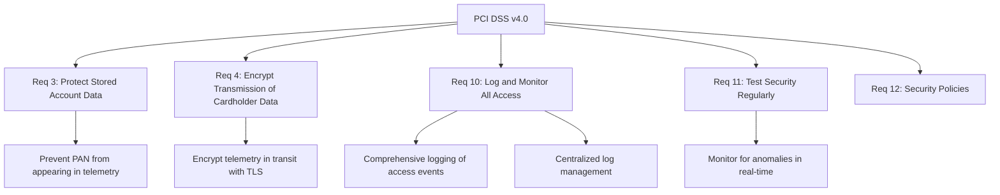
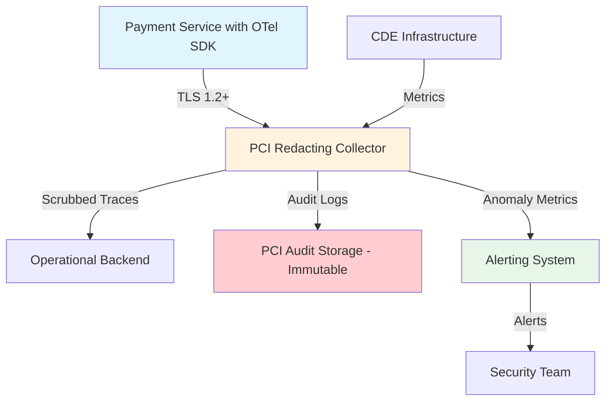

# How to Use OpenTelemetry to Meet PCI DSS Compliance Requirements

Author: [nawazdhandala](https://www.github.com/nawazdhandala)

Tags: OpenTelemetry, PCI DSS, Compliance, Security, Observability, Monitoring

Description: How to configure OpenTelemetry pipelines to help satisfy PCI DSS requirements for logging, monitoring, and protecting cardholder data environments.

---

PCI DSS (Payment Card Industry Data Security Standard) is a set of security requirements for organizations that handle credit card data. If your systems process, store, or transmit cardholder data, you need to meet these requirements. OpenTelemetry can play a significant role in satisfying several PCI DSS controls, particularly around logging, monitoring, network security, and access tracking.

But there is a catch. OpenTelemetry can also be a compliance liability if misconfigured. Traces and logs can accidentally capture card numbers, CVVs, or other sensitive cardholder data. You need to be deliberate about what gets collected, how it is transported, and where it is stored.

This guide maps specific PCI DSS requirements to OpenTelemetry configurations that help you meet them.

## PCI DSS Requirements Relevant to OpenTelemetry

Let's identify the PCI DSS v4.0 requirements where OpenTelemetry is directly useful.



## Requirement 3: Protecting Cardholder Data in Telemetry

PCI DSS Requirement 3 mandates that the Primary Account Number (PAN) must be rendered unreadable anywhere it is stored. This absolutely includes telemetry data. If a trace span or log message contains a full card number, you are in violation.

Use the OpenTelemetry Collector's transform processor to detect and redact PANs before they reach storage.

```yaml
# Collector configuration that scrubs cardholder data from all signals
# This prevents PAN, CVV, and expiry dates from reaching telemetry storage
processors:
  transform/pci-redact:
    trace_statements:
      - context: span
        statements:
          # Redact any attribute value that looks like a credit card number
          # Matches common 13-19 digit card number patterns
          - replace_pattern(attributes["http.request.body"], "\\b(?:\\d[ -]*?){13,19}\\b", "[PAN_REDACTED]")
          - replace_pattern(attributes["http.url"], "\\b(?:\\d[ -]*?){13,19}\\b", "[PAN_REDACTED]")
          # Remove CVV if it somehow appears
          - delete_key(attributes, "card.cvv")
          - delete_key(attributes, "payment.cvv")
          # Redact track data
          - delete_key(attributes, "card.track1")
          - delete_key(attributes, "card.track2")

    log_statements:
      - context: log
        statements:
          # Scrub card numbers from log message bodies
          - replace_pattern(body, "\\b(?:\\d[ -]*?){13,19}\\b", "[PAN_REDACTED]")
          # Scrub from log attributes as well
          - replace_pattern(attributes["message"], "\\b(?:\\d[ -]*?){13,19}\\b", "[PAN_REDACTED]")

service:
  pipelines:
    traces:
      receivers: [otlp]
      processors: [transform/pci-redact, batch]
      exporters: [otlp/backend]
    logs:
      receivers: [otlp]
      processors: [transform/pci-redact, batch]
      exporters: [otlp/backend]
```

Beyond the collector, you should also sanitize data at the SDK level. Do not wait for the collector to catch it.

```python
# Custom SpanProcessor that strips cardholder data before export
# This acts as a safety net at the application level
import re
from opentelemetry.sdk.trace import SpanProcessor

# Pattern matching common credit card number formats
PAN_PATTERN = re.compile(r'\b(?:\d[ -]*?){13,19}\b')

class PCIRedactingProcessor(SpanProcessor):
    """Strips PAN data from span attributes before export."""

    def on_end(self, span):
        # Check each attribute for potential cardholder data
        for key, value in span.attributes.items():
            if isinstance(value, str) and PAN_PATTERN.search(value):
                span.attributes[key] = PAN_PATTERN.sub("[PAN_REDACTED]", value)

    def on_start(self, span, parent_context=None):
        pass

    def shutdown(self):
        pass

    def force_flush(self, timeout_millis=None):
        pass
```

## Requirement 4: Encrypting Telemetry in Transit

PCI DSS Requirement 4 requires strong cryptography when transmitting cardholder data over open, public networks. Even on internal networks, encryption is a best practice and may be required depending on your network architecture.

Configure TLS on every segment of the telemetry pipeline.

```yaml
# Full pipeline TLS configuration for PCI DSS compliance
# Every connection uses TLS 1.2 or higher
receivers:
  otlp:
    protocols:
      grpc:
        endpoint: 0.0.0.0:4317
        tls:
          cert_file: /etc/otel/certs/server.crt
          key_file: /etc/otel/certs/server.key
          # PCI DSS requires TLS 1.2 minimum
          min_version: "1.2"

exporters:
  otlp/secure:
    endpoint: backend.cde.internal:4317
    tls:
      ca_file: /etc/otel/certs/ca.crt
      cert_file: /etc/otel/certs/client.crt
      key_file: /etc/otel/certs/client.key
      min_version: "1.2"

service:
  pipelines:
    traces:
      receivers: [otlp]
      processors: [transform/pci-redact, batch]
      exporters: [otlp/secure]
```

## Requirement 10: Logging and Monitoring All Access

This is where OpenTelemetry shines. PCI DSS Requirement 10 has several sub-requirements that map directly to observability capabilities.

### 10.2: Implement Automated Audit Trails

You need logs for all access to cardholder data, all actions by administrators, all access to audit trails, invalid logical access attempts, and changes to authentication mechanisms.

Use OpenTelemetry instrumentation to capture these events as structured logs and traces.

```python
# Instrument access to cardholder data with structured logging
# Each access event becomes a traceable, auditable record
from opentelemetry import trace
import logging

tracer = trace.get_tracer("payment-service")
logger = logging.getLogger("pci-audit")

def access_cardholder_data(user_id: str, action: str, record_id: str):
    with tracer.start_as_current_span("cde_data_access") as span:
        # Set attributes that satisfy PCI DSS 10.2 requirements
        span.set_attribute("audit.user_id", user_id)
        span.set_attribute("audit.action", action)
        span.set_attribute("audit.resource", "cardholder_data")
        span.set_attribute("audit.record_id", record_id)
        span.set_attribute("audit.timestamp", get_utc_timestamp())
        span.set_attribute("audit.source_ip", get_client_ip())
        span.set_attribute("pci.requirement", "10.2")

        # Also emit a structured log for the audit trail
        logger.info(
            "Cardholder data access",
            extra={
                "user_id": user_id,
                "action": action,
                "record_id": record_id,
                "pci_event": True,
            }
        )

        # Perform the actual data access
        return fetch_record(record_id)
```

### 10.3: Record Specific Details for Each Auditable Event

PCI DSS 10.3 requires that each log entry includes: user identification, type of event, date and time, success or failure, origination of event, and the identity or name of affected data.

```python
# Structured audit event that satisfies PCI DSS 10.3
# Contains all six required data elements
def log_pci_event(user_id, event_type, success, source_ip, affected_data, details):
    with tracer.start_as_current_span("pci_audit_event") as span:
        # PCI DSS 10.3.1 - User identification
        span.set_attribute("audit.user_id", user_id)
        # PCI DSS 10.3.2 - Type of event
        span.set_attribute("audit.event_type", event_type)
        # PCI DSS 10.3.3 - Date and time (automatic in OTel spans)
        # PCI DSS 10.3.4 - Success or failure indication
        span.set_attribute("audit.success", success)
        # PCI DSS 10.3.5 - Origination of event
        span.set_attribute("audit.source_ip", source_ip)
        span.set_attribute("audit.source_component", "payment-service")
        # PCI DSS 10.3.6 - Identity or name of affected data
        span.set_attribute("audit.affected_data", affected_data)
        # Additional context
        span.set_attribute("audit.details", details)
```

### 10.4: Synchronize Clocks

PCI DSS requires time synchronization using NTP. OpenTelemetry spans automatically include high-resolution timestamps from the host clock. Ensure your hosts use NTP.

```yaml
# Kubernetes DaemonSet that ensures NTP is running on all nodes
# Synchronized clocks are required by PCI DSS 10.4
apiVersion: apps/v1
kind: DaemonSet
metadata:
  name: ntp-sync-check
  namespace: monitoring
spec:
  selector:
    matchLabels:
      app: ntp-check
  template:
    metadata:
      labels:
        app: ntp-check
    spec:
      containers:
        - name: ntp-check
          image: alpine:latest
          command:
            - /bin/sh
            - -c
            # Check NTP synchronization status every hour
            # Alert if clock drift exceeds 1 second
            - |
              while true; do
                ntpdate -q pool.ntp.org 2>&1 | grep "offset" || echo "NTP check failed"
                sleep 3600
              done
```

### 10.5: Secure Audit Trails

Audit logs must be protected from modification. Send your PCI audit telemetry to a separate, secured pipeline.

```yaml
# Dedicated PCI audit pipeline with immutable storage
# Separates PCI audit data from general operational telemetry
receivers:
  otlp/pci-audit:
    protocols:
      grpc:
        endpoint: 0.0.0.0:4319
        tls:
          cert_file: /etc/otel/certs/server.crt
          key_file: /etc/otel/certs/server.key
          client_ca_file: /etc/otel/certs/ca.crt

processors:
  # Filter to only pass through PCI-tagged events
  filter/pci:
    logs:
      include:
        match_type: strict
        record_attributes:
          - key: pci_event
            value: "true"

  batch:
    timeout: 1s

exporters:
  # Write-once S3 storage with Object Lock
  awss3/pci-audit:
    s3uploader:
      region: us-east-1
      s3_bucket: pci-audit-logs
      s3_prefix: audit-trail

service:
  pipelines:
    logs/pci:
      receivers: [otlp/pci-audit]
      processors: [filter/pci, batch]
      exporters: [awss3/pci-audit]
```

## Requirement 11: Monitoring for Anomalies

PCI DSS Requirement 11 covers intrusion detection and monitoring. Use OpenTelemetry metrics to track anomalous patterns in your cardholder data environment.

```python
# Create custom metrics that track CDE access patterns
# These metrics feed into anomaly detection for PCI DSS Req 11
from opentelemetry import metrics

meter = metrics.get_meter("pci-monitoring")

# Counter for total CDE access events
cde_access_counter = meter.create_counter(
    name="cde.access.total",
    description="Total access events to cardholder data environment",
    unit="1",
)

# Histogram for access frequency patterns
cde_access_rate = meter.create_histogram(
    name="cde.access.rate",
    description="Rate of access events to detect unusual spikes",
    unit="events/min",
)

def track_cde_access(user_id: str, action: str, success: bool):
    """Record a CDE access event for anomaly detection."""
    cde_access_counter.add(
        1,
        attributes={
            "user_id": user_id,
            "action": action,
            "success": str(success),
        },
    )
```

Then set up alerting rules in your monitoring backend to detect anomalies.

```yaml
# Prometheus alerting rules for PCI DSS anomaly detection
groups:
  - name: pci-dss-monitoring
    rules:
      # Alert if CDE access rate exceeds normal baseline
      - alert: HighCDEAccessRate
        expr: rate(cde_access_total[5m]) > 100
        for: 2m
        labels:
          severity: critical
          pci_requirement: "11"
        annotations:
          summary: "Unusual spike in cardholder data access"

      # Alert on failed access attempts
      - alert: CDEAccessFailures
        expr: rate(cde_access_total{success="false"}[5m]) > 10
        for: 1m
        labels:
          severity: critical
          pci_requirement: "10.2"
        annotations:
          summary: "Multiple failed access attempts to CDE"
```

## Putting It All Together

Here is how the complete PCI-compliant OpenTelemetry architecture looks.



The key principles are:

1. **Never store cardholder data in telemetry.** Redact at the SDK level and again at the collector.
2. **Encrypt everything in transit.** TLS 1.2 minimum on every connection.
3. **Log every access to cardholder data** with all six required data elements.
4. **Protect audit trails** in immutable, access-controlled storage.
5. **Monitor for anomalies** using custom metrics and alerting rules.

OpenTelemetry gives you the tools to satisfy these requirements, but the configuration must be deliberate. A default OpenTelemetry setup will not be PCI compliant. You need to actively prevent sensitive data from entering the pipeline, enforce encryption, structure your audit events, and separate PCI audit data from general telemetry. Do this correctly, and your OpenTelemetry infrastructure becomes an asset during PCI DSS assessments rather than a liability.
