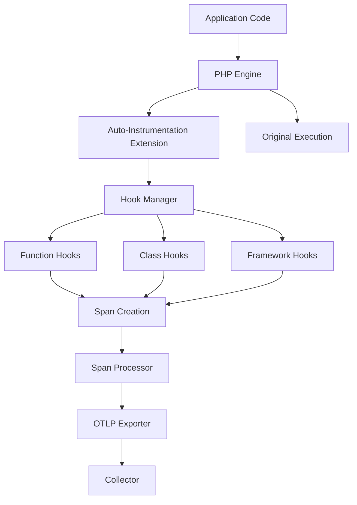

# How to Use the OpenTelemetry PHP Auto-Instrumentation Extension

Author: [nawazdhandala](https://www.github.com/nawazdhandala)

Tags: OpenTelemetry, PHP, Auto-Instrumentation, Extension, C Extension

Description: Learn how to install and configure the OpenTelemetry PHP auto-instrumentation extension to automatically trace PHP applications without code changes.

The OpenTelemetry PHP auto-instrumentation extension is a C extension that automatically instruments PHP applications without requiring code changes. It hooks into PHP's internal execution at the engine level, capturing function calls, database queries, HTTP requests, and framework operations. This approach provides comprehensive observability with minimal performance overhead and zero code modifications.

## Why Use Auto-Instrumentation

Manual instrumentation requires modifying application code to add tracing spans. This is time-consuming, error-prone, and requires maintenance as code evolves. The auto-instrumentation extension eliminates these issues by intercepting PHP function calls at runtime. You get immediate visibility into your application's behavior without touching a single line of application code.

## Architecture Overview

Here's how the auto-instrumentation extension works at the PHP engine level:



## Installing the Extension

The extension requires PHP 8.0 or higher and is distributed through PECL. Installation varies by operating system.

For Ubuntu/Debian:

```bash
# Install build dependencies
sudo apt-get update
sudo apt-get install php8.2-dev pkg-config build-essential

# Install the extension via PECL
sudo pecl install opentelemetry-beta

# Enable the extension
echo "extension=opentelemetry.so" | sudo tee /etc/php/8.2/mods-available/opentelemetry.ini
sudo phpenmod opentelemetry

# Verify installation
php -m | grep opentelemetry
```

For macOS with Homebrew:

```bash
# Install PHP development tools
brew install php@8.2

# Install the extension
pecl install opentelemetry-beta

# Add to php.ini
echo "extension=opentelemetry.so" >> $(php -r "echo php_ini_loaded_file();")

# Verify installation
php -m | grep opentelemetry
```

For Docker environments, add to your Dockerfile:

```dockerfile
FROM php:8.2-fpm

# Install build dependencies
RUN apt-get update && apt-get install -y \
    build-essential \
    pkg-config

# Install OpenTelemetry extension
RUN pecl install opentelemetry-beta \
    && docker-php-ext-enable opentelemetry

# Install Composer dependencies for SDK
COPY --from=composer:latest /usr/bin/composer /usr/bin/composer
RUN composer require open-telemetry/sdk open-telemetry/exporter-otlp

# Copy configuration
COPY php-otel.ini /usr/local/etc/php/conf.d/

CMD ["php-fpm"]
```

## Configuring the Extension

The extension uses php.ini directives for configuration. Create a configuration file `/etc/php/8.2/mods-available/opentelemetry.ini`:

```ini
; Enable the OpenTelemetry extension
extension=opentelemetry.so

; Configure the exporter endpoint
otel.exporter.otlp.endpoint=http://localhost:4318/v1/traces

; Set service name
otel.service.name=my-php-application

; Configure resource attributes
otel.resource.attributes=deployment.environment=production,service.version=1.0.0

; Set sampling rate (1.0 = 100%, 0.1 = 10%)
otel.traces.sampler=parentbased_traceidratio
otel.traces.sampler.arg=1.0

; Enable specific instrumentation libraries
otel.php.autoload_enabled=1
otel.php.detect_variables=1

; Configure which functions to instrument
otel.php.excluded_urls=/health,/metrics,/status

; Set batch processor configuration
otel.bsp.schedule.delay=5000
otel.bsp.max.queue.size=2048
otel.bsp.max.export.batch.size=512
otel.bsp.export.timeout=30000

; Enable debug logging (disable in production)
otel.log.level=info
```

## Auto-Instrumentation Capabilities

The extension automatically instruments several common PHP operations without configuration.

### HTTP Server Requests

Every incoming HTTP request automatically creates a root span:

```php
<?php
// No instrumentation code needed - extension handles this automatically
// Your existing application code works as-is

if ($_SERVER['REQUEST_METHOD'] === 'GET') {
    echo "Hello, World!";
}

// Extension automatically captures:
// - HTTP method, URL, headers
// - Response status code
// - Request duration
// - Client IP address
```

### Database Queries

The extension hooks into PDO, MySQLi, and other database drivers:

```php
<?php
// No instrumentation code needed
$pdo = new PDO('mysql:host=localhost;dbname=test', 'user', 'pass');

// This query is automatically traced
$stmt = $pdo->query('SELECT * FROM users WHERE active = 1');

// Extension captures:
// - Full SQL statement
// - Query duration
// - Database system (MySQL, PostgreSQL, etc.)
// - Row count
```

### HTTP Client Requests

Outbound HTTP requests using cURL, file_get_contents, or Guzzle are automatically traced:

```php
<?php
// No instrumentation code needed
// cURL requests automatically traced
$ch = curl_init('https://api.example.com/users');
curl_setopt($ch, CURLOPT_RETURNTRANSFER, true);
$response = curl_exec($ch);
curl_close($ch);

// Extension captures:
// - Target URL
// - HTTP method
// - Response status
// - Request duration
// - Request/response sizes

// file_get_contents also traced automatically
$data = file_get_contents('https://api.example.com/data');
```

### Framework Auto-Instrumentation

The extension includes framework-specific instrumentation for Laravel, Symfony, WordPress, and others:

```php
<?php
// Laravel route handlers automatically traced
Route::get('/users/{id}', function ($id) {
    // Controller execution is traced
    $user = User::find($id);

    // Eloquent queries automatically traced
    return response()->json($user);
});

// Extension captures:
// - Route name and parameters
// - Controller class and method
// - Database queries from Eloquent
// - View rendering time
```

## Configuring Framework-Specific Instrumentation

Enable specific framework hooks through php.ini:

```ini
; Laravel instrumentation
otel.instrumentation.laravel.enabled=1
otel.instrumentation.laravel.trace_db_queries=1
otel.instrumentation.laravel.trace_views=1
otel.instrumentation.laravel.trace_cache=1

; Symfony instrumentation
otel.instrumentation.symfony.enabled=1
otel.instrumentation.symfony.trace_console=1
otel.instrumentation.symfony.trace_http_client=1

; WordPress instrumentation
otel.instrumentation.wordpress.enabled=1
otel.instrumentation.wordpress.trace_plugins=1
otel.instrumentation.wordpress.trace_themes=1
```

## Custom Instrumentation Hooks

While auto-instrumentation covers common cases, you can add custom instrumentation for application-specific code. Create a configuration file that defines hooks:

```php
<?php
// config/otel-hooks.php
// This file is automatically loaded by the extension

use OpenTelemetry\API\Globals;
use OpenTelemetry\API\Trace\SpanKind;

// Register a hook for custom business logic
\OpenTelemetry\Instrumentation\hook(
    class: 'App\\Service\\PaymentProcessor',
    function: 'processPayment',
    pre: function ($processor, array $params, string $class, string $function, ?string $filename, ?int $lineno) {
        $tracer = Globals::tracerProvider()->getTracer('custom-instrumentation');
        $span = $tracer
            ->spanBuilder('payment.process')
            ->setSpanKind(SpanKind::KIND_INTERNAL)
            ->setAttribute('payment.amount', $params[0]['amount'] ?? 0)
            ->setAttribute('payment.currency', $params[0]['currency'] ?? 'USD')
            ->startSpan();

        // Store span for post hook
        $processor->__otel_span = $span;
        $span->activate();
    },
    post: function ($processor, array $params, $returnValue, ?Throwable $exception) {
        if (isset($processor->__otel_span)) {
            $span = $processor->__otel_span;

            if ($exception) {
                $span->recordException($exception);
            } else {
                $span->setAttribute('payment.success', $returnValue['success'] ?? false);
                $span->setAttribute('payment.transaction_id', $returnValue['transaction_id'] ?? '');
            }

            $span->end();
            unset($processor->__otel_span);
        }
    }
);

// Hook into any function
\OpenTelemetry\Instrumentation\hook(
    function: 'expensive_calculation',
    pre: function ($object, array $params, string $class, string $function, ?string $filename, ?int $lineno) {
        $tracer = Globals::tracerProvider()->getTracer('custom-instrumentation');
        $GLOBALS['calc_span'] = $tracer
            ->spanBuilder('calculation.' . $function)
            ->startSpan();
        $GLOBALS['calc_span']->activate();
    },
    post: function ($object, array $params, $returnValue, ?Throwable $exception) {
        if (isset($GLOBALS['calc_span'])) {
            $GLOBALS['calc_span']->end();
            unset($GLOBALS['calc_span']);
        }
    }
);
```

Load the hooks file through php.ini:

```ini
otel.php.autoload_enabled=1
auto_prepend_file=/path/to/config/otel-hooks.php
```

## Environment-Based Configuration

Configure the extension differently per environment using environment variables:

```bash
# Production configuration
export OTEL_SERVICE_NAME=api-production
export OTEL_EXPORTER_OTLP_ENDPOINT=https://collector.example.com:4318/v1/traces
export OTEL_TRACES_SAMPLER=parentbased_traceidratio
export OTEL_TRACES_SAMPLER_ARG=0.1
export OTEL_LOG_LEVEL=warning

# Development configuration
export OTEL_SERVICE_NAME=api-development
export OTEL_EXPORTER_OTLP_ENDPOINT=http://localhost:4318/v1/traces
export OTEL_TRACES_SAMPLER=always_on
export OTEL_LOG_LEVEL=debug
```

Environment variables override php.ini settings, making deployment flexible.

## Performance Considerations

The C extension has minimal performance impact, typically adding less than 5% overhead. However, you can optimize further:

### Selective Instrumentation

Disable instrumentation for specific paths:

```ini
; Don't trace health checks or static assets
otel.php.excluded_urls=/health,/metrics,/_status,/static/*,/assets/*
```

### Sampling Strategy

Use intelligent sampling to reduce trace volume:

```ini
; Sample 10% of traces
otel.traces.sampler=parentbased_traceidratio
otel.traces.sampler.arg=0.1

; Or use probability-based sampling
otel.traces.sampler=parentbased_traceidratio
otel.traces.sampler.arg=0.05
```

### Batch Processing

Optimize batch export settings for your traffic:

```ini
; High-traffic configuration
otel.bsp.schedule.delay=1000
otel.bsp.max.queue.size=4096
otel.bsp.max.export.batch.size=1024

; Low-traffic configuration
otel.bsp.schedule.delay=5000
otel.bsp.max.queue.size=512
otel.bsp.max.export.batch.size=128
```

## Troubleshooting

### Verify Extension is Loaded

```bash
php -m | grep opentelemetry
php -i | grep -A 20 opentelemetry
```

### Check Configuration

```bash
php -r "var_dump(ini_get_all('otel'));"
```

### Enable Debug Logging

```ini
otel.log.level=debug
```

Check PHP error logs for OpenTelemetry debug output:

```bash
tail -f /var/log/php-fpm/error.log | grep -i otel
```

### Test with Simple Script

Create `test.php`:

```php
<?php
// Simple test to verify instrumentation
$ch = curl_init('https://httpbin.org/get');
curl_setopt($ch, CURLOPT_RETURNTRANSFER, true);
$response = curl_exec($ch);
curl_close($ch);

echo "Request completed\n";

// Force flush spans
sleep(2);
```

Run and check traces:

```bash
php test.php
# Check your observability backend for traces
```

## Comparing Auto vs Manual Instrumentation

Auto-instrumentation provides immediate value but has trade-offs:

**Advantages:**
- Zero code changes required
- Automatic updates as extension improves
- Consistent instrumentation across applications
- Lower maintenance burden
- Captures operations you might forget to instrument manually

**Disadvantages:**
- Less control over span attributes
- May capture too much or too little detail
- Framework-specific features may lag behind manual instrumentation
- Harder to customize for business-specific metrics

Many teams use a hybrid approach: auto-instrumentation for baseline observability plus manual instrumentation for business-critical paths.

## Conclusion

The OpenTelemetry PHP auto-instrumentation extension provides comprehensive observability without code changes. It hooks into PHP's execution engine to automatically capture HTTP requests, database queries, external API calls, and framework operations. The C extension adds minimal overhead while delivering detailed distributed traces. This makes it ideal for adding observability to existing applications or ensuring consistent instrumentation across multiple services without requiring development team training on manual instrumentation techniques.
