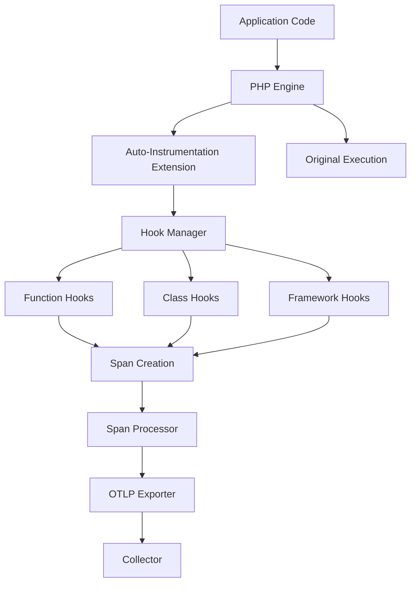

# How to Use the OpenTelemetry PHP Auto-Instrumentation Extension

Author: [nawazdhandala](https://www.github.com/nawazdhandala)

Tags: OpenTelemetry, PHP, Auto-Instrumentation, Extension, C Extension

Description: Learn how to install and configure the OpenTelemetry PHP auto-instrumentation extension to automatically trace PHP applications without code changes.

The OpenTelemetry PHP auto-instrumentation extension is a C extension that enables automatic instrumentation hooks for PHP applications. It hooks into PHP's internal execution at the engine level so OpenTelemetry instrumentation libraries can wrap function and method calls. With the OpenTelemetry SDK and the right Composer auto-instrumentation packages installed, this approach provides observability with minimal application code changes.

## Why Use Auto-Instrumentation

Manual instrumentation requires modifying application code to add tracing spans. This is time-consuming, error-prone, and requires maintenance as code evolves. The auto-instrumentation extension reduces these issues by letting instrumentation packages intercept PHP function calls at runtime. You get immediate visibility into supported libraries and frameworks without touching a single line of application code.

## Architecture Overview

Here's how the auto-instrumentation extension works at the PHP engine level:


```mermaid
graph TB
    A[Application Code] --> B[PHP Engine]
    B --> C[Auto-Instrumentation Extension]
    C --> D[Hook Manager]
    D --> E[Function Hooks]
    D --> F[Class Hooks]
    D --> G[Framework Hooks]
    E --> H[Span Creation]
    F --> H
    G --> H
    H --> I[Span Processor]
    I --> J[OTLP Exporter]
    J --> K[Collector]
    B --> L[Original Execution]
```

## Installing the Extension

The extension requires PHP 8.0 or higher and is distributed through PECL. Installing the extension by itself does not generate traces; you also need Composer autoloading, the OpenTelemetry SDK, an exporter, and one or more auto-instrumentation packages. Installation varies by operating system.

For Ubuntu/Debian:

```bash
# Install build dependencies

sudo apt-get update
sudo apt-get install php8.2-dev gcc make autoconf

# Install the extension via PECL
sudo pecl install opentelemetry

# Enable the extension
echo "extension=opentelemetry.so" | sudo tee /etc/php/8.2/mods-available/opentelemetry.ini
sudo phpenmod opentelemetry

# Install the SDK, exporter, and instrumentation packages your app needs
composer require open-telemetry/sdk open-telemetry/exporter-otlp open-telemetry/opentelemetry-auto-pdo

# Verify installation
php -m | grep opentelemetry
```

For macOS with Homebrew:

```bash
# Install PHP development tools
brew install php@8.2 gcc make autoconf

# Install the extension
pecl install opentelemetry

# Add to php.ini
echo "extension=opentelemetry.so" >> $(php -r "echo php_ini_loaded_file();")

# Install the SDK, exporter, and instrumentation packages your app needs
composer require open-telemetry/sdk open-telemetry/exporter-otlp open-telemetry/opentelemetry-auto-pdo

# Verify installation
php -m | grep opentelemetry
```

For Docker environments, add to your Dockerfile:

```dockerfile
FROM php:8.2-fpm

# Install build dependencies
RUN apt-get update && apt-get install -y \
    gcc \
    make \
    autoconf

# Install OpenTelemetry extension
RUN pecl install opentelemetry \
    && docker-php-ext-enable opentelemetry

# Install Composer dependencies for SDK
COPY --from=composer:latest /usr/bin/composer /usr/bin/composer
RUN composer require \
    open-telemetry/sdk \
    open-telemetry/exporter-otlp \
    open-telemetry/opentelemetry-auto-pdo \
    open-telemetry/opentelemetry-auto-curl

# Copy configuration
COPY php-otel.ini /usr/local/etc/php/conf.d/

CMD ["php-fpm"]
```

## Configuring the Extension

The PHP SDK can read OpenTelemetry environment variables from the environment or from a `php.ini` file. Create a configuration file such as `/etc/php/8.2/mods-available/opentelemetry.ini`:

```ini
; Enable the OpenTelemetry extension
extension=opentelemetry.so

; Enable SDK autoloading through Composer
OTEL_PHP_AUTOLOAD_ENABLED="true"

; Enable OTLP trace export over HTTP/protobuf
OTEL_TRACES_EXPORTER=otlp
OTEL_EXPORTER_OTLP_PROTOCOL=http/protobuf

; Configure the exporter endpoint
OTEL_EXPORTER_OTLP_ENDPOINT=http://localhost:4318

; Set service name
OTEL_SERVICE_NAME=my-php-application

; Configure resource attributes
OTEL_RESOURCE_ATTRIBUTES=deployment.environment=production,service.version=1.0.0

; Set sampling rate (1.0 = 100%, 0.1 = 10%)
OTEL_TRACES_SAMPLER=parentbased_traceidratio
OTEL_TRACES_SAMPLER_ARG=1.0

; Exclude requests whose URL matches these regular expressions
OTEL_PHP_EXCLUDED_URLS=/health,/metrics,/status

; Set batch processor configuration
OTEL_BSP_SCHEDULE_DELAY=5000
OTEL_BSP_MAX_QUEUE_SIZE=2048
OTEL_BSP_MAX_EXPORT_BATCH_SIZE=512
OTEL_BSP_EXPORT_TIMEOUT=30000

; Send PHP SDK internal logs to PHP's error_log
OTEL_PHP_LOG_DESTINATION=error_log
```

## Auto-Instrumentation Capabilities

The extension provides the hook mechanism. The SDK and Composer auto-instrumentation packages create spans for supported libraries without application code changes.

### HTTP Server Requests

Installed server or framework instrumentation can create a root span for incoming HTTP requests:

```php
<?php
// No instrumentation code needed when a matching instrumentation package is installed
// Your existing application code works as-is

if ($_SERVER['REQUEST_METHOD'] === 'GET') {
    echo "Hello, World!";
}

// Instrumentation can capture:
// - HTTP method, URL, headers
// - Response status code
// - Request duration
// - Client IP address
```

### Database Queries

Install the matching database instrumentation package, such as `open-telemetry/opentelemetry-auto-pdo` or `open-telemetry/opentelemetry-auto-mysqli`, to trace database calls:

```php
<?php
// No instrumentation code needed when the PDO instrumentation package is installed
$pdo = new PDO('mysql:host=localhost;dbname=test', 'user', 'pass');

// This query is traced by the PDO instrumentation package
$stmt = $pdo->query('SELECT * FROM users WHERE active = 1');

// Instrumentation captures:
// - Full SQL statement
// - Query duration
// - Database system (MySQL, PostgreSQL, etc.)
// - Query span relationships and selected database attributes
```

### HTTP Client Requests

Outbound HTTP requests can be traced by installing packages such as `open-telemetry/opentelemetry-auto-curl`, `open-telemetry/opentelemetry-auto-guzzle`, `open-telemetry/opentelemetry-auto-psr18`, or `open-telemetry/opentelemetry-auto-io`:

```php
<?php
// No instrumentation code needed when the cURL instrumentation package is installed
$ch = curl_init('https://api.example.com/users');
curl_setopt($ch, CURLOPT_RETURNTRANSFER, true);
$response = curl_exec($ch);
curl_close($ch);

// Instrumentation captures:
// - Target URL
// - HTTP method
// - Response status
// - Request duration
// - Request/response sizes

// file_get_contents can be traced by the IO instrumentation package
$data = file_get_contents('https://api.example.com/data');
```

### Framework Auto-Instrumentation

Framework-specific instrumentation is provided by Composer packages for Laravel, Symfony, WordPress, and others:

```php
<?php
// Laravel route handlers are traced when open-telemetry/opentelemetry-auto-laravel is installed
Route::get('/users/{id}', function ($id) {
    // Controller execution is traced
    $user = User::find($id);

    // Eloquent queries are traced when database instrumentation is also installed
    return response()->json($user);
});

// Instrumentation captures:
// - Route name and parameters
// - Controller class and method
// - Database queries from Eloquent
// - View rendering time
```

## Configuring Framework-Specific Instrumentation

Install the Composer package for each framework you want to instrument:

```bash
composer require open-telemetry/opentelemetry-auto-laravel
composer require open-telemetry/opentelemetry-auto-symfony
composer require open-telemetry/opentelemetry-auto-wordpress
```

Disable specific installed instrumentations through runtime configuration when needed:

```ini
OTEL_PHP_DISABLED_INSTRUMENTATIONS=laravel,symfony,wordpress
```

## Custom Instrumentation Hooks

While auto-instrumentation covers common cases, you can add custom instrumentation for application-specific code. Create a configuration file that defines hooks:

```php
<?php
// config/otel-hooks.php
// Load Composer autoloading before registering hooks.
require_once __DIR__ . '/../vendor/autoload.php';

use OpenTelemetry\API\Globals;
use OpenTelemetry\API\Trace\SpanKind;

// Register a hook for custom business logic
\OpenTelemetry\Instrumentation\hook(
    class: 'App\\Service\\PaymentProcessor',
    function: 'processPayment',
    pre: function ($processor, array $params, string $class, string $function, ?string $filename, ?int $lineno) {
        $tracer = Globals::tracerProvider()->getTracer('custom-instrumentation');
        $span = $tracer
            ->spanBuilder('payment.process')
            ->setSpanKind(SpanKind::KIND_INTERNAL)
            ->setAttribute('payment.amount', $params[0]['amount'] ?? 0)
            ->setAttribute('payment.currency', $params[0]['currency'] ?? 'USD')
            ->startSpan();

        // Store span and scope for post hook
        $key = spl_object_id($processor);
        $GLOBALS['payment_spans'][$key] = $span;
        $GLOBALS['payment_scopes'][$key] = $span->activate();
    },
    post: function ($processor, array $params, $returnValue, ?Throwable $exception) {
        $key = spl_object_id($processor);
        if (isset($GLOBALS['payment_spans'][$key])) {
            $span = $GLOBALS['payment_spans'][$key];

            if ($exception) {
                $span->recordException($exception);
            } else {
                $span->setAttribute('payment.success', $returnValue['success'] ?? false);
                $span->setAttribute('payment.transaction_id', $returnValue['transaction_id'] ?? '');
            }

            $GLOBALS['payment_scopes'][$key]?->detach();
            $span->end();
            unset($GLOBALS['payment_spans'][$key], $GLOBALS['payment_scopes'][$key]);
        }
    }
);

// Hook into any function
\OpenTelemetry\Instrumentation\hook(
    function: 'expensive_calculation',
    pre: function ($object, array $params, string $class, string $function, ?string $filename, ?int $lineno) {
        $tracer = Globals::tracerProvider()->getTracer('custom-instrumentation');
        $GLOBALS['calc_span'] = $tracer
            ->spanBuilder('calculation.' . $function)
            ->startSpan();
        $GLOBALS['calc_scope'] = $GLOBALS['calc_span']->activate();
    },
    post: function ($object, array $params, $returnValue, ?Throwable $exception) {
        if (isset($GLOBALS['calc_span'])) {
            $GLOBALS['calc_scope']?->detach();
            $GLOBALS['calc_span']->end();
            unset($GLOBALS['calc_span'], $GLOBALS['calc_scope']);
        }
    }
);
```

Load the hooks file through PHP, for example with `auto_prepend_file`:

```ini
OTEL_PHP_AUTOLOAD_ENABLED="true"
auto_prepend_file=/path/to/config/otel-hooks.php
```

## Environment-Based Configuration

Configure the extension differently per environment using environment variables:

```bash
# Production configuration
export OTEL_SERVICE_NAME=api-production
export OTEL_EXPORTER_OTLP_PROTOCOL=http/protobuf
export OTEL_EXPORTER_OTLP_ENDPOINT=https://collector.example.com:4318
export OTEL_TRACES_SAMPLER=parentbased_traceidratio
export OTEL_TRACES_SAMPLER_ARG=0.1
export OTEL_PHP_AUTOLOAD_ENABLED=true
export OTEL_PHP_LOG_DESTINATION=error_log

# Development configuration
export OTEL_SERVICE_NAME=api-development
export OTEL_EXPORTER_OTLP_PROTOCOL=http/protobuf
export OTEL_EXPORTER_OTLP_ENDPOINT=http://localhost:4318
export OTEL_TRACES_SAMPLER=always_on
export OTEL_PHP_AUTOLOAD_ENABLED=true
export OTEL_PHP_LOG_DESTINATION=stderr
```

Environment variables are the usual deployment mechanism. The same `OTEL_*` names can also be placed in a `php.ini` file.

## Performance Considerations

The C extension is designed to be lightweight, but the actual overhead depends on the SDK configuration, exporter, installed instrumentation packages, and workload. You can optimize further:

### Selective Instrumentation

Disable instrumentation for specific paths:

```ini
; Don't trace health checks or static assets
OTEL_PHP_EXCLUDED_URLS=/health,/metrics,/_status,/static/.*,assets/.*
```

### Sampling Strategy

Use intelligent sampling to reduce trace volume:

```ini
; Sample 10% of traces
OTEL_TRACES_SAMPLER=parentbased_traceidratio
OTEL_TRACES_SAMPLER_ARG=0.1

; Or use probability-based sampling
OTEL_TRACES_SAMPLER=traceidratio
OTEL_TRACES_SAMPLER_ARG=0.05
```

### Batch Processing

Optimize batch export settings for your traffic:

```ini
; High-traffic configuration
OTEL_BSP_SCHEDULE_DELAY=1000
OTEL_BSP_MAX_QUEUE_SIZE=4096
OTEL_BSP_MAX_EXPORT_BATCH_SIZE=1024

; Low-traffic configuration
OTEL_BSP_SCHEDULE_DELAY=5000
OTEL_BSP_MAX_QUEUE_SIZE=512
OTEL_BSP_MAX_EXPORT_BATCH_SIZE=128
```

## Troubleshooting

### Verify Extension is Loaded

```bash
php -m | grep opentelemetry
php -i | grep -A 20 opentelemetry
```

### Check Configuration

```bash
php --ri opentelemetry
php -r "var_dump(getenv('OTEL_SERVICE_NAME'), getenv('OTEL_PHP_AUTOLOAD_ENABLED'));"
```

### Send SDK Logs to stderr

```ini
OTEL_PHP_LOG_DESTINATION=stderr
```

Check PHP error logs for OpenTelemetry output:

```bash
tail -f /var/log/php-fpm/error.log | grep -i otel
```

### Test with Simple Script

Create `test.php`:

```php
<?php
// Simple test to verify instrumentation
$ch = curl_init('https://httpbin.org/get');
curl_setopt($ch, CURLOPT_RETURNTRANSFER, true);
$response = curl_exec($ch);
curl_close($ch);

echo "Request completed\n";

// Force flush spans
sleep(2);
```

Run and check traces:

```bash
php test.php
# Check your observability backend for traces
```

## Comparing Auto vs Manual Instrumentation

Auto-instrumentation provides immediate value but has trade-offs:

**Advantages:**
- Zero code changes required
- Automatic updates as extension improves
- Consistent instrumentation across applications
- Lower maintenance burden
- Captures operations you might forget to instrument manually

**Disadvantages:**
- Less control over span attributes
- May capture too much or too little detail
- Framework-specific features may lag behind manual instrumentation
- Harder to customize for business-specific metrics

Many teams use a hybrid approach: auto-instrumentation for baseline observability plus manual instrumentation for business-critical paths.

## Conclusion

The OpenTelemetry PHP auto-instrumentation extension provides the hook mechanism needed for PHP zero-code instrumentation. Paired with the OpenTelemetry SDK, an exporter, Composer autoloading, and the relevant auto-instrumentation packages, it can capture HTTP requests, database queries, external API calls, and framework operations without application code changes. This makes it useful for adding observability to existing applications or ensuring consistent instrumentation across multiple services without requiring development team training on manual instrumentation techniques.
