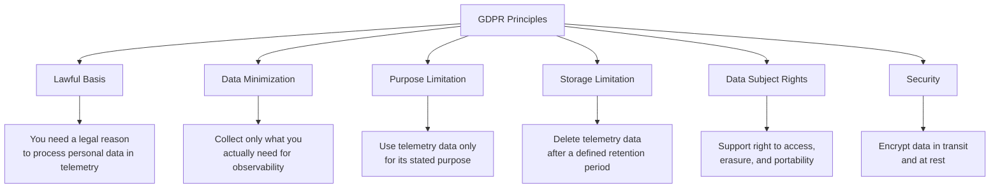
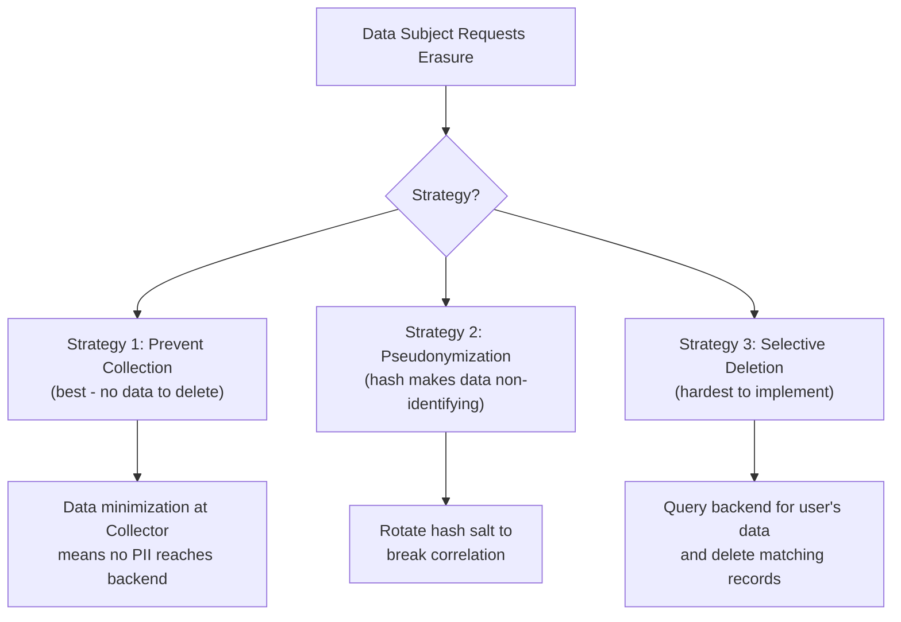
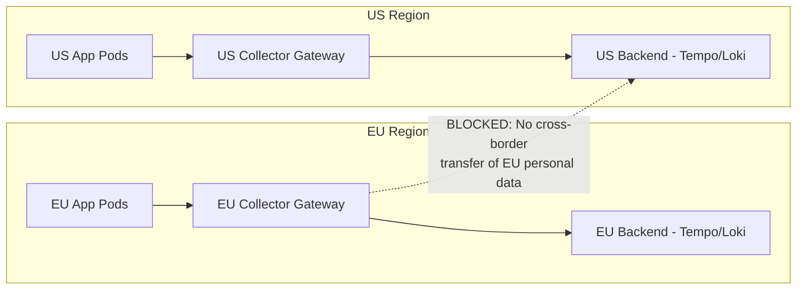

# How to Make Your OpenTelemetry Pipeline GDPR-Compliant

Author: [nawazdhandala](https://www.github.com/nawazdhandala)

Tags: OpenTelemetry, GDPR, Compliance, Data Privacy, Security, Observability

Description: A practical guide to building GDPR-compliant OpenTelemetry pipelines with data minimization, retention controls, consent handling, and right-to-erasure support.

---

The General Data Protection Regulation (GDPR) applies to any organization that processes personal data of individuals in the European Union. Telemetry data is no exception. If your OpenTelemetry traces, logs, or metrics contain personal data (and they almost certainly do), your observability pipeline falls under GDPR's requirements.

This is not a theoretical problem. IP addresses, user IDs, email addresses, session tokens, and even browser user-agent strings can all qualify as personal data under GDPR. If your instrumentation captures any of these, you need to handle them according to the regulation's rules.

This guide translates GDPR's legal requirements into concrete OpenTelemetry configurations. We will cover the six key areas where your pipeline needs to be compliant: lawful basis, data minimization, purpose limitation, storage limitation, data subject rights, and security.

## GDPR Requirements That Affect Telemetry

Before jumping into configurations, let's map GDPR's core principles to what they mean for an observability pipeline.



**Lawful basis** means you need a legitimate reason to process personal data. For observability, this is usually "legitimate interest" in maintaining system reliability. Document this in your Records of Processing Activities (ROPA).

**Data minimization** means you should not collect more personal data than you need. This is the most actionable requirement for your pipeline configuration.

**Purpose limitation** means telemetry data collected for debugging should not be used for user profiling, marketing, or other unrelated purposes. This is primarily a policy and access control issue.

**Storage limitation** means you need defined retention periods and automated deletion.

**Data subject rights** include the right to access (what data do you have about me?), right to erasure (delete my data), and right to portability (export my data).

**Security** means encryption in transit, encryption at rest, and access controls.

## Step 1: Data Minimization in the Collector

Data minimization is the most important technical control. If you never collect personal data in the first place, you do not need to worry about most GDPR obligations for that data.

Start by identifying which attributes in your telemetry contain personal data. Then configure the Collector to minimize what gets through.

This configuration uses multiple processors to strip, hash, and reduce personal data before it reaches your backend.

```yaml
# gdpr-minimization.yaml
# Collector pipeline designed for GDPR data minimization
processors:
  # Remove attributes that contain direct identifiers
  attributes/remove-direct-identifiers:
    actions:
      # Direct identifiers - must be removed or pseudonymized
      - key: user.email
        action: delete
      - key: user.full_name
        action: delete
      - key: user.phone
        action: delete
      - key: enduser.id
        action: delete

      # Network identifiers - IP addresses are personal data under GDPR
      - key: http.client_ip
        action: delete
      - key: client.address
        action: delete
      - key: source.address
        action: delete
      - key: net.peer.ip
        action: delete

      # Pseudonymize (hash) indirect identifiers needed for correlation
      - key: user.id
        action: hash
      - key: session.id
        action: hash

  # Remove query parameters from URLs - often contain PII
  transform/strip-urls:
    trace_statements:
      - context: span
        statements:
          # Strip query strings from URLs
          - replace_pattern(attributes["url.full"], "\\?.*", "")
          - replace_pattern(attributes["http.url"], "\\?.*", "")

    log_statements:
      - context: log
        statements:
          # Redact email patterns in log bodies
          - replace_pattern(body, "[a-zA-Z0-9._%+-]+@[a-zA-Z0-9.-]+\\.[a-zA-Z]{2,}", "[REDACTED]")

  # Use redaction processor as a safety net - allowlist approach
  redaction:
    allowed_keys:
      - "http\\.method"
      - "http\\.status_code"
      - "http\\.route"
      - "http\\.scheme"
      - url.path
      - url.scheme
      - "rpc\\..*"
      - db.system
      - db.name
      - db.operation
      - "messaging\\..*"
      - service.name
      - service.version
      - service.namespace
      - deployment.environment
      - "k8s\\..*"
      - "otel\\..*"
      - "net\\.host\\..*"
      - server.address
      - server.port
    blocked_values:
      - "[a-zA-Z0-9._%+-]+@[a-zA-Z0-9.-]+\\.[a-zA-Z]{2,}"
      - "\\b[0-9]{4}[- ]?[0-9]{4}[- ]?[0-9]{4}[- ]?[0-9]{4}\\b"
    summary: info

  batch:
    send_batch_size: 8192
    timeout: 5s
```

The layered approach is deliberate. The `attributes` processor handles known PII fields. The `transform` processor scrubs URLs and log bodies. The `redaction` processor acts as a safety net, blocking any unexpected attributes that slip through.

## Step 2: Pseudonymization with Hashing

GDPR distinguishes between anonymization (irreversible, data is no longer personal data) and pseudonymization (reversible with additional information, still personal data but with reduced risk). Hashing without a salt is closer to pseudonymization because the hash can theoretically be reversed for low-entropy values.

For GDPR purposes, use hashing with a secret salt at the SDK level to provide stronger pseudonymization. The Collector's built-in hash action does not support salts, so you need a custom approach.

This Python SDK example adds a salted hash processor.

```python
# salted_hash_processor.py
# Pseudonymize user IDs with a salted SHA-256 hash
import hashlib
import os
from opentelemetry.sdk.trace import SpanProcessor

# Load salt from environment variable - keep this secret
HASH_SALT = os.environ.get('OTEL_PII_HASH_SALT', 'change-this-default-salt')

class SaltedHashProcessor(SpanProcessor):
    """Replaces specified attribute values with salted SHA-256 hashes.

    This provides GDPR-compliant pseudonymization. The salt must be
    kept separate from the hashed data to maintain pseudonymization
    properties. If the salt is compromised, re-salt all data.
    """

    # Attributes to pseudonymize
    HASH_KEYS = {'user.id', 'session.id', 'account.id', 'device.id'}

    def on_end(self, span):
        for key in self.HASH_KEYS:
            if key in span.attributes:
                raw_value = str(span.attributes[key])
                # Combine salt + value and hash
                salted = f"{HASH_SALT}:{raw_value}"
                hashed = hashlib.sha256(salted.encode()).hexdigest()
                span.attributes[key] = hashed

    def on_start(self, span, parent_context=None):
        pass

    def shutdown(self):
        pass

    def force_flush(self, timeout_millis=None):
        pass
```

Store the salt securely (in a secrets manager, not in code or config files). If you ever need to rotate the salt, be aware that the hash values will change, breaking correlation with historical data.

## Step 3: Storage Limitation and Retention

GDPR requires that personal data is not kept longer than necessary. For telemetry data, this means you need automated retention policies on your observability backend.

The specific retention period depends on your use case. Most organizations set 7-30 days for detailed traces and logs, and longer for aggregated metrics (which should not contain personal data anyway).

If you are using Grafana Tempo for traces, configure retention in the compactor.

```yaml
# tempo-retention.yaml
# Configure Tempo to automatically delete trace data after 14 days
compactor:
  compaction:
    # Block retention - traces older than this are deleted during compaction
    block_retention: 336h  # 14 days

  ring:
    kvstore:
      store: memberlist

# For S3-backed storage, also configure lifecycle policies
storage:
  trace:
    backend: s3
    s3:
      bucket: tempo-traces
      endpoint: s3.eu-west-1.amazonaws.com  # EU region for data residency
      region: eu-west-1
```

For Elasticsearch (used by Jaeger), set up Index Lifecycle Management.

```json
{
  "policy": {
    "description": "GDPR-compliant trace retention - 14 day deletion",
    "phases": {
      "hot": {
        "min_age": "0ms",
        "actions": {
          "rollover": {
            "max_size": "50gb",
            "max_age": "1d"
          }
        }
      },
      "delete": {
        "min_age": "14d",
        "actions": {
          "delete": {}
        }
      }
    }
  }
}
```

For logs stored in Loki, use retention configuration.

```yaml
# loki-retention.yaml
# Configure Loki to enforce 14-day retention
limits_config:
  retention_period: 336h  # 14 days

compactor:
  retention_enabled: true
  retention_delete_delay: 2h
  retention_delete_worker_count: 150
```

## Step 4: Supporting Right to Erasure

Article 17 of GDPR gives individuals the right to request deletion of their personal data. This is one of the hardest requirements for telemetry systems because traces and logs are typically stored in append-only, immutable storage that is not designed for selective deletion.

There are three strategies, ranging from practical to ideal.



**Strategy 1: Prevention.** If you aggressively minimize data collection so that no personal data reaches your backend, erasure requests become trivial. There is nothing to delete. This is why data minimization is the most important control.

**Strategy 2: Pseudonymization with salt rotation.** If you hash user identifiers with a salt, you can "erase" a user's data by rotating the salt. Old hashes become meaningless because they cannot be correlated back to the user. The data still physically exists, but it is no longer personal data because it cannot be linked to an identified individual without the old salt (which you have destroyed).

**Strategy 3: Selective deletion.** If your backend supports it, you can query for all telemetry associated with a specific user and delete it. This is the most direct approach but requires that your backend supports deletion by attribute value, which many time-series and tracing backends do not natively support.

In practice, most organizations combine strategies 1 and 2. Minimize collection so that very little personal data reaches the backend, pseudonymize what remains, and rely on short retention periods to automatically delete everything.

## Step 5: Encryption and Transport Security

GDPR Article 32 requires "appropriate technical measures" to protect personal data. For your telemetry pipeline, this means TLS everywhere.

This Collector configuration enforces TLS on both the receiver (inbound from applications) and the exporter (outbound to backend).

```yaml
# gdpr-tls-config.yaml
# Enforce TLS encryption for all telemetry in transit
receivers:
  otlp:
    protocols:
      grpc:
        endpoint: "0.0.0.0:4317"
        tls:
          # Require TLS for incoming connections
          cert_file: /etc/otel/certs/collector.crt
          key_file: /etc/otel/certs/collector.key
          # Optionally require client certificates (mTLS)
          client_ca_file: /etc/otel/certs/ca.crt
      http:
        endpoint: "0.0.0.0:4318"
        tls:
          cert_file: /etc/otel/certs/collector.crt
          key_file: /etc/otel/certs/collector.key

exporters:
  otlp:
    endpoint: "tempo.monitoring:4317"
    tls:
      # Use TLS for outbound connections to the backend
      insecure: false
      ca_file: /etc/otel/certs/backend-ca.crt
      cert_file: /etc/otel/certs/collector-client.crt
      key_file: /etc/otel/certs/collector-client.key
```

Also ensure your backend encrypts data at rest. For cloud-hosted backends, enable server-side encryption on your storage buckets (S3, GCS, Azure Blob). For self-hosted backends, use encrypted volumes.

## Step 6: Data Residency and Cross-Border Transfer

GDPR restricts transferring personal data outside the European Economic Area (EEA). If your Collector or backend is running in a US region, you may be in violation.

Deploy your Collectors and backends in EU regions. If you use a managed observability SaaS, confirm that they offer EU data residency and have appropriate data processing agreements.

For multi-region architectures, use region-specific Collector gateways.



Configure your EU Collector to export only to EU backends.

```yaml
# eu-collector-config.yaml
# EU Collector - exports only to EU-hosted backend
exporters:
  otlp/eu-backend:
    endpoint: "tempo.eu-west-1.internal:4317"
    tls:
      insecure: false
    # Explicitly set headers to identify the data origin
    headers:
      x-data-region: "eu"
      x-data-classification: "gdpr-regulated"

service:
  pipelines:
    traces:
      receivers: [otlp]
      processors: [memory_limiter, attributes/remove-direct-identifiers, redaction, batch]
      exporters: [otlp/eu-backend]  # EU backend only
```

## Step 7: Documentation and Audit Trail

GDPR requires you to document your data processing activities. For your telemetry pipeline, this means maintaining records of:

- What personal data your pipeline processes (data inventory)
- What legal basis you rely on (usually legitimate interest)
- How long you retain data (retention policy)
- What security measures you apply (TLS, encryption, access controls)
- Who has access to the telemetry data (access control policy)
- What processors you use to minimize and pseudonymize data (pipeline configuration)

Keep your Collector configuration in version control. Changes to the pipeline configuration are changes to your data processing, and should be reviewed with the same rigor as code changes.

## Complete GDPR-Compliant Pipeline

Here is the full Collector configuration bringing together all the pieces.

```yaml
# gdpr-compliant-collector.yaml
# Complete GDPR-compliant OpenTelemetry Collector configuration
receivers:
  otlp:
    protocols:
      grpc:
        endpoint: "0.0.0.0:4317"
        tls:
          cert_file: /etc/otel/certs/collector.crt
          key_file: /etc/otel/certs/collector.key
      http:
        endpoint: "0.0.0.0:4318"
        tls:
          cert_file: /etc/otel/certs/collector.crt
          key_file: /etc/otel/certs/collector.key

processors:
  memory_limiter:
    check_interval: 1s
    limit_mib: 4096
    spike_limit_mib: 1024

  # Data minimization: remove direct identifiers
  attributes/minimize:
    actions:
      - key: user.email
        action: delete
      - key: user.full_name
        action: delete
      - key: user.phone
        action: delete
      - key: http.client_ip
        action: delete
      - key: client.address
        action: delete
      - key: http.request.header.authorization
        action: delete
      - key: http.request.header.cookie
        action: delete
      - key: user.id
        action: hash
      - key: session.id
        action: hash

  # Scrub PII from URLs and log bodies
  transform/scrub:
    trace_statements:
      - context: span
        statements:
          - replace_pattern(attributes["url.full"], "\\?.*", "")
    log_statements:
      - context: log
        statements:
          - replace_pattern(body, "[a-zA-Z0-9._%+-]+@[a-zA-Z0-9.-]+\\.[a-zA-Z]{2,}", "[REDACTED]")
          - replace_pattern(body, "\\b[0-9]{1,3}\\.[0-9]{1,3}\\.[0-9]{1,3}\\.[0-9]{1,3}\\b", "[REDACTED_IP]")

  # Safety net: allowlist approach
  redaction:
    allowed_keys:
      - "http\\.method"
      - "http\\.status_code"
      - "http\\.route"
      - url.path
      - url.scheme
      - server.address
      - server.port
      - "rpc\\..*"
      - db.system
      - db.name
      - db.operation
      - service.name
      - service.version
      - deployment.environment
      - "k8s\\..*"
    blocked_values:
      - "[a-zA-Z0-9._%+-]+@[a-zA-Z0-9.-]+\\.[a-zA-Z]{2,}"
      - "\\b[0-9]{4}[- ]?[0-9]{4}[- ]?[0-9]{4}[- ]?[0-9]{4}\\b"
    summary: info

  batch:
    send_batch_size: 8192
    timeout: 5s

exporters:
  otlp/eu:
    endpoint: "tempo.eu-west-1.internal:4317"
    tls:
      insecure: false
      ca_file: /etc/otel/certs/backend-ca.crt
    headers:
      x-data-region: "eu"

service:
  pipelines:
    traces:
      receivers: [otlp]
      processors: [memory_limiter, attributes/minimize, transform/scrub, redaction, batch]
      exporters: [otlp/eu]
    logs:
      receivers: [otlp]
      processors: [memory_limiter, attributes/minimize, transform/scrub, batch]
      exporters: [otlp/eu]
    metrics:
      receivers: [otlp]
      processors: [memory_limiter, attributes/minimize, batch]
      exporters: [otlp/eu]

  telemetry:
    metrics:
      address: ":8888"
```

## Wrapping Up

Making your OpenTelemetry pipeline GDPR-compliant is not a single configuration change. It requires a layered approach: minimize what you collect, pseudonymize what remains, encrypt everything in transit and at rest, enforce retention policies, plan for data subject rights, and keep your infrastructure in the right geography.

The good news is that the OpenTelemetry Collector gives you the tools to implement each of these requirements. The attributes processor, redaction processor, and transform processor handle data minimization. TLS configuration handles encryption. Backend-level retention policies handle storage limitation.

The most effective strategy is also the simplest: collect less personal data. If it never enters your pipeline, you do not need to protect it, pseudonymize it, delete it, or document it. Start there, and build additional controls for the personal data that genuinely needs to flow through your observability system.
