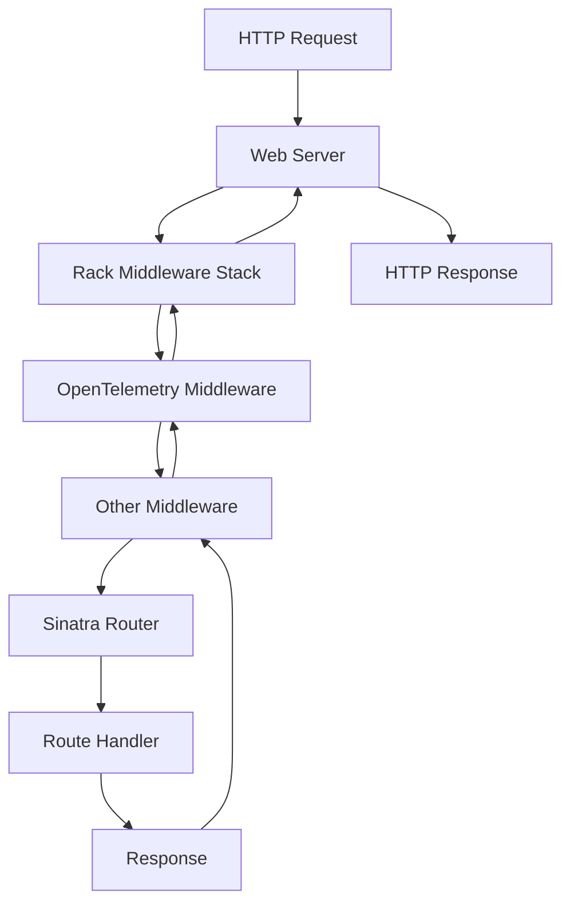

# How to Configure OpenTelemetry Rack Middleware for Sinatra Web Applications

Author: [nawazdhandala](https://www.github.com/nawazdhandala)

Tags: OpenTelemetry, Ruby, Sinatra, Rack, Middleware, HTTP

Description: Deep dive into configuring and customizing OpenTelemetry Rack middleware for comprehensive HTTP tracing in Sinatra applications.

Rack middleware sits between the web server and your Sinatra application, processing every HTTP request and response. OpenTelemetry's Rack middleware turns this strategic position into an observability powerhouse. It automatically captures request details, timing information, and errors without cluttering your application code.

The default configuration works for basic use cases, but production applications need customization. You want to filter sensitive data, add custom attributes, control which routes get traced, and integrate with existing logging systems. This guide covers everything from basic setup to advanced configuration patterns.

## Understanding Rack Middleware Flow

Before diving into configuration, you need to understand where Rack middleware fits in the request lifecycle:



The OpenTelemetry middleware creates a span when the request enters and finishes it when the response leaves. Everything that happens between those points becomes part of the span's duration.

## Basic Installation and Setup

Start with the minimal configuration:

```ruby
# Gemfile

gem 'sinatra'
gem 'opentelemetry-sdk'
gem 'opentelemetry-exporter-otlp'
gem 'opentelemetry-instrumentation-rack'
```

Initialize OpenTelemetry before your Sinatra app loads:

```ruby
# config/instrumentation.rb

require 'opentelemetry/sdk'
require 'opentelemetry/exporter/otlp'
require 'opentelemetry/instrumentation/rack'

OpenTelemetry::SDK.configure do |c|
  c.service_name = 'sinatra-api'

  c.add_span_processor(
    OpenTelemetry::SDK::Trace::Export::BatchSpanProcessor.new(
      OpenTelemetry::Exporter::OTLP::Exporter.new
    )
  )
end
```

Add the middleware to your Sinatra application:

```ruby
# app.rb

require 'sinatra'
require_relative 'config/instrumentation'

# Register the Rack middleware
use OpenTelemetry::Instrumentation::Rack::Middlewares::TracerMiddleware

get '/' do
  'Hello World'
end
```

This basic setup automatically traces every HTTP request with minimal configuration.

## Configuring Middleware Options

The Rack middleware accepts configuration options that control its behavior:

```ruby
# config/instrumentation.rb

require 'opentelemetry/sdk'
require 'opentelemetry/instrumentation/rack'

# Configure the instrumentation library before using it
OpenTelemetry::SDK.configure do |c|
  c.service_name = 'sinatra-api'

  # Configure Rack instrumentation with custom options
  c.use 'OpenTelemetry::Instrumentation::Rack', {
    # Propagate trace context from incoming requests
    # This is essential for distributed tracing
    propagation_style: :w3c,

    # Record HTTP request and response details
    record_frontend_span: true,

    # Automatically detect and record the original client IP
    # even when behind load balancers
    retain_middleware_names: true,

    # Custom function to determine if a request should be traced
    untraced_endpoints: ['/health', '/metrics'],

    # Add custom attributes to every span
    response_propagators: []
  }

  # Add span processors and exporters
  c.add_span_processor(
    OpenTelemetry::SDK::Trace::Export::BatchSpanProcessor.new(
      OpenTelemetry::Exporter::OTLP::Exporter.new(
        endpoint: ENV.fetch('OTEL_EXPORTER_OTLP_ENDPOINT', 'http://localhost:4318/v1/traces')
      )
    )
  )
end
```

In your Sinatra app, simply register the middleware without options since configuration happens in the SDK setup:

```ruby
# app.rb

require 'sinatra'
require_relative 'config/instrumentation'

use OpenTelemetry::Instrumentation::Rack::Middlewares::TracerMiddleware

get '/health' do
  # This endpoint won't be traced due to untraced_endpoints config
  { status: 'ok' }.to_json
end

get '/api/users' do
  # This endpoint will be traced
  User.all.to_json
end
```

## Filtering Sensitive Data

HTTP requests often contain sensitive information in headers, query parameters, or request bodies. You need to scrub this data before it ends up in traces.

Create a custom middleware wrapper that filters data:

```ruby
# lib/filtered_tracer_middleware.rb

require 'opentelemetry/instrumentation/rack'

class FilteredTracerMiddleware
  # Headers that should never be recorded
  SENSITIVE_HEADERS = %w[
    authorization
    cookie
    set-cookie
    x-api-key
    x-auth-token
  ].freeze

  # Query parameters to filter
  SENSITIVE_PARAMS = %w[
    password
    token
    api_key
    secret
    credit_card
  ].freeze

  def initialize(app)
    @app = app
    @middleware = OpenTelemetry::Instrumentation::Rack::Middlewares::TracerMiddleware.new(app)
  end

  def call(env)
    # Filter sensitive data before tracing
    filtered_env = filter_environment(env)

    # Call the OpenTelemetry middleware with filtered env
    status, headers, body = @middleware.call(filtered_env)

    # Get current span and add filtered attributes
    span = OpenTelemetry::Trace.current_span
    add_safe_attributes(span, env) if span && span.recording?

    [status, headers, body]
  end

  private

  def filter_environment(env)
    filtered = env.dup

    # Filter headers
    SENSITIVE_HEADERS.each do |header|
      key = "HTTP_#{header.upcase.tr('-', '_')}"
      filtered[key] = '[FILTERED]' if filtered[key]
    end

    # Filter query string
    if filtered['QUERY_STRING']
      filtered['QUERY_STRING'] = filter_query_string(filtered['QUERY_STRING'])
    end

    filtered
  end

  def filter_query_string(query)
    params = URI.decode_www_form(query)
    filtered_params = params.map do |key, value|
      if SENSITIVE_PARAMS.include?(key.downcase)
        [key, '[FILTERED]']
      else
        [key, value]
      end
    end
    URI.encode_www_form(filtered_params)
  end

  def add_safe_attributes(span, env)
    # Add useful non-sensitive attributes
    span.set_attribute('http.user_agent', env['HTTP_USER_AGENT']) if env['HTTP_USER_AGENT']
    span.set_attribute('http.client_ip', extract_client_ip(env))
    span.set_attribute('http.request_id', env['HTTP_X_REQUEST_ID']) if env['HTTP_X_REQUEST_ID']
  end

  def extract_client_ip(env)
    # Check for forwarded IP headers (from load balancers)
    forwarded = env['HTTP_X_FORWARDED_FOR']
    return forwarded.split(',').first.strip if forwarded

    env['REMOTE_ADDR']
  end
end
```

Use this filtered middleware instead of the default:

```ruby
# app.rb

require 'sinatra'
require_relative 'config/instrumentation'
require_relative 'lib/filtered_tracer_middleware'

# Use the filtered version instead of the default
use FilteredTracerMiddleware

post '/login' do
  # Even though this receives password in params,
  # it won't be recorded in traces
  username = params[:username]
  password = params[:password]  # This will be [FILTERED] in traces

  # Authentication logic
  if authenticate(username, password)
    { token: generate_token(username) }.to_json
  else
    status 401
    { error: 'Invalid credentials' }.to_json
  end
end
```

## Adding Custom Span Attributes

Beyond the default HTTP attributes, you often want to add business-specific data:

```ruby
# lib/enhanced_tracer_middleware.rb

class EnhancedTracerMiddleware
  def initialize(app)
    @app = app
    @tracer_middleware = OpenTelemetry::Instrumentation::Rack::Middlewares::TracerMiddleware.new(app)
  end

  def call(env)
    status, headers, body = @tracer_middleware.call(env)

    # Get the span created by the tracer middleware
    span = OpenTelemetry::Trace.current_span

    if span && span.recording?
      enrich_span(span, env, status, headers)
    end

    [status, headers, body]
  end

  private

  def enrich_span(span, env, status, headers)
    # Add tenant/organization ID if present
    if env['HTTP_X_TENANT_ID']
      span.set_attribute('tenant.id', env['HTTP_X_TENANT_ID'])
    end

    # Add API version from header or route
    if env['HTTP_API_VERSION']
      span.set_attribute('api.version', env['HTTP_API_VERSION'])
    end

    # Record cache hit/miss from response headers
    if headers['X-Cache-Status']
      span.set_attribute('cache.status', headers['X-Cache-Status'])
    end

    # Add response size
    if headers['Content-Length']
      span.set_attribute('http.response_size', headers['Content-Length'].to_i)
    end

    # Record request timing from custom headers
    if env['HTTP_X_REQUEST_START']
      queue_time = calculate_queue_time(env['HTTP_X_REQUEST_START'])
      span.set_attribute('http.queue_time_ms', queue_time)
    end

    # Tag expensive operations
    if status == 200 && span.attributes['http.route']&.include?('/export')
      span.set_attribute('operation.expensive', true)
    end
  end

  def calculate_queue_time(request_start)
    # Request start is typically in format "t=1234567890.123"
    start_time = request_start.split('=').last.to_f
    queue_time = (Time.now.to_f - start_time) * 1000
    queue_time.round(2)
  end
end
```

## Conditional Tracing Based on Request Properties

Not all requests deserve the same level of tracing. You might want different sampling rates for different endpoints:

```ruby
# lib/adaptive_tracer_middleware.rb

class AdaptiveTracerMiddleware
  # Configuration for path-specific tracing rules
  TRACING_RULES = {
    /^\/health/ => { sample_rate: 0.01, enabled: false },
    /^\/metrics/ => { sample_rate: 0.01, enabled: false },
    /^\/api\/v1\/search/ => { sample_rate: 0.5, expensive: true },
    /^\/api\/v1\/export/ => { sample_rate: 1.0, expensive: true },
    /^\/api\/v1/ => { sample_rate: 0.1, expensive: false }
  }.freeze

  def initialize(app)
    @app = app
    @tracer_middleware = OpenTelemetry::Instrumentation::Rack::Middlewares::TracerMiddleware.new(app)
  end

  def call(env)
    path = env['PATH_INFO']
    rules = find_matching_rules(path)

    # Skip tracing if explicitly disabled
    if rules[:enabled] == false
      return @app.call(env)
    end

    # Make sampling decision based on configured rate
    unless should_sample?(rules[:sample_rate])
      return @app.call(env)
    end

    # Trace the request
    status, headers, body = @tracer_middleware.call(env)

    # Add rule-based attributes
    span = OpenTelemetry::Trace.current_span
    if span && span.recording? && rules[:expensive]
      span.set_attribute('operation.expensive', true)
      span.set_attribute('operation.sample_rate', rules[:sample_rate])
    end

    [status, headers, body]
  end

  private

  def find_matching_rules(path)
    TRACING_RULES.each do |pattern, rules|
      return rules if pattern.match?(path)
    end

    # Default rules if no pattern matches
    { sample_rate: 0.1, enabled: true, expensive: false }
  end

  def should_sample?(sample_rate)
    rand < sample_rate
  end
end
```

## Integrating with Request ID Systems

Many applications use request IDs to correlate logs, metrics, and traces. Ensure your trace IDs align with existing request IDs:

```ruby
# lib/request_id_tracer_middleware.rb

class RequestIdTracerMiddleware
  REQUEST_ID_HEADER = 'HTTP_X_REQUEST_ID'.freeze

  def initialize(app)
    @app = app
    @tracer_middleware = OpenTelemetry::Instrumentation::Rack::Middlewares::TracerMiddleware.new(app)
  end

  def call(env)
    # Extract or generate request ID
    request_id = env[REQUEST_ID_HEADER] || SecureRandom.uuid
    env[REQUEST_ID_HEADER] = request_id

    # Process request with tracing
    status, headers, body = @tracer_middleware.call(env)

    # Add request ID to span and response headers
    span = OpenTelemetry::Trace.current_span
    if span && span.recording?
      span.set_attribute('request.id', request_id)

      # Link span ID to request ID for log correlation
      trace_id = span.context.hex_trace_id
      span.set_attribute('trace.id', trace_id)
    end

    # Include both IDs in response headers
    headers['X-Request-ID'] = request_id
    headers['X-Trace-ID'] = span.context.hex_trace_id if span

    [status, headers, body]
  end
end
```

Now your logs can reference both request IDs and trace IDs:

```ruby
# app.rb

require 'logger'

configure do
  set :logger, Logger.new($stdout)
end

before do
  # Access request ID from env
  @request_id = env['HTTP_X_REQUEST_ID']

  # Get trace ID from current span
  span = OpenTelemetry::Trace.current_span
  @trace_id = span.context.hex_trace_id if span && span.recording?

  # Log with both IDs for correlation
  logger.info "Processing request request_id=#{@request_id} trace_id=#{@trace_id}"
end

get '/api/process' do
  # Your business logic
  result = perform_expensive_operation

  logger.info "Operation completed request_id=#{@request_id} result=#{result}"

  { success: true, result: result }.to_json
end
```

## Measuring and Recording Queue Time

Requests often wait in queues before your application processes them. Recording queue time helps identify infrastructure bottlenecks:

```ruby
# lib/queue_time_middleware.rb

class QueueTimeMiddleware
  def initialize(app)
    @app = app
  end

  def call(env)
    # Record when request processing starts
    processing_start = Time.now.to_f

    # Calculate queue time if header is present
    queue_time = extract_queue_time(env)

    status, headers, body = @app.call(env)

    # Add queue time to span
    span = OpenTelemetry::Trace.current_span
    if span && span.recording?
      if queue_time
        span.set_attribute('http.queue_time_ms', queue_time)
        span.add_event('Request queued', attributes: {
          'queue_time_ms' => queue_time
        })
      end

      # Record processing time separately from total time
      processing_time = ((Time.now.to_f - processing_start) * 1000).round(2)
      span.set_attribute('http.processing_time_ms', processing_time)
    end

    [status, headers, body]
  end

  private

  def extract_queue_time(env)
    # Check for X-Request-Start header (set by load balancers)
    request_start = env['HTTP_X_REQUEST_START']
    return nil unless request_start

    # Parse timestamp (format: "t=1234567890.123")
    timestamp = request_start.split('=').last.to_f
    queue_time = ((Time.now.to_f - timestamp) * 1000).round(2)

    # Sanity check: queue time shouldn't be negative or unreasonably large
    queue_time if queue_time > 0 && queue_time < 300000  # 5 minutes max
  end
end
```

Use it before the tracer middleware:

```ruby
# app.rb

use QueueTimeMiddleware
use OpenTelemetry::Instrumentation::Rack::Middlewares::TracerMiddleware
```

## Complete Production Configuration

Here's a production-ready configuration combining all the concepts:

```ruby
# config/instrumentation.rb

require 'opentelemetry/sdk'
require 'opentelemetry/exporter/otlp'
require 'opentelemetry/instrumentation/rack'
require_relative '../lib/filtered_tracer_middleware'
require_relative '../lib/request_id_tracer_middleware'
require_relative '../lib/queue_time_middleware'

# Configure OpenTelemetry SDK
OpenTelemetry::SDK.configure do |c|
  c.service_name = ENV.fetch('OTEL_SERVICE_NAME', 'sinatra-api')
  c.service_version = ENV.fetch('APP_VERSION', 'unknown')

  c.resource = OpenTelemetry::SDK::Resources::Resource.create({
    'deployment.environment' => ENV.fetch('RACK_ENV', 'development'),
    'service.namespace' => ENV.fetch('SERVICE_NAMESPACE', 'default')
  })

  # Configure sampling
  c.sampler = OpenTelemetry::SDK::Trace::Samplers::ParentBased.new(
    root: OpenTelemetry::SDK::Trace::Samplers::TraceIdRatioBased.new(
      ENV.fetch('OTEL_TRACE_SAMPLE_RATE', '0.1').to_f
    )
  )

  # Configure exporter
  exporter = OpenTelemetry::Exporter::OTLP::Exporter.new(
    endpoint: ENV.fetch('OTEL_EXPORTER_OTLP_ENDPOINT'),
    headers: { 'Authorization' => ENV['OTEL_AUTH_HEADER'] }.compact
  )

  c.add_span_processor(
    OpenTelemetry::SDK::Trace::Export::BatchSpanProcessor.new(
      exporter,
      max_queue_size: 2048,
      schedule_delay: 5000
    )
  )
end
```

```ruby
# app.rb

require 'sinatra'
require_relative 'config/instrumentation'

# Middleware stack (order matters)
use QueueTimeMiddleware
use RequestIdTracerMiddleware
use FilteredTracerMiddleware

# Your Sinatra routes
get '/api/v1/users/:id' do
  # Fully traced with all the enhancements
  user = User.find(params[:id])
  user.to_json
end
```

The middleware stack processes requests from top to bottom and responses from bottom to top. This order ensures queue time is measured first, then request IDs are assigned, filtering happens, and finally tracing captures everything.

With proper Rack middleware configuration, your Sinatra application gains production-grade observability without sacrificing performance or cluttering application code. Every request is traced, sensitive data is filtered, and you get the context needed to debug issues quickly.
