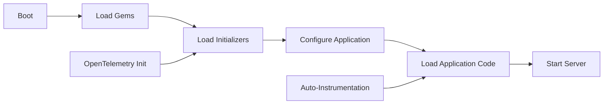

# How to Configure OpenTelemetry in a Rails Initializer for Automatic Instrumentation

Author: [nawazdhandala](https://www.github.com/nawazdhandala)

Tags: OpenTelemetry, Ruby, Rails, Initializer, Configuration

Description: Step-by-step guide to configuring OpenTelemetry in Rails initializers for automatic instrumentation with custom settings and best practices for production deployments.

Rails initializers provide a clean, centralized way to configure OpenTelemetry for your entire application. Proper initializer configuration ensures instrumentation starts before your application code executes, capturing all telemetry data from the moment your app boots.

## Rails Initializer Execution Flow

Understanding when initializers run is critical for OpenTelemetry configuration. Here's the Rails boot sequence:



Your OpenTelemetry initializer must run during phase C to properly instrument everything that happens in phases D, E, and F.

## Basic Initializer Structure

Create a dedicated initializer file for OpenTelemetry configuration. The file name determines load order, so prefix it appropriately:

```ruby
# config/initializers/opentelemetry.rb

require 'opentelemetry/sdk'
require 'opentelemetry/exporter/otlp'
require 'opentelemetry/instrumentation/all'

# Configure the OpenTelemetry SDK
OpenTelemetry::SDK.configure do |c|
  c.service_name = 'rails-app'
  c.use_all('OpenTelemetry::Instrumentation')
end
```

This basic configuration enables all available instrumentations automatically. The `use_all` method discovers and activates instrumentation gems present in your bundle.

## Environment-Specific Configuration

Production, staging, and development environments often need different OpenTelemetry settings. Use Rails environment detection to customize behavior:

```ruby
# config/initializers/opentelemetry.rb

require 'opentelemetry/sdk'
require 'opentelemetry/exporter/otlp'
require 'opentelemetry/instrumentation/all'

OpenTelemetry::SDK.configure do |c|
  # Set service name from environment or use default
  c.service_name = ENV.fetch('OTEL_SERVICE_NAME', "rails-app-#{Rails.env}")

  # Different sampling rates per environment
  if Rails.env.production?
    # Sample 50% in production to manage volume
    c.sampler = OpenTelemetry::SDK::Trace::Samplers::TraceIdRatioBased.new(0.5)
  elsif Rails.env.staging?
    # Sample 100% in staging for thorough testing
    c.sampler = OpenTelemetry::SDK::Trace::Samplers::TraceIdRatioBased.new(1.0)
  else
    # Development: sample everything
    c.sampler = OpenTelemetry::SDK::Trace::Samplers::TraceIdRatioBased.new(1.0)
  end

  # Enable all instrumentations
  c.use_all('OpenTelemetry::Instrumentation')

  # Add environment-specific resource attributes
  c.resource = OpenTelemetry::SDK::Resources::Resource.create({
    'service.name' => c.service_name,
    'deployment.environment' => Rails.env,
    'service.version' => ENV.fetch('GIT_COMMIT', 'unknown')
  })
end
```

This configuration adapts sampling rates and resource attributes based on the current Rails environment, giving you full traces in development while managing costs in production.

## Selective Instrumentation Configuration

While `use_all` is convenient, you often need fine-grained control over individual instrumentations. Here's how to configure each instrumentation separately:

```ruby
# config/initializers/opentelemetry.rb

require 'opentelemetry/sdk'
require 'opentelemetry/exporter/otlp'
require 'opentelemetry/instrumentation/rails'
require 'opentelemetry/instrumentation/active_record'
require 'opentelemetry/instrumentation/net_http'
require 'opentelemetry/instrumentation/redis'
require 'opentelemetry/instrumentation/sidekiq'

OpenTelemetry::SDK.configure do |c|
  c.service_name = 'rails-app'

  # Rails instrumentation with route recognition
  c.use 'OpenTelemetry::Instrumentation::Rails', {
    enable_recognize_route: true,
    # Include middleware names in span attributes
    enable_middleware: true
  }

  # ActiveRecord with SQL obfuscation for security
  c.use 'OpenTelemetry::Instrumentation::ActiveRecord', {
    enable_sql_obfuscation: true,
    # Capture full SQL statements (obfuscated)
    db_statement: :include
  }

  # Net::HTTP for external API calls
  c.use 'OpenTelemetry::Instrumentation::Net::HTTP', {
    # Don't trace health check endpoints
    untraced_hosts: ['localhost:8080']
  }

  # Redis instrumentation
  c.use 'OpenTelemetry::Instrumentation::Redis', {
    # Include command arguments in traces
    db_statement: :include
  }

  # Sidekiq background job instrumentation
  c.use 'OpenTelemetry::Instrumentation::Sidekiq'
end
```

Each instrumentation accepts different configuration options. The Rails instrumentation can track route matching, ActiveRecord can obfuscate SQL for security, and Net::HTTP can exclude specific hosts from tracing.

## Configuring Exporters and Processors

The exporter sends trace data to your observability backend. Configure it with appropriate batching and timeout settings:

```ruby
# config/initializers/opentelemetry.rb

require 'opentelemetry/sdk'
require 'opentelemetry/exporter/otlp'
require 'opentelemetry/instrumentation/all'

OpenTelemetry::SDK.configure do |c|
  c.service_name = 'rails-app'
  c.use_all('OpenTelemetry::Instrumentation')

  # Create OTLP exporter with custom configuration
  exporter = OpenTelemetry::Exporter::OTLP::Exporter.new(
    endpoint: ENV.fetch('OTEL_EXPORTER_OTLP_ENDPOINT', 'http://localhost:4318/v1/traces'),
    headers: {
      'x-api-key' => ENV['OTEL_API_KEY']
    }.compact,
    compression: 'gzip',
    timeout: 10 # seconds
  )

  # Configure batch processor for efficient export
  processor = OpenTelemetry::SDK::Trace::Export::BatchSpanProcessor.new(
    exporter,
    max_queue_size: 2048,
    schedule_delay_millis: 5000,      # Export every 5 seconds
    max_export_batch_size: 512,       # Export up to 512 spans at once
    export_timeout_millis: 30000      # 30 second export timeout
  )

  c.add_span_processor(processor)
end
```

The batch processor collects spans in memory and exports them periodically. This reduces network overhead compared to exporting spans individually.

## Adding Custom Resource Attributes

Resource attributes help identify and filter traces in your observability platform. Add attributes that describe your application instance:

```ruby
# config/initializers/opentelemetry.rb

require 'opentelemetry/sdk'
require 'opentelemetry/exporter/otlp'
require 'opentelemetry/instrumentation/all'

OpenTelemetry::SDK.configure do |c|
  c.service_name = 'rails-app'
  c.use_all('OpenTelemetry::Instrumentation')

  # Rich resource attributes for trace filtering and analysis
  c.resource = OpenTelemetry::SDK::Resources::Resource.create({
    # Service identification
    'service.name' => ENV.fetch('OTEL_SERVICE_NAME', 'rails-app'),
    'service.version' => ENV.fetch('APP_VERSION', 'dev'),
    'service.namespace' => ENV.fetch('SERVICE_NAMESPACE', 'production'),

    # Deployment information
    'deployment.environment' => Rails.env,
    'deployment.region' => ENV.fetch('AWS_REGION', 'us-east-1'),

    # Host information
    'host.name' => Socket.gethostname,
    'host.id' => ENV.fetch('HOSTNAME', Socket.gethostname),

    # Process information
    'process.pid' => Process.pid,
    'process.runtime.name' => RUBY_ENGINE,
    'process.runtime.version' => RUBY_VERSION,

    # Container information (if applicable)
    'container.id' => ENV['CONTAINER_ID'],
    'container.name' => ENV['CONTAINER_NAME'],

    # Kubernetes information (if applicable)
    'k8s.pod.name' => ENV['K8S_POD_NAME'],
    'k8s.namespace.name' => ENV['K8S_NAMESPACE'],
    'k8s.deployment.name' => ENV['K8S_DEPLOYMENT_NAME']
  }.compact) # Remove nil values
end
```

These attributes appear on every span from your application, making it easy to filter traces by environment, region, or deployment version.

## Implementing Custom Samplers

Custom samplers give you precise control over which traces to record. Here's a sampler that always records errors but samples successful requests:

```ruby
# config/initializers/opentelemetry.rb

require 'opentelemetry/sdk'
require 'opentelemetry/exporter/otlp'
require 'opentelemetry/instrumentation/all'

# Custom sampler that records all errors
class ErrorAwareSampler
  def initialize(base_sampler, error_paths = [])
    @base_sampler = base_sampler
    @error_paths = error_paths
  end

  def should_sample?(trace_id:, parent_context:, links:, name:, kind:, attributes:, **)
    # Always sample if this is an error span
    if attributes && attributes['http.status_code'].to_i >= 400
      return OpenTelemetry::SDK::Trace::Samplers::Result.new(
        decision: OpenTelemetry::SDK::Trace::Samplers::Decision::RECORD_AND_SAMPLE
      )
    end

    # Otherwise, defer to base sampler
    @base_sampler.should_sample?(
      trace_id: trace_id,
      parent_context: parent_context,
      links: links,
      name: name,
      kind: kind,
      attributes: attributes
    )
  end

  def description
    "ErrorAwareSampler{base=#{@base_sampler.description}}"
  end
end

OpenTelemetry::SDK.configure do |c|
  c.service_name = 'rails-app'
  c.use_all('OpenTelemetry::Instrumentation')

  # Use custom sampler that always records errors
  base_sampler = OpenTelemetry::SDK::Trace::Samplers::TraceIdRatioBased.new(0.1)
  c.sampler = ErrorAwareSampler.new(base_sampler)
end
```

This sampler ensures you never miss error traces while keeping overall trace volume manageable through percentage-based sampling of successful requests.

## Propagation Configuration

Trace context propagation ensures distributed traces work correctly across service boundaries. Configure which propagation formats your application supports:

```ruby
# config/initializers/opentelemetry.rb

require 'opentelemetry/sdk'
require 'opentelemetry/exporter/otlp'
require 'opentelemetry/instrumentation/all'

OpenTelemetry::SDK.configure do |c|
  c.service_name = 'rails-app'
  c.use_all('OpenTelemetry::Instrumentation')

  # Configure context propagation formats
  # Supports W3C Trace Context, Jaeger, and Zipkin formats
  propagators = [
    OpenTelemetry::Trace::Propagation::TraceContext.text_map_propagator,
    OpenTelemetry::Baggage::Propagation.text_map_propagator
  ]

  c.propagators = propagators
end
```

The W3C Trace Context format is the OpenTelemetry standard and works with all modern observability platforms.

## Handling Initialization Failures

OpenTelemetry initialization can fail due to network issues or misconfiguration. Handle failures gracefully to prevent application startup problems:

```ruby
# config/initializers/opentelemetry.rb

require 'opentelemetry/sdk'
require 'opentelemetry/exporter/otlp'
require 'opentelemetry/instrumentation/all'

begin
  OpenTelemetry::SDK.configure do |c|
    c.service_name = 'rails-app'
    c.use_all('OpenTelemetry::Instrumentation')

    # Configure exporter with retry logic
    exporter = OpenTelemetry::Exporter::OTLP::Exporter.new(
      endpoint: ENV.fetch('OTEL_EXPORTER_OTLP_ENDPOINT', 'http://localhost:4318/v1/traces'),
      timeout: 10
    )

    processor = OpenTelemetry::SDK::Trace::Export::BatchSpanProcessor.new(exporter)
    c.add_span_processor(processor)
  end

  Rails.logger.info "OpenTelemetry initialized successfully"
rescue StandardError => e
  # Log error but don't crash the application
  Rails.logger.error "Failed to initialize OpenTelemetry: #{e.message}"
  Rails.logger.error e.backtrace.join("\n")

  # Optionally send alert to monitoring system
  # ExceptionNotifier.notify_exception(e) if defined?(ExceptionNotifier)
end
```

This pattern logs initialization failures without preventing your application from starting, which is crucial for production deployments.

## Testing Your Configuration

Verify your initializer configuration works correctly across environments:

```ruby
# spec/initializers/opentelemetry_spec.rb

require 'rails_helper'

RSpec.describe 'OpenTelemetry Configuration' do
  it 'initializes OpenTelemetry SDK' do
    expect(OpenTelemetry.tracer_provider).not_to be_nil
  end

  it 'sets correct service name' do
    resource = OpenTelemetry.tracer_provider.resource
    service_name = resource.attribute_enumerator.find { |k, _| k == 'service.name' }&.last

    expect(service_name).to eq("rails-app-test")
  end

  it 'enables Rails instrumentation' do
    tracer = OpenTelemetry.tracer_provider.tracer('test')

    spans = []
    span_processor = OpenTelemetry::SDK::Trace::Export::SimpleSpanProcessor.new(
      OpenTelemetry::SDK::Trace::Export::InMemorySpanExporter.new(spans)
    )

    expect(tracer).not_to be_nil
  end
end
```

These tests verify OpenTelemetry initializes correctly and creates the expected configuration.

## Load Order Considerations

Sometimes you need your OpenTelemetry initializer to run before or after other initializers. Control load order with file naming:

```bash
# Load OpenTelemetry first
config/initializers/00_opentelemetry.rb

# Load after database initialization
config/initializers/50_opentelemetry.rb

# Load last
config/initializers/zz_opentelemetry.rb
```

For most applications, loading OpenTelemetry early ensures all subsequent initialization code is instrumented.

Proper initializer configuration is the foundation of effective OpenTelemetry integration in Rails. With environment-specific settings, custom sampling, rich resource attributes, and error handling, your initializer becomes a robust observability foundation that adapts to different deployment scenarios while maintaining application stability.

