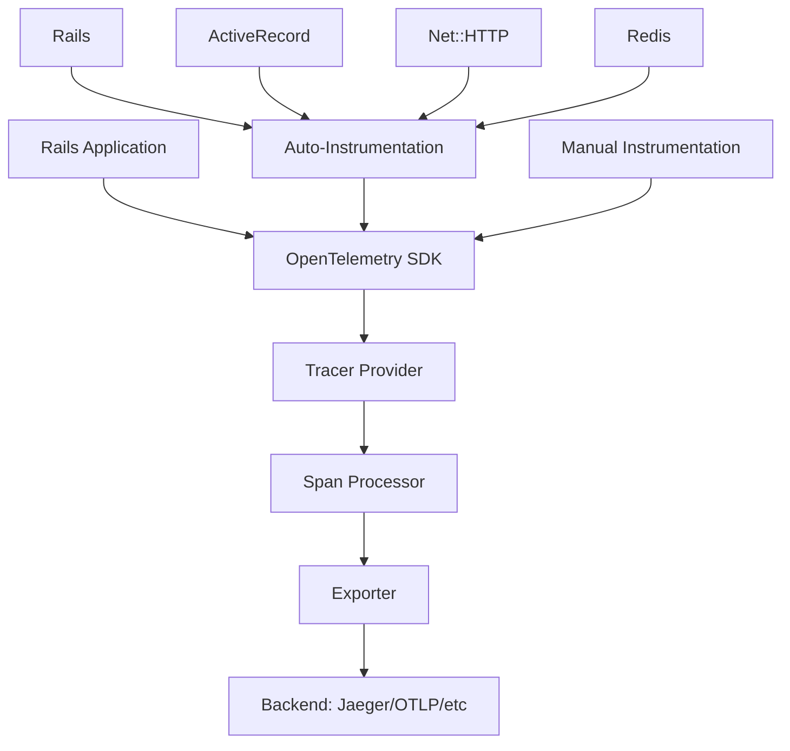

# How to Set Up OpenTelemetry in a Rails Application with opentelemetry-instrumentation-all

Author: [nawazdhandala](https://www.github.com/nawazdhandala)

Tags: OpenTelemetry, Ruby, Rails, Instrumentation, Auto-Instrumentation

Description: Complete guide to setting up OpenTelemetry in Ruby on Rails using the opentelemetry-instrumentation-all gem for automatic distributed tracing and observability.

OpenTelemetry provides a vendor-neutral way to collect telemetry data from your Rails applications. The `opentelemetry-instrumentation-all` gem is a meta-package that bundles all available OpenTelemetry instrumentations for Ruby, making it incredibly easy to get comprehensive observability coverage across your entire Rails stack.

## Why Use opentelemetry-instrumentation-all?

When building production Rails applications, you need visibility into multiple layers: HTTP requests, database queries, background jobs, Redis operations, and external API calls. Instead of installing and configuring each instrumentation library individually, the `opentelemetry-instrumentation-all` gem provides a single dependency that includes everything.

This approach reduces configuration complexity and ensures you don't miss instrumenting critical components. As new instrumentations become available, updating this single gem gives you access to them automatically.

## Understanding the OpenTelemetry Architecture

Before diving into implementation, here's how OpenTelemetry components work together in a Rails application:



## Installation and Dependencies

First, add the required gems to your Gemfile. The instrumentation-all gem pulls in all available instrumentations, while the SDK and exporters handle trace collection and transmission.

```ruby
# Add to your Gemfile
gem 'opentelemetry-sdk'
gem 'opentelemetry-exporter-otlp'
gem 'opentelemetry-instrumentation-all'
```

Run bundler to install the dependencies:

```bash
bundle install
```

The `opentelemetry-instrumentation-all` gem includes instrumentations for Rails, Rack, ActiveRecord, Net::HTTP, Redis, Sidekiq, and many more libraries commonly used in Rails applications.

## Creating the OpenTelemetry Initializer

Rails initializers run during application startup, making them the perfect place to configure OpenTelemetry. Create a new initializer file:

```ruby
# config/initializers/opentelemetry.rb

require 'opentelemetry/sdk'
require 'opentelemetry/exporter/otlp'
require 'opentelemetry/instrumentation/all'

OpenTelemetry::SDK.configure do |c|
  # Set the service name to identify your application in traces
  c.service_name = 'rails-application'

  # Configure the OTLP exporter to send traces to your backend
  # This uses environment variables for endpoint configuration
  c.use_all('OpenTelemetry::Instrumentation' => { enabled: true })

  # Add resource attributes for better trace identification
  c.resource = OpenTelemetry::SDK::Resources::Resource.create(
    'service.name' => 'rails-application',
    'service.version' => '1.0.0',
    'deployment.environment' => Rails.env
  )
end
```

The `use_all` method automatically discovers and enables all available instrumentations. This single line replaces dozens of individual `use` calls you would otherwise need.

## Configuring Environment Variables

OpenTelemetry SDKs follow the OpenTelemetry specification for environment variable configuration. Set these variables to control where traces are sent:

```bash
# .env or environment configuration

# OTLP endpoint (default: http://localhost:4318)
OTEL_EXPORTER_OTLP_ENDPOINT=http://localhost:4318

# Or use the gRPC endpoint
# OTEL_EXPORTER_OTLP_ENDPOINT=http://localhost:4317

# Optional: Set headers for authentication
# OTEL_EXPORTER_OTLP_HEADERS=x-api-key=your-api-key

# Service name (can override initializer setting)
OTEL_SERVICE_NAME=rails-application

# Resource attributes
OTEL_RESOURCE_ATTRIBUTES=deployment.environment=production,service.version=1.0.0

# Enable/disable tracing
OTEL_TRACES_ENABLED=true
```

For development environments, you can run a local collector or use a SaaS observability platform. OneUptime, Jaeger, and other OpenTelemetry-compatible backends work seamlessly with this configuration.

## Advanced Configuration Options

The basic setup works well, but you might want more control over specific instrumentations. Here's a more sophisticated configuration:

```ruby
# config/initializers/opentelemetry.rb

require 'opentelemetry/sdk'
require 'opentelemetry/exporter/otlp'
require 'opentelemetry/instrumentation/all'

OpenTelemetry::SDK.configure do |c|
  c.service_name = ENV.fetch('OTEL_SERVICE_NAME', 'rails-application')

  # Use all instrumentations with custom configuration
  c.use_all({
    'OpenTelemetry::Instrumentation::Rails' => {
      enabled: true,
      enable_recognize_route: true
    },
    'OpenTelemetry::Instrumentation::ActiveRecord' => {
      enabled: true,
      enable_sql_obfuscation: true
    },
    'OpenTelemetry::Instrumentation::Redis' => {
      enabled: true
    },
    'OpenTelemetry::Instrumentation::Sidekiq' => {
      enabled: true
    },
    'OpenTelemetry::Instrumentation::Net::HTTP' => {
      enabled: true
    }
  })

  # Configure resource attributes
  c.resource = OpenTelemetry::SDK::Resources::Resource.create({
    'service.name' => c.service_name,
    'service.version' => ENV.fetch('APP_VERSION', 'unknown'),
    'deployment.environment' => Rails.env,
    'host.name' => Socket.gethostname,
    'process.pid' => Process.pid
  })

  # Add a custom span processor for filtering or enrichment
  c.add_span_processor(
    OpenTelemetry::SDK::Trace::Export::BatchSpanProcessor.new(
      OpenTelemetry::Exporter::OTLP::Exporter.new
    )
  )
end
```

The `enable_sql_obfuscation` option is particularly important for production environments, as it prevents sensitive data in SQL queries from appearing in your traces.

## Verifying the Installation

After configuring OpenTelemetry, verify that traces are being generated correctly. Start your Rails application and make a few requests:

```bash
rails server
```

Then make requests to your application:

```bash
curl http://localhost:3000/users
```

Check your OpenTelemetry backend (OneUptime, Jaeger, etc.) to confirm traces are arriving. You should see spans for:

- HTTP request/response cycle
- Rails controller actions
- ActiveRecord database queries
- Any Redis operations
- External HTTP calls via Net::HTTP

## Performance Considerations

Auto-instrumentation adds minimal overhead, typically less than 5% in most applications. However, for high-traffic applications, consider these optimizations:

```ruby
# Adjust batch span processor settings for better performance
OpenTelemetry::SDK.configure do |c|
  c.service_name = 'rails-application'
  c.use_all

  # Configure batching to reduce network calls
  exporter = OpenTelemetry::Exporter::OTLP::Exporter.new
  processor = OpenTelemetry::SDK::Trace::Export::BatchSpanProcessor.new(
    exporter,
    max_queue_size: 2048,        # Default: 2048
    max_export_batch_size: 512,  # Default: 512
    export_timeout_millis: 30000 # Default: 30000
  )

  c.add_span_processor(processor)
end
```

The batch processor collects spans in memory and exports them in batches, reducing the number of network calls and improving overall performance.

## Sampling Strategies

For extremely high-traffic applications, you might want to sample traces rather than recording every single request:

```ruby
OpenTelemetry::SDK.configure do |c|
  c.service_name = 'rails-application'
  c.use_all

  # Sample 10% of traces
  c.add_span_processor(
    OpenTelemetry::SDK::Trace::Export::BatchSpanProcessor.new(
      OpenTelemetry::Exporter::OTLP::Exporter.new
    )
  )

  # Configure sampler
  c.sampler = OpenTelemetry::SDK::Trace::Samplers::TraceIdRatioBased.new(0.1)
end
```

This configuration records only 10% of traces, significantly reducing storage costs and processing overhead while still providing valuable insights.

## Troubleshooting Common Issues

If traces aren't appearing in your backend, check these common problems:

**Connection Issues**: Verify the OTLP endpoint is reachable from your Rails application. Test with curl:

```bash
curl -v http://localhost:4318/v1/traces
```

**Initialization Order**: Ensure the OpenTelemetry initializer runs before other initializers that might make instrumented calls. Rename it to load first:

```bash
mv config/initializers/opentelemetry.rb config/initializers/00_opentelemetry.rb
```

**Gem Compatibility**: Some gems might conflict with auto-instrumentation. Check your bundle for version conflicts:

```bash
bundle exec gem dependency opentelemetry-instrumentation-all
```

## Integration with Different Backends

The beauty of OpenTelemetry is vendor neutrality. The same configuration works with different backends by changing only the endpoint:

**OneUptime**:
```bash
OTEL_EXPORTER_OTLP_ENDPOINT=https://opentelemetry-collector.oneuptime.com:4318
OTEL_EXPORTER_OTLP_HEADERS=x-api-key=your-oneuptime-api-key
```

**Jaeger**:
```bash
OTEL_EXPORTER_OTLP_ENDPOINT=http://localhost:4318
```

**Honeycomb**:
```bash
OTEL_EXPORTER_OTLP_ENDPOINT=https://api.honeycomb.io
OTEL_EXPORTER_OTLP_HEADERS=x-honeycomb-team=your-api-key
```

The `opentelemetry-instrumentation-all` gem provides the fastest path to comprehensive observability in Rails applications. With a single gem and minimal configuration, you get automatic instrumentation across your entire stack, giving you the visibility needed to debug issues and optimize performance in production environments.

