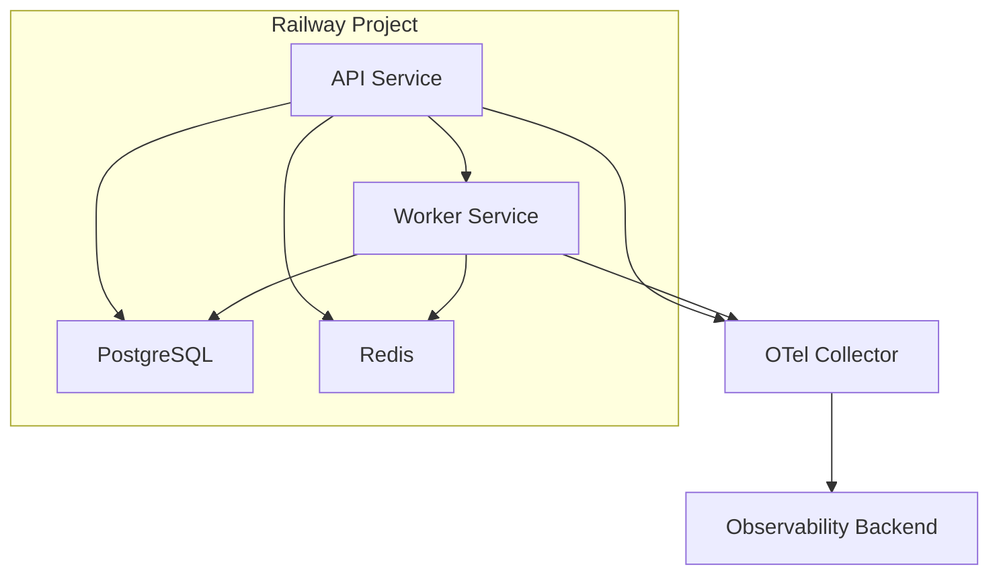
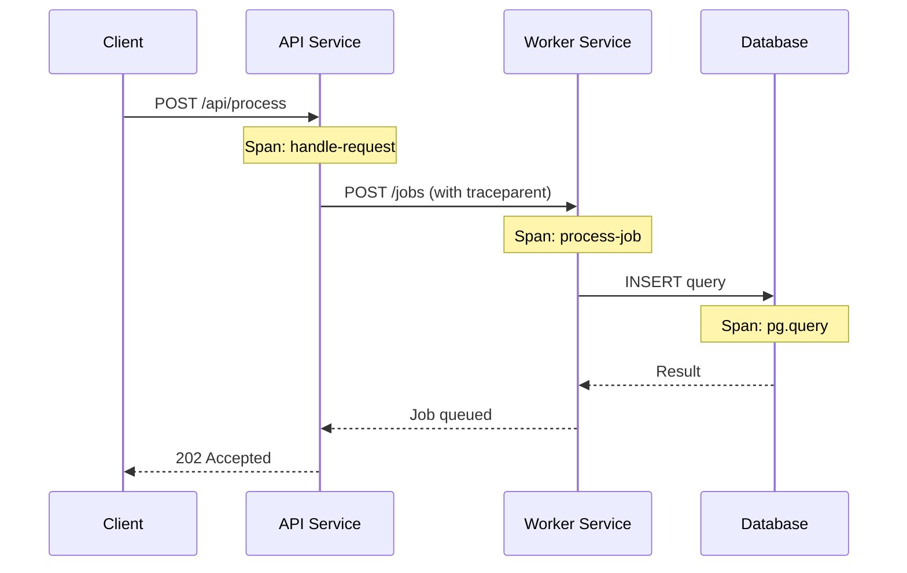

# How to Configure OpenTelemetry for Railway Deployments

Author: [nawazdhandala](https://www.github.com/nawazdhandala)

Tags: OpenTelemetry, Railway, Observability, Tracing, Metrics, Node.js, Deployment

Description: Learn how to configure OpenTelemetry for applications deployed on Railway, with practical examples covering tracing, metrics, and multi-service observability.

---

Railway is a modern deployment platform that makes it easy to ship web applications, APIs, and background workers. It handles builds, deployments, and infrastructure while giving you a clean developer experience. But when your app is running in production and something goes wrong, you need observability. That's where OpenTelemetry fits in.

This guide covers how to instrument your Railway-deployed applications with OpenTelemetry. We'll go through the SDK setup, configuration, and handling Railway-specific details like service-to-service communication and environment management.

## Railway's Architecture and Observability

Railway deploys your applications as containers running on managed infrastructure. Each service in your Railway project gets its own container with persistent networking. Railway also provides built-in service discovery through private networking, which means your services can communicate with each other using internal hostnames.

Here's a typical multi-service Railway project with OpenTelemetry:



Each service runs the OpenTelemetry SDK independently and exports telemetry to an external collector. Trace context propagation links the spans across services so you can see the full request lifecycle.

## Installing OpenTelemetry

Start by adding the OpenTelemetry packages to your project. We'll use the Node.js SDK with auto-instrumentation, which automatically traces HTTP requests, database queries, Redis commands, and more.

```bash
# Install the OpenTelemetry SDK and auto-instrumentation
npm install @opentelemetry/sdk-node \
  @opentelemetry/auto-instrumentations-node \
  @opentelemetry/exporter-trace-otlp-http \
  @opentelemetry/exporter-metrics-otlp-http \
  @opentelemetry/sdk-metrics \
  @opentelemetry/resources \
  @opentelemetry/semantic-conventions
```

## Setting Up the Tracing Configuration

Create an `instrumentation.js` file at the root of your project. This file initializes the OpenTelemetry SDK and must be loaded before any other application code.

```javascript
// instrumentation.js - OpenTelemetry setup for Railway
// Load before your app: node --require ./instrumentation.js server.js

const { NodeSDK } = require('@opentelemetry/sdk-node');
const { getNodeAutoInstrumentations } = require('@opentelemetry/auto-instrumentations-node');
const { OTLPTraceExporter } = require('@opentelemetry/exporter-trace-otlp-http');
const { OTLPMetricExporter } = require('@opentelemetry/exporter-metrics-otlp-http');
const { PeriodicExportingMetricReader } = require('@opentelemetry/sdk-metrics');
const { Resource } = require('@opentelemetry/resources');
const { ATTR_SERVICE_NAME } = require('@opentelemetry/semantic-conventions');

// Railway provides several environment variables automatically
// We use them to enrich our telemetry with deployment context
const resource = new Resource({
  [ATTR_SERVICE_NAME]: process.env.OTEL_SERVICE_NAME || process.env.RAILWAY_SERVICE_NAME || 'railway-app',
  'deployment.environment': process.env.RAILWAY_ENVIRONMENT || 'production',
  'railway.project.id': process.env.RAILWAY_PROJECT_ID || 'unknown',
  'railway.service.id': process.env.RAILWAY_SERVICE_ID || 'unknown',
  'railway.deployment.id': process.env.RAILWAY_DEPLOYMENT_ID || 'unknown',
  'railway.replica.id': process.env.RAILWAY_REPLICA_ID || 'unknown',
});

// Configure the trace exporter to send data via OTLP/HTTP
const traceExporter = new OTLPTraceExporter({
  url: process.env.OTEL_EXPORTER_OTLP_ENDPOINT + '/v1/traces',
  headers: {
    'x-oneuptime-token': process.env.ONEUPTIME_TOKEN || '',
  },
});

// Configure metrics export every 30 seconds
const metricReader = new PeriodicExportingMetricReader({
  exporter: new OTLPMetricExporter({
    url: process.env.OTEL_EXPORTER_OTLP_ENDPOINT + '/v1/metrics',
    headers: {
      'x-oneuptime-token': process.env.ONEUPTIME_TOKEN || '',
    },
  }),
  exportIntervalMillis: 30000,
});

const sdk = new NodeSDK({
  resource,
  traceExporter,
  metricReader,
  instrumentations: [
    getNodeAutoInstrumentations({
      // Reduce noise from file system operations
      '@opentelemetry/instrumentation-fs': { enabled: false },
      '@opentelemetry/instrumentation-http': {
        // Ignore health check endpoints
        ignoreIncomingRequestHook: (request) => {
          return request.url === '/health' || request.url === '/healthz';
        },
      },
    }),
  ],
});

sdk.start();
console.log('OpenTelemetry initialized for Railway deployment');

// Graceful shutdown on SIGTERM (Railway sends this during redeployments)
process.on('SIGTERM', () => {
  sdk.shutdown()
    .then(() => console.log('Telemetry flushed successfully'))
    .catch((err) => console.error('Error flushing telemetry:', err))
    .finally(() => process.exit(0));
});
```

Railway sets several environment variables automatically on your deployments: `RAILWAY_PROJECT_ID`, `RAILWAY_SERVICE_NAME`, `RAILWAY_ENVIRONMENT`, `RAILWAY_DEPLOYMENT_ID`, and others. We include these as resource attributes so you can correlate traces with specific deployments. If a bug was introduced in a particular deployment, you can filter traces by `railway.deployment.id` to see exactly what changed.

## Configuring the Start Command

Railway detects your start command from the `Procfile`, `package.json`, or your Railway service settings. Update your start command to preload the instrumentation file.

In your `package.json`, modify the start script:

```json
{
  "scripts": {
    "start": "node --require ./instrumentation.js server.js",
    "dev": "node --require ./instrumentation.js --watch server.js"
  }
}
```

Or if you use a `Procfile`:

```
web: node --require ./instrumentation.js server.js
worker: node --require ./instrumentation.js worker.js
```

## Setting Environment Variables in Railway

Add the OpenTelemetry configuration to your Railway service's variables. Open the Railway dashboard, navigate to your service, and click the Variables tab.

```
OTEL_EXPORTER_OTLP_ENDPOINT = https://your-collector.example.com
OTEL_SERVICE_NAME = my-api-service
ONEUPTIME_TOKEN = your-auth-token
```

Railway supports shared variables across services in a project. If all your services export to the same collector, you can set `OTEL_EXPORTER_OTLP_ENDPOINT` as a shared variable to avoid duplication.

You can also set variables via the Railway CLI:

```bash
# Set variables using the Railway CLI
railway variables set OTEL_EXPORTER_OTLP_ENDPOINT=https://your-collector.example.com
railway variables set OTEL_SERVICE_NAME=my-api-service
railway variables set ONEUPTIME_TOKEN=your-auth-token
```

## Tracing Across Railway Services

When you have multiple services in a Railway project (an API service, a worker, a database), distributed tracing ties them together. The OpenTelemetry SDK automatically injects trace context headers (W3C Trace Context) into outgoing HTTP requests.

Here's an example of an API service that calls a worker service over Railway's private network:

```javascript
// API service calling a worker service on Railway's private network
const { trace } = require('@opentelemetry/api');
const tracer = trace.getTracer('api-service');

async function enqueueJob(jobData) {
  return tracer.startActiveSpan('enqueue-job', async (span) => {
    span.setAttribute('job.type', jobData.type);
    span.setAttribute('job.priority', jobData.priority || 'normal');

    // Call the worker service using Railway's internal networking
    // Railway services can reach each other via their service name
    const response = await fetch('http://worker-service.railway.internal:3001/jobs', {
      method: 'POST',
      headers: { 'Content-Type': 'application/json' },
      body: JSON.stringify(jobData),
    });

    span.setAttribute('http.status_code', response.status);

    if (!response.ok) {
      span.setStatus({ code: 2, message: 'Worker returned error' });
    }

    span.end();
    return response.json();
  });
}
```

The trace context is automatically propagated to the worker service. When both services have OpenTelemetry configured, you'll see a single trace that spans across both services.



## Custom Metrics for Railway

Beyond traces, custom metrics help you monitor business KPIs and system health. Here's how to create counters and histograms that work well with Railway's deployment model.

```javascript
// Custom metrics for monitoring application health on Railway
const { metrics } = require('@opentelemetry/api');
const meter = metrics.getMeter('railway-app');

// Track request counts by endpoint and status
const requestCounter = meter.createCounter('http.requests.total', {
  description: 'Total HTTP requests handled',
});

// Track response latency distribution
const latencyHistogram = meter.createHistogram('http.request.duration_ms', {
  description: 'HTTP request duration in milliseconds',
  unit: 'ms',
});

// Track active connections (useful for debugging connection pool issues)
const activeConnections = meter.createUpDownCounter('db.connections.active', {
  description: 'Number of active database connections',
});

// Middleware to record request metrics
function metricsMiddleware(req, res, next) {
  const start = Date.now();

  res.on('finish', () => {
    const duration = Date.now() - start;
    const attributes = {
      'http.method': req.method,
      'http.route': req.route?.path || req.path,
      'http.status_code': res.statusCode,
      'railway.service': process.env.RAILWAY_SERVICE_NAME || 'unknown',
    };

    requestCounter.add(1, attributes);
    latencyHistogram.record(duration, attributes);
  });

  next();
}
```

## Handling Railway Redeployments

When you push new code or change a configuration variable, Railway creates a new deployment. The old container receives `SIGTERM` and has a grace period to shut down. Our `SIGTERM` handler in the instrumentation file handles this by flushing any buffered telemetry before the process exits.

One thing to watch out for: Railway performs zero-downtime deployments by starting the new container before stopping the old one. During this overlap period, both containers are running and both will emit telemetry. The `railway.deployment.id` resource attribute helps you distinguish between traces from the old and new deployments.

## Running a Collector on Railway

For advanced setups, you can run an OpenTelemetry Collector as a separate service within your Railway project. This gives you a local aggregation point for all your services.

Create a new Railway service with this `Dockerfile`:

```dockerfile
# Dockerfile for OpenTelemetry Collector on Railway
FROM otel/opentelemetry-collector-contrib:latest

# Copy the collector configuration
COPY otel-collector-config.yaml /etc/otelcol-contrib/config.yaml

# The collector listens on port 4318 for OTLP/HTTP
EXPOSE 4318

CMD ["--config", "/etc/otelcol-contrib/config.yaml"]
```

And the collector configuration:

```yaml
# otel-collector-config.yaml
receivers:
  otlp:
    protocols:
      http:
        endpoint: 0.0.0.0:4318

processors:
  batch:
    timeout: 10s
    send_batch_size: 512

exporters:
  otlphttp:
    endpoint: ${BACKEND_ENDPOINT}
    headers:
      x-oneuptime-token: ${ONEUPTIME_TOKEN}

service:
  pipelines:
    traces:
      receivers: [otlp]
      processors: [batch]
      exporters: [otlphttp]
    metrics:
      receivers: [otlp]
      processors: [batch]
      exporters: [otlphttp]
```

Point your application services to the collector using Railway's internal networking:

```
OTEL_EXPORTER_OTLP_ENDPOINT = http://otel-collector.railway.internal:4318
```

## Summary

Configuring OpenTelemetry for Railway deployments follows the standard Node.js setup with some Railway-specific enhancements. The platform provides useful environment variables for deployment context, internal networking for service-to-service communication, and a clean deployment model that works well with OpenTelemetry's lifecycle.

Here's what to keep in mind:

- Load the instrumentation file before your application code using `--require`
- Include Railway's environment variables as resource attributes for deployment correlation
- Use Railway's internal networking when running a collector as a separate service
- Handle `SIGTERM` to flush telemetry during redeployments
- Use shared variables across services for common configuration like the collector endpoint
- Filter out health check requests to keep traces focused on real traffic

With this setup, you get end-to-end visibility across all your Railway services, making it much easier to debug issues and understand performance in production.
