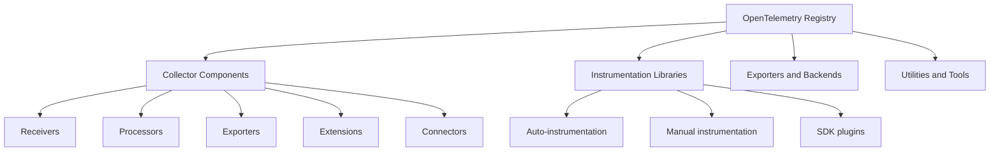
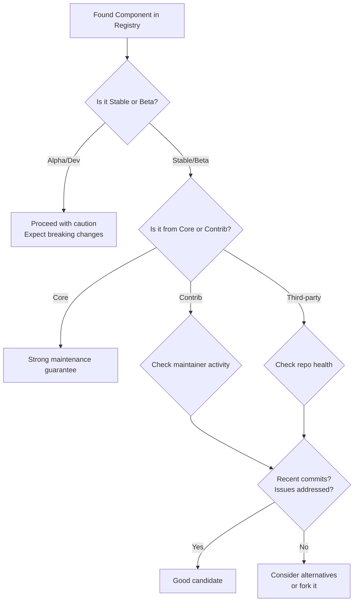

# How to Use the OpenTelemetry Registry to Find Compatible Components

Author: [nawazdhandala](https://www.github.com/nawazdhandala)

Tags: OpenTelemetry, Registry, Components, Collector, Discovery

Description: Learn how to navigate the OpenTelemetry Registry to discover, evaluate, and select compatible components for your collector distribution.

---

The OpenTelemetry ecosystem has hundreds of components spread across multiple repositories, vendors, and community contributors. Finding the right component for your use case, and confirming it works with your collector version, can feel like searching through a maze. The OpenTelemetry Registry exists to solve this problem. This post shows you how to use it effectively.

## What is the OpenTelemetry Registry?

The OpenTelemetry Registry is a searchable catalog at [opentelemetry.io/ecosystem/registry](https://opentelemetry.io/ecosystem/registry/) that lists receivers, processors, exporters, extensions, and instrumentation libraries across all supported languages and platforms. Think of it as a package index specifically for the OpenTelemetry ecosystem.



## Searching the Registry

The registry supports filtering by several dimensions:

- **Component type**: receiver, processor, exporter, extension, connector
- **Language**: Go, Java, Python, JavaScript, .NET, etc.
- **Source**: core, contrib, third-party
- **Stability**: stable, beta, alpha, development

### Finding a Receiver for Your Data Source

Suppose you need to collect metrics from a PostgreSQL database. Here is how to find the right component:

1. Go to the registry and search for "postgresql"
2. Filter by component type "receiver"
3. Filter by language "collector" (since collector components are written in Go)
4. Check the stability level and source repository

The search will return the `postgresqlreceiver` from the contrib repository. The registry page tells you:

- The Go module path to use in your manifest
- The stability level for each signal (traces, metrics, logs)
- A link to the component's documentation
- The repository where the source code lives

## Evaluating Components

Not all registry entries are equal. Here is a checklist for evaluating a component before adding it to your distribution:



### Checking Component Health

Use the GitHub API to evaluate a component's maintenance status:

```bash
#!/bin/bash
# check-component-health.sh
# Evaluates the health of a collector component repository

REPO="${1:?Usage: $0 <owner/repo>}"

echo "Checking health of ${REPO}..."

# Get the last commit date
LAST_COMMIT=$(gh api "repos/${REPO}/commits?per_page=1" --jq '.[0].commit.committer.date')
echo "Last commit: ${LAST_COMMIT}"

# Count open issues
OPEN_ISSUES=$(gh api "repos/${REPO}" --jq '.open_issues_count')
echo "Open issues: ${OPEN_ISSUES}"

# Count recent commits (last 30 days)
SINCE=$(date -u -v-30d +%Y-%m-%dT%H:%M:%SZ 2>/dev/null || date -u -d '30 days ago' +%Y-%m-%dT%H:%M:%SZ)
RECENT_COMMITS=$(gh api "repos/${REPO}/commits?since=${SINCE}&per_page=100" --jq 'length')
echo "Commits in last 30 days: ${RECENT_COMMITS}"

# Check for releases
LATEST_RELEASE=$(gh api "repos/${REPO}/releases/latest" --jq '.tag_name' 2>/dev/null || echo "No releases")
echo "Latest release: ${LATEST_RELEASE}"

# Get star count as a rough popularity indicator
STARS=$(gh api "repos/${REPO}" --jq '.stargazers_count')
echo "Stars: ${STARS}"
```

## Matching Component Versions to Your Collector

The most common mistake when using registry components is version mismatches. Here is how to get it right.

### Core and Contrib Components

These release in lockstep with the collector. Match the version exactly:

```yaml
# manifest.yaml
dist:
  otelcol_version: "0.96.0"

# Core components use the same version as otelcol_version
receivers:
  - gomod: go.opentelemetry.io/collector/receiver/otlpreceiver v0.96.0

# Contrib components also release with matching versions
processors:
  - gomod: github.com/open-telemetry/opentelemetry-collector-contrib/processor/attributesprocessor v0.96.0
```

### Third-Party Components

These have their own versioning scheme. Check what collector version they were built against:

```bash
# Check a third-party component's go.mod to see which collector version it targets
# This tells you if it is compatible with your collector version
go list -m -json github.com/somevendor/otel-component@v1.2.0 | \
  grep -A1 'opentelemetry-collector'
```

If the versions do not match, you have two options:

```yaml
# Option 1: Use a replace directive to force version alignment
# This works when the API differences are minor
replaces:
  - go.opentelemetry.io/collector v0.94.0 => go.opentelemetry.io/collector v0.96.0

# Option 2: Pin to the collector version that matches the component
# Downgrade your collector to match
dist:
  otelcol_version: "0.94.0"
```

## Common Component Categories

Here are the most frequently used components from the registry, organized by use case.

### Infrastructure Monitoring

```yaml
# Components for monitoring infrastructure
receivers:
  # Collects CPU, memory, disk, and network metrics from the host
  - gomod: github.com/open-telemetry/opentelemetry-collector-contrib/receiver/hostmetricsreceiver v0.96.0
  # Collects Docker container metrics
  - gomod: github.com/open-telemetry/opentelemetry-collector-contrib/receiver/dockerstatsreceiver v0.96.0
  # Collects Kubernetes cluster-level metrics
  - gomod: github.com/open-telemetry/opentelemetry-collector-contrib/receiver/k8sclusterreceiver v0.96.0
  # Collects Kubernetes events as logs
  - gomod: github.com/open-telemetry/opentelemetry-collector-contrib/receiver/k8seventsreceiver v0.96.0
```

### Database Monitoring

```yaml
# Components for monitoring databases
receivers:
  - gomod: github.com/open-telemetry/opentelemetry-collector-contrib/receiver/postgresqlreceiver v0.96.0
  - gomod: github.com/open-telemetry/opentelemetry-collector-contrib/receiver/mysqlreceiver v0.96.0
  - gomod: github.com/open-telemetry/opentelemetry-collector-contrib/receiver/mongodbatlasreceiver v0.96.0
  - gomod: github.com/open-telemetry/opentelemetry-collector-contrib/receiver/redisreceiver v0.96.0
  - gomod: github.com/open-telemetry/opentelemetry-collector-contrib/receiver/elasticsearchreceiver v0.96.0
```

### Log Collection

```yaml
# Components for collecting and processing logs
receivers:
  # Tail log files on disk
  - gomod: github.com/open-telemetry/opentelemetry-collector-contrib/receiver/filelogreceiver v0.96.0
  # Receive syslog messages
  - gomod: github.com/open-telemetry/opentelemetry-collector-contrib/receiver/syslogreceiver v0.96.0
  # Receive logs over TCP/UDP
  - gomod: github.com/open-telemetry/opentelemetry-collector-contrib/receiver/tcplogreceiver v0.96.0
```

### Data Enrichment

```yaml
# Components for enriching telemetry with context
processors:
  # Add Kubernetes metadata (pod name, namespace, node, etc.)
  - gomod: github.com/open-telemetry/opentelemetry-collector-contrib/processor/k8sattributesprocessor v0.96.0
  # Detect resource attributes from the environment
  - gomod: github.com/open-telemetry/opentelemetry-collector-contrib/processor/resourcedetectionprocessor v0.96.0
  # Transform data using the OpenTelemetry Transformation Language
  - gomod: github.com/open-telemetry/opentelemetry-collector-contrib/processor/transformprocessor v0.96.0
```

### Cost Optimization

```yaml
# Components for controlling telemetry volume and cost
processors:
  # Sample traces intelligently based on errors, latency, etc.
  - gomod: github.com/open-telemetry/opentelemetry-collector-contrib/processor/tailsamplingprocessor v0.96.0
  # Drop telemetry matching specific conditions
  - gomod: github.com/open-telemetry/opentelemetry-collector-contrib/processor/filterprocessor v0.96.0
  # Sample based on probability
  - gomod: github.com/open-telemetry/opentelemetry-collector-contrib/processor/probabilisticsamplerprocessor v0.96.0
```

## Building a Manifest from Registry Discoveries

After finding the components you need, assemble them into a manifest:

```yaml
# manifest.yaml
# Built from components discovered in the OpenTelemetry Registry
# Each component was evaluated for stability and compatibility

dist:
  name: otelcol-production
  output_path: ./dist
  otelcol_version: "0.96.0"
  module: github.com/myorg/otelcol-production

receivers:
  # Core: OTLP for application telemetry
  - gomod: go.opentelemetry.io/collector/receiver/otlpreceiver v0.96.0
  # Contrib (Beta): Host metrics for infrastructure monitoring
  - gomod: github.com/open-telemetry/opentelemetry-collector-contrib/receiver/hostmetricsreceiver v0.96.0
  # Contrib (Beta): File logs for application log collection
  - gomod: github.com/open-telemetry/opentelemetry-collector-contrib/receiver/filelogreceiver v0.96.0
  # Contrib (Beta): PostgreSQL metrics for database monitoring
  - gomod: github.com/open-telemetry/opentelemetry-collector-contrib/receiver/postgresqlreceiver v0.96.0

processors:
  # Core: Batching
  - gomod: go.opentelemetry.io/collector/processor/batchprocessor v0.96.0
  # Core: Memory protection
  - gomod: go.opentelemetry.io/collector/processor/memorylimiterprocessor v0.96.0
  # Contrib (Beta): Kubernetes enrichment
  - gomod: github.com/open-telemetry/opentelemetry-collector-contrib/processor/k8sattributesprocessor v0.96.0
  # Contrib (Beta): Transform processor for OTTL
  - gomod: github.com/open-telemetry/opentelemetry-collector-contrib/processor/transformprocessor v0.96.0
  # Contrib (Beta): Filter out unwanted telemetry
  - gomod: github.com/open-telemetry/opentelemetry-collector-contrib/processor/filterprocessor v0.96.0

exporters:
  # Core: OTLP gRPC
  - gomod: go.opentelemetry.io/collector/exporter/otlpexporter v0.96.0
  # Core: OTLP HTTP
  - gomod: go.opentelemetry.io/collector/exporter/otlphttpexporter v0.96.0
  # Core: Debug for development
  - gomod: go.opentelemetry.io/collector/exporter/debugexporter v0.96.0

extensions:
  # Contrib (Stable): Health check endpoint
  - gomod: github.com/open-telemetry/opentelemetry-collector-contrib/extension/healthcheckextension v0.96.0
```

## Staying Updated on New Components

The registry grows constantly. Set up a process to stay informed:

```bash
#!/bin/bash
# check-new-components.sh
# Checks the contrib repository for recently added components

echo "Recently added components in opentelemetry-collector-contrib:"

# List directories added in the last 90 days
for TYPE in receiver processor exporter extension connector; do
  echo ""
  echo "=== ${TYPE}s ==="
  gh api "repos/open-telemetry/opentelemetry-collector-contrib/commits?path=${TYPE}&since=$(date -u -v-90d +%Y-%m-%dT%H:%M:%SZ 2>/dev/null || date -u -d '90 days ago' +%Y-%m-%dT%H:%M:%SZ)&per_page=10" \
    --jq '.[].commit.message' | grep -i "add\|new\|initial" | head -5
done
```

## Wrapping Up

The OpenTelemetry Registry is your starting point for building a well-fitted collector distribution. Search by component type and use case, evaluate stability levels, verify version compatibility, and check maintenance health before committing to a component. The registry keeps growing as the community contributes more integrations, so check back regularly for new components that might simplify your observability stack.
