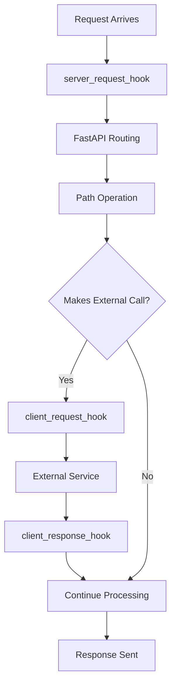

# How to Use OpenTelemetry Request and Response Hooks in FastAPI

Author: [nawazdhandala](https://www.github.com/nawazdhandala)

Tags: OpenTelemetry, FastAPI, Hooks, Request, Response, Python, Custom Attributes

Description: Master OpenTelemetry request and response hooks in FastAPI to enrich traces with custom attributes and implement advanced observability patterns.

Request and response hooks in OpenTelemetry FastAPI instrumentation provide powerful extension points for customizing telemetry data. While automatic instrumentation captures standard HTTP metrics, hooks let you extract application-specific information, implement custom business logic tracking, and enrich traces with context that matters for your particular use case. Hooks execute at strategic points in the request lifecycle, giving you access to raw request data before processing and response information after completion.

## Understanding Hook Execution Lifecycle

FastAPIInstrumentor provides three types of hooks that execute at different stages:

**server_request_hook**: Runs when a request arrives, before any application code executes. Use this to extract request metadata, validate headers, or set up request-scoped context.

**client_request_hook**: Fires when your application makes outgoing HTTP requests. This helps trace calls to external services.

**client_response_hook**: Executes when responses arrive from external services, allowing you to capture response metadata.

Understanding when each hook fires is critical for implementing the right logic in the right place.



## Basic Server Request Hook

The server request hook receives the span and ASGI scope dictionary. The scope contains all request information in ASGI format.

```python
from fastapi import FastAPI
from opentelemetry.instrumentation.fastapi import FastAPIInstrumentor
from opentelemetry import trace

app = FastAPI()

def server_request_hook(span, scope):
    """
    Customize span with request information

    Args:
        span: Current OpenTelemetry span
        scope: ASGI scope dictionary containing request data
    """
    if not span or not span.is_recording():
        return

    # Extract HTTP method and path
    method = scope.get("method", "")
    path = scope.get("path", "")
    span.set_attribute("custom.http.method", method)
    span.set_attribute("custom.http.path", path)

    # Extract query string
    query_string = scope.get("query_string", b"").decode("utf-8")
    if query_string:
        span.set_attribute("http.query_string", query_string)

    # Extract client information
    client = scope.get("client")
    if client:
        client_host, client_port = client
        span.set_attribute("client.address", client_host)
        span.set_attribute("client.port", client_port)

    # Extract server information
    server = scope.get("server")
    if server:
        server_host, server_port = server
        span.set_attribute("server.address", server_host)
        span.set_attribute("server.port", server_port)

FastAPIInstrumentor.instrument_app(
    app,
    server_request_hook=server_request_hook
)

@app.get("/api/users")
async def get_users(page: int = 1, limit: int = 10):
    return {"users": [], "page": page, "limit": limit}
```

This hook extracts comprehensive request metadata and adds it to every span automatically.

## Extracting and Validating Headers

Headers often contain important context like authentication tokens, request IDs, and API versions. Extract these in the request hook.

```python
from fastapi import FastAPI
from opentelemetry.instrumentation.fastapi import FastAPIInstrumentor

app = FastAPI()

def server_request_hook(span, scope):
    """Extract headers and add to span"""
    if not span or not span.is_recording():
        return

    # Parse headers from ASGI scope
    headers = {}
    for header_name, header_value in scope.get("headers", []):
        headers[header_name.decode("utf-8").lower()] = header_value.decode("utf-8")

    # Extract user agent
    user_agent = headers.get("user-agent", "unknown")
    span.set_attribute("http.user_agent", user_agent)

    # Extract request ID for correlation
    request_id = headers.get("x-request-id", "")
    if request_id:
        span.set_attribute("request.id", request_id)

    # Extract API version
    api_version = headers.get("x-api-version", "v1")
    span.set_attribute("api.version", api_version)

    # Extract authentication information
    authorization = headers.get("authorization", "")
    if authorization:
        # Don't log the actual token
        auth_type = authorization.split(" ")[0] if " " in authorization else "unknown"
        span.set_attribute("auth.type", auth_type)
        span.set_attribute("auth.present", True)
    else:
        span.set_attribute("auth.present", False)

    # Extract custom business headers
    tenant_id = headers.get("x-tenant-id", "")
    if tenant_id:
        span.set_attribute("tenant.id", tenant_id)

    # Extract trace context for debugging
    traceparent = headers.get("traceparent", "")
    if traceparent:
        span.set_attribute("trace.parent", traceparent)

FastAPIInstrumentor.instrument_app(
    app,
    server_request_hook=server_request_hook
)

@app.get("/api/data")
async def get_data():
    return {"data": [1, 2, 3]}
```

## Implementing Request Context and User Tracking

Track user identity and session information across requests.

```python
from fastapi import FastAPI, Header
from opentelemetry.instrumentation.fastapi import FastAPIInstrumentor
import jwt
from typing import Optional

app = FastAPI()

def server_request_hook(span, scope):
    """Extract user context from JWT token"""
    if not span or not span.is_recording():
        return

    # Parse headers
    headers = dict(scope.get("headers", []))
    authorization = headers.get(b"authorization", b"").decode("utf-8")

    if authorization.startswith("Bearer "):
        token = authorization[7:]
        try:
            # Decode JWT (simplified - use proper validation in production)
            payload = jwt.decode(token, options={"verify_signature": False})

            # Extract user information
            user_id = payload.get("user_id", "")
            user_email = payload.get("email", "")
            user_role = payload.get("role", "")

            # Add to span
            span.set_attribute("user.id", user_id)
            span.set_attribute("user.email", user_email)
            span.set_attribute("user.role", user_role)
            span.set_attribute("user.authenticated", True)

            # Track subscription tier for SaaS apps
            subscription_tier = payload.get("subscription", "free")
            span.set_attribute("user.subscription", subscription_tier)

        except jwt.InvalidTokenError:
            span.set_attribute("user.authenticated", False)
            span.set_attribute("auth.error", "invalid_token")
    else:
        span.set_attribute("user.authenticated", False)

    # Track session information
    session_id = headers.get(b"x-session-id", b"").decode("utf-8")
    if session_id:
        span.set_attribute("session.id", session_id)

FastAPIInstrumentor.instrument_app(
    app,
    server_request_hook=server_request_hook
)

@app.get("/api/profile")
async def get_profile(authorization: Optional[str] = Header(None)):
    return {"profile": "data"}
```

## Tracking Request Body Characteristics

While you shouldn't log entire request bodies (potential security and performance issues), you can track characteristics like size and content type.

```python
from fastapi import FastAPI, Request
from opentelemetry.instrumentation.fastapi import FastAPIInstrumentor
import json

app = FastAPI()

def server_request_hook(span, scope):
    """Track request body characteristics"""
    if not span or not span.is_recording():
        return

    # Get content-type
    headers = dict(scope.get("headers", []))
    content_type = headers.get(b"content-type", b"").decode("utf-8")

    if content_type:
        span.set_attribute("http.request.content_type", content_type)

        # Track content type category
        if "application/json" in content_type:
            span.set_attribute("request.format", "json")
        elif "multipart/form-data" in content_type:
            span.set_attribute("request.format", "multipart")
        elif "application/x-www-form-urlencoded" in content_type:
            span.set_attribute("request.format", "form")

    # Track content length
    content_length = headers.get(b"content-length", b"0").decode("utf-8")
    if content_length and content_length.isdigit():
        span.set_attribute("http.request.body.size", int(content_length))

        # Categorize request size
        size = int(content_length)
        if size > 1_000_000:
            span.set_attribute("request.size.category", "large")
        elif size > 10_000:
            span.set_attribute("request.size.category", "medium")
        else:
            span.set_attribute("request.size.category", "small")

FastAPIInstrumentor.instrument_app(
    app,
    server_request_hook=server_request_hook
)

@app.post("/api/upload")
async def upload_data(request: Request):
    body = await request.json()
    return {"status": "uploaded"}
```

## Implementing Feature Flags and Experimentation Tracking

Track which features and experiments are active for each request.

```python
from fastapi import FastAPI
from opentelemetry.instrumentation.fastapi import FastAPIInstrumentor

app = FastAPI()

# Simulated feature flag service
FEATURE_FLAGS = {
    "new_checkout_flow": True,
    "ai_recommendations": False,
    "beta_dashboard": True
}

def server_request_hook(span, scope):
    """Track feature flags and experiments"""
    if not span or not span.is_recording():
        return

    # Extract user/tenant from headers for feature flag evaluation
    headers = dict(scope.get("headers", []))
    tenant_id = headers.get(b"x-tenant-id", b"").decode("utf-8")

    # Get active feature flags
    active_flags = [flag for flag, enabled in FEATURE_FLAGS.items() if enabled]

    # Add to span
    span.set_attribute("feature_flags.count", len(active_flags))
    span.set_attribute("feature_flags.active", ",".join(active_flags))

    # Track specific important flags
    for flag, enabled in FEATURE_FLAGS.items():
        span.set_attribute(f"feature_flag.{flag}", enabled)

    # Track experiment assignment
    path = scope.get("path", "")
    if "/checkout" in path and FEATURE_FLAGS["new_checkout_flow"]:
        span.set_attribute("experiment.checkout_flow", "variant_b")
    else:
        span.set_attribute("experiment.checkout_flow", "control")

    # Track beta access
    if FEATURE_FLAGS["beta_dashboard"]:
        span.set_attribute("access.beta_features", True)

FastAPIInstrumentor.instrument_app(
    app,
    server_request_hook=server_request_hook
)

@app.get("/api/checkout")
async def checkout():
    return {"checkout": "data"}
```

## Client Request Hook for Outgoing Calls

Track outgoing HTTP requests to external services.

```python
from fastapi import FastAPI
from opentelemetry.instrumentation.fastapi import FastAPIInstrumentor
import httpx

app = FastAPI()

def client_request_hook(span, scope):
    """Customize spans for outgoing requests"""
    if not span or not span.is_recording():
        return

    # Extract URL and method from scope
    method = scope.get("method", "")
    url = scope.get("url", "")

    span.set_attribute("http.client.method", method)
    span.set_attribute("http.client.url", str(url))

    # Parse URL to extract service information
    if url:
        # Identify external service
        if "api.stripe.com" in str(url):
            span.set_attribute("external.service", "stripe")
            span.set_attribute("external.service.type", "payment")
        elif "api.sendgrid.com" in str(url):
            span.set_attribute("external.service", "sendgrid")
            span.set_attribute("external.service.type", "email")
        elif "s3.amazonaws.com" in str(url):
            span.set_attribute("external.service", "s3")
            span.set_attribute("external.service.type", "storage")

def client_response_hook(span, message):
    """Process responses from external services"""
    if not span or not span.is_recording():
        return

    # Extract status code
    status = message.get("status", 0)
    span.set_attribute("http.client.status_code", status)

    # Categorize response
    if 200 <= status < 300:
        span.set_attribute("http.client.result", "success")
    elif 400 <= status < 500:
        span.set_attribute("http.client.result", "client_error")
    elif 500 <= status < 600:
        span.set_attribute("http.client.result", "server_error")

FastAPIInstrumentor.instrument_app(
    app,
    client_request_hook=client_request_hook,
    client_response_hook=client_response_hook
)

@app.get("/api/charge")
async def charge_payment():
    """Make external payment API call"""
    async with httpx.AsyncClient() as client:
        response = await client.post(
            "https://api.stripe.com/v1/charges",
            json={"amount": 1000}
        )
    return {"status": "charged"}
```

## Implementing Performance Budgets

Track whether requests meet performance budgets.

```python
from fastapi import FastAPI
from opentelemetry.instrumentation.fastapi import FastAPIInstrumentor
import time

app = FastAPI()

# Performance budgets per endpoint (in milliseconds)
PERFORMANCE_BUDGETS = {
    "/api/users": 100,
    "/api/products": 150,
    "/api/search": 300,
    "/api/checkout": 500
}

request_start_times = {}

def server_request_hook(span, scope):
    """Record request start time"""
    if not span or not span.is_recording():
        return

    path = scope.get("path", "")

    # Store start time
    span_id = span.get_span_context().span_id
    request_start_times[span_id] = time.time()

    # Add performance budget to span
    budget = PERFORMANCE_BUDGETS.get(path, 1000)
    span.set_attribute("performance.budget_ms", budget)

# Note: FastAPI doesn't have a server_response_hook
# Use middleware for response-time tracking

from starlette.middleware.base import BaseHTTPMiddleware

class PerformanceTrackingMiddleware(BaseHTTPMiddleware):
    async def dispatch(self, request, call_next):
        start_time = time.time()
        response = await call_next(request)
        duration = (time.time() - start_time) * 1000  # Convert to ms

        # Get current span
        span = trace.get_current_span()
        if span and span.is_recording():
            span.set_attribute("performance.actual_ms", duration)

            # Check against budget
            budget = PERFORMANCE_BUDGETS.get(request.url.path, 1000)
            span.set_attribute("performance.within_budget", duration <= budget)

            if duration > budget:
                span.set_attribute("performance.budget_exceeded_by_ms", duration - budget)

        return response

app.add_middleware(PerformanceTrackingMiddleware)

FastAPIInstrumentor.instrument_app(
    app,
    server_request_hook=server_request_hook
)

@app.get("/api/users")
async def get_users():
    import asyncio
    await asyncio.sleep(0.05)  # Simulate work
    return {"users": []}
```

## Conditional Hook Logic Based on Request Properties

Implement different hook behavior based on request characteristics.

```python
from fastapi import FastAPI
from opentelemetry.instrumentation.fastapi import FastAPIInstrumentor

app = FastAPI()

def server_request_hook(span, scope):
    """Apply conditional logic based on request"""
    if not span or not span.is_recording():
        return

    path = scope.get("path", "")
    method = scope.get("method", "")

    # Different tracking for different endpoint types
    if path.startswith("/api/admin"):
        span.set_attribute("endpoint.category", "admin")
        span.set_attribute("security.elevated", True)

    elif path.startswith("/api/public"):
        span.set_attribute("endpoint.category", "public")
        span.set_attribute("security.elevated", False)

    elif path.startswith("/api/internal"):
        span.set_attribute("endpoint.category", "internal")
        # Skip detailed tracking for internal endpoints
        return

    # Track mutation operations differently
    if method in ["POST", "PUT", "PATCH", "DELETE"]:
        span.set_attribute("operation.type", "mutation")
        span.set_attribute("operation.requires_audit", True)
    else:
        span.set_attribute("operation.type", "query")
        span.set_attribute("operation.requires_audit", False)

    # Extract and track query parameters for search endpoints
    if "/search" in path:
        query_string = scope.get("query_string", b"").decode("utf-8")
        if query_string:
            # Parse query parameters
            params = {}
            for param in query_string.split("&"):
                if "=" in param:
                    key, value = param.split("=", 1)
                    params[key] = value

            # Track search parameters
            if "q" in params:
                span.set_attribute("search.has_query", True)
                span.set_attribute("search.query_length", len(params["q"]))

            if "filters" in params:
                span.set_attribute("search.has_filters", True)

FastAPIInstrumentor.instrument_app(
    app,
    server_request_hook=server_request_hook
)

@app.get("/api/public/products")
async def public_products():
    return {"products": []}

@app.get("/api/admin/users")
async def admin_users():
    return {"users": []}

@app.get("/api/search")
async def search(q: str = "", filters: str = ""):
    return {"results": []}
```

## Security and Privacy Considerations

Be mindful of what data you capture in hooks.

```python
from fastapi import FastAPI
from opentelemetry.instrumentation.fastapi import FastAPIInstrumentor
import re

app = FastAPI()

# Patterns for sensitive data
SENSITIVE_PATTERNS = [
    r'\b\d{4}[-\s]?\d{4}[-\s]?\d{4}[-\s]?\d{4}\b',  # Credit cards
    r'\b\d{3}-\d{2}-\d{4}\b',  # SSN
    r'\b[A-Za-z0-9._%+-]+@[A-Za-z0-9.-]+\.[A-Z|a-z]{2,}\b'  # Email
]

def is_sensitive(value):
    """Check if value contains sensitive data"""
    for pattern in SENSITIVE_PATTERNS:
        if re.search(pattern, str(value)):
            return True
    return False

def server_request_hook(span, scope):
    """Extract data while respecting privacy"""
    if not span or not span.is_recording():
        return

    # Parse headers
    headers = dict(scope.get("headers", []))

    # Safe headers to capture
    safe_headers = ["user-agent", "accept", "content-type"]

    for header in safe_headers:
        value = headers.get(header.encode(), b"").decode("utf-8")
        if value:
            span.set_attribute(f"http.header.{header}", value)

    # Never capture authorization tokens
    if b"authorization" in headers:
        span.set_attribute("http.header.authorization.present", True)

    # Sanitize query parameters
    query_string = scope.get("query_string", b"").decode("utf-8")
    if query_string:
        # Only track parameter names, not values
        param_names = [p.split("=")[0] for p in query_string.split("&") if "=" in p]
        span.set_attribute("query.parameter_names", ",".join(param_names))
        span.set_attribute("query.parameter_count", len(param_names))

        # Don't log actual parameter values
        # They might contain sensitive information

FastAPIInstrumentor.instrument_app(
    app,
    server_request_hook=server_request_hook
)

@app.get("/api/data")
async def get_data(user_id: str = "", email: str = ""):
    return {"data": "response"}
```

## Testing Hooks

Verify your hooks work correctly with automated tests.

```python
from fastapi import FastAPI
from fastapi.testclient import TestClient
from opentelemetry import trace
from opentelemetry.sdk.trace import TracerProvider
from opentelemetry.sdk.trace.export import SimpleSpanProcessor
from opentelemetry.sdk.trace.export.in_memory_span_exporter import InMemorySpanExporter
from opentelemetry.instrumentation.fastapi import FastAPIInstrumentor

# Set up in-memory exporter
exporter = InMemorySpanExporter()
provider = TracerProvider()
provider.add_span_processor(SimpleSpanProcessor(exporter))
trace.set_tracer_provider(provider)

app = FastAPI()

def server_request_hook(span, scope):
    """Test hook that adds custom attributes"""
    if span and span.is_recording():
        headers = dict(scope.get("headers", []))
        user_id = headers.get(b"x-user-id", b"").decode("utf-8")
        if user_id:
            span.set_attribute("user.id", user_id)

FastAPIInstrumentor.instrument_app(
    app,
    server_request_hook=server_request_hook
)

@app.get("/test")
async def test_endpoint():
    return {"status": "ok"}

def test_request_hook():
    """Test that request hook adds attributes"""
    client = TestClient(app)
    exporter.clear()

    # Make request with custom header
    response = client.get("/test", headers={"X-User-ID": "12345"})
    assert response.status_code == 200

    # Check spans
    spans = exporter.get_finished_spans()
    assert len(spans) > 0

    # Find HTTP span
    http_span = next(s for s in spans if "GET" in s.name)

    # Verify custom attribute was added
    assert http_span.attributes.get("user.id") == "12345"
```

Request and response hooks transform OpenTelemetry's automatic instrumentation from generic HTTP tracing into application-aware observability. By carefully extracting relevant business context, user information, and operational metadata at the right points in the request lifecycle, you create traces that provide actionable insights specific to your application's needs. The key is balancing comprehensiveness with performance and security, capturing enough context to debug issues while respecting user privacy and minimizing overhead.
