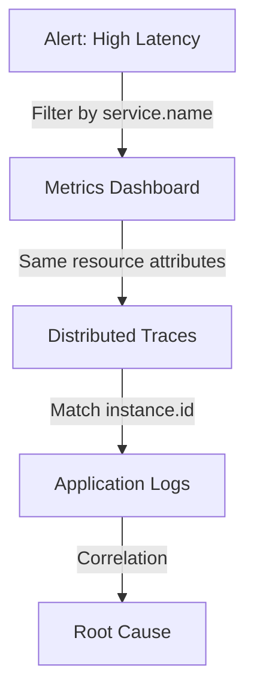

# How to Understand OpenTelemetry Resource Attributes and Why They Matter

Author: [nawazdhandala](https://www.github.com/nawazdhandala)

Tags: OpenTelemetry, Resource Attributes, Service Name, Metadata, Configuration

Description: An in-depth exploration of OpenTelemetry resource attributes, how they identify and describe your services, and why they are critical for effective observability.

Resource attributes are the foundation of OpenTelemetry's data model, yet many developers overlook their importance until they find themselves unable to differentiate between services in production. These attributes are metadata that describe the entity producing telemetry data, and they're attached to every span, metric, and log your application generates.

## What are Resource Attributes?

A resource in OpenTelemetry represents the entity producing telemetry. This could be a service, a container, a host, a serverless function, or even a mobile application. Resource attributes are key-value pairs that describe this entity with information like service name, version, deployment environment, and infrastructure details.

Every piece of telemetry your application produces carries these resource attributes. When you view a trace in Jaeger or a metric in Prometheus, resource attributes tell you exactly where that data came from:

```javascript
// Example of setting resource attributes in Node.js
const { Resource } = require('@opentelemetry/resources');
const { SemanticResourceAttributes } = require('@opentelemetry/semantic-conventions');

const resource = new Resource({
  // Service identification
  [SemanticResourceAttributes.SERVICE_NAME]: 'payment-service',
  [SemanticResourceAttributes.SERVICE_VERSION]: '2.1.0',
  [SemanticResourceAttributes.SERVICE_NAMESPACE]: 'production',
  [SemanticResourceAttributes.SERVICE_INSTANCE_ID]: 'payment-service-7d8f9c-xk2j9',

  // Deployment information
  [SemanticResourceAttributes.DEPLOYMENT_ENVIRONMENT]: 'production',

  // Infrastructure details
  [SemanticResourceAttributes.CLOUD_PROVIDER]: 'aws',
  [SemanticResourceAttributes.CLOUD_REGION]: 'us-east-1',
  [SemanticResourceAttributes.CLOUD_AVAILABILITY_ZONE]: 'us-east-1a',

  // Container information
  [SemanticResourceAttributes.CONTAINER_NAME]: 'payment-api',
  [SemanticResourceAttributes.CONTAINER_ID]: 'abc123def456',

  // Custom attributes
  'team.name': 'payments',
  'cost.center': 'engineering-payments'
});
```

These attributes create a rich context that helps you understand your telemetry data. Without them, you'd have difficulty distinguishing traces from different services or identifying which instance of a service encountered an error.

## Why Resource Attributes Matter

Resource attributes serve multiple critical functions in your observability infrastructure:

### Service Identification and Filtering

When you have dozens or hundreds of services generating telemetry, resource attributes let you filter and find relevant data quickly. Searching for all traces from `service.name = "payment-service"` and `deployment.environment = "production"` immediately narrows your investigation.

### Aggregation and Analysis

Metrics backends use resource attributes as labels for aggregation. You can calculate error rates per service, measure latency by region, or track resource usage by team:

```python
# Python example showing resource attributes for metrics
from opentelemetry import metrics
from opentelemetry.sdk.metrics import MeterProvider
from opentelemetry.sdk.resources import Resource
from opentelemetry.semconv.resource import ResourceAttributes

# Create resource with attributes
resource = Resource.create({
    ResourceAttributes.SERVICE_NAME: "api-gateway",
    ResourceAttributes.SERVICE_VERSION: "1.5.2",
    ResourceAttributes.DEPLOYMENT_ENVIRONMENT: "staging",
    ResourceAttributes.HOST_NAME: "api-gateway-staging-01",
    "team": "platform",
    "region": "us-west-2"
})

# Initialize meter provider with resource
meter_provider = MeterProvider(resource=resource)
metrics.set_meter_provider(meter_provider)

# All metrics will carry these resource attributes
meter = metrics.get_meter(__name__)
request_counter = meter.create_counter(
    "http.server.requests",
    description="Number of HTTP requests received"
)

# This metric will be labeled with all resource attributes
request_counter.add(1, {"http.method": "GET", "http.route": "/api/users"})
```

When you query this metric in Prometheus, you can aggregate by any resource attribute: error rate by team, request count by region, or latency by service version.

### Correlation Across Signals

Resource attributes enable correlation between traces, metrics, and logs. When you notice high latency in metrics, you can find corresponding traces with the same resource attributes. When a trace shows an error, you can pull related logs using matching service names and instance IDs:



This correlation only works when resource attributes are consistent across all telemetry signals.

### Cost Attribution and Capacity Planning

Cloud costs and infrastructure capacity decisions depend on understanding which teams or services consume resources. Resource attributes like team name, cost center, or business unit enable chargeback models and informed scaling decisions:

```go
// Go example with comprehensive resource attributes for cost tracking
package main

import (
    "go.opentelemetry.io/otel"
    "go.opentelemetry.io/otel/sdk/resource"
    semconv "go.opentelemetry.io/otel/semconv/v1.20.0"
)

func initResource() *resource.Resource {
    return resource.NewWithAttributes(
        semconv.SchemaURL,
        // Standard attributes
        semconv.ServiceName("data-processor"),
        semconv.ServiceVersion("3.2.1"),
        semconv.DeploymentEnvironment("production"),

        // Cost attribution attributes
        attribute.String("team", "data-engineering"),
        attribute.String("cost_center", "engineering-data"),
        attribute.String("business_unit", "analytics"),
        attribute.String("project", "customer-insights"),

        // Capacity planning attributes
        attribute.String("instance_type", "c5.2xlarge"),
        attribute.Int("instance_vcpus", 8),
        attribute.Int("instance_memory_gb", 16),
    )
}
```

## Semantic Conventions: The Standard Vocabulary

OpenTelemetry defines semantic conventions for resource attributes to ensure consistency across different languages, frameworks, and tools. These conventions specify standard attribute names and expected values.

### Core Service Attributes

Every service should set these fundamental attributes:

```yaml
# Standard service attributes
service.name: "checkout-service"      # Required: unique service identifier
service.version: "1.2.3"              # Semantic version of the service
service.namespace: "production"       # Logical namespace for grouping services
service.instance.id: "checkout-abc123" # Unique instance identifier
```

The `service.name` is particularly critical because it's the primary way to identify and group telemetry. Choose names that are:

- Unique across your organization
- Descriptive of the service's purpose
- Consistent between development and production
- Stable over time (changing names breaks historical analysis)

### Infrastructure Attributes

Resource attributes describe where your service runs:

```python
# Infrastructure attributes for cloud deployments
from opentelemetry.semconv.resource import ResourceAttributes

cloud_attributes = {
    # Cloud provider information
    ResourceAttributes.CLOUD_PROVIDER: "gcp",
    ResourceAttributes.CLOUD_PLATFORM: "gcp_kubernetes_engine",
    ResourceAttributes.CLOUD_ACCOUNT_ID: "my-gcp-project",
    ResourceAttributes.CLOUD_REGION: "us-central1",
    ResourceAttributes.CLOUD_AVAILABILITY_ZONE: "us-central1-a",

    # Kubernetes attributes
    ResourceAttributes.K8S_CLUSTER_NAME: "production-cluster",
    ResourceAttributes.K8S_NAMESPACE_NAME: "checkout",
    ResourceAttributes.K8S_POD_NAME: "checkout-service-7d8f9c-xk2j9",
    ResourceAttributes.K8S_DEPLOYMENT_NAME: "checkout-service",
    ResourceAttributes.K8S_CONTAINER_NAME: "checkout-api",

    # Host attributes
    ResourceAttributes.HOST_NAME: "gke-node-1a2b3c",
    ResourceAttributes.HOST_TYPE: "n1-standard-4",
}
```

These attributes help you understand performance patterns related to infrastructure. Latency might correlate with specific availability zones, or errors might concentrate on particular host types.

### Process and Runtime Attributes

Runtime information helps diagnose issues related to the application environment:

```javascript
// Process and runtime attributes
const { SemanticResourceAttributes } = require('@opentelemetry/semantic-conventions');

const runtimeAttributes = {
  // Process information
  [SemanticResourceAttributes.PROCESS_PID]: process.pid,
  [SemanticResourceAttributes.PROCESS_EXECUTABLE_NAME]: 'node',
  [SemanticResourceAttributes.PROCESS_EXECUTABLE_PATH]: process.execPath,
  [SemanticResourceAttributes.PROCESS_COMMAND_LINE]: process.argv.join(' '),

  // Runtime information
  [SemanticResourceAttributes.PROCESS_RUNTIME_NAME]: 'nodejs',
  [SemanticResourceAttributes.PROCESS_RUNTIME_VERSION]: process.version,
  [SemanticResourceAttributes.PROCESS_RUNTIME_DESCRIPTION]: 'Node.js',

  // OS information
  [SemanticResourceAttributes.OS_TYPE]: process.platform,
  [SemanticResourceAttributes.OS_VERSION]: require('os').release(),
};
```

When troubleshooting memory leaks or performance regressions, knowing the exact runtime version can be crucial.

## Setting Resource Attributes

You can set resource attributes through code, environment variables, or configuration files. Each approach has different use cases.

### Programmatic Configuration

Setting attributes in code gives you maximum control and allows dynamic values:

```python
# Python application with comprehensive resource configuration
from opentelemetry import trace
from opentelemetry.sdk.trace import TracerProvider
from opentelemetry.sdk.resources import Resource
from opentelemetry.semconv.resource import ResourceAttributes
import os
import socket

def create_resource():
    """Create resource with dynamic and static attributes"""

    # Static attributes (known at development time)
    static_attrs = {
        ResourceAttributes.SERVICE_NAME: "order-processor",
        ResourceAttributes.SERVICE_VERSION: "2.3.1",
        "team": "fulfillment",
    }

    # Dynamic attributes (determined at runtime)
    dynamic_attrs = {
        ResourceAttributes.SERVICE_INSTANCE_ID: f"{os.getenv('HOSTNAME', 'unknown')}-{os.getpid()}",
        ResourceAttributes.HOST_NAME: socket.gethostname(),
        ResourceAttributes.PROCESS_PID: os.getpid(),
    }

    # Environment-specific attributes
    env = os.getenv('ENVIRONMENT', 'development')
    env_attrs = {
        ResourceAttributes.DEPLOYMENT_ENVIRONMENT: env,
        ResourceAttributes.SERVICE_NAMESPACE: env,
    }

    # Cloud attributes from environment
    cloud_attrs = {}
    if os.getenv('CLOUD_PROVIDER'):
        cloud_attrs.update({
            ResourceAttributes.CLOUD_PROVIDER: os.getenv('CLOUD_PROVIDER'),
            ResourceAttributes.CLOUD_REGION: os.getenv('CLOUD_REGION'),
            ResourceAttributes.CLOUD_AVAILABILITY_ZONE: os.getenv('CLOUD_ZONE'),
        })

    # Combine all attributes
    all_attrs = {**static_attrs, **dynamic_attrs, **env_attrs, **cloud_attrs}

    return Resource.create(all_attrs)

# Initialize tracer with resource
resource = create_resource()
provider = TracerProvider(resource=resource)
trace.set_tracer_provider(provider)
```

### Environment Variable Configuration

OpenTelemetry supports setting resource attributes via environment variables, which works well for containerized deployments:

```bash
# Set resource attributes via environment variables
export OTEL_RESOURCE_ATTRIBUTES="service.name=payment-service,service.version=1.0.0,deployment.environment=production,team=payments"

# Or set individual attributes
export OTEL_SERVICE_NAME="payment-service"

# Start your application
node index.js
```

This approach is particularly useful in Kubernetes where you can inject environment variables from ConfigMaps or the downward API:

```yaml
# Kubernetes deployment with resource attributes
apiVersion: apps/v1
kind: Deployment
metadata:
  name: payment-service
spec:
  template:
    spec:
      containers:
      - name: payment-api
        image: payment-service:1.0.0
        env:
        # Static attributes
        - name: OTEL_SERVICE_NAME
          value: "payment-service"
        - name: OTEL_SERVICE_VERSION
          value: "1.0.0"

        # Dynamic attributes from Kubernetes
        - name: K8S_POD_NAME
          valueFrom:
            fieldRef:
              fieldPath: metadata.name
        - name: K8S_NAMESPACE
          valueFrom:
            fieldRef:
              fieldPath: metadata.namespace
        - name: K8S_NODE_NAME
          valueFrom:
            fieldRef:
              fieldPath: spec.nodeName

        # Construct resource attributes string
        - name: OTEL_RESOURCE_ATTRIBUTES
          value: "service.namespace=production,k8s.pod.name=$(K8S_POD_NAME),k8s.namespace.name=$(K8S_NAMESPACE),k8s.node.name=$(K8S_NODE_NAME)"
```

### Resource Detectors

OpenTelemetry provides resource detectors that automatically discover attributes from the environment:

```javascript
// Using resource detectors in Node.js
const { detectResources } = require('@opentelemetry/resources');
const { envDetector, hostDetector, osDetector, processDetector } = require('@opentelemetry/resources');
const { awsEc2Detector, awsEksDetector } = require('@opentelemetry/resource-detector-aws');
const { gcpDetector } = require('@opentelemetry/resource-detector-gcp');

async function initializeWithDetectors() {
  // Automatically detect resource attributes from environment
  const resource = await detectResources({
    detectors: [
      envDetector,        // Read from OTEL_RESOURCE_ATTRIBUTES
      hostDetector,       // Detect host information
      osDetector,         // Detect OS information
      processDetector,    // Detect process information
      awsEc2Detector,     // Detect AWS EC2 attributes
      awsEksDetector,     // Detect AWS EKS attributes
      gcpDetector,        // Detect GCP attributes
    ],
  });

  // Merge with manually specified attributes
  const customResource = resource.merge(new Resource({
    'service.name': 'my-service',
    'service.version': '1.0.0',
    'team': 'platform',
  }));

  return customResource;
}
```

Resource detectors save you from manually configuring infrastructure-specific attributes. They automatically detect whether you're running on AWS, GCP, Azure, or Kubernetes and populate appropriate attributes.

## Best Practices for Resource Attributes

### Consistency Across Services

Use the same attribute names and value formats across all services. Create a shared configuration library or template:

```python
# Shared resource configuration module
# shared_otel_config.py

from opentelemetry.sdk.resources import Resource
from opentelemetry.semconv.resource import ResourceAttributes
import os

def create_standard_resource(service_name, service_version, team):
    """
    Creates a standardized resource with consistent attributes
    across all services in the organization.
    """

    base_attrs = {
        # Required attributes (every service must set these)
        ResourceAttributes.SERVICE_NAME: service_name,
        ResourceAttributes.SERVICE_VERSION: service_version,
        ResourceAttributes.DEPLOYMENT_ENVIRONMENT: os.getenv('ENV', 'development'),

        # Organizational attributes
        "team": team,
        "organization": "acme-corp",

        # Infrastructure attributes (if available)
        ResourceAttributes.CLOUD_PROVIDER: os.getenv('CLOUD_PROVIDER', 'unknown'),
        ResourceAttributes.CLOUD_REGION: os.getenv('CLOUD_REGION', 'unknown'),
    }

    return Resource.create(base_attrs)

# Usage in individual services
resource = create_standard_resource(
    service_name="payment-service",
    service_version="2.1.0",
    team="payments"
)
```

### Balance Detail and Cardinality

More attributes provide better context, but high-cardinality attributes (like request IDs or user IDs) can overwhelm metrics systems. Keep resource attributes to low-cardinality values that describe the service, not individual requests:

```javascript
// Good: Low-cardinality resource attributes
const goodResource = new Resource({
  'service.name': 'api-gateway',
  'deployment.environment': 'production',  // Limited values: dev, staging, prod
  'service.version': '1.2.3',              // Changes occasionally
  'team': 'platform',                       // Limited number of teams
});

// Bad: High-cardinality values belong in span attributes, not resources
const badResource = new Resource({
  'service.name': 'api-gateway',
  'request.id': 'req-abc123',        // Unique per request - DON'T DO THIS
  'user.id': 'user-xyz789',           // Unique per user - DON'T DO THIS
  'transaction.id': 'txn-123456',     // Unique per transaction - DON'T DO THIS
});
```

High-cardinality data belongs in span attributes, not resource attributes.

### Version Everything

Always include version information for services, dependencies, and configurations:

```go
// Comprehensive versioning in resource attributes
resource := resource.NewWithAttributes(
    semconv.SchemaURL,
    semconv.ServiceName("inventory-service"),
    semconv.ServiceVersion("3.1.2"),  // Application version

    // Additional version tracking
    attribute.String("config.version", "2023-11-15"),     // Configuration version
    attribute.String("schema.version", "v2"),              // Data schema version
    attribute.String("api.version", "v1"),                 // API version
    attribute.String("build.commit", "a1b2c3d"),          // Git commit
    attribute.String("build.timestamp", "2023-11-15T10:30:00Z"),
)
```

When debugging production issues, knowing exact versions helps you correlate problems with deployments.

### Document Custom Attributes

If you add custom attributes beyond semantic conventions, document them:

```python
# Custom resource attributes should be documented
CUSTOM_RESOURCE_ATTRIBUTES = {
    # Custom organizational attributes
    "team": "Team responsible for the service (e.g., 'platform', 'payments')",
    "cost.center": "Cost center for chargeback (e.g., 'eng-platform-001')",
    "compliance.level": "Data compliance level (e.g., 'pci-dss', 'hipaa', 'standard')",
    "support.oncall": "On-call rotation identifier (e.g., 'payments-primary')",

    # Custom deployment attributes
    "deploy.strategy": "Deployment strategy (e.g., 'blue-green', 'canary', 'rolling')",
    "feature.flags": "Feature flag configuration version",
}
```

Documentation prevents confusion and ensures consistent usage across teams.

## Resource Attributes in Practice

Understanding resource attributes theoretically is one thing; using them effectively requires seeing them in action. Your observability platform leverages these attributes for filtering, grouping, and correlation. Well-configured resource attributes make the difference between quick troubleshooting and hours of frustration.

When debugging a production incident, you'll filter traces by `service.name` and `deployment.environment`. When analyzing performance trends, you'll group metrics by `service.version` to identify regressions. When calculating costs, you'll aggregate by `team` or `cost.center`. Every one of these workflows depends on properly configured resource attributes.

Take time to design your resource attribute strategy before deploying instrumentation. Choose consistent naming conventions, document custom attributes, and ensure all services follow the same patterns. The investment pays dividends every time you need to understand what's happening in your system.

For more foundational information on observability concepts, see our guide on [monitoring vs observability](https://oneuptime.com/blog/post/2025-11-28-monitoring-vs-observability-sre/view).
