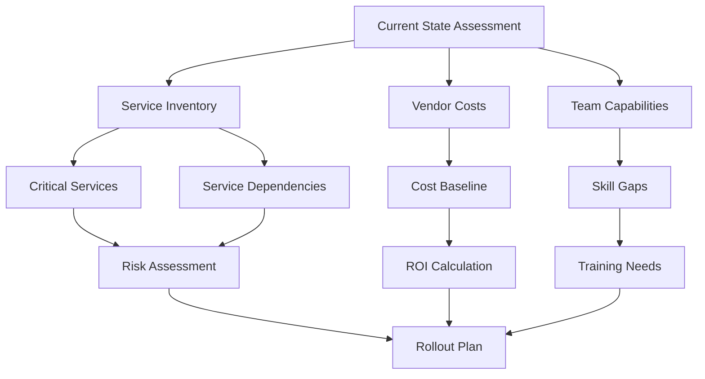
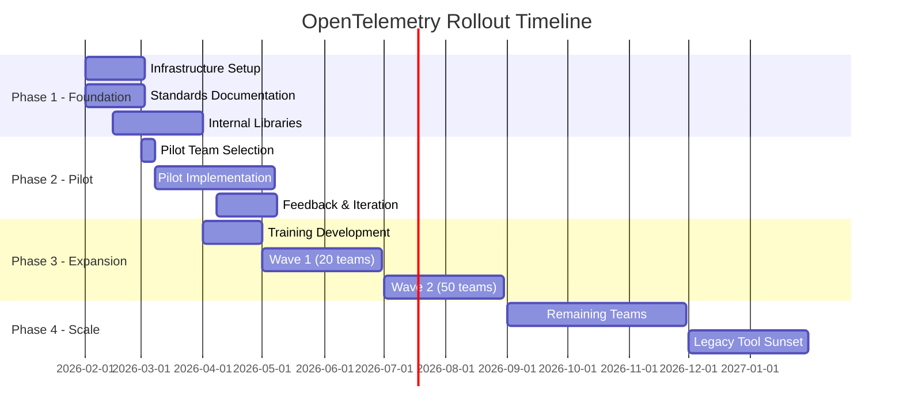

# How to Plan Your OpenTelemetry Rollout Strategy for a Large Organization

Author: [nawazdhandala](https://www.github.com/nawazdhandala)

Tags: OpenTelemetry, Rollout, Strategy, Enterprise, Adoption, Planning

Description: A comprehensive framework for rolling out OpenTelemetry across a large organization, covering technical, organizational, and operational challenges.

Rolling out OpenTelemetry across a large organization requires more than technical expertise. You need to coordinate across teams, manage the transition from existing observability tools, and build internal capability while maintaining production stability. A successful rollout balances speed with risk management, providing value quickly while establishing patterns that scale across hundreds of services.

## Assessing Your Current State

Before planning a rollout, understand what you're working with. Map your existing observability landscape: which teams use which tools, what data they collect, and how they use it. Some teams might have comprehensive tracing, while others rely solely on logs and basic metrics.

Document your existing observability vendors and their costs. Understanding current spending provides baseline data for measuring ROI. It also reveals which teams are getting the most value from observability and which are underserved by current tooling.

Identify critical services and dependencies. These are systems that must remain observable during the transition. You can't afford gaps in visibility for payment processing, authentication, or other core business functions. These services often need a more conservative rollout approach.



Survey teams about their observability pain points. What questions can't they answer with current tools? Where do incidents take too long to debug? What vendor limitations frustrate them? This feedback shapes your value proposition and helps prioritize which capabilities to deliver first.

## Building the Core Infrastructure

Start by establishing the foundational infrastructure that all services will use. This means deploying OpenTelemetry Collectors in your production environment with high availability, proper monitoring, and operational runbooks.

The collector deployment architecture depends on your infrastructure. For Kubernetes environments, deploy collectors as a DaemonSet on each node, plus a central collector tier for aggregation and routing. For traditional VM or bare-metal infrastructure, deploy collectors as systemd services on each host.

```yaml
# Kubernetes DaemonSet for node-level collectors
apiVersion: apps/v1
kind: DaemonSet
metadata:
  name: otel-collector
  namespace: observability
spec:
  selector:
    matchLabels:
      app: otel-collector
  template:
    metadata:
      labels:
        app: otel-collector
    spec:
      containers:
      - name: otel-collector
        image: otel/opentelemetry-collector-contrib:0.90.0
        resources:
          limits:
            memory: 2Gi
            cpu: 1000m
          requests:
            memory: 500Mi
            cpu: 200m
        ports:
        - containerPort: 4317  # OTLP gRPC
          name: otlp-grpc
        - containerPort: 4318  # OTLP HTTP
          name: otlp-http
        volumeMounts:
        - name: config
          mountPath: /etc/otel
      volumes:
      - name: config
        configMap:
          name: otel-collector-config
```

Design your collector configuration to handle multiple backends during the transition period. You'll likely need to send data to both your existing vendors and new OpenTelemetry-native backends simultaneously while teams validate the new tooling.

```yaml
# Collector configuration for dual-export during migration
receivers:
  otlp:
    protocols:
      grpc:
        endpoint: 0.0.0.0:4317
      http:
        endpoint: 0.0.0.0:4318

processors:
  batch:
    timeout: 10s
    send_batch_size: 1024

  memory_limiter:
    check_interval: 1s
    limit_mib: 1500

  resource:
    attributes:
    - key: deployment.environment
      value: production
      action: insert

exporters:
  # Existing vendor for continuity
  datadog:
    api:
      key: ${DATADOG_API_KEY}

  # New OpenTelemetry backend
  otlp/backend:
    endpoint: otel-backend.company.com:4317
    tls:
      insecure: false

  # Local Jaeger for development
  otlp/jaeger:
    endpoint: jaeger-collector:4317
    tls:
      insecure: true

service:
  pipelines:
    traces:
      receivers: [otlp]
      processors: [memory_limiter, batch, resource]
      exporters: [datadog, otlp/backend, otlp/jaeger]
```

Build monitoring for the collectors themselves. They're critical infrastructure, and you need visibility into their resource usage, throughput, and error rates. Use Prometheus exporters to expose collector metrics and create dashboards showing data flow through the system.

## Establishing Governance and Standards

Large organizations need standards to avoid chaos. Define conventions for service naming, resource attributes, and span naming before teams start instrumenting services. These conventions ensure consistency that makes data usable across team boundaries.

Create a document that specifies required attributes for all spans. At minimum, services should include service name, version, deployment environment, and team ownership. These attributes enable filtering and aggregation across your entire service inventory.

```javascript
// Standard resource attributes required for all services
const { Resource } = require('@opentelemetry/resources');
const { SemanticResourceAttributes } = require('@opentelemetry/semantic-conventions');

const resource = new Resource({
  // Required standard attributes
  [SemanticResourceAttributes.SERVICE_NAME]: 'payment-service',
  [SemanticResourceAttributes.SERVICE_VERSION]: process.env.SERVICE_VERSION,
  [SemanticResourceAttributes.DEPLOYMENT_ENVIRONMENT]: process.env.ENVIRONMENT,

  // Required organizational attributes
  'service.owner.team': 'payments-team',
  'service.owner.slack': '#payments-oncall',
  'service.tier': 'critical',
  'service.cost_center': 'CC-1234',
});
```

Establish patterns for common instrumentation scenarios. Provide reference implementations showing how to instrument REST APIs, gRPC services, database access, message queues, and background jobs. These examples reduce the learning curve and ensure consistency.

Build internal libraries that encapsulate standard configuration. Rather than having each team configure the SDK from scratch, provide a package that applies organizational defaults and handles environment-specific configuration.

```javascript
// Internal library that encapsulates OpenTelemetry configuration
const { initializeTelemetry } = require('@company/otel-config');

// Teams use a simple initialization function
initializeTelemetry({
  serviceName: 'payment-service',
  serviceVersion: '1.2.3',
  team: 'payments-team',
  // Library handles exporter configuration, sampling, resource attributes, etc.
});

// Application code uses standard OpenTelemetry APIs
const { trace } = require('@opentelemetry/api');
const tracer = trace.getTracer('payment-service');
```

Document your standards in a central location accessible to all engineering teams. Include examples, anti-patterns to avoid, and troubleshooting guides. Keep this documentation updated as you learn what works and what doesn't.

## Phased Rollout Strategy

Don't attempt to instrument everything simultaneously. A phased approach reduces risk and allows you to learn from early adopters before scaling widely.

Phase one focuses on pilot teams. Select two or three teams with different characteristics: one that's already sophisticated with observability, one that's average, and one that struggles with current tools. This diversity reveals different adoption challenges.

Work closely with pilot teams. Provide hands-on support, iterate on documentation based on their feedback, and use their experiences to refine your internal libraries and standards. These teams become champions who can help other teams later.



Phase two expands to more teams in waves. Each wave includes 20-30 teams that instrument their critical services. Provide training sessions, office hours, and Slack channels where teams can get help. Track adoption metrics like percentage of services instrumented and trace volume per service.

Phase three scales to the entire organization. By this point, you have proven patterns, comprehensive documentation, and a community of teams who've successfully adopted OpenTelemetry. The internal libraries are stable, and training materials are refined based on real feedback.

Phase four focuses on cleanup. Migrate remaining services, sunset legacy observability agents, and renegotiate or cancel contracts with vendors you're replacing. This phase also includes measuring ROI and documenting lessons learned.

## Training and Enablement

Technical documentation alone isn't sufficient. Teams need hands-on training that meets them at their current skill level. Build a multi-tier training program addressing different audiences.

Start with an introduction for all engineers covering basic concepts: what OpenTelemetry is, why the organization is adopting it, and what's expected of teams. This session should be 30-45 minutes and focus on the "why" rather than deep technical details.

Provide hands-on workshops for engineers who will implement instrumentation. These sessions should be 2-3 hours and include actual coding. Walk through instrumenting a sample service, explain common patterns, and give participants time to instrument their own services with support available.

Create advanced sessions for platform engineers and SREs who will operate the collector infrastructure and build internal tooling. These sessions cover collector configuration, performance tuning, and troubleshooting techniques.

```javascript
// Example from hands-on workshop showing incremental instrumentation
const express = require('express');
const app = express();

// Step 1: Initialize OpenTelemetry (covered in workshop part 1)
const { initializeTelemetry } = require('@company/otel-config');
initializeTelemetry({ serviceName: 'workshop-service' });

// Step 2: Automatic instrumentation works without changes (part 2)
app.get('/users/:id', async (req, res) => {
  const user = await db.query('SELECT * FROM users WHERE id = $1', [req.params.id]);
  res.json(user);
});

// Step 3: Add custom spans for business logic (part 3)
const { trace } = require('@opentelemetry/api');
const tracer = trace.getTracer('workshop-service');

app.post('/checkout', async (req, res) => {
  const span = tracer.startSpan('process_checkout');
  try {
    // Business logic here
    span.setAttribute('order.total', req.body.total);
    res.json({ success: true });
  } finally {
    span.end();
  }
});
```

Record training sessions and make them available on-demand. Not everyone can attend live sessions, and recorded content serves as reference material teams can revisit when actually implementing instrumentation.

## Measuring Success

Define success metrics before starting the rollout. These metrics help you demonstrate value to leadership and identify teams that need additional support.

Track adoption metrics: percentage of services instrumented, percentage of traffic covered by traces, and time to instrument a new service. These show whether the rollout is progressing on schedule.

Measure operational metrics: mean time to detect incidents, mean time to resolve incidents, and number of incidents requiring escalation. These demonstrate the business value of improved observability.

Monitor cost metrics: total observability spending, cost per service, and cost per trace or span. If OpenTelemetry reduces costs by eliminating expensive vendor agents, quantify those savings.

```javascript
// Example: Track instrumentation coverage across services
const serviceInventory = await getServiceInventory();
const instrumentedServices = serviceInventory.filter(s => s.hasOpenTelemetry);

const coverageMetrics = {
  totalServices: serviceInventory.length,
  instrumentedServices: instrumentedServices.length,
  coveragePercent: (instrumentedServices.length / serviceInventory.length) * 100,

  // Break down by service tier
  criticalCoverage: calculateCoverage(serviceInventory, 'critical'),
  highCoverage: calculateCoverage(serviceInventory, 'high'),
  mediumCoverage: calculateCoverage(serviceInventory, 'medium'),
};

// Report these metrics to leadership monthly
publishMetrics('opentelemetry.adoption', coverageMetrics);
```

Create a dashboard showing rollout progress. Include adoption metrics, operational metrics, and cost metrics in one view. Update this dashboard weekly and share it with engineering leadership.

## Handling Resistance and Edge Cases

Not every team will embrace OpenTelemetry immediately. Some have invested heavily in existing tooling and don't see value in changing. Others work on legacy systems where instrumentation is difficult.

Address resistance by demonstrating value, not mandating adoption. Show concrete examples of how OpenTelemetry solved problems similar to what the resistant team faces. Offer to instrument one of their services as a proof of concept.

For legacy systems that can't be easily instrumented, consider alternative approaches. Use sidecar proxies like Envoy that can generate traces based on network traffic. Deploy OpenTelemetry collectors that parse logs and convert them to traces. These approaches provide some visibility while avoiding invasive code changes.

Some teams will have valid technical constraints. A team working on a high-frequency trading system might not be able to accept the overhead of instrumentation. Embedded systems might not have the resources to run an instrumentation SDK. Work with these teams to find appropriate solutions, which might include exemptions or alternative approaches.

```yaml
# Envoy proxy configuration for sidecar-based tracing
# Useful for legacy services that can't be instrumented directly
static_resources:
  listeners:
  - name: listener_0
    address:
      socket_address:
        address: 0.0.0.0
        port_value: 8080
    filter_chains:
    - filters:
      - name: envoy.filters.network.http_connection_manager
        typed_config:
          "@type": type.googleapis.com/envoy.extensions.filters.network.http_connection_manager.v3.HttpConnectionManager
          tracing:
            provider:
              name: envoy.tracers.opentelemetry
              typed_config:
                "@type": type.googleapis.com/envoy.config.trace.v3.OpenTelemetryConfig
                grpc_service:
                  envoy_grpc:
                    cluster_name: otel_collector
                service_name: legacy-service
```

## Managing the Transition Period

During the rollout, you'll run both old and new observability systems simultaneously. This dual operation increases complexity and cost but is necessary to maintain visibility while teams migrate.

Set a deadline for the transition period. Teams need to know they can't run both systems forever. A reasonable timeline is 12-18 months from pilot to full migration, depending on organization size.

Provide tools to compare data between old and new systems. Teams need confidence that OpenTelemetry provides equivalent or better visibility than their current tools. Build dashboards that show the same metrics in both systems, allowing side-by-side comparison.

As services migrate, track which teams are still using legacy tools and why. Some may have forgotten they're running old agents. Others may have blockers that need addressing. Regular check-ins help identify and resolve these issues.

## Building Internal Expertise

OpenTelemetry expertise becomes a strategic capability. Invest in building internal expertise rather than relying entirely on external consultants or vendor support.

Designate OpenTelemetry champions in each major engineering organization. These individuals become the go-to experts for their area and participate in a central working group that shares learnings across the company.

Create office hours where teams can bring specific problems and get expert help. This works better than expecting teams to figure everything out from documentation. Schedule these sessions weekly during the expansion and scaling phases.

Contribute back to the OpenTelemetry project. When you encounter bugs or missing features, fix them upstream. This builds expertise in your team while improving the project for everyone. It also establishes your organization as a serious participant in the community.

## Long-Term Operations

Once OpenTelemetry is deployed widely, ongoing operations become critical. The collector infrastructure needs monitoring, updates, and capacity planning just like any other production system.

Establish an SRE or platform team responsible for operating the collector infrastructure. This team handles collector updates, responds to incidents, and manages the relationship with backend vendors.

Build automation for common operational tasks. Collector configuration should be managed as code with CI/CD pipelines that validate changes before deployment. Capacity scaling should be automated based on telemetry volume metrics.

Plan for regular updates to collectors and SDKs. The OpenTelemetry project releases new versions frequently with bug fixes and new features. Test updates in non-production environments before rolling them to production.

For more context on operating OpenTelemetry Collectors at scale, see our guide on [what is OpenTelemetry Collector and why use one](https://oneuptime.com/blog/post/2025-09-18-what-is-opentelemetry-collector-and-why-use-one/view).

Rolling out OpenTelemetry across a large organization is a multi-quarter project requiring technical expertise, organizational change management, and sustained executive support. Success depends on starting with solid foundations, moving incrementally, and building internal capability along the way. The result is standardized observability that scales across your entire service inventory while reducing vendor lock-in and enabling teams to answer questions about their systems that they couldn't before.
